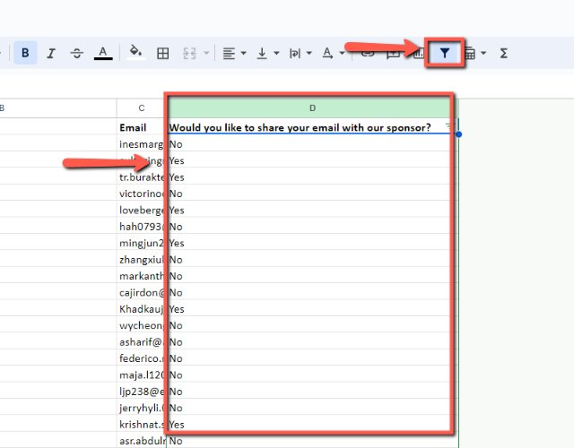
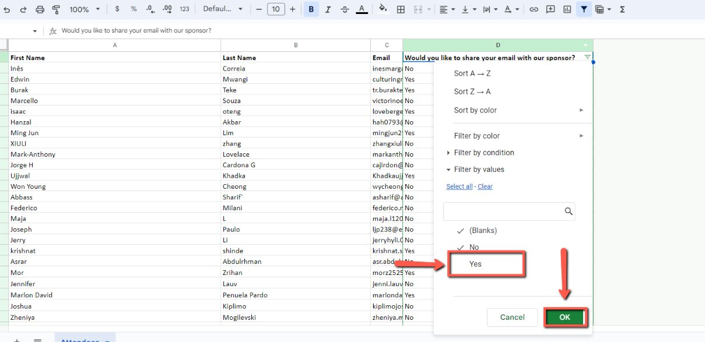
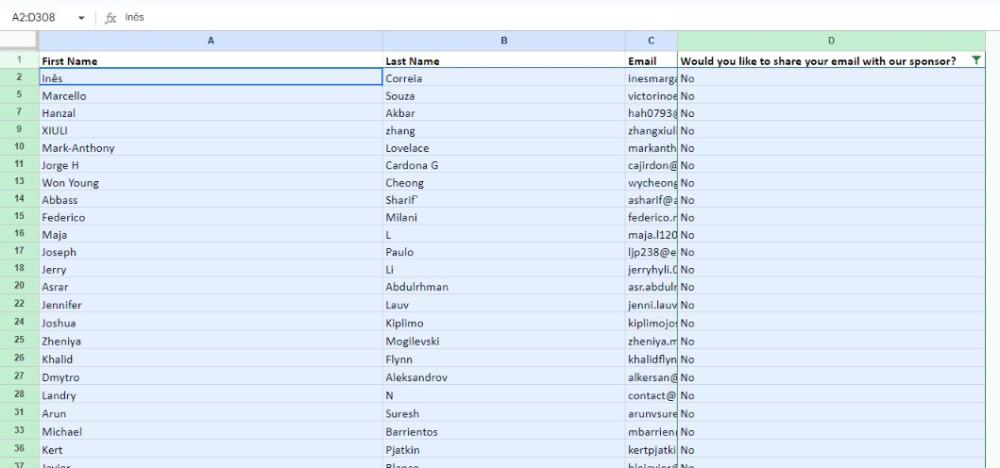
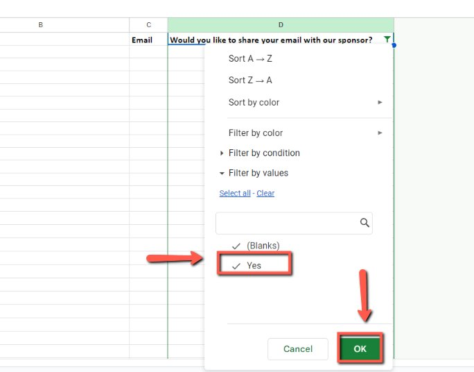
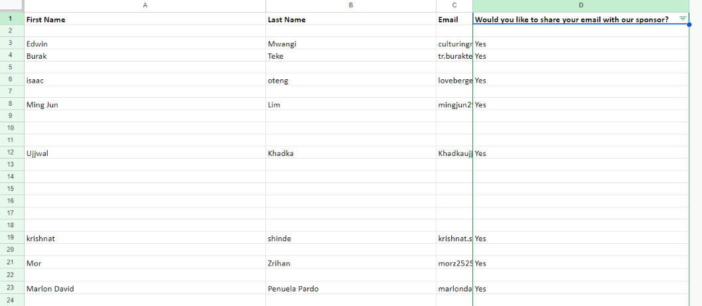
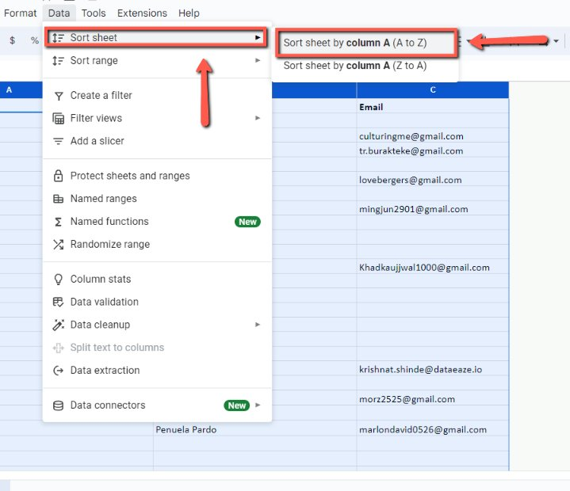
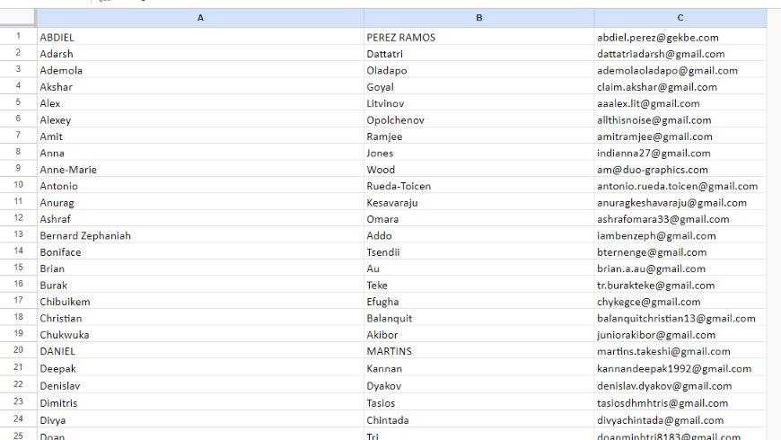
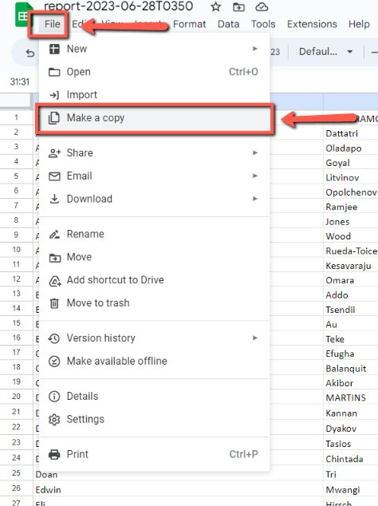
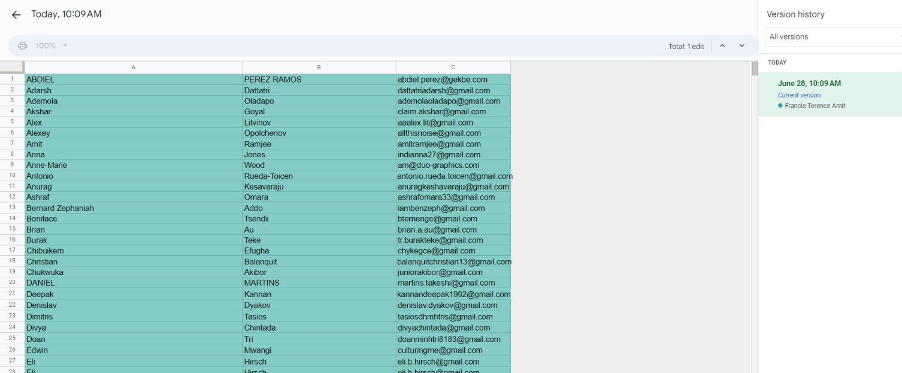

# Email Filtering for Sponsored Workshops

<!-- sop-section-start: summary -->
## Summary

- Purpose:
- Outcome:
- Trigger:
- Frequency:
<!-- sop-section-end -->

<!-- sop-section-start: prerequisites -->
## Prerequisites

- Access:
- Tools:
- Inputs:
<!-- sop-section-end -->

<!-- sop-section-start: procedure -->
## Procedure

<!-- sop-prose-start -->
How to Filter Email from Workshops
This document shows the steps on how to Filter Email from Workshops to get the list of emails to share with the sponsors

Step-by-step Instructions
<!-- sop-prose-end -->

<!-- sop-step-start id=1 -->
1.  On the google sheet, the first thing you need to do is select the “ Would you like to share your email to the sponsor” column and click the filter icon to see those who will be removed in the spreadsheet.

    <!-- sop-screenshot-start -->
    
    <!-- sop-caption-start -->
    The screenshot points to the sponsor email-sharing column in the workshop registration sheet. It helps confirm you are filtering the consent field, not another attendee column.
    <!-- sop-caption-end -->
    <!-- sop-screenshot-end -->
<!-- sop-step-end -->

<!-- sop-step-start id=2 -->
2.  And then, uncheck the “Yes” and click “Okay”

    <!-- sop-screenshot-start -->
    
    <!-- sop-caption-start -->
    The screenshot shows the filter choices where “Yes” is removed so only non-consenting attendees remain visible. The “Okay” button applies that temporary view.
    <!-- sop-caption-end -->
    <!-- sop-screenshot-end -->
<!-- sop-step-end -->

<!-- sop-step-start id=3 -->
3.  Once done, select the entire sheet with the data of the attendees who said “No” and delete it.

    <!-- sop-screenshot-start -->
    
    <!-- sop-caption-start -->
    The screenshot shows the rows returned by the “No” filter after the consent column is narrowed. Those are the attendee records to remove before sharing data with the sponsor.
    <!-- sop-caption-end -->
    <!-- sop-screenshot-end -->
<!-- sop-step-end -->

<!-- sop-step-start id=4 -->
4.  After, go back to the filter icon and check “Yes” and click “Okay”

    <!-- sop-screenshot-start -->
    
    <!-- sop-caption-start -->
    The screenshot shows the filter being switched back to “Yes” after the non-consenting rows are removed. Applying this view leaves only attendees who agreed to share their email.
    <!-- sop-caption-end -->
    <!-- sop-screenshot-end -->
<!-- sop-step-end -->

<!-- sop-step-start id=5 -->
5.  And now, you will be left with attendees who agreed to share their emails to the sponsors.

    Note: In here, those who did not agree to share their emails to the sponsors are removed in the spreadsheet.

    <!-- sop-screenshot-start -->
    
    <!-- sop-caption-start -->
    The screenshot shows the cleaned Google Sheet after the opt-out rows have been deleted. It confirms the remaining attendee list is the sponsor-shareable set.
    <!-- sop-caption-end -->
    <!-- sop-screenshot-end -->
<!-- sop-step-end -->

<!-- sop-step-start id=6 -->
6.  To remove the spaces in between the rows, click “Data” and select “Sort Sheet” and click “Sort Sheet by column A (A to Z)”

    <!-- sop-screenshot-start -->
    
    <!-- sop-caption-start -->
    The screenshot shows the Google Sheets Data menu path for sorting the full sheet by column A. Sorting closes gaps left by deleted rows and keeps the sponsor export tidy.
    <!-- sop-caption-end -->
    <!-- sop-screenshot-end -->
<!-- sop-step-end -->

<!-- sop-step-start id=7 -->
7.  And here’s the data with all the attendees who agreed to have their emails shared to the sponsors!

    <!-- sop-screenshot-start -->
    
    <!-- sop-caption-start -->
    The screenshot shows the final sorted attendee data after filtering and cleanup. It is the version that should contain only people who consented to sponsor email sharing.
    <!-- sop-caption-end -->
    <!-- sop-screenshot-end -->
<!-- sop-step-end -->

<!-- sop-step-start id=8 -->
8.  Also, to clean the document before sending it to sponsors, you need to create a new copy of it by clicking “File” and selecting “Make a copy”

    Note: A copy is made to not preserve history because if not, they can undo and see confidential emails.

    <!-- sop-screenshot-start -->
    
    <!-- sop-caption-start -->
    The screenshot shows the File menu option used to make a fresh copy of the spreadsheet. Creating this copy prevents sponsors from accessing prior edit history.
    <!-- sop-caption-end -->
    <!-- sop-screenshot-end -->
<!-- sop-step-end -->

<!-- sop-step-start id=9 -->
9.  Now, you can view the document with no previous version stated.

    Note: Send the copy version to the sponsors

    <!-- sop-screenshot-start -->
    
    <!-- sop-caption-start -->
    The screenshot shows the copied spreadsheet with no earlier version history visible. This is the sponsor-ready file to share after the consent cleanup.
    <!-- sop-caption-end -->
    <!-- sop-screenshot-end -->
<!-- sop-step-end -->
<!-- sop-section-end -->

<!-- sop-section-start: validation -->
## Validation

-
<!-- sop-section-end -->

<!-- sop-section-start: troubleshooting -->
## Troubleshooting

-
<!-- sop-section-end -->

<!-- sop-section-start: references -->
## References

-
<!-- sop-section-end -->
