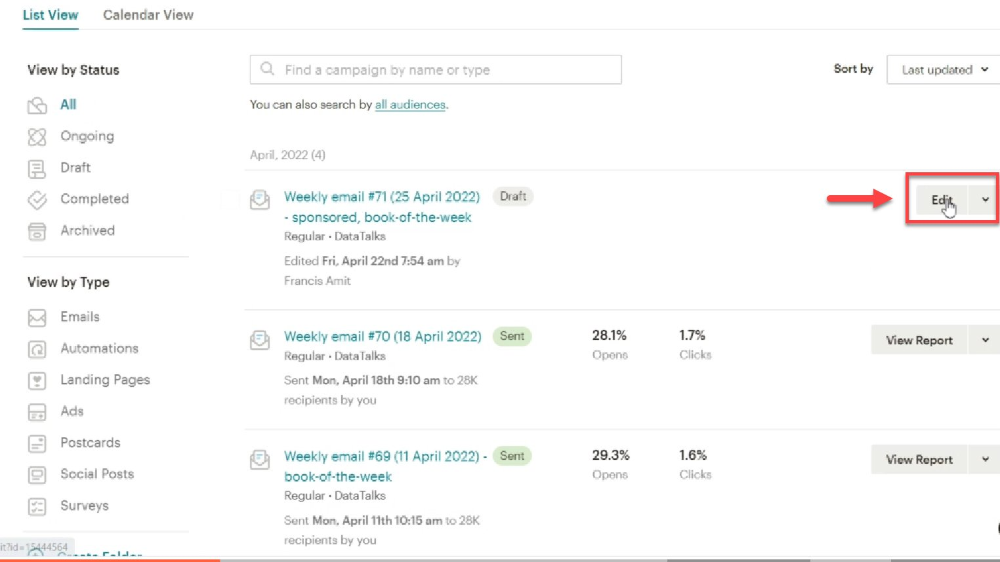
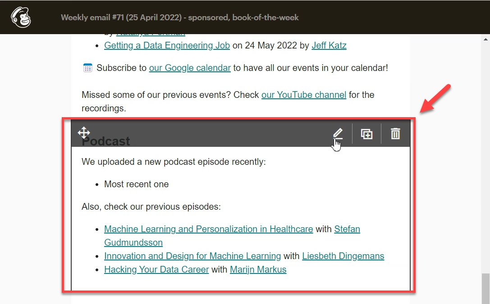
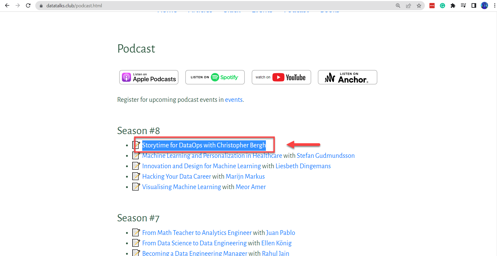
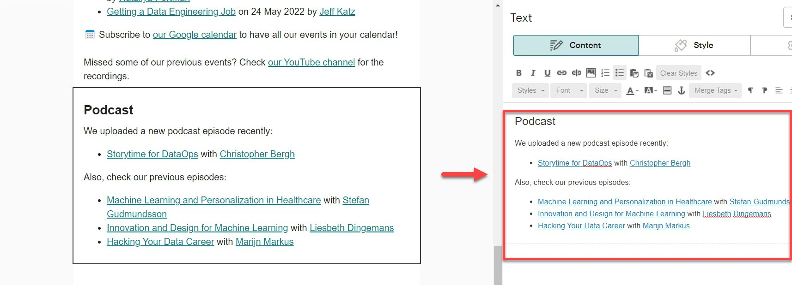
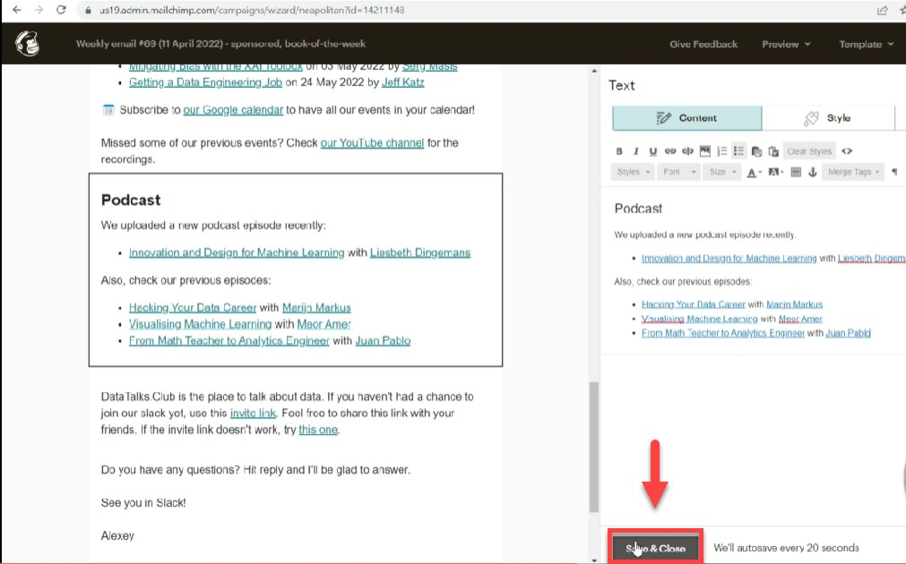

# Add just published podcast page to the newsletter

<!-- sop-section-start: summary -->
## Summary

- Purpose: Add the newly published podcast page link to a Mailchimp newsletter draft.
- Outcome: The podcast block in the newsletter points to the latest published podcast page.
- Trigger: A podcast page has been published and needs to be included in the newsletter.
- Frequency: Whenever a newly published podcast page is added to a newsletter.
<!-- sop-section-end -->

<!-- sop-section-start: prerequisites -->
## Prerequisites

- Access: Mailchimp campaign editor and the DataTalks.Club website.
- Tools: Mailchimp and a web browser.
- Inputs: Newsletter draft and the URL of the published podcast page.
<!-- sop-section-end -->

<!-- sop-section-start: procedure -->
## Procedure

<!-- sop-prose-start -->
How to add just published podcast page to the newsletter
This procedure will show you the steps on how to add just published podcast page to the newsletter.

Step-by-step Instructions
<!-- sop-prose-end -->

<!-- sop-step-start id=1 -->
1.  The first thing you need to do is open the draft template created in [Mailchimp](https://docs.google.com/document/d/1V1Ybh4jx-HThHnHkVxiCQs1_WZlXMYnXgt7Zaivq5EQ/edit?usp=sharing) and click “Edit”

    <!-- sop-screenshot-start -->
    
    <!-- sop-caption-start -->
    This screenshot anchors the step to open the draft template created in Mailchimp and click “Edit” so you can match the documented UI before acting. Look for “Edit”, then use that cue to complete or verify the step before continuing.
    <!-- sop-caption-end -->
    <!-- sop-screenshot-end -->
<!-- sop-step-end -->

<!-- sop-step-start id=2 -->
2.  Scroll down, and click the Podcast block

    <!-- sop-screenshot-start -->
    
    <!-- sop-caption-start -->
    This screenshot anchors the step to scroll down, and click the Podcast block so you can match the documented UI before acting. Look for the reporting value or action control shown there, then use it to confirm you are in the correct place before continuing.
    <!-- sop-caption-end -->
    <!-- sop-screenshot-end -->
<!-- sop-step-end -->

<!-- sop-step-start id=3 -->
3.  And then, copy the most recent podcast page in [DataTalks.Club](https://datatalks.club/) website.

    <!-- sop-screenshot-start -->
    
    <!-- sop-caption-start -->
    This screenshot anchors the step to copy the most recent podcast page in DataTalks.Club website so you can match the documented UI before acting. Look for the link, copy, or paste target shown there, then use it to confirm you are in the correct place before continuing.
    <!-- sop-caption-end -->
    <!-- sop-screenshot-end -->
<!-- sop-step-end -->

<!-- sop-step-start id=4 -->
4.  And then, paste it into the block.

    <!-- sop-screenshot-start -->
    
    <!-- sop-caption-start -->
    This screenshot anchors the step to paste it into the block so you can match the documented UI before acting. Look for the link, copy, or paste target shown there, then use it to confirm you are in the correct place before continuing.
    <!-- sop-caption-end -->
    <!-- sop-screenshot-end -->
<!-- sop-step-end -->

<!-- sop-step-start id=5 -->
5.  Lastly, click "Save & Close"

    <!-- sop-screenshot-start -->
    
    <!-- sop-caption-start -->
    This screenshot anchors the step to click "Save & Close" so you can match the documented UI before acting. Look for “Save & Close”, then use that cue to complete or verify the step before continuing.
    <!-- sop-caption-end -->
    <!-- sop-screenshot-end -->
<!-- sop-step-end -->
<!-- sop-section-end -->

<!-- sop-section-start: validation -->
## Validation

-
<!-- sop-section-end -->

<!-- sop-section-start: troubleshooting -->
## Troubleshooting

-
<!-- sop-section-end -->

<!-- sop-section-start: references -->
## References

-
<!-- sop-section-end -->
