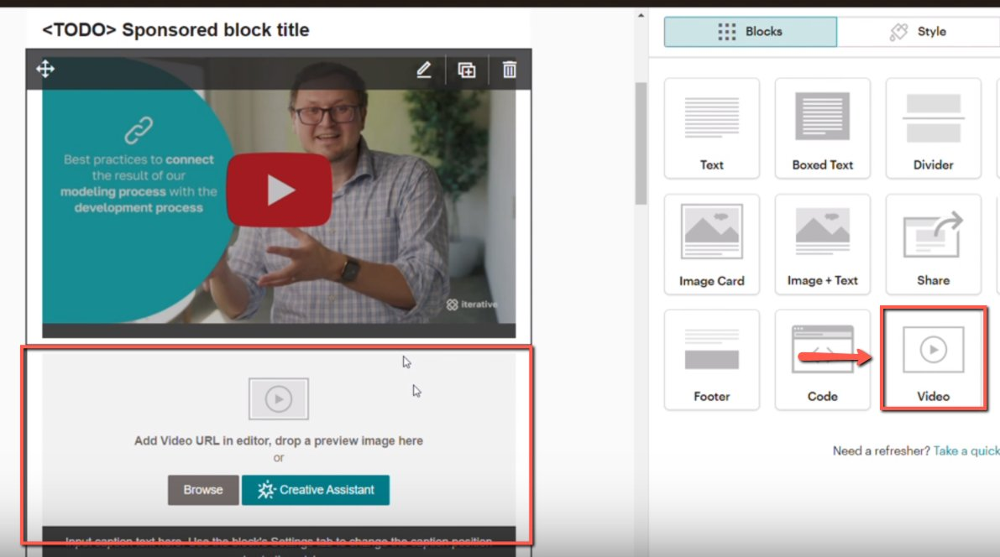
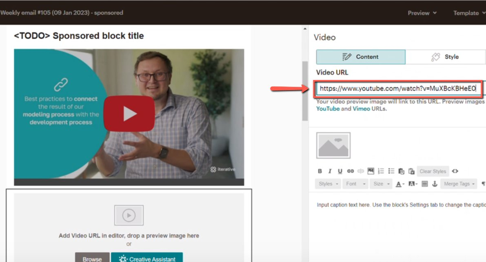
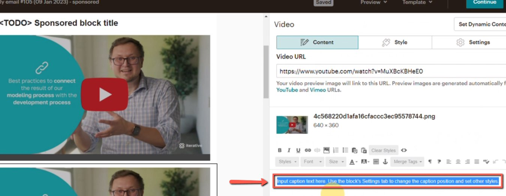
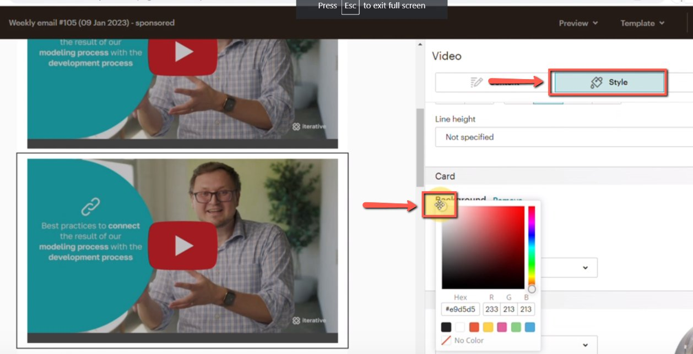

# Adding Videos to Mailchimp Campaigns

<!-- sop-section-start: summary -->
## Summary

- Purpose: Add a sponsor video to a Mailchimp newsletter campaign.
- Outcome: The newsletter uses a Mailchimp video block that links to the video.
- Trigger: A sponsor asks to include video content in the newsletter.
- Frequency: Whenever a newsletter campaign needs a video block.
<!-- sop-section-end -->

<!-- sop-section-start: prerequisites -->
## Prerequisites

- Access: Mailchimp campaign editor.
- Tools: Mailchimp video content block.
- Inputs: Video URL and the newsletter draft.
<!-- sop-section-end -->

<!-- sop-section-start: procedure -->
## Procedure

<!-- sop-prose-start -->
How to Add videos to Mailchimp Campaigns
This procedure will show you the steps on how to Add Videos to Mailchimp Campaigns.

Step-by-step Instructions
<!-- sop-prose-end -->

<!-- sop-step-start id=1 -->
1.  On the Sponsored block title, remove the photo block and replace it with a video block by dragging it in the template.

    <!-- sop-screenshot-start -->
    
    <!-- sop-caption-start -->
    This screenshot anchors the step about on the Sponsored block title, remove the photo block and replace it with a video block by dragging it in the template so you can match the documented UI before acting. Look for the relevant screen area shown there, then use it to confirm you are in the correct place before continuing.
    <!-- sop-caption-end -->
    <!-- sop-screenshot-end -->
<!-- sop-step-end -->

<!-- sop-step-start id=2 -->
2.  Then, copy the link of the video and paste it on the Video URL section.

    <!-- sop-screenshot-start -->
    
    <!-- sop-caption-start -->
    This screenshot anchors the step to copy the link of the video and paste it on the Video URL section so you can match the documented UI before acting. Look for the link, copy, or paste target shown there, then use it to confirm you are in the correct place before continuing.
    <!-- sop-caption-end -->
    <!-- sop-screenshot-end -->
<!-- sop-step-end -->

<!-- sop-step-start id=3 -->
3.  Next, remove the caption

    <!-- sop-screenshot-start -->
    
    <!-- sop-caption-start -->
    This screenshot anchors the step to remove the caption so you can match the documented UI before acting. Look for the relevant screen area shown there, then use it to confirm you are in the correct place before continuing.
    <!-- sop-caption-end -->
    <!-- sop-screenshot-end -->
<!-- sop-step-end -->

<!-- sop-step-start id=4 -->
4.  After, change the background by clicking the “Style” menu and select “White” as the color of the background

    <!-- sop-screenshot-start -->
    
    <!-- sop-caption-start -->
    This screenshot anchors the step about change the background by clicking the “Style” menu and select “White” as the color of the background so you can match the documented UI before acting. Look for “Style” and “White”, then use those cues to complete or verify the step before continuing.
    <!-- sop-caption-end -->
    <!-- sop-screenshot-end -->
<!-- sop-step-end -->
<!-- sop-section-end -->

<!-- sop-section-start: validation -->
## Validation

-
<!-- sop-section-end -->

<!-- sop-section-start: troubleshooting -->
## Troubleshooting

-
<!-- sop-section-end -->

<!-- sop-section-start: references -->
## References

-
<!-- sop-section-end -->
