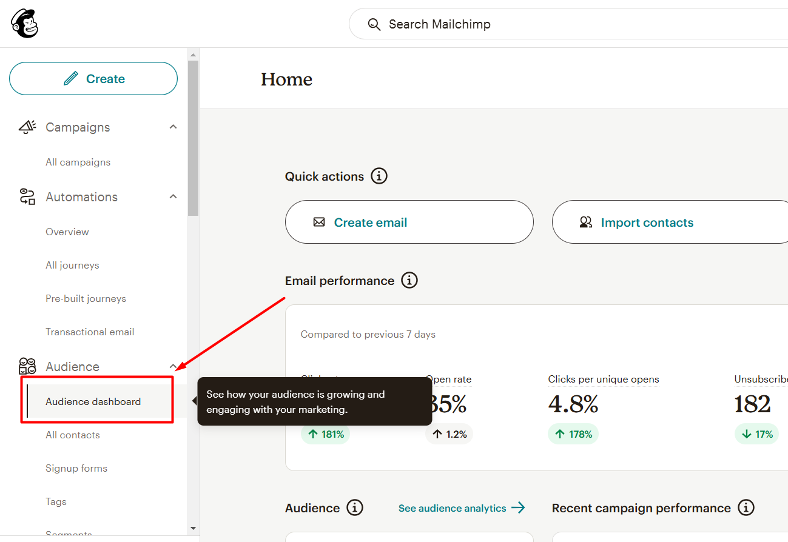
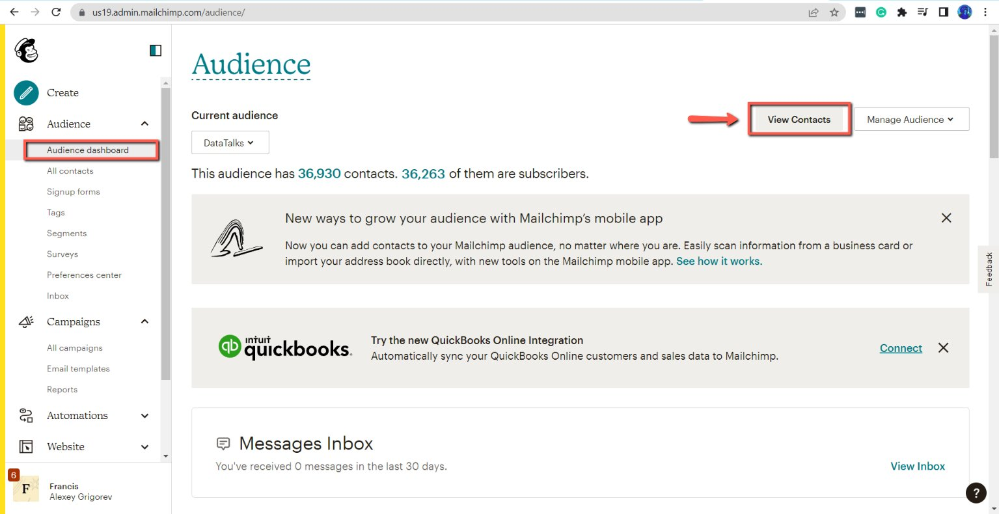
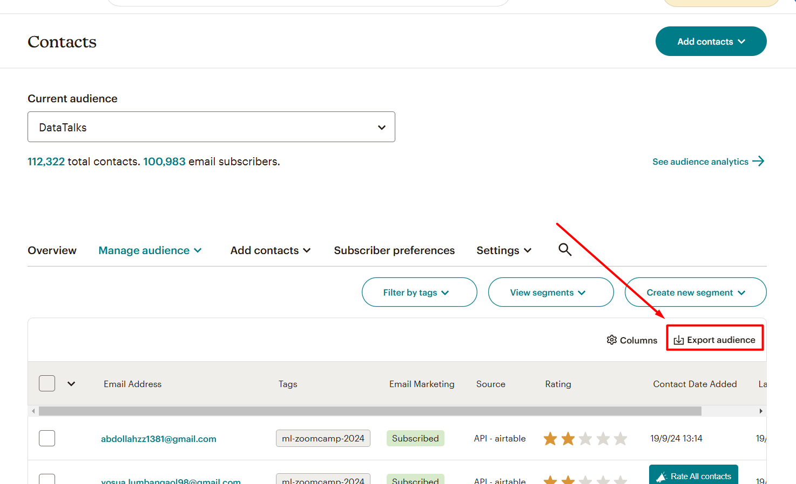
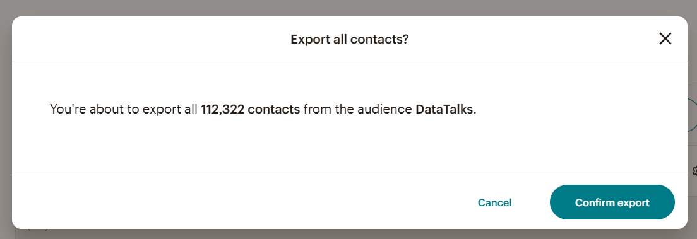
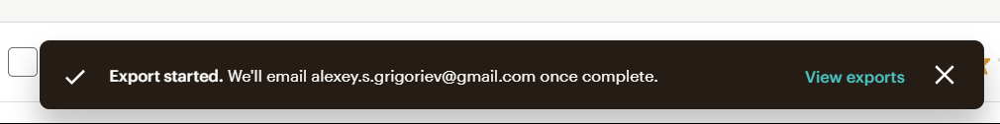
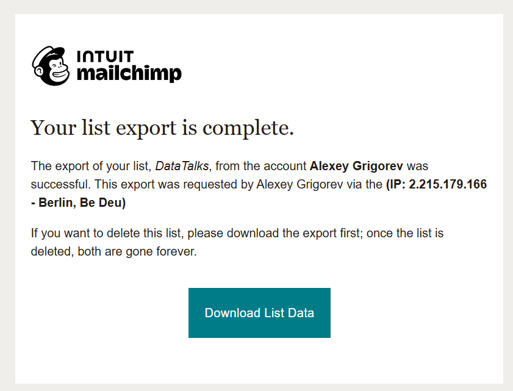
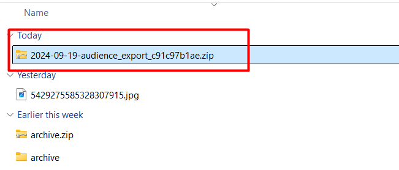
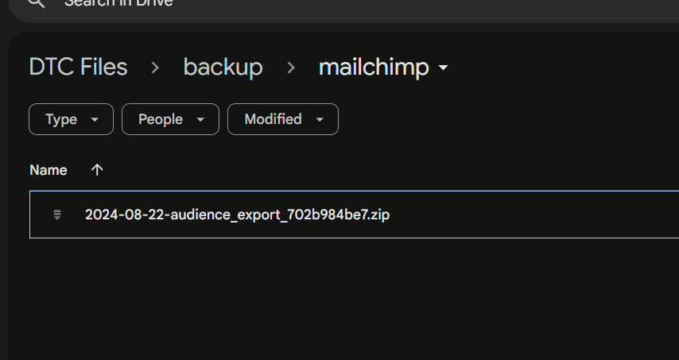

# Backup Mailchimp audience

<!-- sop-section-start: summary -->
## Summary

- Purpose: Backing up our mailchimp mailing list
- Outcome: That’s our most valuable asset and we don’t want to fully rely on mailchimp for storing it, that’s why we want to periodically create a backup
- Trigger: After you receive a weekly reminder from the TODO bot
- Frequency:
<!-- sop-section-end -->

<!-- sop-section-start: prerequisites -->
## Prerequisites

- Access:
- Tools:
- Inputs:
<!-- sop-section-end -->

<!-- sop-section-start: procedure -->
## Procedure

<!-- sop-step-start id=1 -->
1.  Open Mailchimp: [https://mailchi.mp/](https://mailchi.mp/)

    <!-- sop-screenshot-start -->
    
    <!-- sop-caption-start -->
    This screenshot anchors the step to open Mailchimp: https://mailchi.mp/ so you can match the documented UI before acting. Look for the relevant screen area shown there, then use it to confirm you are in the correct place before continuing.
    <!-- sop-caption-end -->
    <!-- sop-screenshot-end -->
<!-- sop-step-end -->

<!-- sop-step-start id=2 -->
2.  On the dashboard, on the “Audience” dashboard, click “View Contacts”

    <!-- sop-screenshot-start -->
    
    <!-- sop-caption-start -->
    This screenshot anchors the step about on the dashboard, on the “Audience” dashboard, click “View Contacts” so you can match the documented UI before acting. Look for “Audience” and “View Contacts”, then use those cues to complete or verify the step before continuing.
    <!-- sop-caption-end -->
    <!-- sop-screenshot-end -->
<!-- sop-step-end -->

<!-- sop-step-start id=3 -->
3.  After, click on “Export Audience”

    <!-- sop-screenshot-start -->
    
    <!-- sop-caption-start -->
    This screenshot anchors the step to click on “Export Audience” so you can match the documented UI before acting. Look for “Export Audience”, then use that cue to complete or verify the step before continuing.
    <!-- sop-caption-end -->
    <!-- sop-screenshot-end -->
<!-- sop-step-end -->

<!-- sop-step-start id=4 -->
4.  Confirm export

    <!-- sop-screenshot-start -->
    
    <!-- sop-caption-start -->
    This screenshot anchors the step to confirm export so you can match the documented UI before acting. Look for the relevant screen area shown there, then use it to confirm you are in the correct place before continuing.
    <!-- sop-caption-end -->
    <!-- sop-screenshot-end -->
<!-- sop-step-end -->

<!-- sop-step-start id=5 -->
5.  You will see a confirmation. Now wait for some time till you get an email.

    <!-- sop-screenshot-start -->
    
    <!-- sop-caption-start -->
    This screenshot anchors the step about you will see a confirmation. Now wait for some time till you get an email so you can match the documented UI before acting. Look for the email or message detail shown there, then use it to confirm you are in the correct place before continuing.
    <!-- sop-caption-end -->
    <!-- sop-screenshot-end -->
<!-- sop-step-end -->

<!-- sop-step-start id=6 -->
6.  Check your email. You should get an email with the subject “Mailchimp Audience Export Complete”.

    Open it and click “Download List Data”

    <!-- sop-screenshot-start -->
    
    <!-- sop-caption-start -->
    This screenshot anchors the step to open it and click “Download List Data” so you can match the documented UI before acting. Look for “Download List Data”, then use that cue to complete or verify the step before continuing.
    <!-- sop-caption-end -->
    <!-- sop-screenshot-end -->
<!-- sop-step-end -->

<!-- sop-step-start id=7 -->
7.  Then, rename the file name
    format YYYY-MM-DD-\<original-filename\>

    <!-- sop-screenshot-start -->
    
    <!-- sop-caption-start -->
    This screenshot anchors the step about format YYYY-MM-DD-original-filename so you can match the documented UI before acting. Look for the file transfer or file picker state shown there, then use it to confirm you are in the correct place before continuing.
    <!-- sop-caption-end -->
    <!-- sop-screenshot-end -->
<!-- sop-step-end -->

<!-- sop-step-start id=8 -->
8.  And then, open DTC Files google drive, select “backup/mailchimp” and upload the downloaded Mailchimp audience backup there.

    The correct location: [mailchimp](https://drive.google.com/drive/folders/1-MAoAuQbny7FK9UQuk8800zT8M8TOQ59)

    <!-- sop-screenshot-start -->
    
    <!-- sop-caption-start -->
    This screenshot anchors the step about the correct location: mailchimp so you can match the documented UI before acting. Look for the relevant screen area shown there, then use it to confirm you are in the correct place before continuing.
    <!-- sop-caption-end -->
    <!-- sop-screenshot-end -->
<!-- sop-step-end -->
<!-- sop-section-end -->

<!-- sop-section-start: validation -->
## Validation

-
<!-- sop-section-end -->

<!-- sop-section-start: troubleshooting -->
## Troubleshooting

-
<!-- sop-section-end -->

<!-- sop-section-start: references -->
## References

-
<!-- sop-section-end -->
