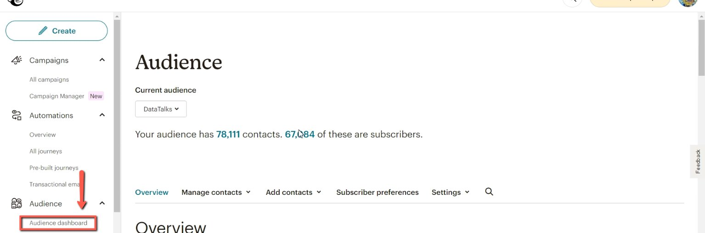
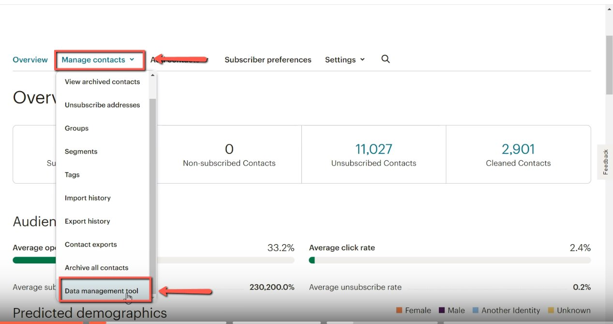
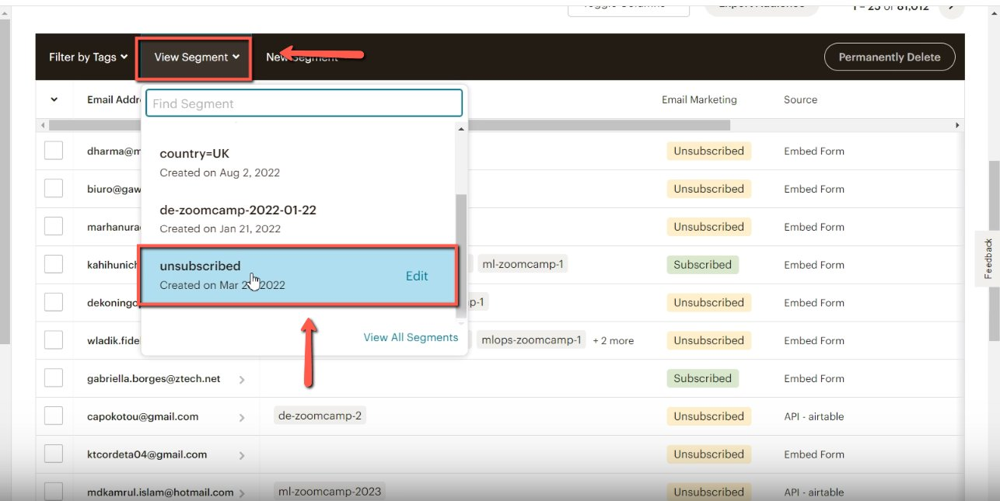
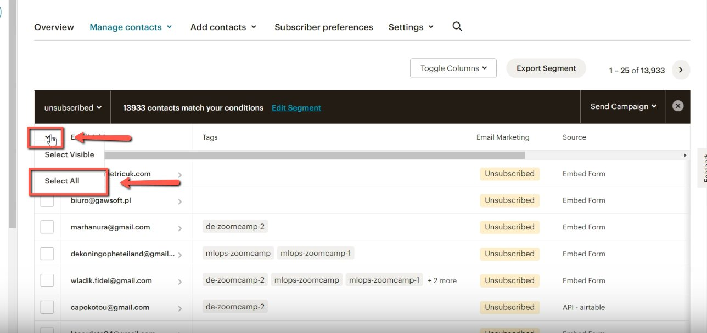
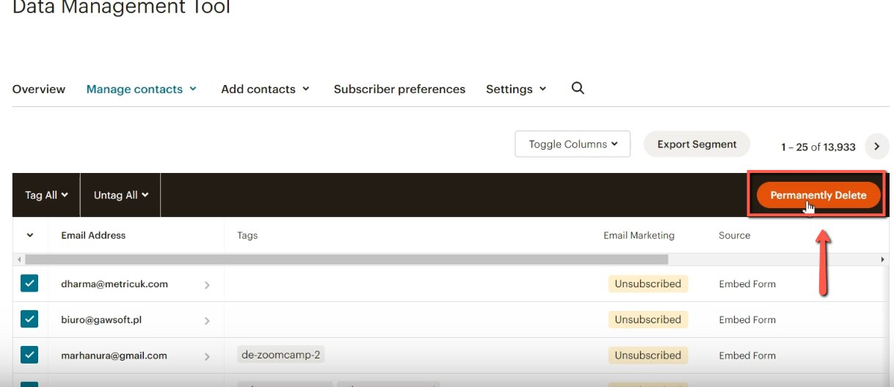
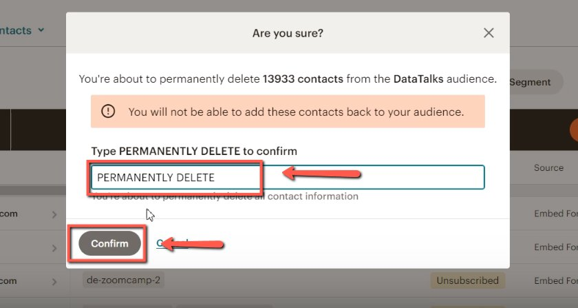

# Deleting Unsubscribed Contacts

<!-- sop-section-start: summary -->
## Summary

- Purpose: Permanently remove unsubscribed contacts from Mailchimp.
- Outcome: Unsubscribed contacts are deleted from the Mailchimp audience.
- Trigger: Unsubscribed contacts need to be cleaned from the audience.
- Frequency: As needed.
<!-- sop-section-end -->

<!-- sop-section-start: prerequisites -->
## Prerequisites

- Access: Mailchimp audience management.
- Tools: Mailchimp Audience Dashboard and Data Management Tool.
- Inputs: Unsubscribed contact segment.
<!-- sop-section-end -->

<!-- sop-section-start: procedure -->
## Procedure

<!-- sop-prose-start -->
How to Delete Unsubscribed Contacts
This procedure will show you the steps on how to Delete Unsubscribed Contacts

Step-by-step Instructions
<!-- sop-prose-end -->

<!-- sop-step-start id=1 -->
1.  The first thing you need to do is visit Mailchimp and select “Audience Dashboard”

    <!-- sop-screenshot-start -->
    
    <!-- sop-caption-start -->
    This screenshot anchors the step about visit Mailchimp and select “Audience Dashboard” so you can match the documented UI before acting. Look for “Audience Dashboard”, then use that cue to complete or verify the step before continuing.
    <!-- sop-caption-end -->
    <!-- sop-screenshot-end -->
<!-- sop-step-end -->

<!-- sop-step-start id=2 -->
2.  And then, go to “Manage Contacts” and select “Data Management Tool”

    <!-- sop-screenshot-start -->
    
    <!-- sop-caption-start -->
    This screenshot anchors the step to go to “Manage Contacts” and select “Data Management Tool” so you can match the documented UI before acting. Look for “Manage Contacts” and “Data Management Tool”, then use those cues to complete or verify the step before continuing.
    <!-- sop-caption-end -->
    <!-- sop-screenshot-end -->
<!-- sop-step-end -->

<!-- sop-step-start id=3 -->
3.  After, go to “View Segment” and select “unsubscribed”

    <!-- sop-screenshot-start -->
    
    <!-- sop-caption-start -->
    This screenshot anchors the step to go to “View Segment” and select “unsubscribed” so you can match the documented UI before acting. Look for “View Segment” and “unsubscribed”, then use those cues to complete or verify the step before continuing.
    <!-- sop-caption-end -->
    <!-- sop-screenshot-end -->
<!-- sop-step-end -->

<!-- sop-step-start id=4 -->
4.  Next, click the drop down button and select “Select all”

    <!-- sop-screenshot-start -->
    
    <!-- sop-caption-start -->
    This screenshot anchors the step to click the drop down button and select “Select all” so you can match the documented UI before acting. Look for “Select all”, then use that cue to complete or verify the step before continuing.
    <!-- sop-caption-end -->
    <!-- sop-screenshot-end -->
<!-- sop-step-end -->

<!-- sop-step-start id=5 -->
5.  After, click “Permanently Delete”

    <!-- sop-screenshot-start -->
    
    <!-- sop-caption-start -->
    This screenshot anchors the step to click “Permanently Delete” so you can match the documented UI before acting. Look for “Permanently Delete”, then use that cue to complete or verify the step before continuing.
    <!-- sop-caption-end -->
    <!-- sop-screenshot-end -->
<!-- sop-step-end -->

<!-- sop-step-start id=6 -->
6.  On the space provided, enter “PERMANENTLY DELETE” and click “Confirm”

    <!-- sop-screenshot-start -->
    
    <!-- sop-caption-start -->
    This screenshot anchors the step about on the space provided, enter “PERMANENTLY DELETE” and click “Confirm” so you can match the documented UI before acting. Look for “PERMANENTLY DELETE” and “Confirm”, then use those cues to complete or verify the step before continuing.
    <!-- sop-caption-end -->
    <!-- sop-screenshot-end -->
<!-- sop-step-end -->
<!-- sop-section-end -->

<!-- sop-section-start: validation -->
## Validation

-
<!-- sop-section-end -->

<!-- sop-section-start: troubleshooting -->
## Troubleshooting

-
<!-- sop-section-end -->

<!-- sop-section-start: references -->
## References

-
<!-- sop-section-end -->
