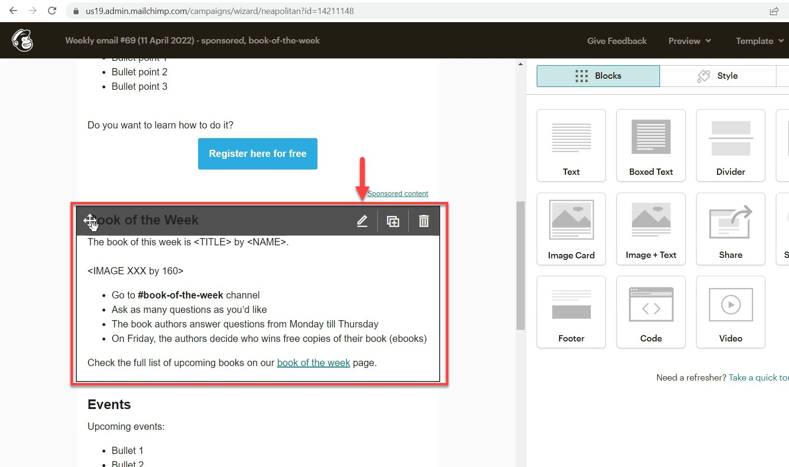
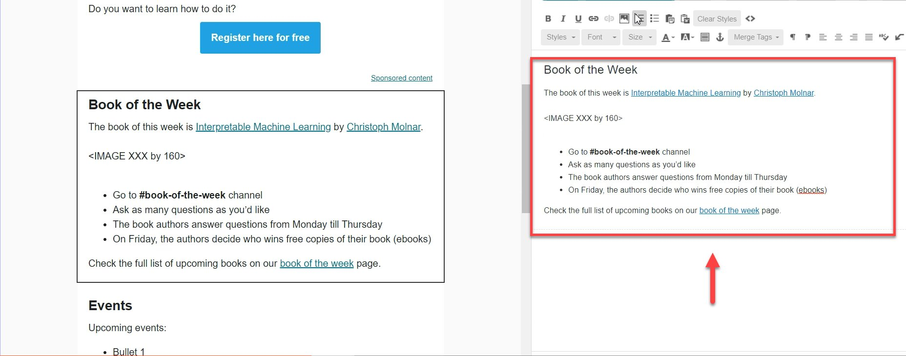
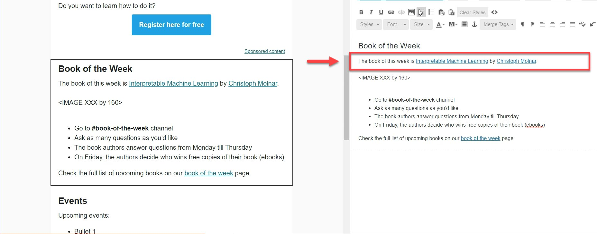
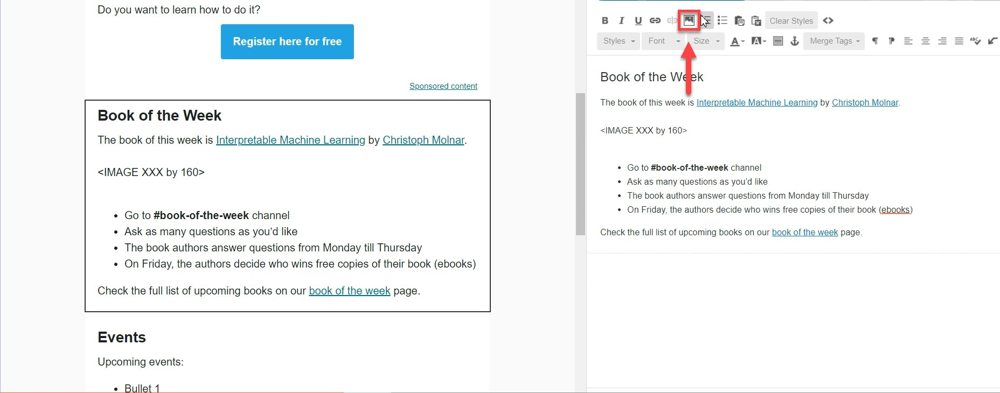
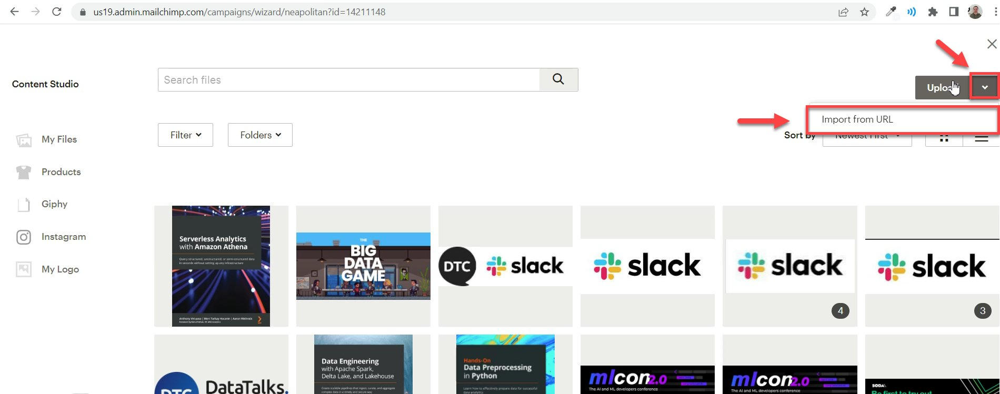
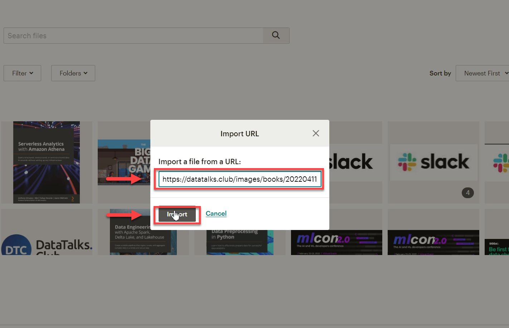
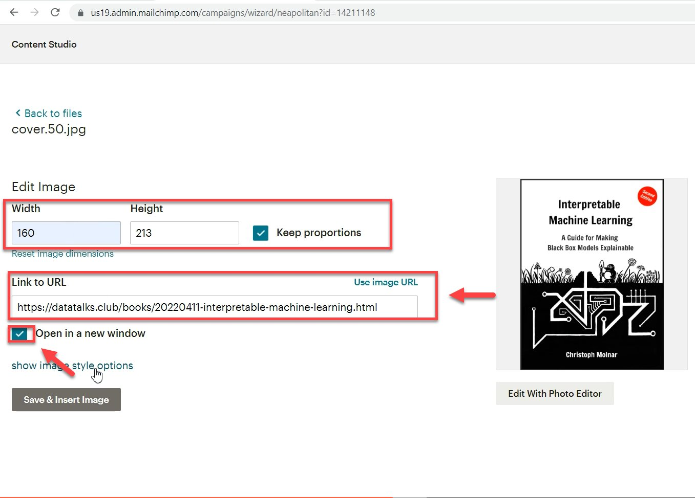
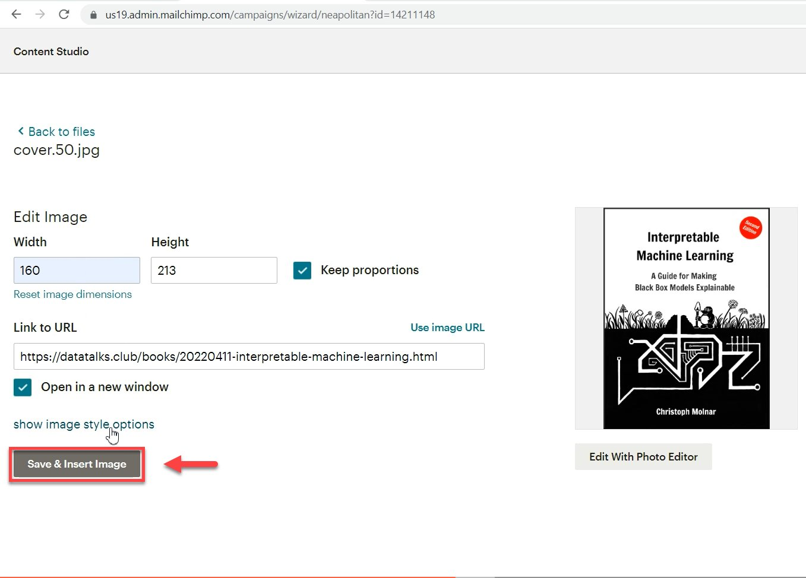

# Entering information in the book of the week block

<!-- sop-section-start: summary -->
## Summary

- Purpose: Update the newsletter Book of the Week block with book details.
- Outcome: The block contains the book title, cover image, and link.
- Trigger: A newsletter draft includes a Book of the Week feature.
- Frequency: Whenever a newsletter includes a Book of the Week block.
<!-- sop-section-end -->

<!-- sop-section-start: prerequisites -->
## Prerequisites

- Access: Mailchimp campaign editor and DataTalks.Club book page.
- Tools: Mailchimp and a web browser.
- Inputs: Book title, cover image URL, and book URL.
<!-- sop-section-end -->

<!-- sop-section-start: procedure -->
## Procedure

<!-- sop-prose-start -->
How to enter information in the book of the week block
This procedure will show you the steps on how to enter information in the book of the week block.

Step-by-step Instructions
<!-- sop-prose-end -->

<!-- sop-step-start id=1 -->
1.  The first thing you need to do is click on the "pen" tool icon to edit the block.

    Note: If the week has no book to be featured, click the "garbage" icon on the block.

    <!-- sop-screenshot-start -->
    
    <!-- sop-caption-start -->
    This screenshot anchors the step about if the week has no book to be featured, click the "garbage" icon on the block so you can match the documented UI before acting. Look for “garbage”, then use that cue to complete or verify the step before continuing.
    <!-- sop-caption-end -->
    <!-- sop-screenshot-end -->
<!-- sop-step-end -->

<!-- sop-step-start id=2 -->
2.  On the ride side of your screen, edit the information about the book of the week.

    <!-- sop-screenshot-start -->
    
    <!-- sop-caption-start -->
    This screenshot anchors the step about on the ride side of your screen, edit the information about the book of the week so you can match the documented UI before acting. Look for the relevant screen area shown there, then use it to confirm you are in the correct place before continuing.
    <!-- sop-caption-end -->
    <!-- sop-screenshot-end -->
<!-- sop-step-end -->

<!-- sop-step-start id=3 -->
3.  For the title of the book, paste the copied title from the [DataTalks.Club](https://datatalks.club/) website.

    <!-- sop-screenshot-start -->
    
    <!-- sop-caption-start -->
    This screenshot anchors the step about for the title of the book, paste the copied title from the DataTalks.Club website so you can match the documented UI before acting. Look for the link, copy, or paste target shown there, then use it to confirm you are in the correct place before continuing.
    <!-- sop-caption-end -->
    <!-- sop-screenshot-end -->
<!-- sop-step-end -->

<!-- sop-step-start id=4 -->
4.  To add the book cover, click on the "image" icon.

    <!-- sop-screenshot-start -->
    
    <!-- sop-caption-start -->
    This screenshot anchors the step about to add the book cover, click on the "image" icon so you can match the documented UI before acting. Look for “image”, then use that cue to complete or verify the step before continuing.
    <!-- sop-caption-end -->
    <!-- sop-screenshot-end -->
<!-- sop-step-end -->

<!-- sop-step-start id=5 -->
5.  Select the dropdown button, and click "Import from URL"

    <!-- sop-screenshot-start -->
    
    <!-- sop-caption-start -->
    This screenshot anchors the step to select the dropdown button, and click "Import from URL" so you can match the documented UI before acting. Look for “Import from URL”, then use that cue to complete or verify the step before continuing.
    <!-- sop-caption-end -->
    <!-- sop-screenshot-end -->
<!-- sop-step-end -->

<!-- sop-step-start id=6 -->
6.  After clicking, paste the copied URL image address of the book cover from the [DataTalks.Club](https://datatalks.club/) website and click “Import”

    <!-- sop-screenshot-start -->
    
    <!-- sop-caption-start -->
    This screenshot anchors the step about clicking, paste the copied URL image address of the book cover from the DataTalks.Club website and click “Import” so you can match the documented UI before acting. Look for “Import”, then use that cue to complete or verify the step before continuing.
    <!-- sop-caption-end -->
    <!-- sop-screenshot-end -->
<!-- sop-step-end -->

<!-- sop-step-start id=7 -->
7.  Don't forget to add the URL of the book under "Link to URL" and check the box beside "Open in a new window"

    Note: You can also change the width and height of the book cover. In this example, the width is 160 and the height is 213.

    <!-- sop-screenshot-start -->
    
    <!-- sop-caption-start -->
    This screenshot anchors the step about you can also change the width and height of the book cover. In this example, the width is 160 and the height is 213 so you can match the documented UI before acting. Look for the relevant screen area shown there, then use it to confirm you are in the correct place before continuing.
    <!-- sop-caption-end -->
    <!-- sop-screenshot-end -->
<!-- sop-step-end -->

<!-- sop-step-start id=8 -->
8.  After, click "Save & Insert Image"

    <!-- sop-screenshot-start -->
    
    <!-- sop-caption-start -->
    This screenshot anchors the step to click "Save & Insert Image" so you can match the documented UI before acting. Look for “Save & Insert Image”, then use that cue to complete or verify the step before continuing.
    <!-- sop-caption-end -->
    <!-- sop-screenshot-end -->
<!-- sop-step-end -->
<!-- sop-section-end -->

<!-- sop-section-start: validation -->
## Validation

-
<!-- sop-section-end -->

<!-- sop-section-start: troubleshooting -->
## Troubleshooting

-
<!-- sop-section-end -->

<!-- sop-section-start: references -->
## References

-
<!-- sop-section-end -->
