# Exporting course registration emails to mailchimp

<!-- sop-section-start: summary -->
## Summary

- Purpose: Export course registration emails and import them into Mailchimp.
- Outcome: Course registrants are uploaded to Mailchimp with the correct course tag, and the CSV is archived.
- Trigger: New course registration records need to be moved from Airtable to Mailchimp.
- Frequency: Whenever course registration emails are ready to import.
<!-- sop-section-end -->

<!-- sop-section-start: prerequisites -->
## Prerequisites

- Access: Course Airtable base, Mailchimp audience, and Google Drive mailing list folders.
- Tools: Airtable CSV export, spreadsheet editor, Google Drive, Mailchimp import contacts.
- Inputs: Course registration records, course tag, and date for the exported CSV filename.
<!-- sop-section-end -->

<!-- sop-section-start: procedure -->
## Procedure

<!-- sop-prose-start -->
How to export course registration emails to Mailchimp
This procedure will show you the steps on How to export course registration emails to Mailchimp.

Step-by-step Instructions
<!-- sop-prose-end -->

<!-- sop-step-start id=1 -->
1.  The first thing you need to do is open [Airtable.com](https://airtable.com/) and select
    - MLOps Zoomcamp for the MLOps Zoomcamp course
    - DE Zoomcamp for the Data Engineering Zoomcamp course
    - ML Zoomcamp for for ML Zoomcamp (Old)
    <!-- sop-screenshot-start -->
    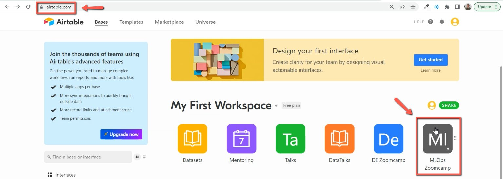
    <!-- sop-caption-start -->
    This screenshot anchors the step about ML Zoomcamp for for ML Zoomcamp (Old) so you can match the documented UI before acting. Look for the relevant screen area shown there, then use it to confirm you are in the correct place before continuing.
    <!-- sop-caption-end -->
    <!-- sop-screenshot-end -->
<!-- sop-step-end -->

<!-- sop-step-start id=2 -->
2.  Save all the emails by clicking "Grid view" and choosing "Download CSV"

    <!-- sop-screenshot-start -->
    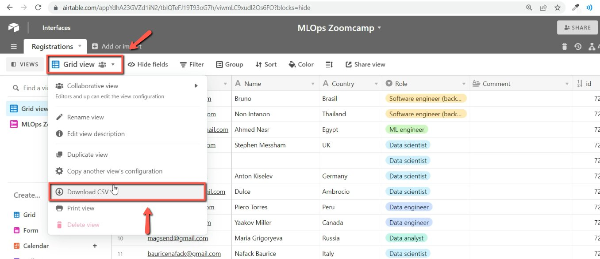
    <!-- sop-caption-start -->
    This screenshot anchors the step to save all the emails by clicking "Grid view" and choosing "Download CSV" so you can match the documented UI before acting. Look for “Grid view” and “Download CSV”, then use those cues to complete or verify the step before continuing.
    <!-- sop-caption-end -->
    <!-- sop-screenshot-end -->
<!-- sop-step-end -->

<!-- sop-step-start id=3 -->
3.  Next, select all the emails by clicking the check box, right-click and choose
    “delete all selected records"
    <!-- sop-screenshot-start -->
    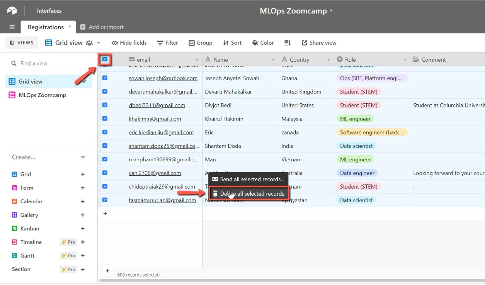
    <!-- sop-caption-start -->
    This screenshot anchors the step about “delete all selected records" so you can match the documented UI before acting. Look for “delete all selected records”, then use that cue to complete or verify the step before continuing.
    <!-- sop-caption-end -->
    <!-- sop-screenshot-end -->
<!-- sop-step-end -->

<!-- sop-step-start id=4 -->
4.  Then, select "Delete"

    <!-- sop-screenshot-start -->
    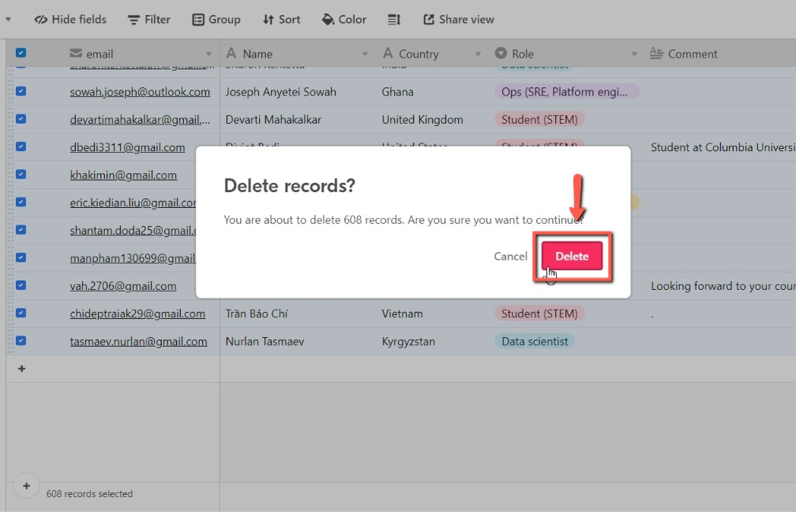
    <!-- sop-caption-start -->
    This screenshot anchors the step to select "Delete" so you can match the documented UI before acting. Look for “Delete”, then use that cue to complete or verify the step before continuing.
    <!-- sop-caption-end -->
    <!-- sop-screenshot-end -->
<!-- sop-step-end -->

<!-- sop-step-start id=5 -->
5.  To proceed, rename the file name.

    Note: It should this date format: YYYY-MM-DD e.g 2022-05-27

    <!-- sop-screenshot-start -->
    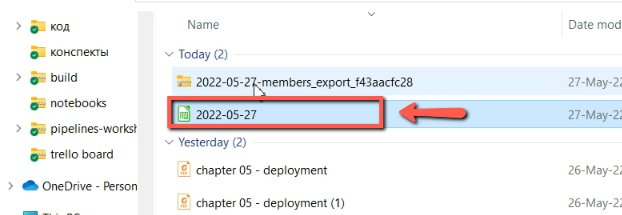
    <!-- sop-caption-start -->
    This screenshot anchors the step about it should this date format: YYYY-MM-DD e.g 2022-05-27 so you can match the documented UI before acting. Look for the schedule or date control shown there, then use it to confirm you are in the correct place before continuing.
    <!-- sop-caption-end -->
    <!-- sop-screenshot-end -->
<!-- sop-step-end -->

<!-- sop-step-start id=6 -->
6.  Move the CSV file to [Google drive](https://drive.google.com/drive/folders/19hmJwU06_wYKMgi9RS6GmthBUezurVlR?usp=sharing). Select "Mailing List" then click the folder, "courses"

    Note: For ML Zoomcamp (old), upload the records in this [folder](https://drive.google.com/drive/folders/1Ovzlm3j-8ozJyUWxAw66q0jT1EnxvuXt) and rename the file to dump-YYYY-MM-DD

    <!-- sop-screenshot-start -->
    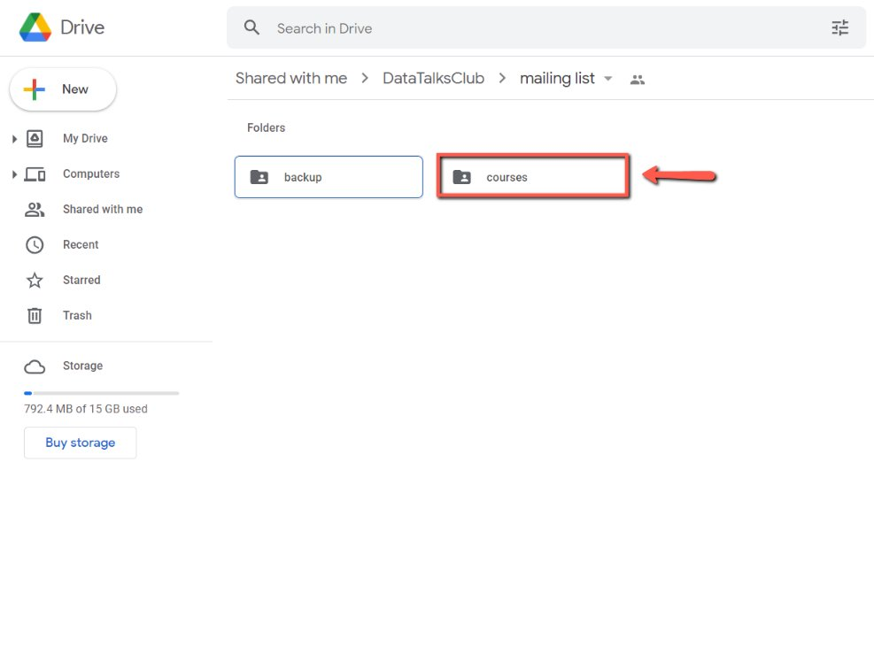
    <!-- sop-caption-start -->
    This screenshot anchors the step to move the CSV file to Google drive. Select "Mailing List" then click the folder, "courses" so you can match the documented UI before acting. Look for “Mailing List” and “courses”, then use those cues to complete or verify the step before continuing.
    <!-- sop-caption-end -->
    <!-- sop-screenshot-end -->
<!-- sop-step-end -->

<!-- sop-step-start id=7 -->
7.  Then, select “[mlops-zoomcamp](https://drive.google.com/drive/folders/1A8TjVwRyXbW7wXyplStM6skaUQrxOxuC?usp=sharing)”

    <!-- sop-screenshot-start -->
    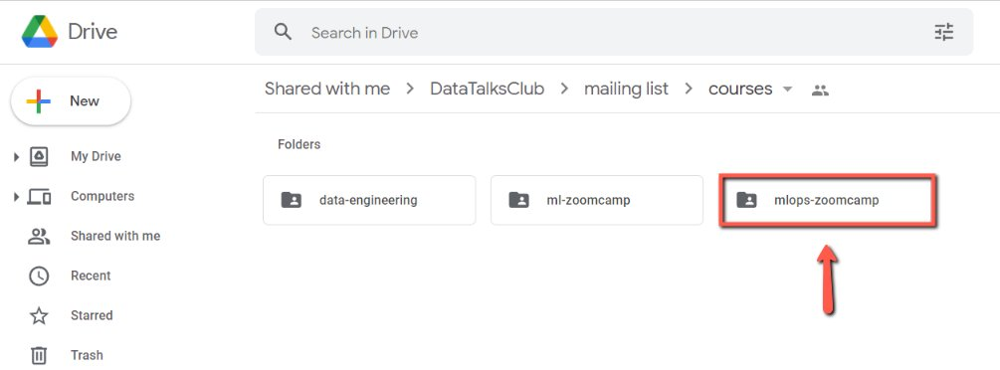
    <!-- sop-caption-start -->
    This screenshot anchors the step to select “mlops-zoomcamp” so you can match the documented UI before acting. Look for the relevant screen area shown there, then use it to confirm you are in the correct place before continuing.
    <!-- sop-caption-end -->
    <!-- sop-screenshot-end -->
<!-- sop-step-end -->

<!-- sop-step-start id=8 -->
8.  Then, upload the CSV file, here.

    <!-- sop-screenshot-start -->
    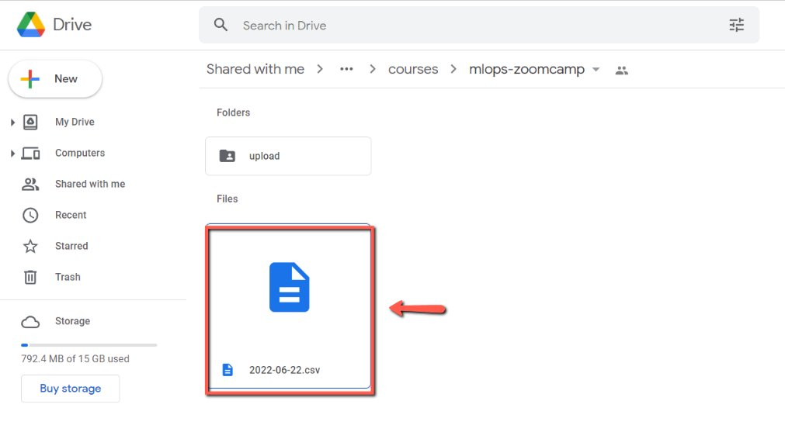
    <!-- sop-caption-start -->
    This screenshot anchors the step to upload the CSV file, here so you can match the documented UI before acting. Look for the file transfer or file picker state shown there, then use it to confirm you are in the correct place before continuing.
    <!-- sop-caption-end -->
    <!-- sop-screenshot-end -->
<!-- sop-step-end -->

<!-- sop-step-start id=9 -->
9.  Now, we need to upload the CSV file to Mailchimp.com

    <!-- sop-screenshot-start -->
    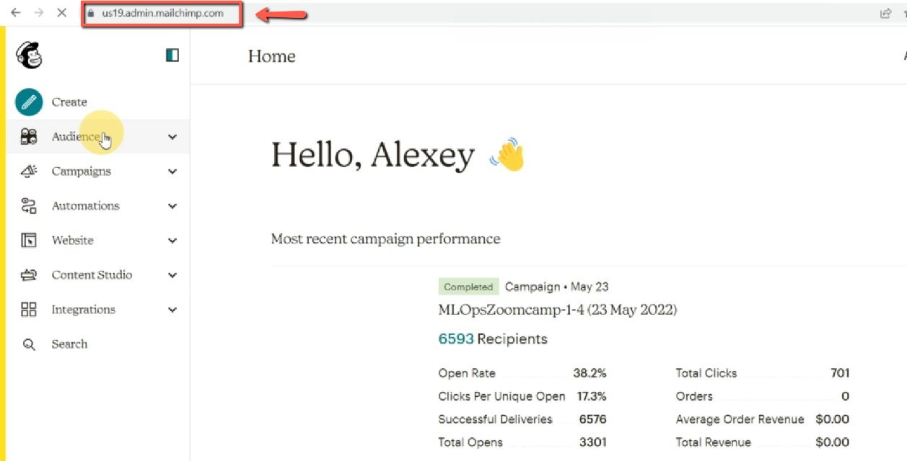
    <!-- sop-caption-start -->
    This screenshot anchors the step about we need to upload the CSV file to Mailchimp.com so you can match the documented UI before acting. Look for the file transfer or file picker state shown there, then use it to confirm you are in the correct place before continuing.
    <!-- sop-caption-end -->
    <!-- sop-screenshot-end -->
<!-- sop-step-end -->

<!-- sop-step-start id=10 -->
10. Once you are in the "Audience dashboard", click "Manage Audience" and select "Import Contacts"

    <!-- sop-screenshot-start -->
    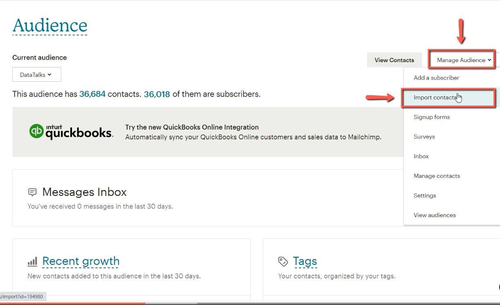
    <!-- sop-caption-start -->
    This screenshot anchors the step about once you are in the "Audience dashboard", click "Manage Audience" and select "Import Contacts" so you can match the documented UI before acting. Look for “Audience dashboard” and “Manage Audience”, then use those cues to complete or verify the step before continuing.
    <!-- sop-caption-end -->
    <!-- sop-screenshot-end -->
<!-- sop-step-end -->

<!-- sop-step-start id=11 -->
11. Select "Upload a file" then press "Continue"

    <!-- sop-screenshot-start -->
    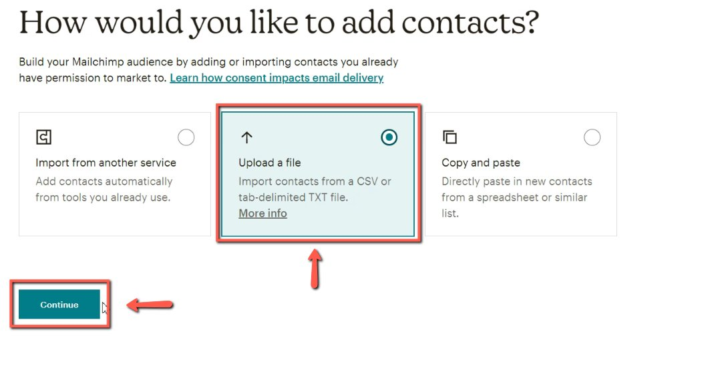
    <!-- sop-caption-start -->
    This screenshot anchors the step to select "Upload a file" then press "Continue" so you can match the documented UI before acting. Look for “Upload a file” and “Continue”, then use those cues to complete or verify the step before continuing.
    <!-- sop-caption-end -->
    <!-- sop-screenshot-end -->
<!-- sop-step-end -->

<!-- sop-step-start id=12 -->
12. Click "Browse" and attach the CSV file

    <!-- sop-screenshot-start -->
    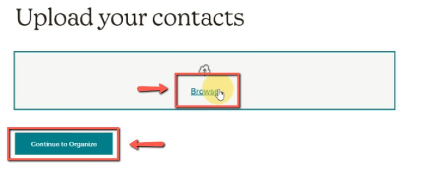
    <!-- sop-caption-start -->
    This screenshot anchors the step to click "Browse" and attach the CSV file so you can match the documented UI before acting. Look for “Browse”, then use that cue to complete or verify the step before continuing.
    <!-- sop-caption-end -->
    <!-- sop-screenshot-end -->
<!-- sop-step-end -->

<!-- sop-step-start id=13 -->
13. Check the box "Update any existing contacts" and select "Continue to Tag"

    <!-- sop-screenshot-start -->
    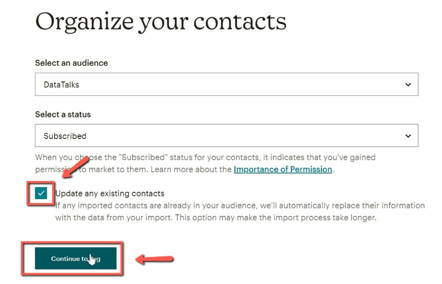
    <!-- sop-caption-start -->
    This screenshot anchors the step to check the box "Update any existing contacts" and select "Continue to Tag" so you can match the documented UI before acting. Look for “Update any existing contacts” and “Continue to Tag”, then use those cues to complete or verify the step before continuing.
    <!-- sop-caption-end -->
    <!-- sop-screenshot-end -->
<!-- sop-step-end -->

<!-- sop-step-start id=14 -->
14. In the "Search for or create tags" enter the following details
    - *For the MLOps Zoomcamp course, use the tags: "mlops-zoomcamp" and "mlops zoomcamp-1"*

    - *For ML Zoomcamp course, use the tags: “ml-zoomcamp”, “ml-zoomcamp-2”*

    Then click "Continue to Match"
    <!-- sop-screenshot-start -->
    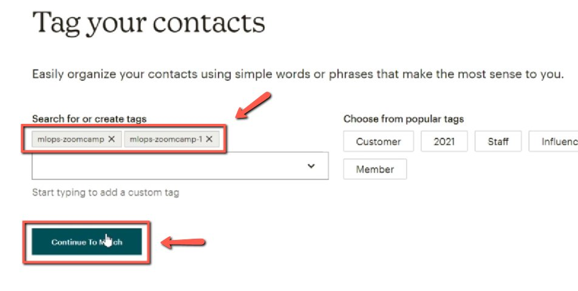
    <!-- sop-caption-start -->
    This screenshot anchors the step to click "Continue to Match" so you can match the documented UI before acting. Look for “Continue to Match”, then use that cue to complete or verify the step before continuing.
    <!-- sop-caption-end -->
    <!-- sop-screenshot-end -->
<!-- sop-step-end -->

<!-- sop-step-start id=15 -->
15. After, click "Finalize import"

    <!-- sop-screenshot-start -->
    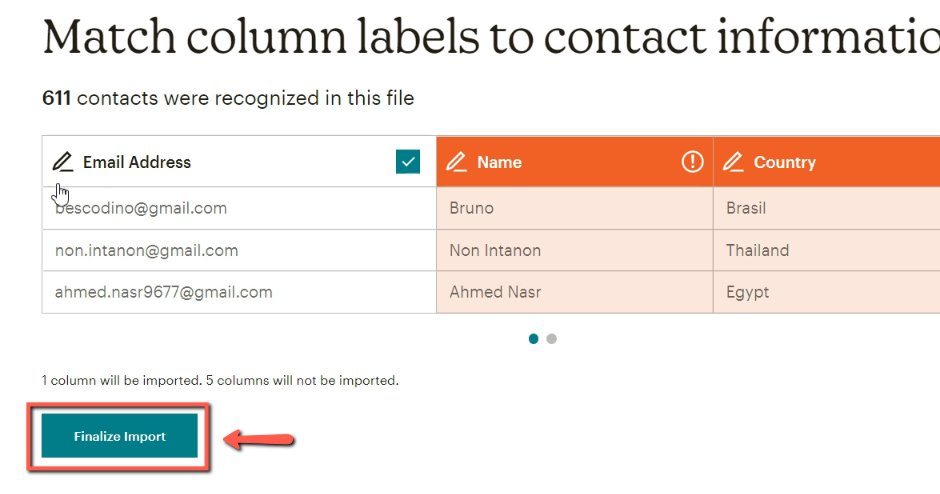
    <!-- sop-caption-start -->
    This screenshot anchors the step to click "Finalize import" so you can match the documented UI before acting. Look for “Finalize import”, then use that cue to complete or verify the step before continuing.
    <!-- sop-caption-end -->
    <!-- sop-screenshot-end -->
<!-- sop-step-end -->

<!-- sop-step-start id=16 -->
16. Then, select "Complete import"

    <!-- sop-screenshot-start -->
    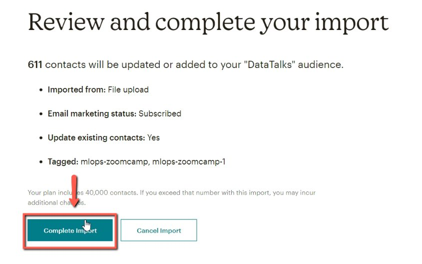
    <!-- sop-caption-start -->
    This screenshot anchors the step to select "Complete import" so you can match the documented UI before acting. Look for “Complete import”, then use that cue to complete or verify the step before continuing.
    <!-- sop-caption-end -->
    <!-- sop-screenshot-end -->
<!-- sop-step-end -->

<!-- sop-step-start id=17 -->
17. Once you complete the import, move the CSV file to the "upload" folder.

    <!-- sop-screenshot-start -->
    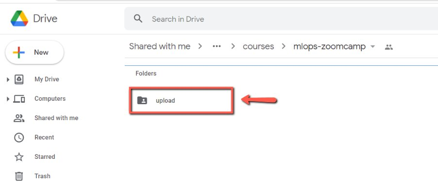
    <!-- sop-caption-start -->
    This screenshot anchors the step about once you complete the import, move the CSV file to the "upload" folder so you can match the documented UI before acting. Look for “upload”, then use that cue to complete or verify the step before continuing.
    <!-- sop-caption-end -->
    <!-- sop-screenshot-end -->
<!-- sop-step-end -->
<!-- sop-section-end -->

<!-- sop-section-start: validation -->
## Validation

-
<!-- sop-section-end -->

<!-- sop-section-start: troubleshooting -->
## Troubleshooting

-
<!-- sop-section-end -->

<!-- sop-section-start: references -->
## References

-
<!-- sop-section-end -->
