# Filling Newsletter Statistics

<!-- sop-section-start: summary -->
## Summary

- Purpose: Newsletter Statistics refers to the data concerning the amount of “clicks” and “impressions” of a sponsored link: Mailchimp, LinkedIn and X.
- Outcome: Filling in Newsletter Statistics is important to update our sponsors how well their newsletters perform and to ensure that we track the success of sponsored links accurately.
- Trigger: It is a weekly update (Monday).
- Frequency: Weekly, on Monday.
<!-- sop-section-end -->

<!-- sop-section-start: prerequisites -->
## Prerequisites

- Access: DataTalks.Club schedule spreadsheet, Mailchimp reports, LinkedIn analytics, and X analytics.
- Tools: Google Sheets, Mailchimp, LinkedIn, and X.
- Inputs: Sponsor name, newsletter number, sponsored link, and social media posts.
<!-- sop-section-end -->

<!-- sop-section-start: procedure -->
## Procedure

<!-- sop-group-start: "Newsletter delivery statistics" -->
### Newsletter delivery statistics

<!-- sop-step-start id=1 -->
1.  Go to DataTalks.Club.schedule [https://docs.google.com/spreadsheets/d/1-T8qkmShlFUrT2NmkI8Pi1NgUS9IunP6wO5-L79xe2s/edit?gid=1710801712#gid=1710801712](https://docs.google.com/spreadsheets/d/1-T8qkmShlFUrT2NmkI8Pi1NgUS9IunP6wO5-L79xe2s/edit?gid=1710801712#gid=1710801712)
<!-- sop-step-end -->

<!-- sop-step-start id=2 -->
2.  Find in the URL section the newsletter number of the sponsor.

    Note: For this example, the sponsor is Qwak and the newsletter number is #190.

    <!-- sop-screenshot-start -->
    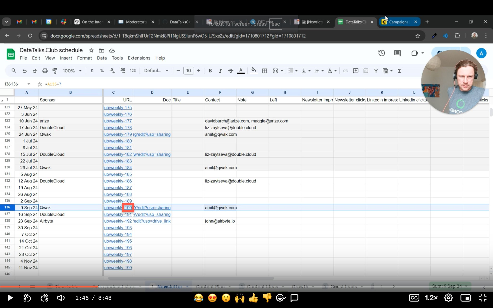
    <!-- sop-caption-start -->
    This screenshot anchors the example shown in the procedure so you can match the documented UI before acting. Look for the relevant screen area shown there, then use it to confirm you are in the correct place before continuing.
    <!-- sop-caption-end -->
    <!-- sop-screenshot-end -->
<!-- sop-step-end -->

<!-- sop-step-start id=3 -->
3.  Go to [https://mailchimp.com/](https://mailchimp.com/) and click “All campaigns” under it.

    <!-- sop-screenshot-start -->
    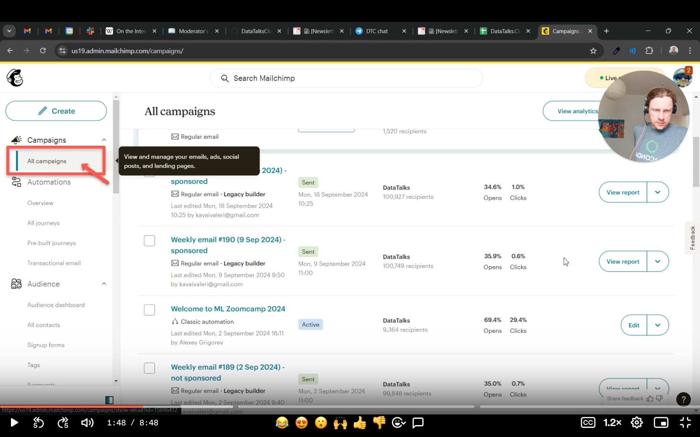
    <!-- sop-caption-start -->
    This screenshot anchors the step to go to https://mailchimp.com/ and click “All campaigns” under it so you can match the documented UI before acting. Look for “All campaigns”, then use that cue to complete or verify the step before continuing.
    <!-- sop-caption-end -->
    <!-- sop-screenshot-end -->
<!-- sop-step-end -->

<!-- sop-step-start id=4 -->
4.  Scroll through and find the corresponding newsletter of the sponsor guided by the newsletter number.

    <!-- sop-screenshot-start -->
    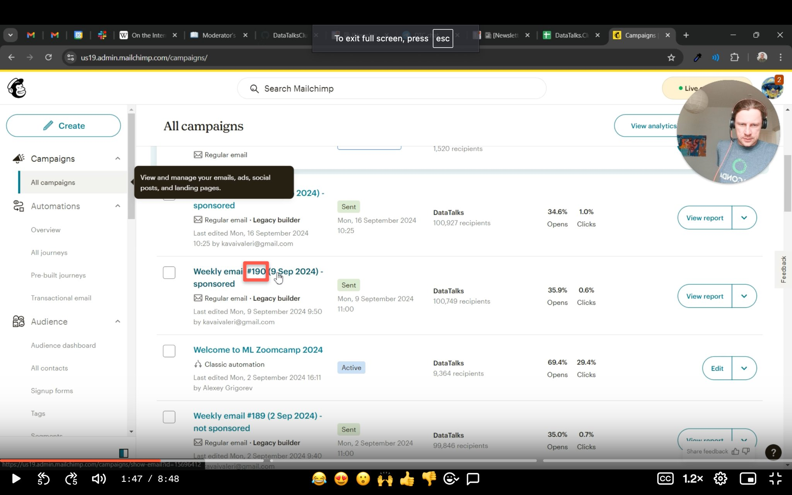
    <!-- sop-caption-start -->
    This screenshot anchors the step to scroll through and find the corresponding newsletter of the sponsor guided by the newsletter number so you can match the documented UI before acting. Look for the relevant screen area shown there, then use it to confirm you are in the correct place before continuing.
    <!-- sop-caption-end -->
    <!-- sop-screenshot-end -->
<!-- sop-step-end -->

<!-- sop-step-start id=5 -->
5.  Once you found the newsletter, click the “View report” button beside it.

    <!-- sop-screenshot-start -->
    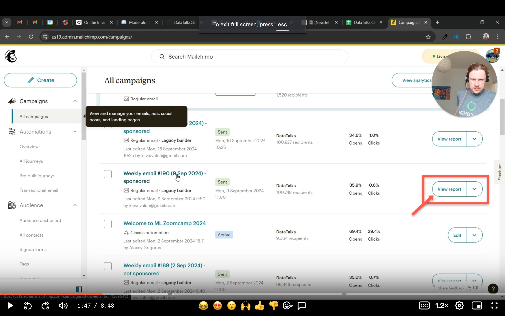
    <!-- sop-caption-start -->
    This screenshot anchors the step about once you found the newsletter, click the “View report” button beside it so you can match the documented UI before acting. Look for “View report”, then use that cue to complete or verify the step before continuing.
    <!-- sop-caption-end -->
    <!-- sop-screenshot-end -->
<!-- sop-step-end -->

<!-- sop-step-start id=6 -->
6.  Copy the number of people who opened the newsletter.

    <!-- sop-screenshot-start -->
    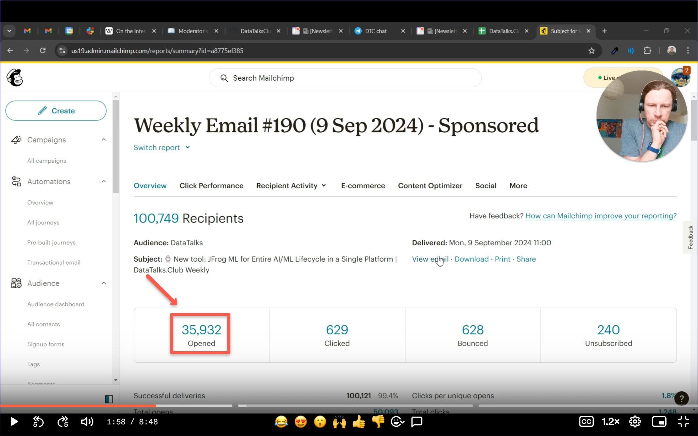
    <!-- sop-caption-start -->
    This screenshot anchors the step to copy the number of people who opened the newsletter so you can match the documented UI before acting. Look for the link, copy, or paste target shown there, then use it to confirm you are in the correct place before continuing.
    <!-- sop-caption-end -->
    <!-- sop-screenshot-end -->
<!-- sop-step-end -->

<!-- sop-step-start id=7 -->
7.  Paste it under the “Newsletter impression” column of the sponsor found on the DataTalk.Club.schedule document.

    <!-- sop-screenshot-start -->
    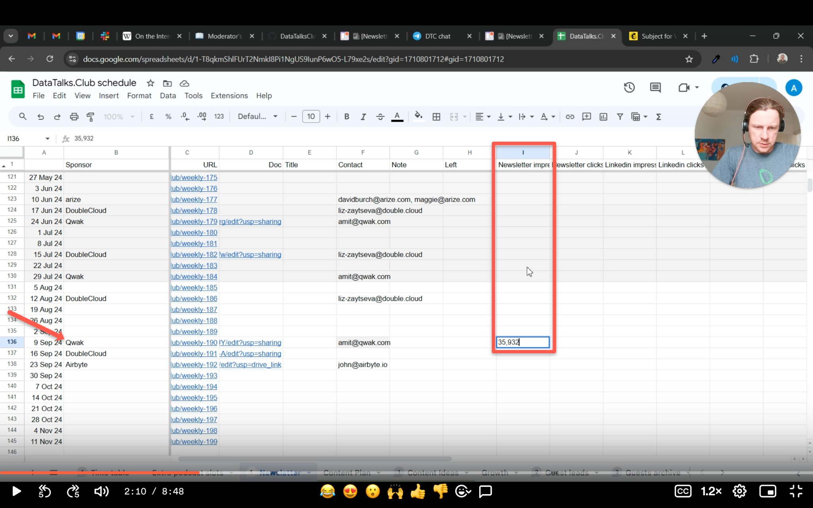
    <!-- sop-caption-start -->
    This screenshot anchors the step to paste it under the “Newsletter impression” column of the sponsor found on the DataTalk.Club.schedule document so you can match the documented UI before acting. Look for “Newsletter impression”, then use that cue to complete or verify the step before continuing.
    <!-- sop-caption-end -->
    <!-- sop-screenshot-end -->
<!-- sop-step-end -->

<!-- sop-step-start id=8 -->
8.  Go back to the report and scroll down to find the “Click Performance” and copy the amount of clicks of the sponsored link.

    Note: Typically, the sponsored link is the top link.
    <!-- sop-screenshot-start -->
    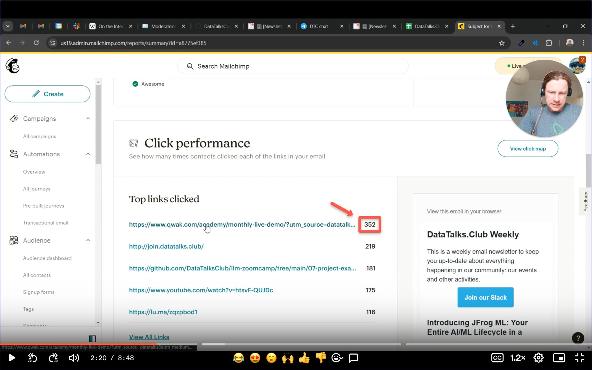
    <!-- sop-caption-start -->
    This screenshot anchors the step about typically, the sponsored link is the top link so you can match the documented UI before acting. Look for the link, copy, or paste target shown there, then use it to confirm you are in the correct place before continuing.
    <!-- sop-caption-end -->
    <!-- sop-screenshot-end -->
<!-- sop-step-end -->

<!-- sop-step-start id=9 -->
9.  Paste it under the “Newsletter clicks” column of the sponsor found on the DataTalk.Club.schedule document.

    <!-- sop-screenshot-start -->
    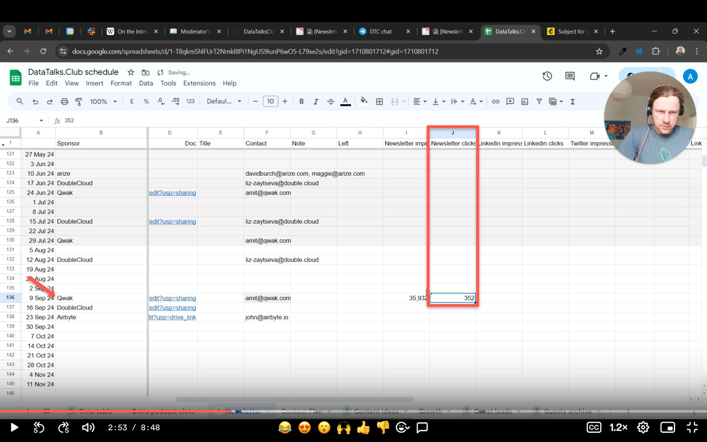
    <!-- sop-caption-start -->
    This screenshot anchors the step to paste it under the “Newsletter clicks” column of the sponsor found on the DataTalk.Club.schedule document so you can match the documented UI before acting. Look for “Newsletter clicks”, then use that cue to complete or verify the step before continuing.
    <!-- sop-caption-end -->
    <!-- sop-screenshot-end -->
<!-- sop-step-end -->

<!-- sop-step-start id=10 -->
10. Go back to the report and click on “Click Performance”.

    <!-- sop-screenshot-start -->
    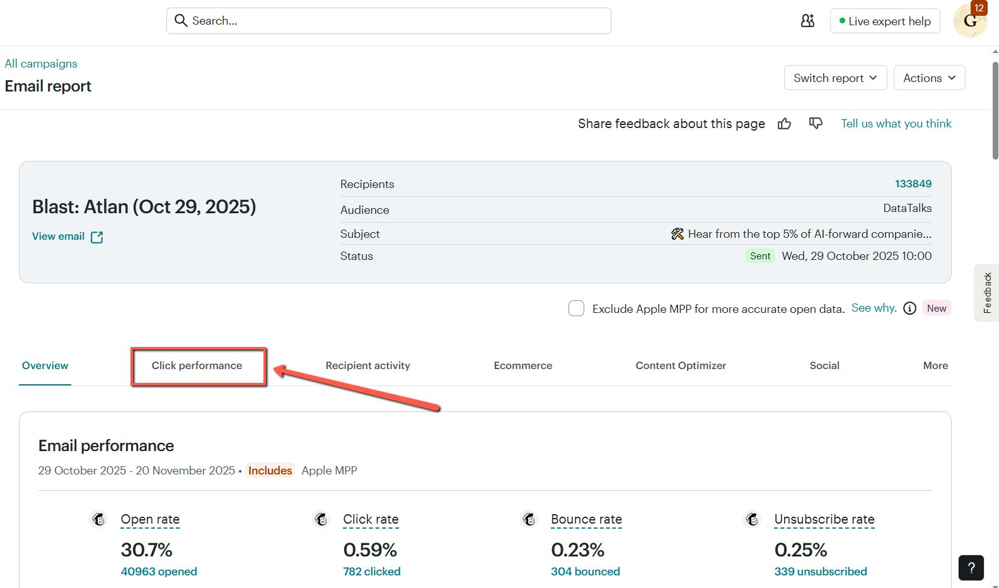
    <!-- sop-caption-start -->
    This screenshot anchors the step to go back to the report and click on “Click Performance” so you can match the documented UI before acting. Look for “Click Performance”, then use that cue to complete or verify the step before continuing.
    <!-- sop-caption-end -->
    <!-- sop-screenshot-end -->
<!-- sop-step-end -->

<!-- sop-step-start id=11 -->
11. Copy on “Unique clicks”.

    <!-- sop-screenshot-start -->
    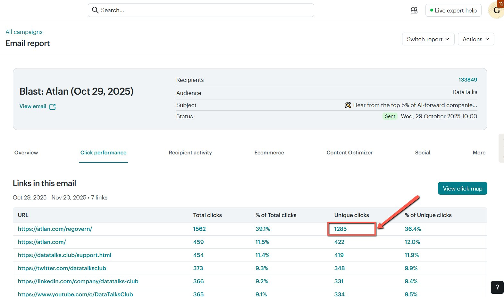
    <!-- sop-caption-start -->
    This screenshot anchors the step to copy on “Unique clicks” so you can match the documented UI before acting. Look for “Unique clicks”, then use that cue to complete or verify the step before continuing.
    <!-- sop-caption-end -->
    <!-- sop-screenshot-end -->
<!-- sop-step-end -->

<!-- sop-step-start id=12 -->
12. Paste it under the “Unique clicks” column in the DataTalk.Club.schedule document.

    <!-- sop-screenshot-start -->
    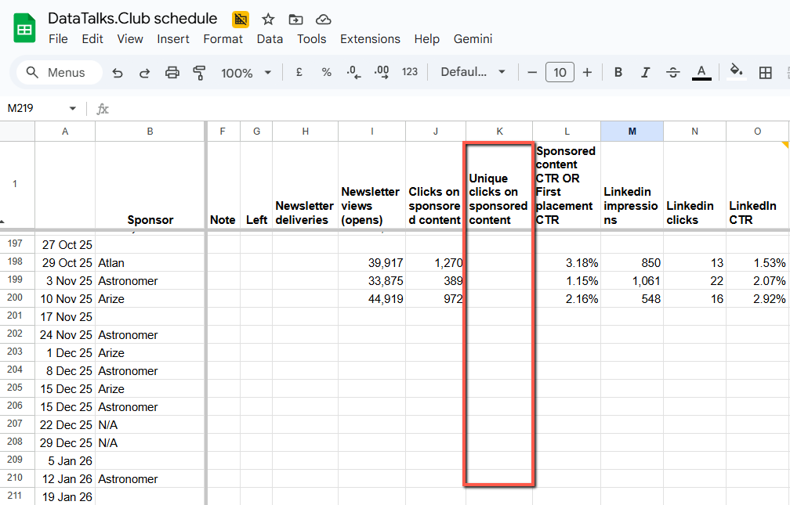
    <!-- sop-caption-start -->
    This screenshot anchors the step to paste it under the “Unique clicks” column in the DataTalk.Club.schedule document so you can match the documented UI before acting. Look for “Unique clicks”, then use that cue to complete or verify the step before continuing.
    <!-- sop-caption-end -->
    <!-- sop-screenshot-end -->
<!-- sop-step-end -->

<!-- sop-step-start id=13 -->
13. Go back to the report and copy on Deliveries.

    <!-- sop-screenshot-start -->
    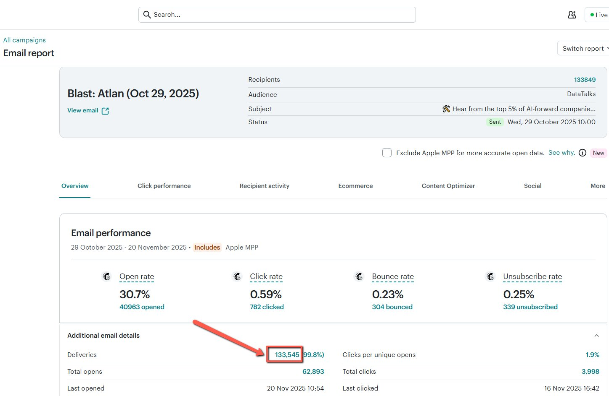
    <!-- sop-caption-start -->
    This screenshot anchors the step to go back to the report and copy on Deliveries so you can match the documented UI before acting. Look for the link, copy, or paste target shown there, then use it to confirm you are in the correct place before continuing.
    <!-- sop-caption-end -->
    <!-- sop-screenshot-end -->
<!-- sop-step-end -->

<!-- sop-step-start id=14 -->
14. Paste it under the “Newsletter deliveries” column in the DataTalk.Club.schedule document.

    <!-- sop-screenshot-start -->
    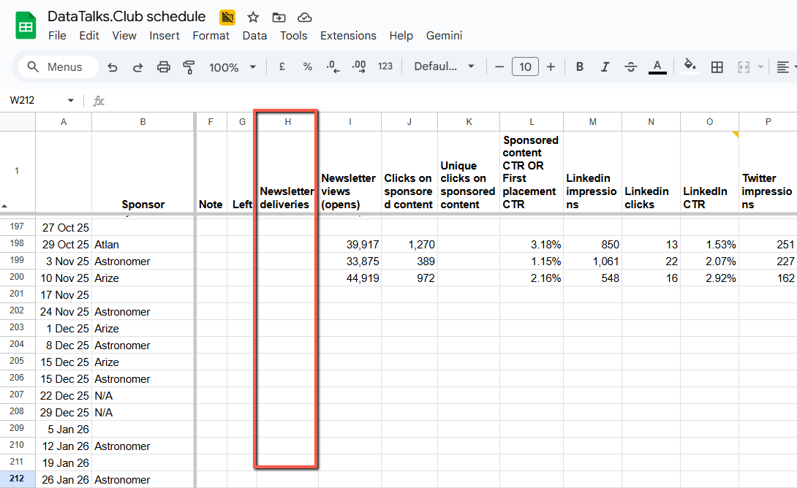
    <!-- sop-caption-start -->
    This screenshot anchors the step to paste it under the “Newsletter deliveries” column in the DataTalk.Club.schedule document so you can match the documented UI before acting. Look for “Newsletter deliveries”, then use that cue to complete or verify the step before continuing.
    <!-- sop-caption-end -->
    <!-- sop-screenshot-end -->
<!-- sop-step-end -->
<!-- sop-group-end -->

<!-- sop-group-start: "LinkedIn Sponsored Post Statistics" -->
### LinkedIn Sponsored Post Statistics

<!-- sop-step-start id=15 -->
15. Go to LinkedIn under the DataTalksClub account. Click “Page posts" and find the sponsored post.

    <!-- sop-screenshot-start -->
    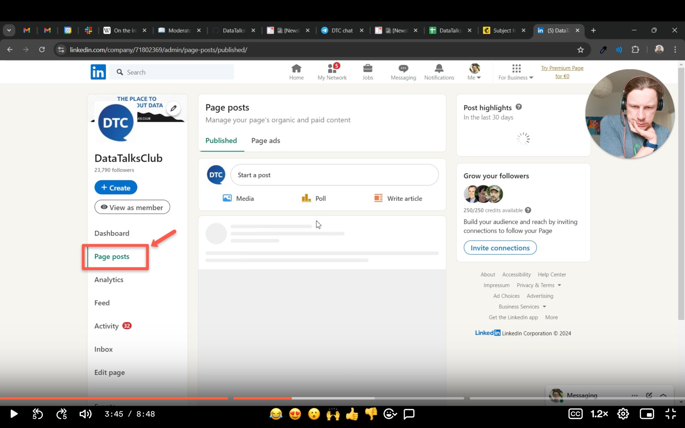
    <!-- sop-caption-start -->
    This screenshot anchors the step to go to LinkedIn under the DataTalksClub account. Click “Page posts" and find the sponsored post so you can match the documented UI before acting. Look for “Page posts”, then use that cue to complete or verify the step before continuing.
    <!-- sop-caption-end -->
    <!-- sop-screenshot-end -->
<!-- sop-step-end -->

<!-- sop-step-start id=16 -->
16. In the post, click “Preview results.”

    Note: For this example, the sponsor is DoubleCloud.

    <!-- sop-screenshot-start -->
    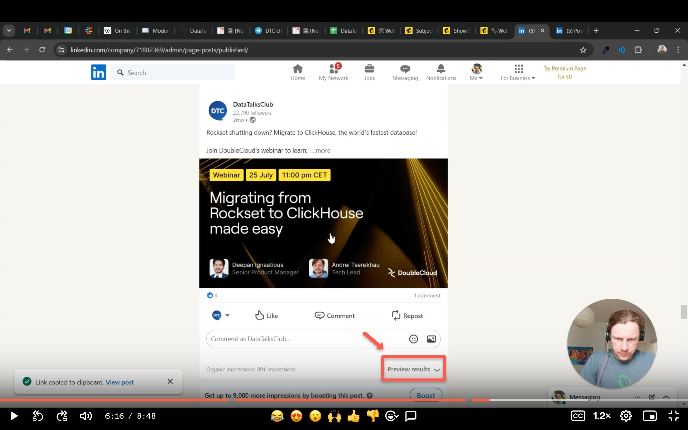
    <!-- sop-caption-start -->
    This screenshot anchors the example shown in the procedure so you can match the documented UI before acting. Look for the relevant screen area shown there, then use it to confirm you are in the correct place before continuing.
    <!-- sop-caption-end -->
    <!-- sop-screenshot-end -->
<!-- sop-step-end -->

<!-- sop-step-start id=17 -->
17. Copy the number of Impressions of the LinkedIn post.

    <!-- sop-screenshot-start -->
    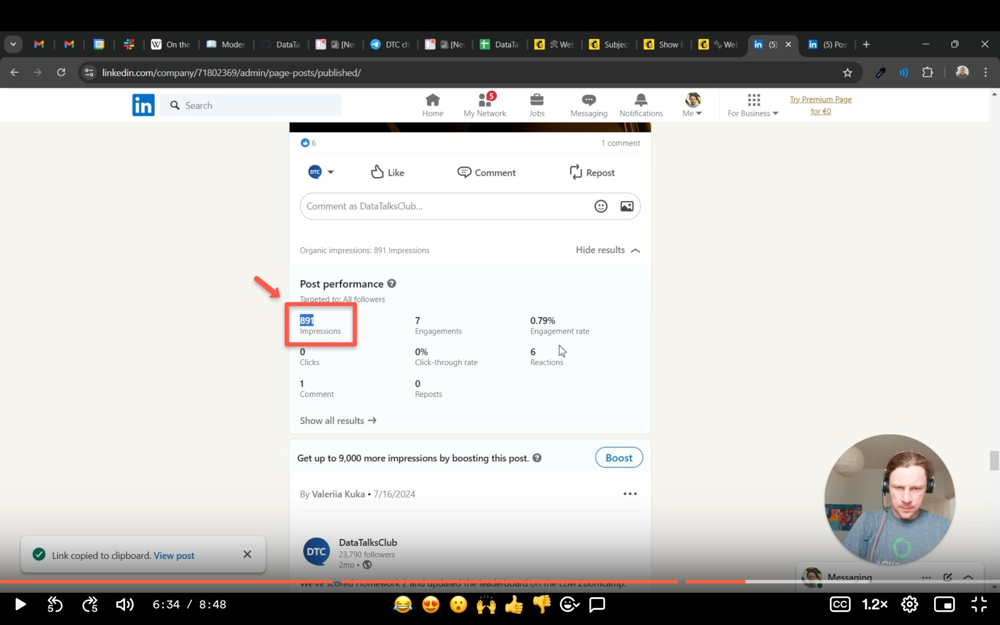
    <!-- sop-caption-start -->
    This screenshot anchors the step to copy the number of Impressions of the LinkedIn post so you can match the documented UI before acting. Look for the link, copy, or paste target shown there, then use it to confirm you are in the correct place before continuing.
    <!-- sop-caption-end -->
    <!-- sop-screenshot-end -->
<!-- sop-step-end -->

<!-- sop-step-start id=18 -->
18. Paste it under the “LinkedIn impressions” column of the sponsor found on the DataTalk.Club.schedule document.

    <!-- sop-screenshot-start -->
    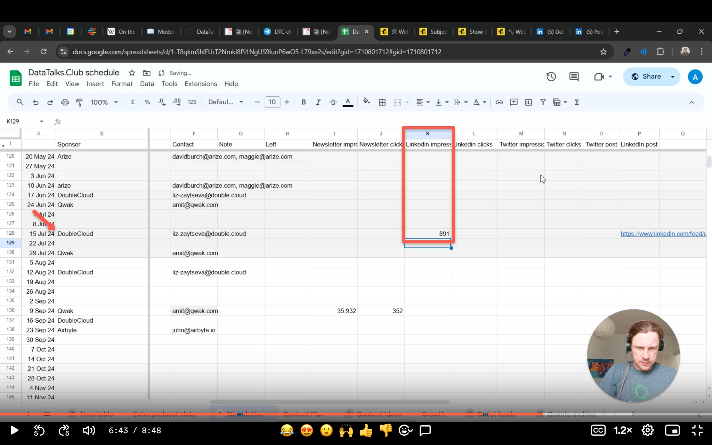
    <!-- sop-caption-start -->
    This screenshot anchors the step to paste it under the “LinkedIn impressions” column of the sponsor found on the DataTalk.Club.schedule document so you can match the documented UI before acting. Look for “LinkedIn impressions”, then use that cue to complete or verify the step before continuing.
    <!-- sop-caption-end -->
    <!-- sop-screenshot-end -->
<!-- sop-step-end -->

<!-- sop-step-start id=19 -->
19. Go back to the LinkedIn post, and copy the number of clicks.

    <!-- sop-screenshot-start -->
    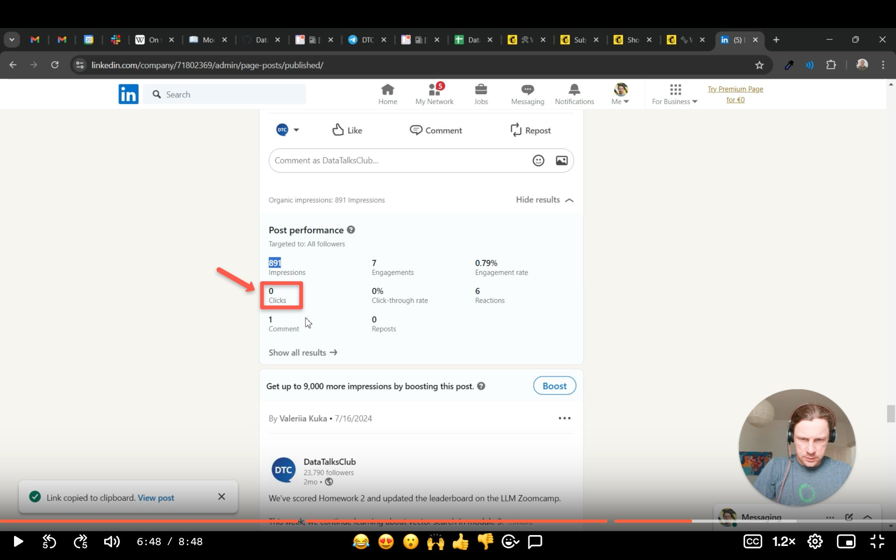
    <!-- sop-caption-start -->
    This screenshot anchors the step to go back to the LinkedIn post, and copy the number of clicks so you can match the documented UI before acting. Look for the link, copy, or paste target shown there, then use it to confirm you are in the correct place before continuing.
    <!-- sop-caption-end -->
    <!-- sop-screenshot-end -->
<!-- sop-step-end -->

<!-- sop-step-start id=20 -->
20. Paste it under the “LinkedIn clicks” column of the sponsor found on the DataTalk.Club.schedule document.

    <!-- sop-screenshot-start -->
    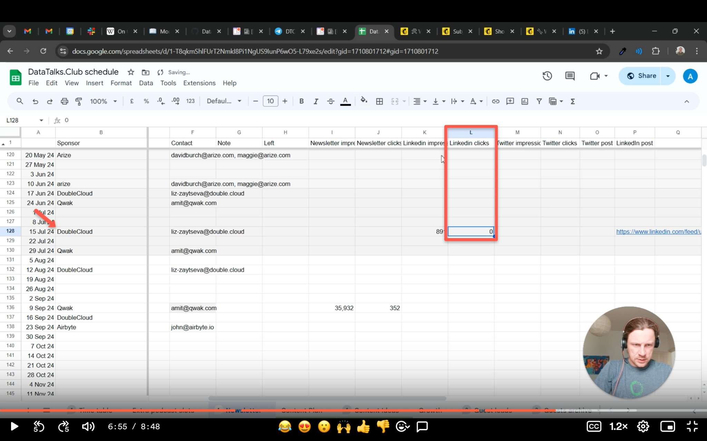
    <!-- sop-caption-start -->
    This screenshot anchors the step to paste it under the “LinkedIn clicks” column of the sponsor found on the DataTalk.Club.schedule document so you can match the documented UI before acting. Look for “LinkedIn clicks”, then use that cue to complete or verify the step before continuing.
    <!-- sop-caption-end -->
    <!-- sop-screenshot-end -->
<!-- sop-step-end -->

<!-- sop-step-start id=21 -->
21. Copy the link of the LinkedIn post

    <!-- sop-screenshot-start -->
    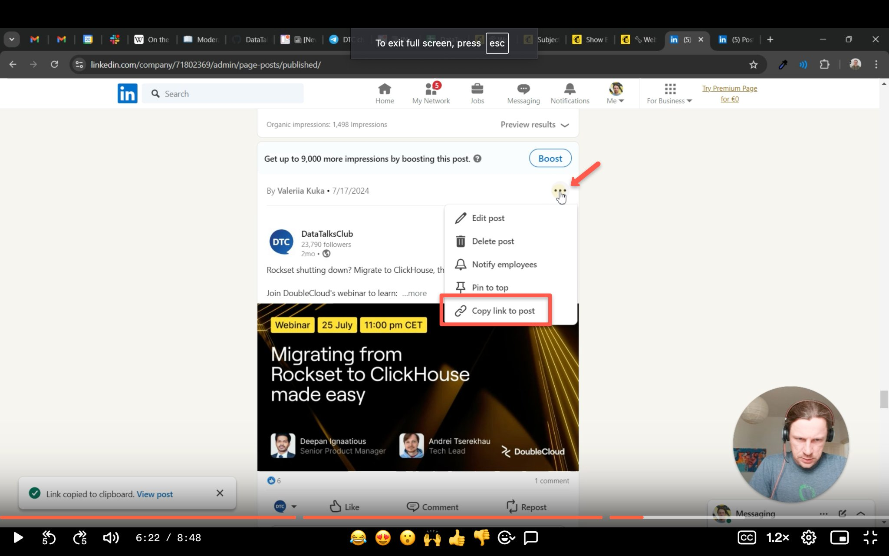
    <!-- sop-caption-start -->
    This screenshot anchors the step to copy the link of the LinkedIn post so you can match the documented UI before acting. Look for the link, copy, or paste target shown there, then use it to confirm you are in the correct place before continuing.
    <!-- sop-caption-end -->
    <!-- sop-screenshot-end -->
<!-- sop-step-end -->

<!-- sop-step-start id=22 -->
22. Paste it on the LinkedIn post column of the sponsor found on the DataTalk.Club.schedule document.

    <!-- sop-screenshot-start -->
    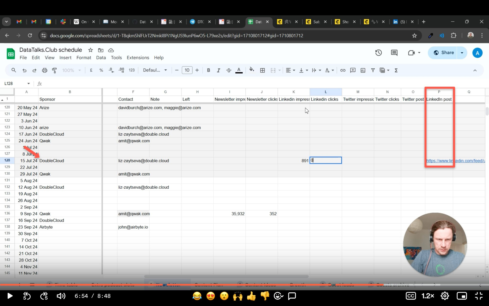
    <!-- sop-caption-start -->
    This screenshot anchors the step to paste it on the LinkedIn post column of the sponsor found on the DataTalk.Club.schedule document so you can match the documented UI before acting. Look for the schedule or date control shown there, then use it to confirm you are in the correct place before continuing.
    <!-- sop-caption-end -->
    <!-- sop-screenshot-end -->

    X Sponsored Post Statistics
<!-- sop-step-end -->

<!-- sop-step-start id=23 -->
23. Go to X under the DataTalksClub account. Click “Profile” and find the sponsored post.

    <!-- sop-screenshot-start -->
    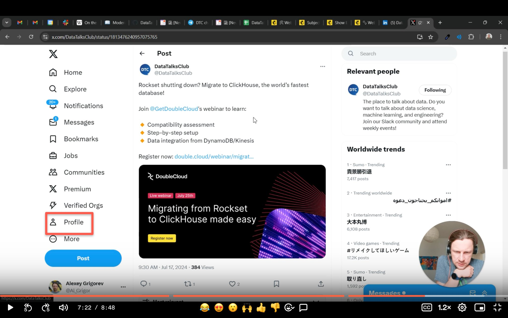
    <!-- sop-caption-start -->
    This screenshot anchors the step to go to X under the DataTalksClub account. Click “Profile” and find the sponsored post so you can match the documented UI before acting. Look for “Profile”, then use that cue to complete or verify the step before continuing.
    <!-- sop-caption-end -->
    <!-- sop-screenshot-end -->
<!-- sop-step-end -->

<!-- sop-step-start id=24 -->
24. In the post, click the Post Analytics Icon.

    <!-- sop-screenshot-start -->
    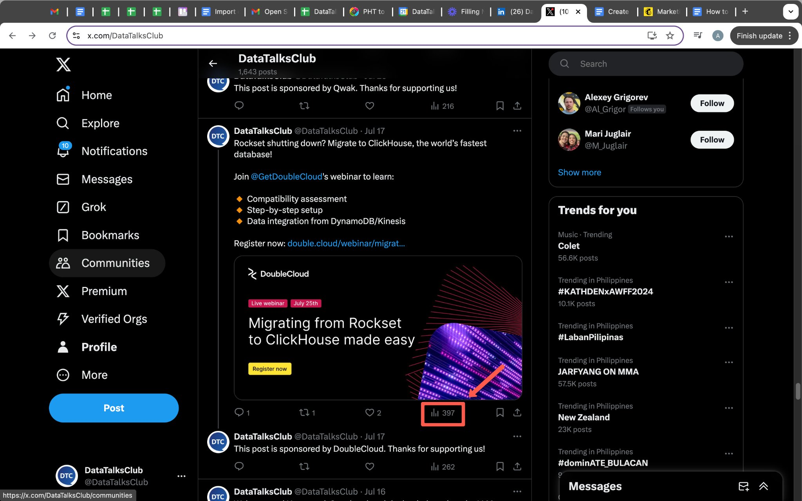
    <!-- sop-caption-start -->
    This screenshot anchors the step about in the post, click the Post Analytics Icon so you can match the documented UI before acting. Look for the post composer or published post shown there, then use it to confirm you are in the correct place before continuing.
    <!-- sop-caption-end -->
    <!-- sop-screenshot-end -->
<!-- sop-step-end -->

<!-- sop-step-start id=25 -->
25. Copy the number of Impressions of the post.

    <!-- sop-screenshot-start -->
    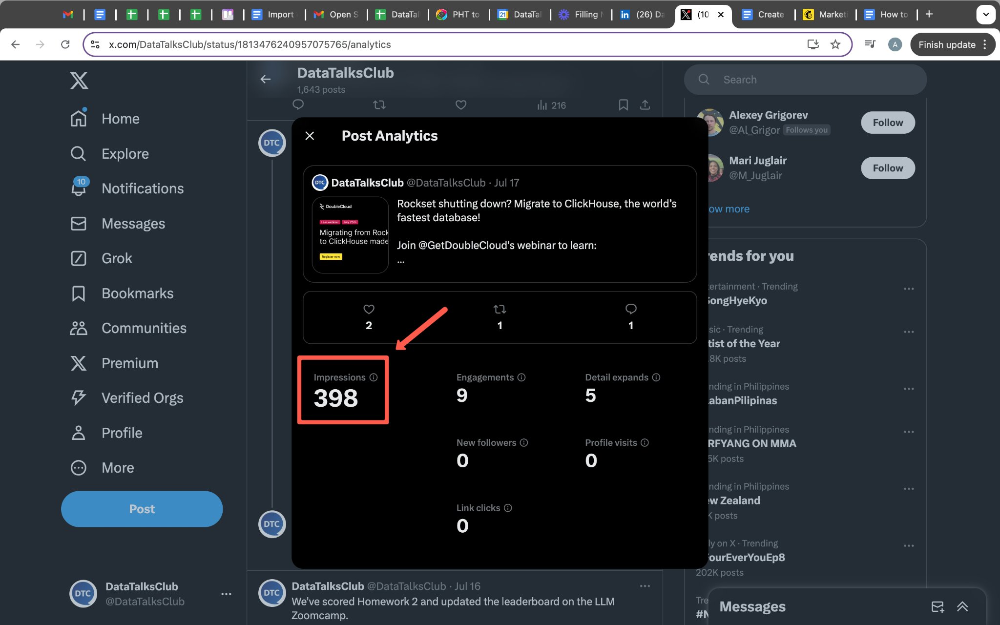
    <!-- sop-caption-start -->
    This screenshot anchors the step to copy the number of Impressions of the post so you can match the documented UI before acting. Look for the link, copy, or paste target shown there, then use it to confirm you are in the correct place before continuing.
    <!-- sop-caption-end -->
    <!-- sop-screenshot-end -->
<!-- sop-step-end -->

<!-- sop-step-start id=26 -->
26. Paste it under the “Twitter Impression” column of the sponsor found on the DataTalk.Club.schedule document.

    <!-- sop-screenshot-start -->
    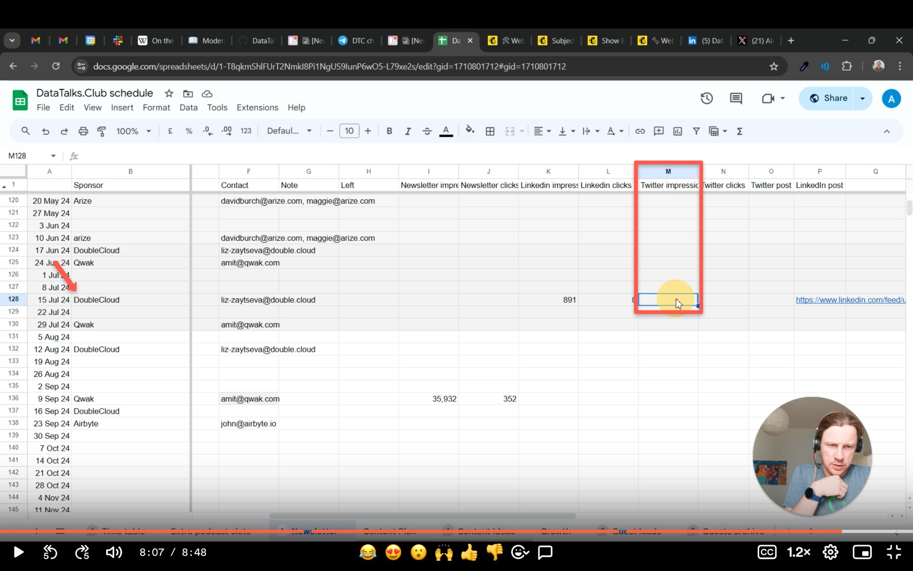
    <!-- sop-caption-start -->
    This screenshot anchors the step to paste it under the “Twitter Impression” column of the sponsor found on the DataTalk.Club.schedule document so you can match the documented UI before acting. Look for “Twitter Impression”, then use that cue to complete or verify the step before continuing.
    <!-- sop-caption-end -->
    <!-- sop-screenshot-end -->
<!-- sop-step-end -->

<!-- sop-step-start id=27 -->
27. Go back to the post, and copy the number of clicks.

    <!-- sop-screenshot-start -->
    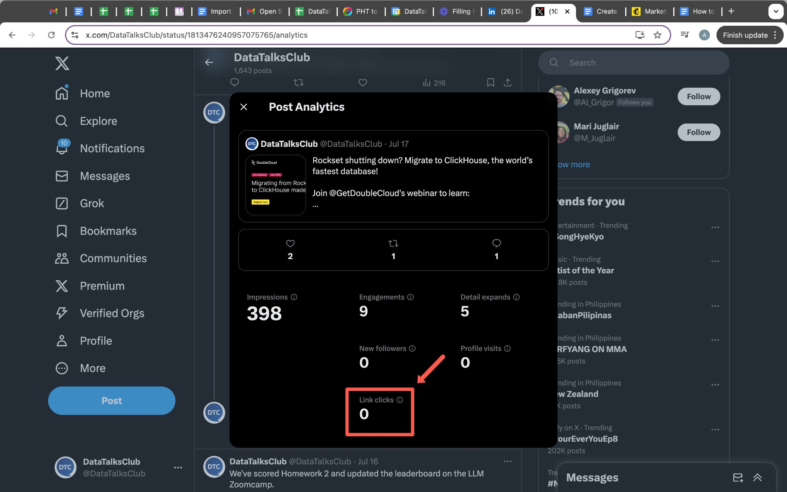
    <!-- sop-caption-start -->
    This screenshot anchors the step to go back to the post, and copy the number of clicks so you can match the documented UI before acting. Look for the link, copy, or paste target shown there, then use it to confirm you are in the correct place before continuing.
    <!-- sop-caption-end -->
    <!-- sop-screenshot-end -->
<!-- sop-step-end -->

<!-- sop-step-start id=28 -->
28. Paste it under the “Twitter clicks” column of the sponsor found on the DataTalk.Club.schedule document.

    <!-- sop-screenshot-start -->
    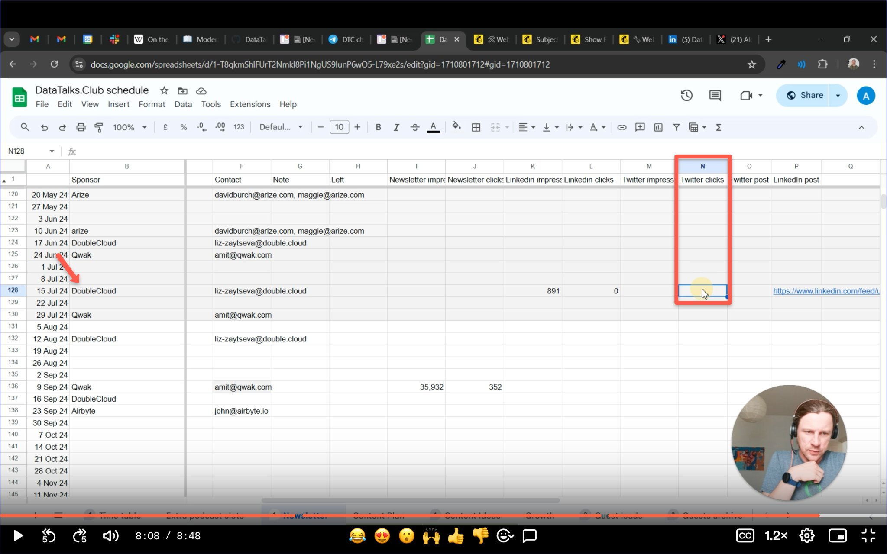
    <!-- sop-caption-start -->
    This screenshot anchors the step to paste it under the “Twitter clicks” column of the sponsor found on the DataTalk.Club.schedule document so you can match the documented UI before acting. Look for “Twitter clicks”, then use that cue to complete or verify the step before continuing.
    <!-- sop-caption-end -->
    <!-- sop-screenshot-end -->
<!-- sop-step-end -->

<!-- sop-step-start id=29 -->
29. In the post, click the share icon, and copy the link of the X sponsored post.

    <!-- sop-screenshot-start -->
    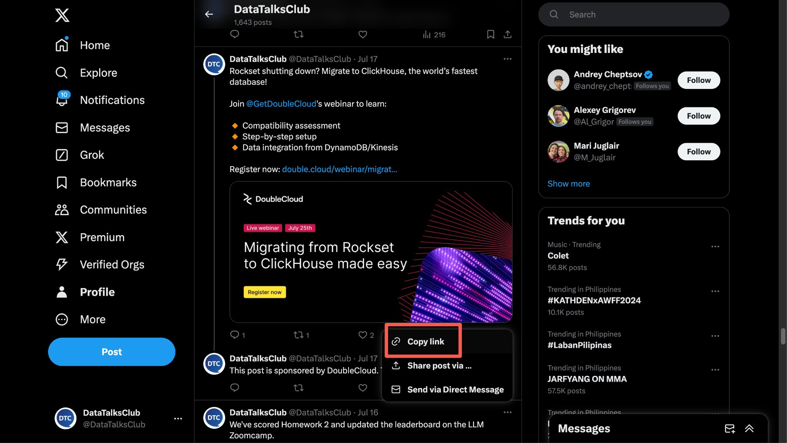
    <!-- sop-caption-start -->
    This screenshot anchors the step about in the post, click the share icon, and copy the link of the X sponsored post so you can match the documented UI before acting. Look for the link, copy, or paste target shown there, then use it to confirm you are in the correct place before continuing.
    <!-- sop-caption-end -->
    <!-- sop-screenshot-end -->
<!-- sop-step-end -->

<!-- sop-step-start id=30 -->
30. Paste it under the “Twitter post” column of the sponsor found on the DataTalk.Club.schedule document.

    <!-- sop-screenshot-start -->
    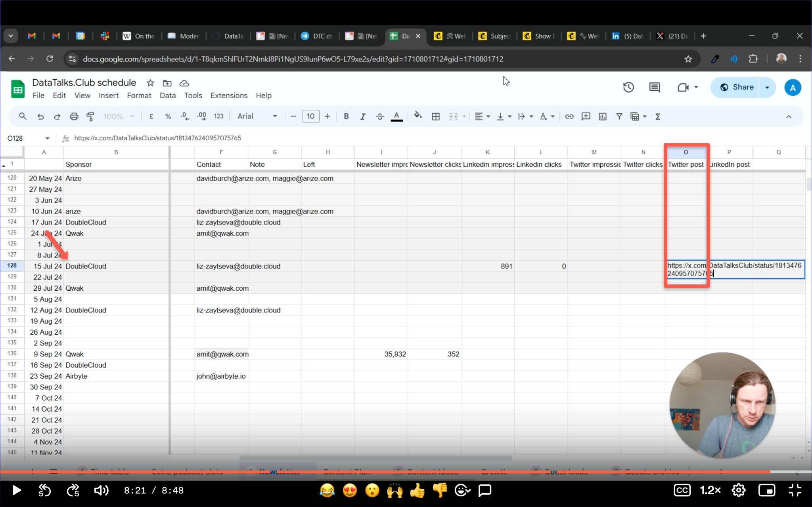
    <!-- sop-caption-start -->
    This screenshot anchors the step to paste it under the “Twitter post” column of the sponsor found on the DataTalk.Club.schedule document so you can match the documented UI before acting. Look for “Twitter post”, then use that cue to complete or verify the step before continuing.
    <!-- sop-caption-end -->
    <!-- sop-screenshot-end -->
<!-- sop-step-end -->

<!-- sop-group-end -->
<!-- sop-section-end -->

<!-- sop-section-start: validation -->
## Validation

-
<!-- sop-section-end -->

<!-- sop-section-start: troubleshooting -->
## Troubleshooting

-
<!-- sop-section-end -->

<!-- sop-section-start: references -->
## References

-
<!-- sop-section-end -->
