# Getting campaign performance stats

<!-- sop-section-start: summary -->
## Summary

- Purpose: Collect campaign performance stats for sponsored newsletter and social posts.
- Outcome: Sponsor-facing stats for Mailchimp, Twitter/X, and LinkedIn are gathered.
- Trigger: A sponsor campaign performance report needs to be prepared.
- Frequency: After sponsored campaign activity is available.
<!-- sop-section-end -->

<!-- sop-section-start: prerequisites -->
## Prerequisites

- Access: Mailchimp reports, DataTalks.Club schedule spreadsheet, X analytics, and LinkedIn analytics.
- Tools: Mailchimp, Google Sheets, X, LinkedIn, and the sponsor stats template.
- Inputs: Sponsor campaign, sponsored links, and related social media announcements.
<!-- sop-section-end -->

<!-- sop-section-start: procedure -->
## Procedure

<!-- sop-prose-start -->
How to get campaign performance stats
This procedure will show you the steps on how to get campaign performance stats.

Step-by-step Instructions
<!-- sop-prose-end -->

<!-- sop-step-start id=1 -->
1.  The first thing you need to do is open MailChimp.com. Under “Campaign” click “All campaign”

    <!-- sop-screenshot-start -->
    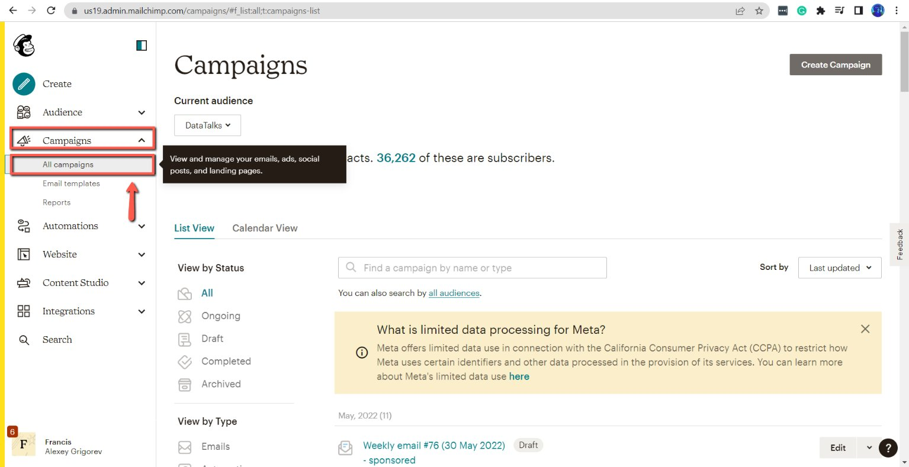
    <!-- sop-caption-start -->
    This screenshot anchors the step to open MailChimp.com. Under “Campaign” click “All campaign” so you can match the documented UI before acting. Look for “Campaign” and “All campaign”, then use those cues to complete or verify the step before continuing.
    <!-- sop-caption-end -->
    <!-- sop-screenshot-end -->
<!-- sop-step-end -->

<!-- sop-step-start id=2 -->
2.  After, find the newsletter and click “View report”

    Note: For easier navigation, you can also utilize the [DataTalks.Club schedule](https://docs.google.com/spreadsheets/d/1-T8qkmShlFUrT2NmkI8Pi1NgUS9IunP6wO5-L79xe2s/edit#gid=0) to locate the campaign.
    <!-- sop-screenshot-start -->
    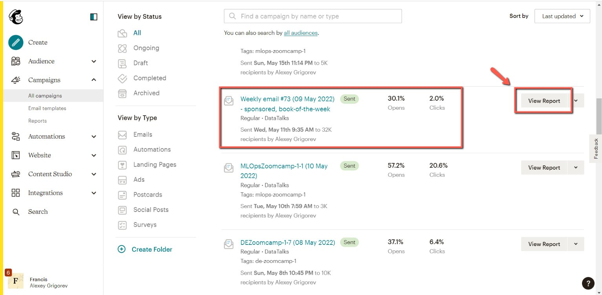
    <!-- sop-caption-start -->
    This screenshot anchors the step to find the newsletter and click “View report” so you can match the documented UI before acting. Look for “View report”, then use that cue to complete or verify the step before continuing.
    <!-- sop-caption-end -->
    <!-- sop-screenshot-end -->
<!-- sop-step-end -->

<!-- sop-step-start id=3 -->
3.  To proceed, scroll down and then you can now locate the campaign performance stats.

    <!-- sop-screenshot-start -->
    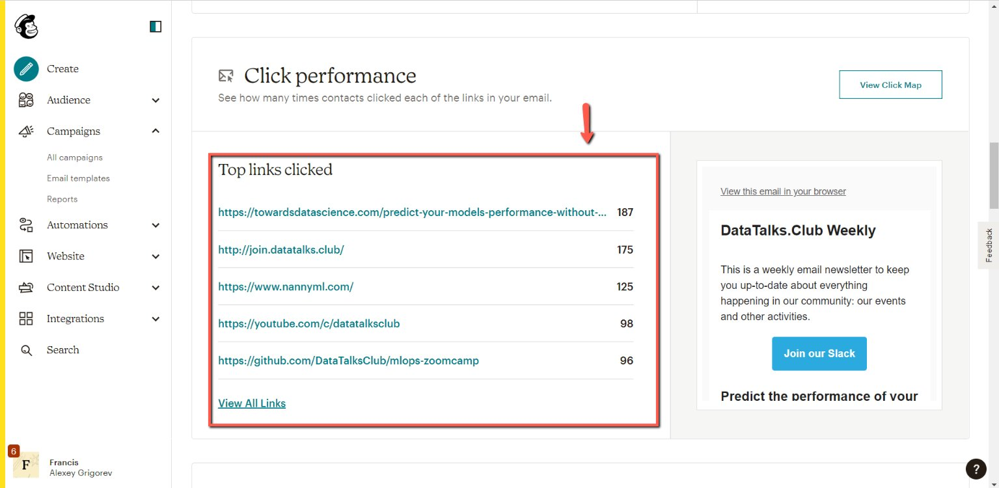
    <!-- sop-caption-start -->
    This screenshot anchors the step to scroll down and then you can now locate the campaign performance stats so you can match the documented UI before acting. Look for the reporting value or action control shown there, then use it to confirm you are in the correct place before continuing.
    <!-- sop-caption-end -->
    <!-- sop-screenshot-end -->
<!-- sop-step-end -->

<!-- sop-step-start id=4 -->
4.  For the email to the sponsor, use this [template](https://docs.google.com/document/d/1ipx5NTvNbN3U56HbXQlIynqb9GW7v9NGFgaN6s6_Ia4/edit?usp=sharing) that will serve as your guide in finding the stats.

    <!-- sop-screenshot-start -->
    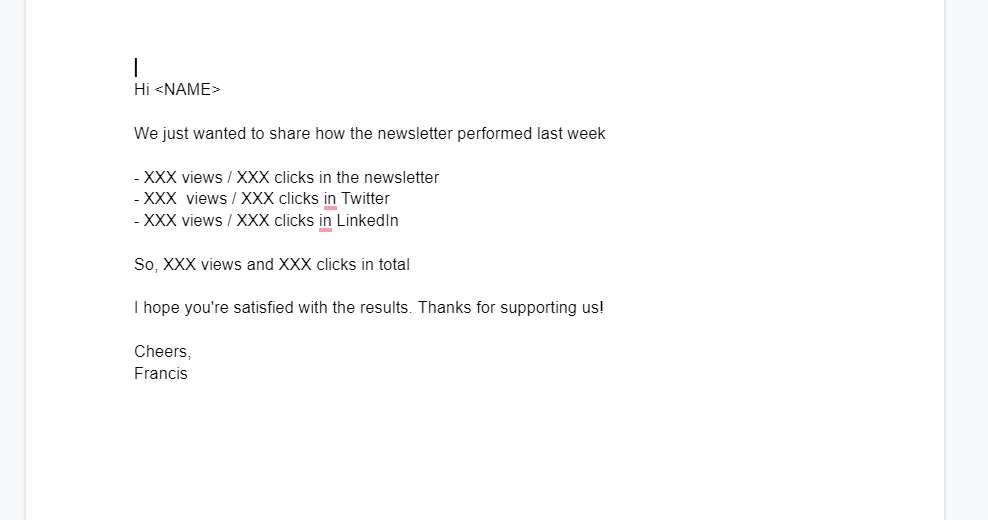
    <!-- sop-caption-start -->
    This screenshot anchors the step about for the email to the sponsor, use this template that will serve as your guide in finding the stats so you can match the documented UI before acting. Look for the email or message detail shown there, then use it to confirm you are in the correct place before continuing.
    <!-- sop-caption-end -->
    <!-- sop-screenshot-end -->
<!-- sop-step-end -->

<!-- sop-step-start id=5 -->
5.  In finding the total number of clicks on the link, view the section “Top links clicked” and select “View all links”

    <!-- sop-screenshot-start -->
    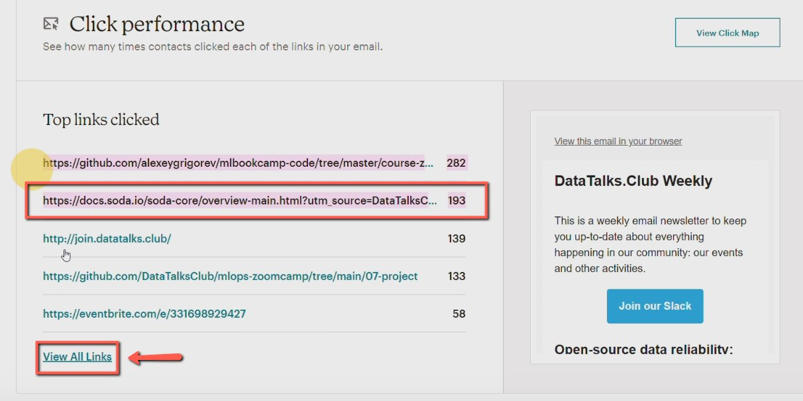
    <!-- sop-caption-start -->
    This screenshot anchors the step about in finding the total number of clicks on the link, view the section “Top links clicked” and select “View all links” so you can match the documented UI before acting. Look for “Top links clicked” and “View all links”, then use those cues to complete or verify the step before continuing.
    <!-- sop-caption-end -->
    <!-- sop-screenshot-end -->
<!-- sop-step-end -->

<!-- sop-step-start id=6 -->
6.  Then, find the link to the sponsor with its correspondent click performance

    <!-- sop-screenshot-start -->
    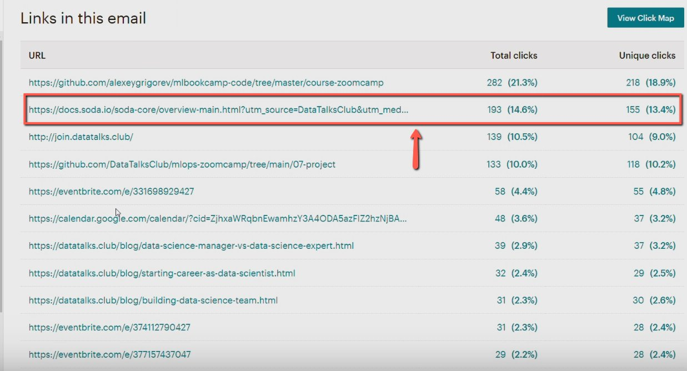
    <!-- sop-caption-start -->
    This screenshot anchors the step to find the link to the sponsor with its correspondent click performance so you can match the documented UI before acting. Look for the link, copy, or paste target shown there, then use it to confirm you are in the correct place before continuing.
    <!-- sop-caption-end -->
    <!-- sop-screenshot-end -->
<!-- sop-step-end -->

<!-- sop-step-start id=7 -->
7.  To find the views of the newsletter, just hover your mouse towards “Opens” on the newsletter.

    <!-- sop-screenshot-start -->
    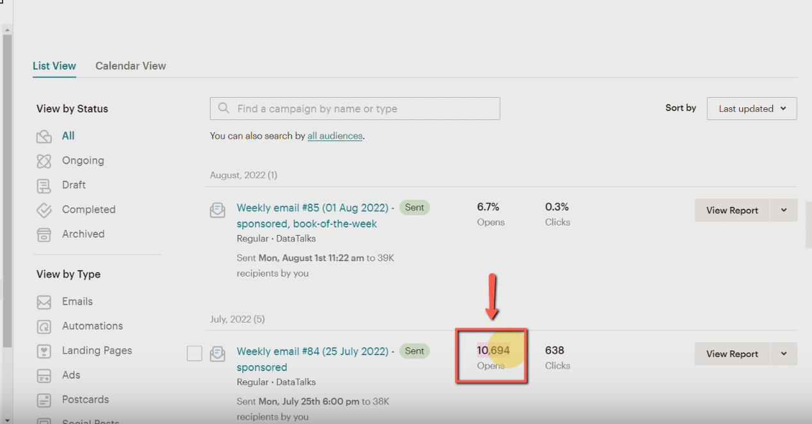
    <!-- sop-caption-start -->
    This screenshot anchors the step about to find the views of the newsletter, just hover your mouse towards “Opens” on the newsletter so you can match the documented UI before acting. Look for “Opens”, then use that cue to complete or verify the step before continuing.
    <!-- sop-caption-end -->
    <!-- sop-screenshot-end -->
<!-- sop-step-end -->

<!-- sop-step-start id=8 -->
8.  For the performance on Twitter, visit DataTalks.Club’s Twitter and find the sponsored announcement. Click the announcement.

    <!-- sop-screenshot-start -->
    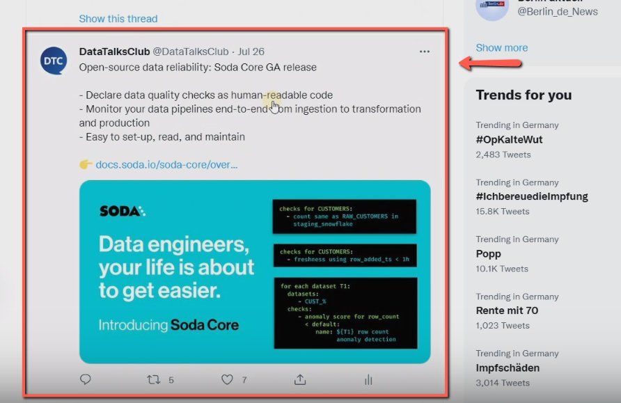
    <!-- sop-caption-start -->
    This screenshot anchors the step about for the performance on Twitter, visit DataTalks.Club’s Twitter and find the sponsored announcement. Click the announcement so you can match the documented UI before acting. Look for the post composer or published post shown there, then use it to confirm you are in the correct place before continuing.
    <!-- sop-caption-end -->
    <!-- sop-screenshot-end -->
<!-- sop-step-end -->

<!-- sop-step-start id=9 -->
9.  After, click “View Twitter Analytics”

    <!-- sop-screenshot-start -->
    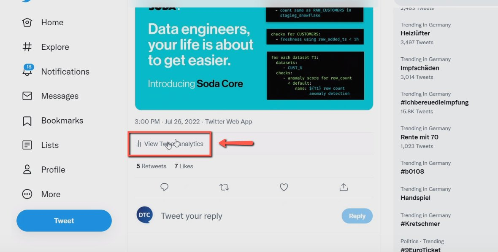
    <!-- sop-caption-start -->
    This screenshot anchors the step to click “View Twitter Analytics” so you can match the documented UI before acting. Look for “View Twitter Analytics”, then use that cue to complete or verify the step before continuing.
    <!-- sop-caption-end -->
    <!-- sop-screenshot-end -->
<!-- sop-step-end -->

<!-- sop-step-start id=10 -->
10. Here, you can view the total views and clicks of the sponsored announcement.

    <!-- sop-screenshot-start -->
    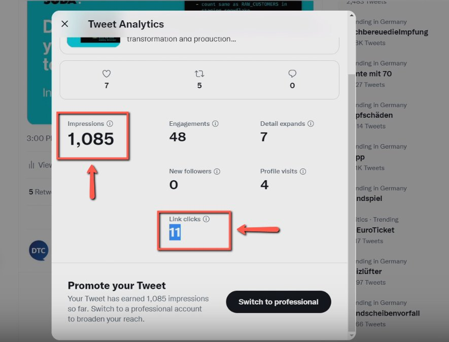
    <!-- sop-caption-start -->
    This screenshot anchors the step about here, you can view the total views and clicks of the sponsored announcement so you can match the documented UI before acting. Look for the reporting value or action control shown there, then use it to confirm you are in the correct place before continuing.
    <!-- sop-caption-end -->
    <!-- sop-screenshot-end -->
<!-- sop-step-end -->

<!-- sop-step-start id=11 -->
11. Lastly, to view the total views and clicks on LinkedIn, open DataTalks.Club’s LinkedIn and click on analytics and then “Updates”

    <!-- sop-screenshot-start -->
    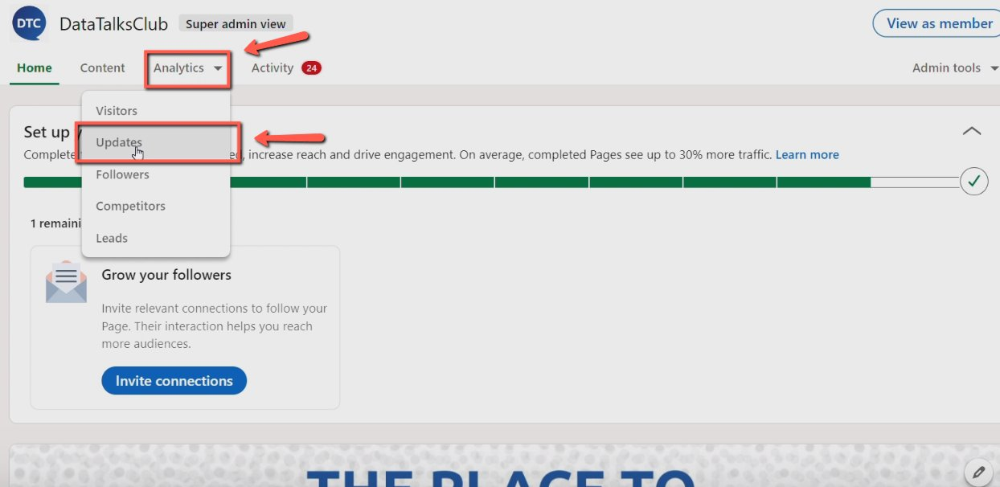
    <!-- sop-caption-start -->
    This screenshot anchors the step about to view the total views and clicks on LinkedIn, open DataTalks.Club’s LinkedIn and click on analytics and then “Updates” so you can match the documented UI before acting. Look for “Updates”, then use that cue to complete or verify the step before continuing.
    <!-- sop-caption-end -->
    <!-- sop-screenshot-end -->
<!-- sop-step-end -->

<!-- sop-step-start id=12 -->
12. Scroll down and find the sponsored announcement and view the total clicks and views of the announcement.

    <!-- sop-screenshot-start -->
    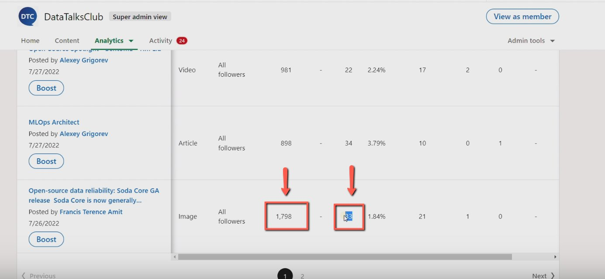
    <!-- sop-caption-start -->
    This screenshot anchors the step to scroll down and find the sponsored announcement and view the total clicks and views of the announcement so you can match the documented UI before acting. Look for the reporting value or action control shown there, then use it to confirm you are in the correct place before continuing.
    <!-- sop-caption-end -->
    <!-- sop-screenshot-end -->
<!-- sop-step-end -->

<!-- sop-step-start id=13 -->
13. Once done, update the [spreadsheet](https://docs.google.com/spreadsheets/d/1-T8qkmShlFUrT2NmkI8Pi1NgUS9IunP6wO5-L79xe2s/edit#gid=1710801712) for the newsletter performance

    <!-- sop-screenshot-start -->
    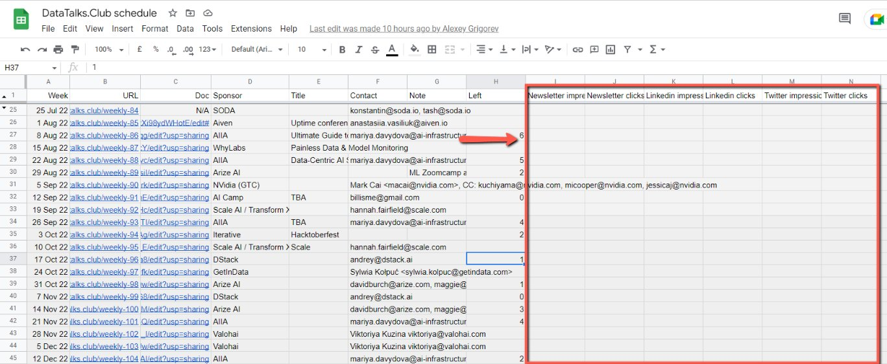
    <!-- sop-caption-start -->
    This screenshot anchors the step about update the spreadsheet for the newsletter performance so you can match the documented UI before acting. Look for the relevant screen area shown there, then use it to confirm you are in the correct place before continuing.
    <!-- sop-caption-end -->
    <!-- sop-screenshot-end -->

    Loom links:
<!-- sop-step-end -->
<!-- sop-section-end -->

<!-- sop-section-start: validation -->
## Validation

-
<!-- sop-section-end -->

<!-- sop-section-start: troubleshooting -->
## Troubleshooting

-
<!-- sop-section-end -->

<!-- sop-section-start: references -->
## References

-
<!-- sop-section-end -->
