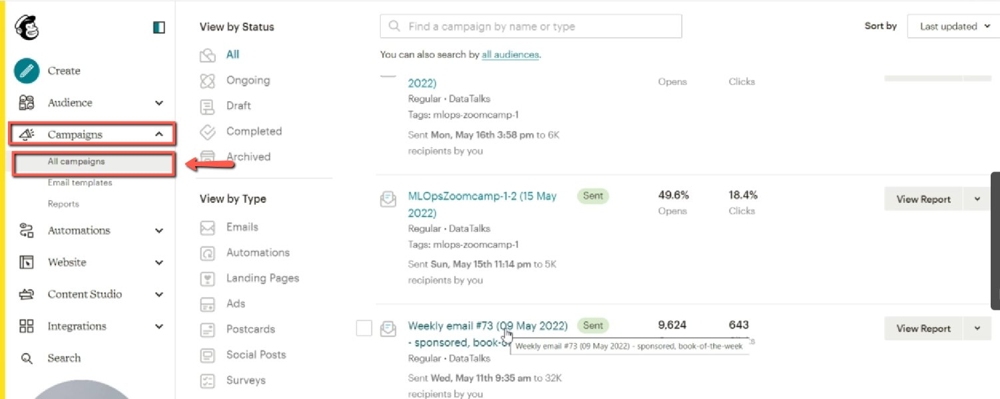
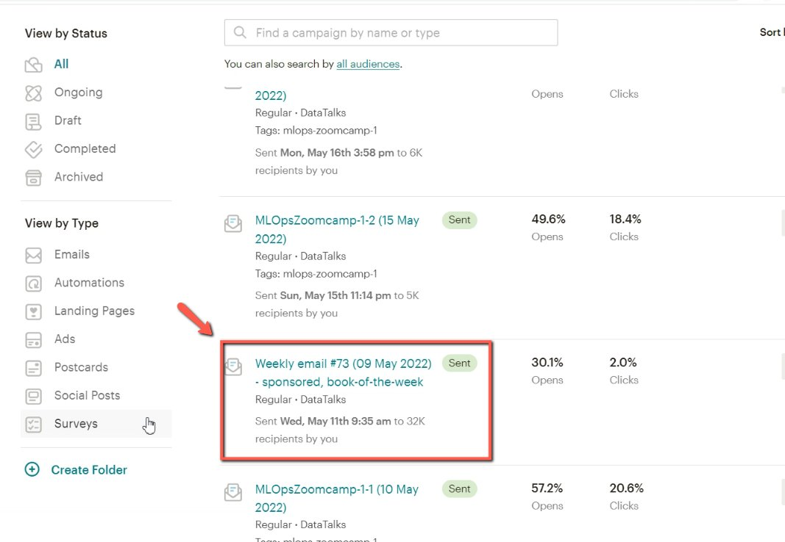
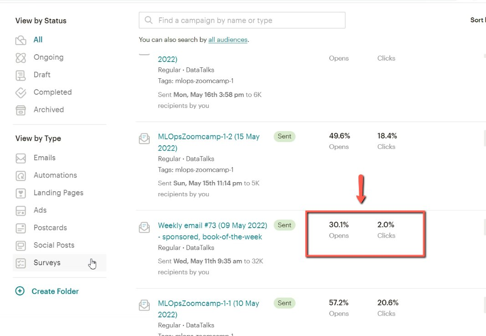

# Getting newsletter open rate and click rate

<!-- sop-section-start: summary -->
## Summary

- Purpose: Find open and click metrics for a Mailchimp newsletter campaign.
- Outcome: Open rate, click rate, clicks, and audience count are identified.
- Trigger: Newsletter performance metrics need to be checked.
- Frequency: As needed after a newsletter is sent.
<!-- sop-section-end -->

<!-- sop-section-start: prerequisites -->
## Prerequisites

- Access: Mailchimp campaigns.
- Tools: Mailchimp campaign list and reports.
- Inputs: Newsletter campaign name or position in Mailchimp.
<!-- sop-section-end -->

<!-- sop-section-start: procedure -->
## Procedure

<!-- sop-prose-start -->
How to get newsletter open rate and click rate
This procedure will show you the steps on how to get newsletter open rate and click rate

Step-by-step Instructions
<!-- sop-prose-end -->

<!-- sop-step-start id=1 -->
1.  The first thing you need to do is open MailChimp.com and under “Campaign” click “All campaign”

    <!-- sop-screenshot-start -->
    
    <!-- sop-caption-start -->
    This screenshot anchors the step to open MailChimp.com and under “Campaign” click “All campaign” so you can match the documented UI before acting. Look for “Campaign” and “All campaign”, then use those cues to complete or verify the step before continuing.
    <!-- sop-caption-end -->
    <!-- sop-screenshot-end -->
<!-- sop-step-end -->

<!-- sop-step-start id=2 -->
2.  Scroll down and find the campaign.

    <!-- sop-screenshot-start -->
    
    <!-- sop-caption-start -->
    This screenshot anchors the step to scroll down and find the campaign so you can match the documented UI before acting. Look for the relevant screen area shown there, then use it to confirm you are in the correct place before continuing.
    <!-- sop-caption-end -->
    <!-- sop-screenshot-end -->
<!-- sop-step-end -->

<!-- sop-step-start id=3 -->
3.  Besides the campaign, you can now see the number of clicks, open rate, click rate, and the number people of who saw it.

    Note: Hover your mouse on the number to see the open and click rates.

    <!-- sop-screenshot-start -->
    
    <!-- sop-caption-start -->
    This screenshot anchors the step about besides the campaign, you can now see the number of clicks, open rate, click rate, and the number people of who saw it so you can match the documented UI before acting. Look for the reporting value or action control shown there, then use it to confirm you are in the correct place before continuing.
    <!-- sop-caption-end -->
    <!-- sop-screenshot-end -->
<!-- sop-step-end -->
<!-- sop-section-end -->

<!-- sop-section-start: validation -->
## Validation

-
<!-- sop-section-end -->

<!-- sop-section-start: troubleshooting -->
## Troubleshooting

-
<!-- sop-section-end -->

<!-- sop-section-start: references -->
## References

-
<!-- sop-section-end -->
