# Import emails from Luma to Mailchimp

<!-- sop-section-start: summary -->
## Summary

- Purpose: Import newsletter opt-ins from Luma event guests into Mailchimp.
- Outcome: Eligible Luma guests are added or updated in Mailchimp with the event tag.
- Trigger: A Luma event has guest opt-ins to sync to Mailchimp.
- Frequency: After Luma events when guest opt-ins need to be imported.
<!-- sop-section-end -->

<!-- sop-section-start: prerequisites -->
## Prerequisites

- Access: Luma event management and Mailchimp audience.
- Tools: Luma guest export, spreadsheet editor, and Mailchimp import contacts.
- Inputs: Luma guest CSV and newsletter opt-in responses.
<!-- sop-section-end -->

<!-- sop-section-start: procedure -->
## Procedure

<!-- sop-prose-start -->
How to import emails from Luma to Mailchimp
This procedure will show you the steps on how to import emails from Luma to Mailchimp.

Step-by-step Instructions
<!-- sop-prose-end -->

<!-- sop-step-start id=1 -->
1.  The first thing you need to do is visit “[https://lu.ma/home](https://lu.ma/home)”

    <!-- sop-screenshot-start -->
    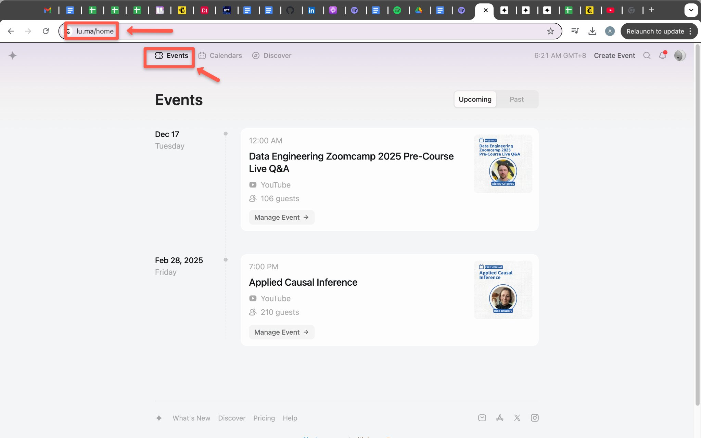
    <!-- sop-caption-start -->
    This screenshot anchors the step about visit “https://lu.ma/home” so you can match the documented UI before acting. Look for “[https://lu.ma/home](https://lu.ma/home)”, then use that cue to complete or verify the step before continuing.
    <!-- sop-caption-end -->
    <!-- sop-screenshot-end -->
<!-- sop-step-end -->

<!-- sop-step-start id=2 -->
2.  After, click on "Events” and the “Past” button.

    <!-- sop-screenshot-start -->
    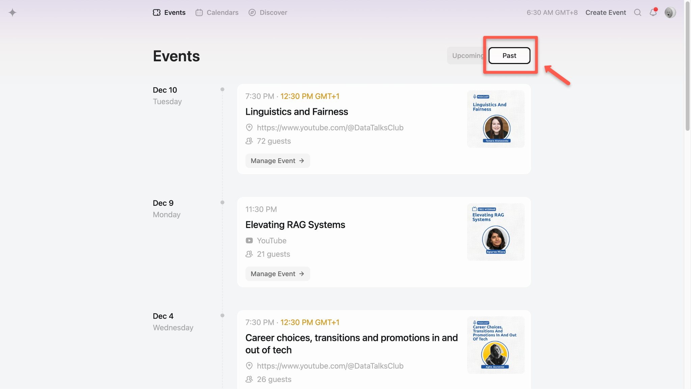
    <!-- sop-caption-start -->
    This screenshot anchors the step to click on "Events” and the “Past” button so you can match the documented UI before acting. Look for “Events” and “Past”, then use those cues to complete or verify the step before continuing.
    <!-- sop-caption-end -->
    <!-- sop-screenshot-end -->
<!-- sop-step-end -->

<!-- sop-step-start id=3 -->
3.  And then, Click on the event that you want to choose. And then, click “Manage Event”

    Note: For this example, we are having "Linguistics and Fairness" as our event"

    <!-- sop-screenshot-start -->
    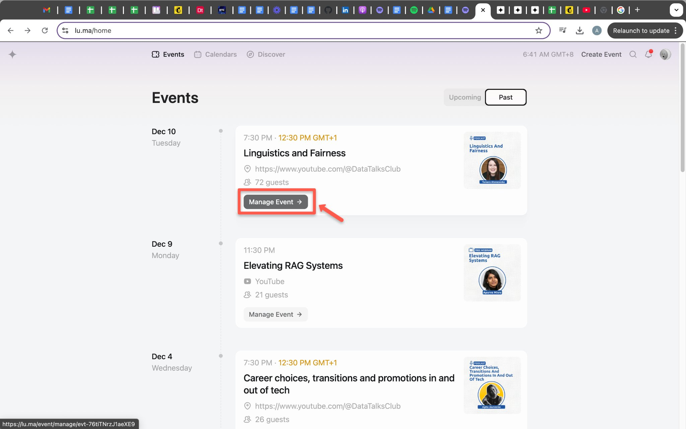
    <!-- sop-caption-start -->
    This screenshot anchors the example shown in the procedure so you can match the documented UI before acting. Look for “Linguistics and Fairness”, then use that cue to complete or verify the step before continuing.
    <!-- sop-caption-end -->
    <!-- sop-screenshot-end -->
<!-- sop-step-end -->

<!-- sop-step-start id=4 -->
4.  After which, click "Guests”

    <!-- sop-screenshot-start -->
    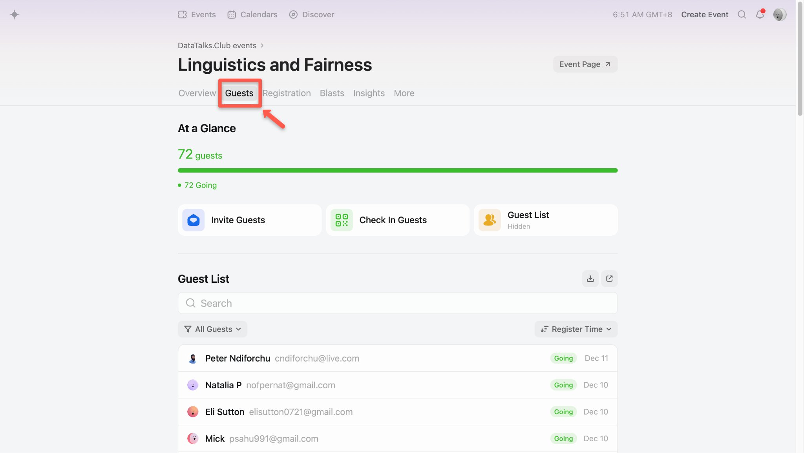
    <!-- sop-caption-start -->
    This screenshot anchors the step about which, click "Guests” so you can match the documented UI before acting. Look for “Guests”, then use that cue to complete or verify the step before continuing.
    <!-- sop-caption-end -->
    <!-- sop-screenshot-end -->
<!-- sop-step-end -->

<!-- sop-step-start id=5 -->
5.  Download the guest list as a CSV file.

    Note: After clicking the download button, the file will be downloaded to your computer. You may use MS Excel to open the file or any other platform like Libre Office.

    <!-- sop-screenshot-start -->
    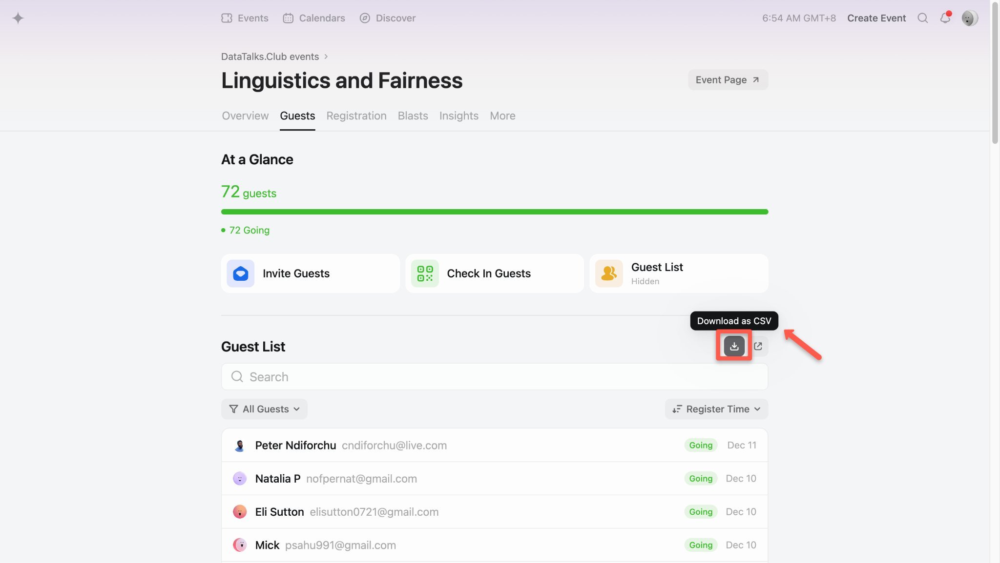
    <!-- sop-caption-start -->
    This screenshot anchors the step about clicking the download button, the file will be downloaded to your computer. You may use MS Excel to open the file or any o... so you can match the documented UI before acting. Look for the file transfer or file picker state shown there, then use it to confirm you are in the correct place before continuing.
    <!-- sop-caption-end -->
    <!-- sop-screenshot-end -->
<!-- sop-step-end -->

<!-- sop-step-start id=6 -->
6.  To open the CSV file using:

    \*MS Excel follow steps 6 - 11

    \*Google sheet follow steps 12 - 18

    Then proceed with Step 19

    For MS Excel - Click on the Download Icon and select the downloaded file.
    <!-- sop-screenshot-start -->
    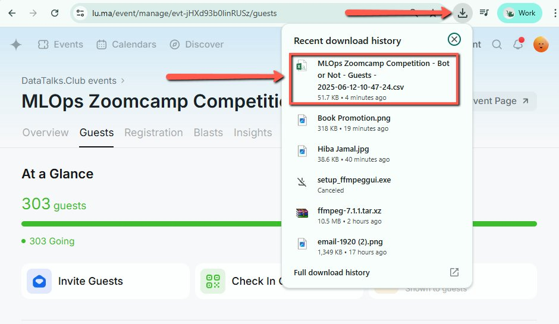
    <!-- sop-caption-start -->
    This screenshot anchors the step about for MS Excel - Click on the Download Icon and select the downloaded file so you can match the documented UI before acting. Look for the file transfer or file picker state shown there, then use it to confirm you are in the correct place before continuing.
    <!-- sop-caption-end -->
    <!-- sop-screenshot-end -->
<!-- sop-step-end -->

<!-- sop-step-start id=7 -->
7.  Find and click the column with the question “Do you want to subscribe to DataTalks.Club newsletter and receive updates about future events?”
    Typically, it’s the column with the “Yes” or “No” data.

    <!-- sop-screenshot-start -->
    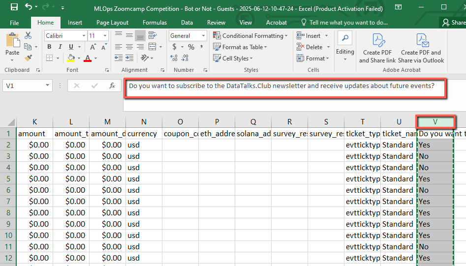
    <!-- sop-caption-start -->
    This screenshot anchors the step about typically, it’s the column with the “Yes” or “No” data so you can match the documented UI before acting. Look for “Yes” and “No”, then use those cues to complete or verify the step before continuing.
    <!-- sop-caption-end -->
    <!-- sop-screenshot-end -->
<!-- sop-step-end -->

<!-- sop-step-start id=8 -->
8.  Click on “Data” at the Menu bar.

    <!-- sop-screenshot-start -->
    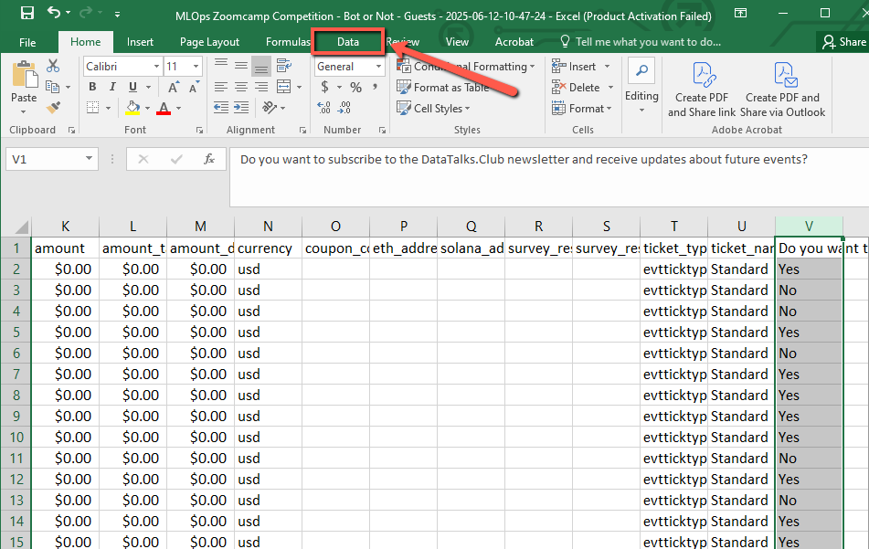
    <!-- sop-caption-start -->
    This screenshot anchors the step to click on “Data” at the Menu bar so you can match the documented UI before acting. Look for “Data”, then use that cue to complete or verify the step before continuing.
    <!-- sop-caption-end -->
    <!-- sop-screenshot-end -->
<!-- sop-step-end -->

<!-- sop-step-start id=9 -->
9.  Click on “Filter”. A Dragdown button will appear at the column and click on it.

    <!-- sop-screenshot-start -->
    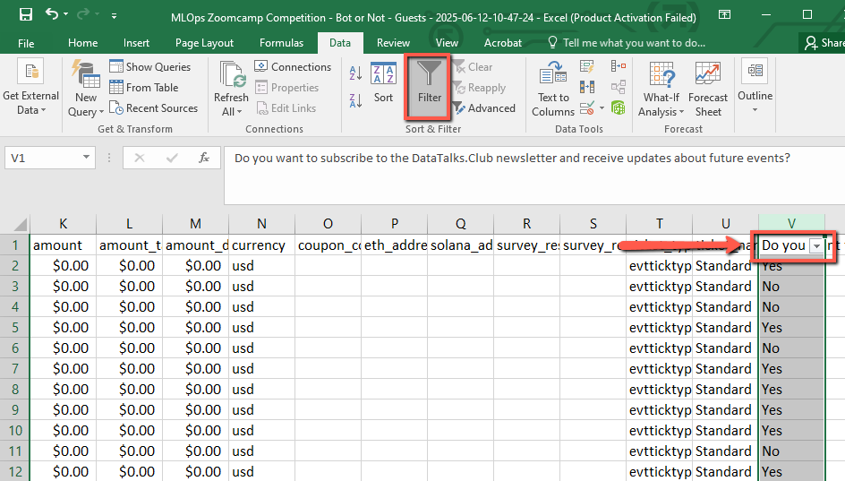
    <!-- sop-caption-start -->
    This screenshot anchors the step to click on “Filter”. A Dragdown button will appear at the column and click on it so you can match the documented UI before acting. Look for “Filter”, then use that cue to complete or verify the step before continuing.
    <!-- sop-caption-end -->
    <!-- sop-screenshot-end -->
<!-- sop-step-end -->

<!-- sop-step-start id=10 -->
10. Uncheck “No” and click on “OK”.

    <!-- sop-screenshot-start -->
    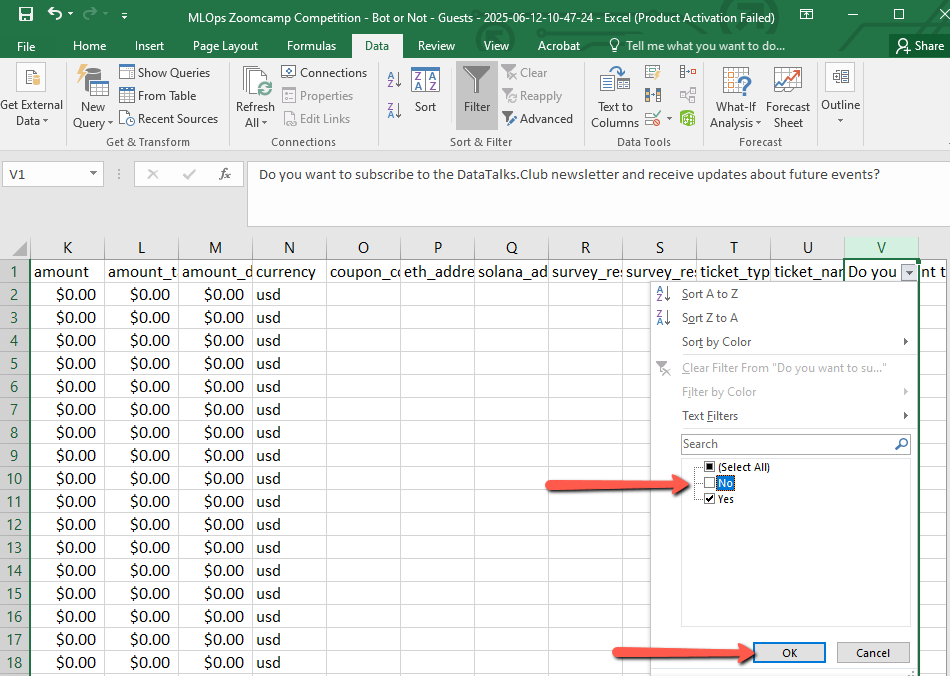
    <!-- sop-caption-start -->
    This screenshot anchors the step about uncheck “No” and click on “OK” so you can match the documented UI before acting. Look for “No” and “OK”, then use those cues to complete or verify the step before continuing.
    <!-- sop-caption-end -->
    <!-- sop-screenshot-end -->
<!-- sop-step-end -->

<!-- sop-step-start id=11 -->
11. Find the email column and copy the emails.
    Then proceed to Step 18.
    <!-- sop-screenshot-start -->
    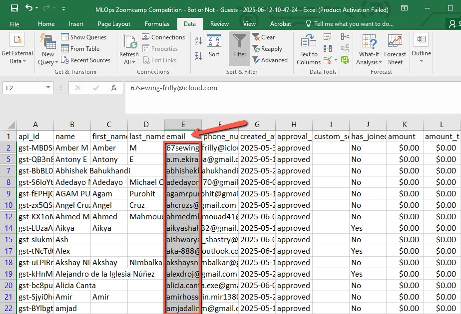
    <!-- sop-caption-start -->
    This screenshot anchors the step about proceed to Step 18 so you can match the documented UI before acting. Look for the relevant screen area shown there, then use it to confirm you are in the correct place before continuing.
    <!-- sop-caption-end -->
    <!-- sop-screenshot-end -->
<!-- sop-step-end -->

<!-- sop-step-start id=12 -->
12. Google sheet - Open the Google Sheet, click on “File” and select “Open”

    <!-- sop-screenshot-start -->
    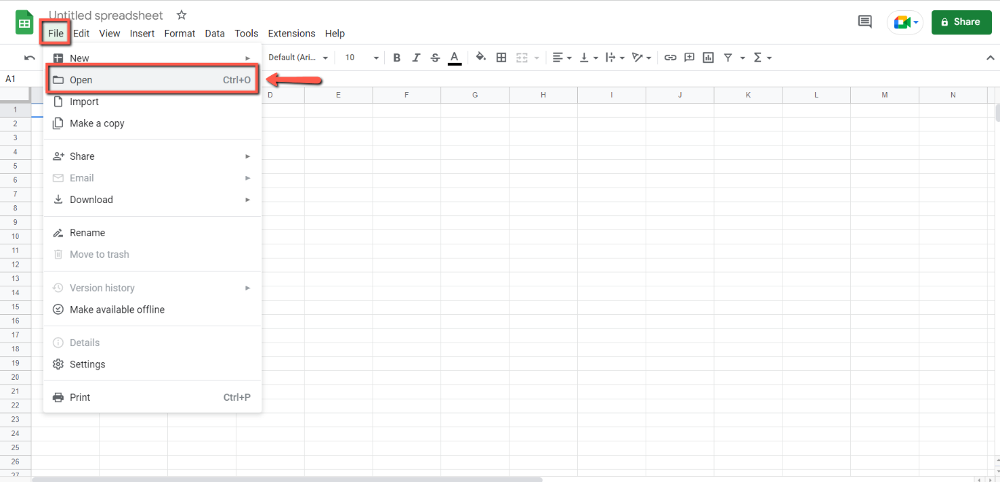
    <!-- sop-caption-start -->
    This screenshot anchors the step about google sheet - Open the Google Sheet, click on “File” and select “Open” so you can match the documented UI before acting. Look for “File” and “Open”, then use those cues to complete or verify the step before continuing.
    <!-- sop-caption-end -->
    <!-- sop-screenshot-end -->
<!-- sop-step-end -->

<!-- sop-step-start id=13 -->
13. And then, click “Upload” and click “Select a file from your device”

    Note: You can also drag your file on the space provided.

    <!-- sop-screenshot-start -->
    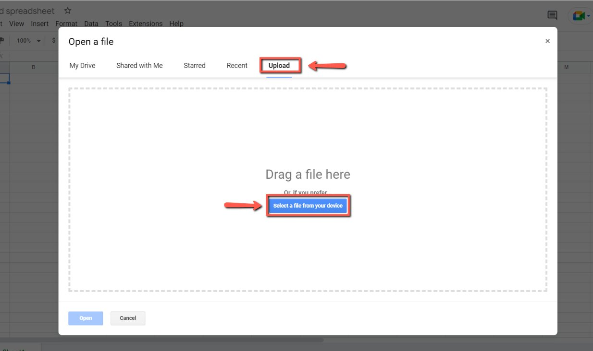
    <!-- sop-caption-start -->
    This screenshot anchors the step to click “Upload” and click “Select a file from your device” so you can match the documented UI before acting. Look for “Upload” and “Select a file from your device”, then use those cues to complete or verify the step before continuing.
    <!-- sop-caption-end -->
    <!-- sop-screenshot-end -->
<!-- sop-step-end -->

<!-- sop-step-start id=14 -->
14. Once you are in the Google sheet, find the column with the question “Do you want to subscribe to DataTalks.Club newsletter and receive updates about future events?” Typically, it’s the column with the “Yes” or “No” data.

    <!-- sop-screenshot-start -->
    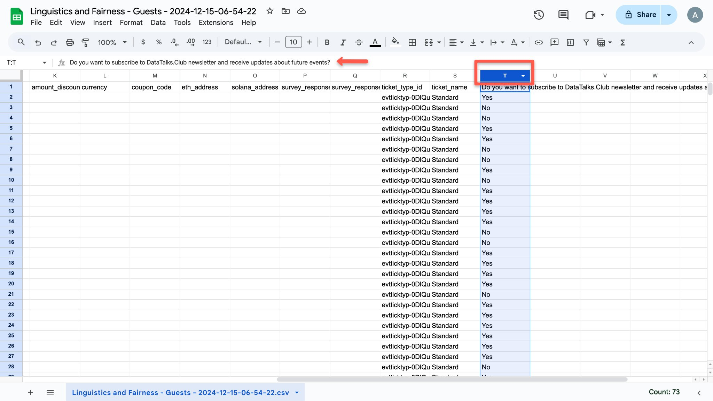
    <!-- sop-caption-start -->
    This screenshot anchors the step about once you are in the Google sheet, find the column with the question “Do you want to subscribe to DataTalks.Club newsletter... so you can match the documented UI before acting. Look for “Yes” and “No”, then use those cues to complete or verify the step before continuing.
    <!-- sop-caption-end -->
    <!-- sop-screenshot-end -->
<!-- sop-step-end -->

<!-- sop-step-start id=15 -->
15. And then, right-click to select “Create a filter.”

    <!-- sop-screenshot-start -->
    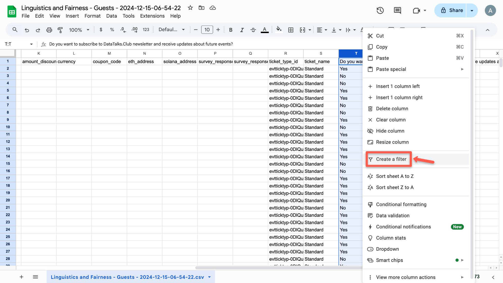
    <!-- sop-caption-start -->
    This screenshot anchors the step about right-click to select “Create a filter.” so you can match the documented UI before acting. Look for “Create a filter.”, then use that cue to complete or verify the step before continuing.
    <!-- sop-caption-end -->
    <!-- sop-screenshot-end -->
<!-- sop-step-end -->

<!-- sop-step-start id=16 -->
16. Afterward, click the drop-down button and unselect "No".

    <!-- sop-screenshot-start -->
    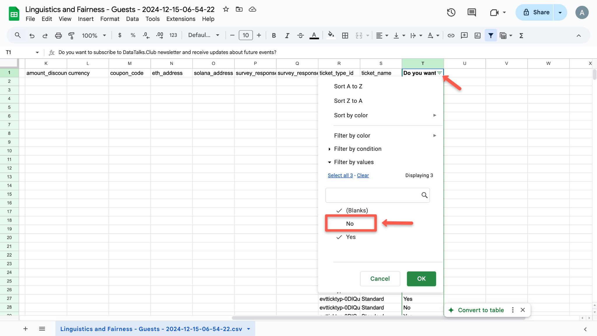
    <!-- sop-caption-start -->
    This screenshot anchors the step about afterward, click the drop-down button and unselect "No" so you can match the documented UI before acting. Look for “No”, then use that cue to complete or verify the step before continuing.
    <!-- sop-caption-end -->
    <!-- sop-screenshot-end -->
<!-- sop-step-end -->

<!-- sop-step-start id=17 -->
17. Then click "Ok"

    <!-- sop-screenshot-start -->
    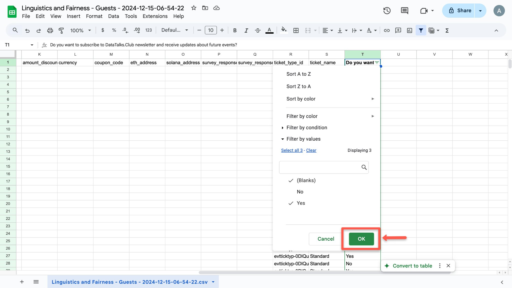
    <!-- sop-caption-start -->
    This screenshot anchors the step to click "Ok" so you can match the documented UI before acting. Look for “Ok”, then use that cue to complete or verify the step before continuing.
    <!-- sop-caption-end -->
    <!-- sop-screenshot-end -->
<!-- sop-step-end -->

<!-- sop-step-start id=18 -->
18. Afterward, copy the emails.

    Note: Make sure to double-check the number of emails copied to ensure that the data is correct.

    <!-- sop-screenshot-start -->
    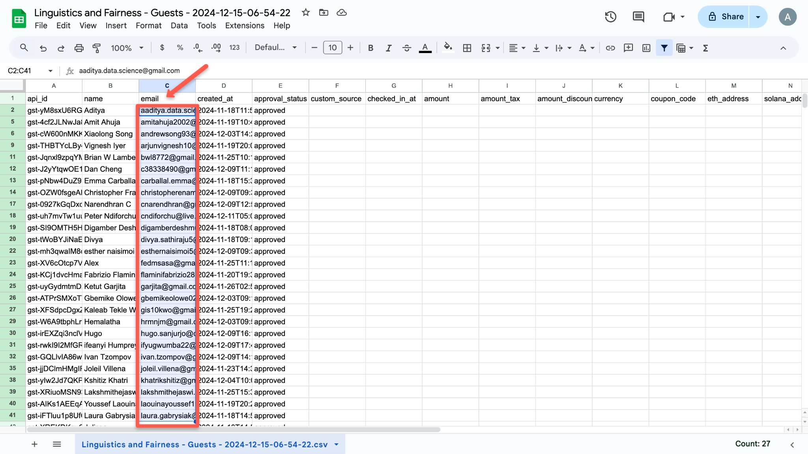
    <!-- sop-caption-start -->
    This screenshot anchors the step about afterward, copy the emails so you can match the documented UI before acting. Look for the email or message detail shown there, then use it to confirm you are in the correct place before continuing.
    <!-- sop-caption-end -->
    <!-- sop-screenshot-end -->
<!-- sop-step-end -->

<!-- sop-step-start id=19 -->
19. Go and Log into "mailchimp.com" and click on "Audience".

    <!-- sop-screenshot-start -->
    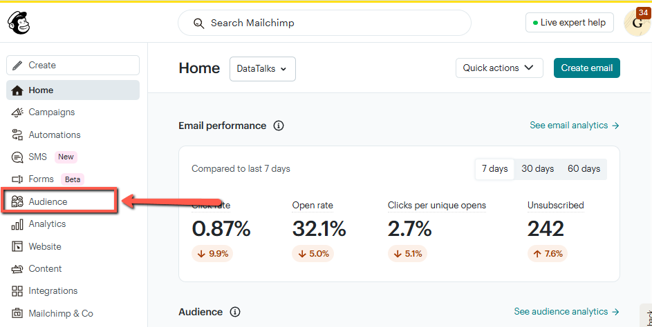
    <!-- sop-caption-start -->
    This screenshot anchors the step to go and Log into "mailchimp.com" and click on "Audience" so you can match the documented UI before acting. Look for “mailchimp.com” and “Audience”, then use those cues to complete or verify the step before continuing.
    <!-- sop-caption-end -->
    <!-- sop-screenshot-end -->
<!-- sop-step-end -->

<!-- sop-step-start id=20 -->
20. After, click on “Audience dashboard” then click on "Manage Audience" and on the dropdown options select "Import contacts".

    <!-- sop-screenshot-start -->
    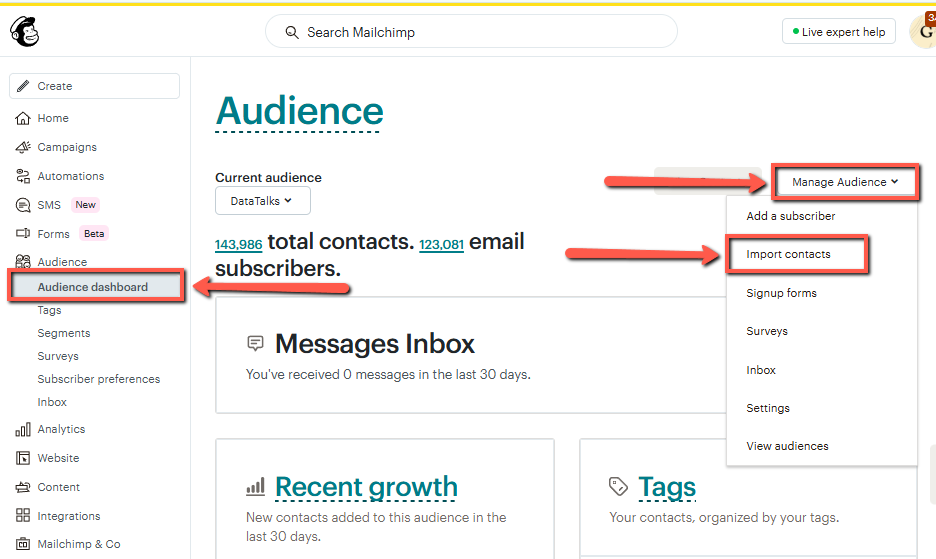
    <!-- sop-caption-start -->
    This screenshot anchors the step to click on “Audience dashboard” then click on "Manage Audience" and on the dropdown options select "Import contacts" so you can match the documented UI before acting. Look for “Audience dashboard” and “Manage Audience”, then use those cues to complete or verify the step before continuing.
    <!-- sop-caption-end -->
    <!-- sop-screenshot-end -->
<!-- sop-step-end -->

<!-- sop-step-start id=21 -->
21. And choose "Copy and paste" and click "Continue”.

    <!-- sop-screenshot-start -->
    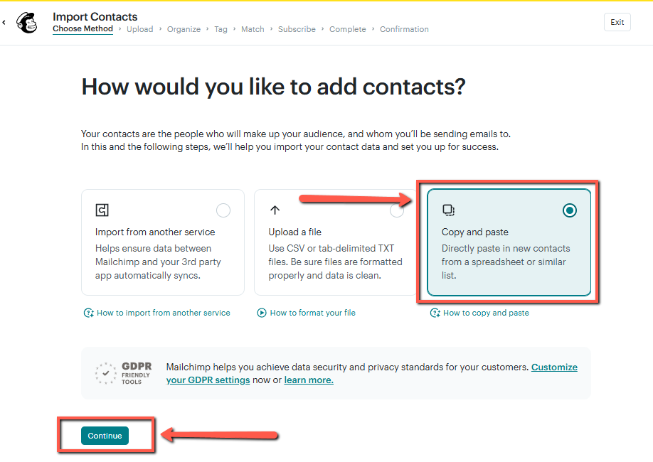
    <!-- sop-caption-start -->
    This screenshot anchors the step about and choose "Copy and paste" and click "Continue” so you can match the documented UI before acting. Look for “Copy and paste” and “Continue”, then use those cues to complete or verify the step before continuing.
    <!-- sop-caption-end -->
    <!-- sop-screenshot-end -->
<!-- sop-step-end -->

<!-- sop-step-start id=22 -->
22. And this is the time when you click the table and paste the emails that you copied from the excel file and click "Continue".

    <!-- sop-screenshot-start -->
    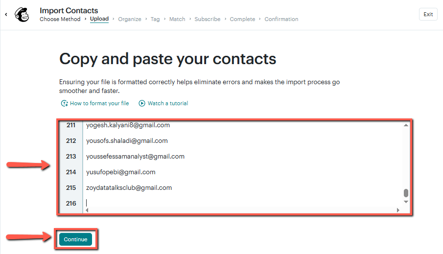
    <!-- sop-caption-start -->
    This screenshot anchors the step about and this is the time when you click the table and paste the emails that you copied from the excel file and click "Continue" so you can match the documented UI before acting. Look for “Continue”, then use that cue to complete or verify the step before continuing.
    <!-- sop-caption-end -->
    <!-- sop-screenshot-end -->
<!-- sop-step-end -->

<!-- sop-step-start id=23 -->
23. Check the button beside "Update any existing contacts" and click on "Continue."

    <!-- sop-screenshot-start -->
    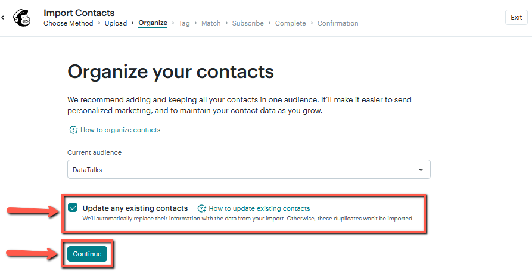
    <!-- sop-caption-start -->
    This screenshot anchors the step to check the button beside "Update any existing contacts" and click on "Continue." so you can match the documented UI before acting. Look for “Update any existing contacts” and “Continue.”, then use those cues to complete or verify the step before continuing.
    <!-- sop-caption-end -->
    <!-- sop-screenshot-end -->
<!-- sop-step-end -->

<!-- sop-step-start id=24 -->
24. Click the dropdown and select the tag "event".

    <!-- sop-screenshot-start -->
    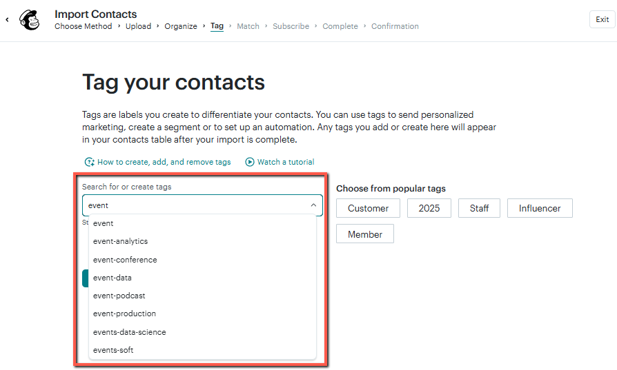
    <!-- sop-caption-start -->
    This screenshot anchors the step to click the dropdown and select the tag "event" so you can match the documented UI before acting. Look for “event”, then use that cue to complete or verify the step before continuing.
    <!-- sop-caption-end -->
    <!-- sop-screenshot-end -->
<!-- sop-step-end -->

<!-- sop-step-start id=25 -->
25. Then click on "Continue."

    <!-- sop-screenshot-start -->
    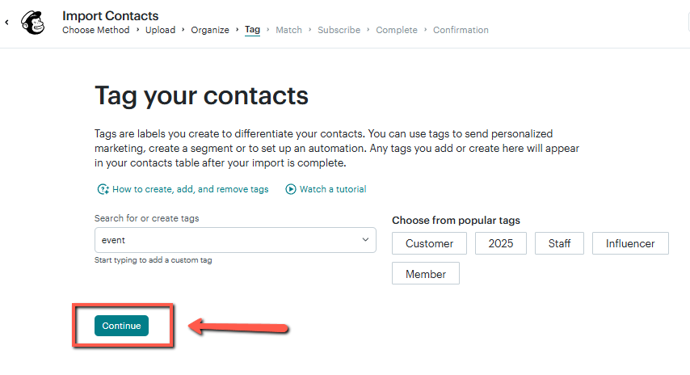
    <!-- sop-caption-start -->
    This screenshot anchors the step to click on "Continue." so you can match the documented UI before acting. Look for “Continue.”, then use that cue to complete or verify the step before continuing.
    <!-- sop-caption-end -->
    <!-- sop-screenshot-end -->
<!-- sop-step-end -->

<!-- sop-step-start id=26 -->
26. Click on “Continue”.

    <!-- sop-screenshot-start -->
    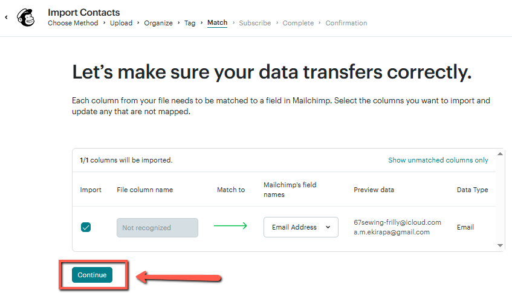
    <!-- sop-caption-start -->
    This screenshot anchors the step to click on “Continue” so you can match the documented UI before acting. Look for “Continue”, then use that cue to complete or verify the step before continuing.
    <!-- sop-caption-end -->
    <!-- sop-screenshot-end -->
<!-- sop-step-end -->

<!-- sop-step-start id=27 -->
27. Click on "Finalize Import".

    <!-- sop-screenshot-start -->
    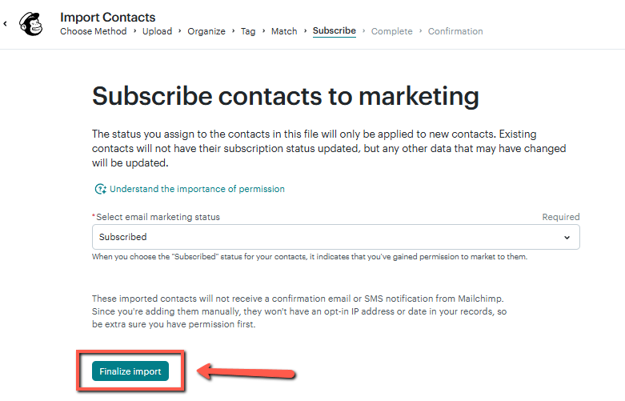
    <!-- sop-caption-start -->
    This screenshot anchors the step to click on "Finalize Import" so you can match the documented UI before acting. Look for “Finalize Import”, then use that cue to complete or verify the step before continuing.
    <!-- sop-caption-end -->
    <!-- sop-screenshot-end -->
<!-- sop-step-end -->

<!-- sop-step-start id=28 -->
28. Then click on “Complete Import”.

    <!-- sop-screenshot-start -->
    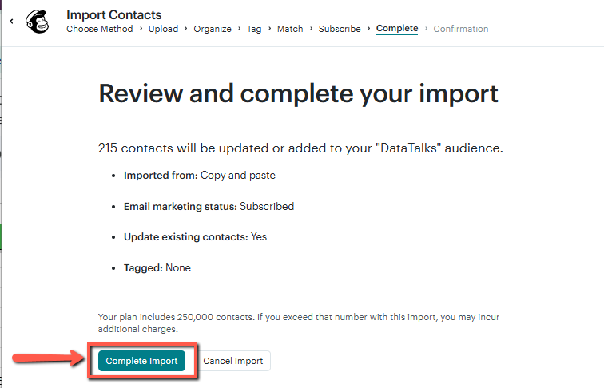
    <!-- sop-caption-start -->
    This screenshot anchors the step to click on “Complete Import” so you can match the documented UI before acting. Look for “Complete Import”, then use that cue to complete or verify the step before continuing.
    <!-- sop-caption-end -->
    <!-- sop-screenshot-end -->
<!-- sop-step-end -->

<!-- sop-step-start id=29 -->
29. To view the emails that you just added, click on "View all contacts"

    <!-- sop-screenshot-start -->
    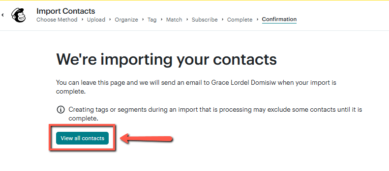
    <!-- sop-caption-start -->
    This screenshot anchors the step about to view the emails that you just added, click on "View all contacts" so you can match the documented UI before acting. Look for “View all contacts”, then use that cue to complete or verify the step before continuing.
    <!-- sop-caption-end -->
    <!-- sop-screenshot-end -->
<!-- sop-step-end -->
<!-- sop-section-end -->

<!-- sop-section-start: validation -->
## Validation

-
<!-- sop-section-end -->

<!-- sop-section-start: troubleshooting -->
## Troubleshooting

-
<!-- sop-section-end -->

<!-- sop-section-start: references -->
## References

-
<!-- sop-section-end -->
