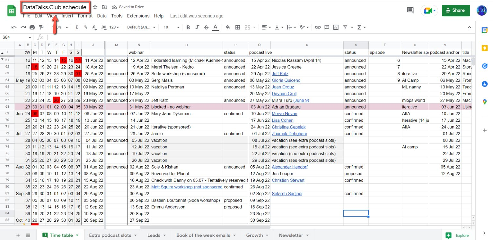
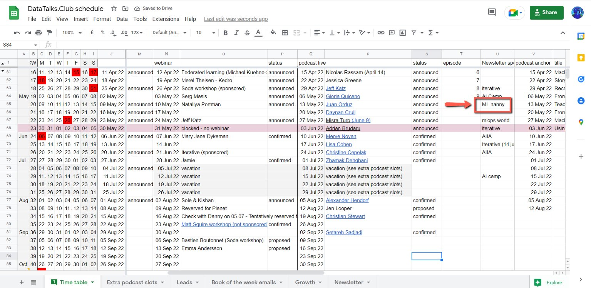

# Locate campaign in DataTalks,Club spreadsheet

<!-- sop-section-start: summary -->
## Summary

- Purpose: Find which newsletter campaign corresponds to a sponsor.
- Outcome: The campaign send date is identified in the DataTalks.Club schedule spreadsheet.
- Trigger: Campaign performance or sponsorship data needs to be checked for a sponsor.
- Frequency: Whenever a sponsored newsletter campaign needs to be located.
<!-- sop-section-end -->

<!-- sop-section-start: prerequisites -->
## Prerequisites

- Access: DataTalks.Club schedule spreadsheet.
- Tools: Google Sheets.
- Inputs: Sponsor name or newsletter sponsorship name.
<!-- sop-section-end -->

<!-- sop-section-start: procedure -->
## Procedure

<!-- sop-prose-start -->
How to locate a campaign in DataTalks.Club spreadsheet
This procedure will show you the steps on how to locate the campaign in DataTalks.Club spreadsheet

Step-by-step Instructions
<!-- sop-prose-end -->

<!-- sop-step-start id=1 -->
1.  The first thing you need to do is open [DataTalks.Club schedule spreadsheet](https://docs.google.com/spreadsheets/d/1-T8qkmShlFUrT2NmkI8Pi1NgUS9IunP6wO5-L79xe2s/edit#gid=0)
    <!-- sop-screenshot-start -->
    
    <!-- sop-caption-start -->
    This screenshot anchors the step to open DataTalks.Club schedule spreadsheet so you can match the documented UI before acting. Look for the schedule or date control shown there, then use it to confirm you are in the correct place before continuing.
    <!-- sop-caption-end -->
    <!-- sop-screenshot-end -->
<!-- sop-step-end -->

<!-- sop-step-start id=2 -->
2.  Locate the campaign under "Newsletter sponsorship"

    Note: In this example, NannyMl is our sponsor.

    <!-- sop-screenshot-start -->
    
    <!-- sop-caption-start -->
    This screenshot anchors the example shown in the procedure so you can match the documented UI before acting. Look for the relevant screen area shown there, then use it to confirm you are in the correct place before continuing.
    <!-- sop-caption-end -->
    <!-- sop-screenshot-end -->
<!-- sop-step-end -->
<!-- sop-section-end -->

<!-- sop-section-start: validation -->
## Validation

-
<!-- sop-section-end -->

<!-- sop-section-start: troubleshooting -->
## Troubleshooting

-
<!-- sop-section-end -->

<!-- sop-section-start: references -->
## References

-
<!-- sop-section-end -->
