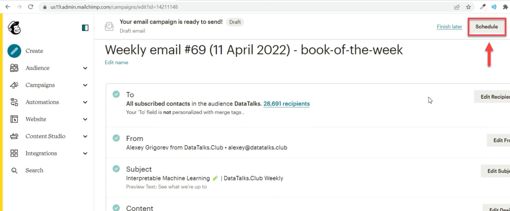
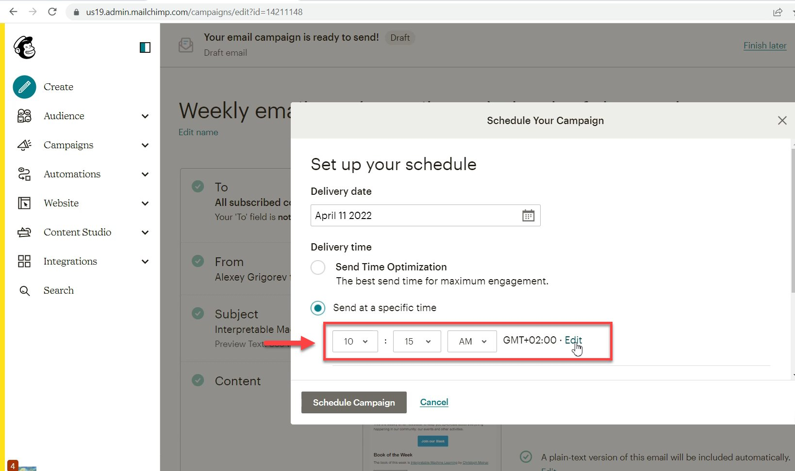
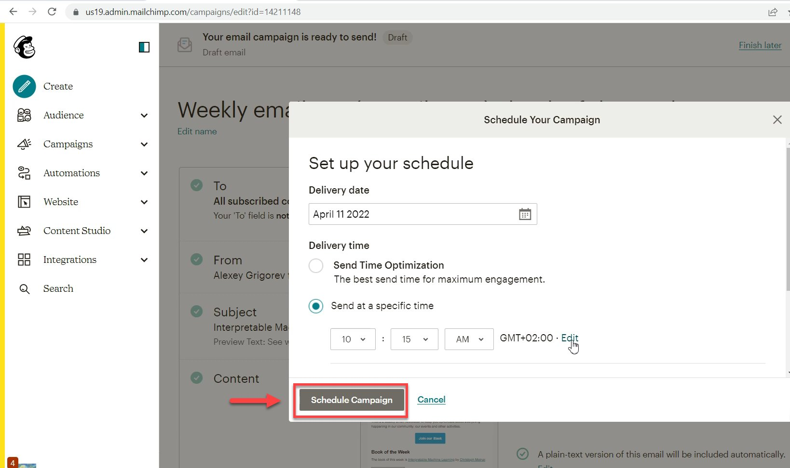

# Schedule a newsletter on Mailchimp

<!-- sop-section-start: summary -->
## Summary

- Purpose: Schedule a reviewed newsletter campaign in Mailchimp.
- Outcome: The newsletter campaign is scheduled for the intended send time.
- Trigger: A newsletter draft is ready to send.
- Frequency: Weekly or whenever a newsletter campaign is prepared.
<!-- sop-section-end -->

<!-- sop-section-start: prerequisites -->
## Prerequisites

- Access: Mailchimp campaign editor.
- Tools: Mailchimp scheduling controls.
- Inputs: Reviewed newsletter draft and send date/time.
<!-- sop-section-end -->

<!-- sop-section-start: procedure -->
## Procedure

<!-- sop-prose-start -->
How to schedule a newsletter on Mailchimp
This procedure will show you the steps on how to schedule a newsletter on Mailchimp.

Step-by-step Instructions
<!-- sop-prose-end -->

<!-- sop-step-start id=1 -->
1.  After creating and reviewing the newsletter, click on “Schedule” on the top right of your screen.

    <!-- sop-screenshot-start -->
    
    <!-- sop-caption-start -->
    This screenshot anchors the step about creating and reviewing the newsletter, click on “Schedule” on the top right of your screen so you can match the documented UI before acting. Look for “Schedule”, then use that cue to complete or verify the step before continuing.
    <!-- sop-caption-end -->
    <!-- sop-screenshot-end -->
<!-- sop-step-end -->

<!-- sop-step-start id=2 -->
2.  And then, change the scheduled time of the newsletter.

    Note: The newsletter will be released on Mondays at 10:15 AM CET GMT+02:00. Make sure to follow the correct timezone.

    <!-- sop-screenshot-start -->
    
    <!-- sop-caption-start -->
    This screenshot anchors the step about change the scheduled time of the newsletter so you can match the documented UI before acting. Look for the schedule or date control shown there, then use it to confirm you are in the correct place before continuing.
    <!-- sop-caption-end -->
    <!-- sop-screenshot-end -->
<!-- sop-step-end -->

<!-- sop-step-start id=3 -->
3.  Lastly, click" Schedule Campaign"

    <!-- sop-screenshot-start -->
    
    <!-- sop-caption-start -->
    This screenshot anchors the step about click" Schedule Campaign" so you can match the documented UI before acting. Look for “Schedule Campaign”, then use that cue to complete or verify the step before continuing.
    <!-- sop-caption-end -->
    <!-- sop-screenshot-end -->
<!-- sop-step-end -->
<!-- sop-section-end -->

<!-- sop-section-start: validation -->
## Validation

-
<!-- sop-section-end -->

<!-- sop-section-start: troubleshooting -->
## Troubleshooting

-
<!-- sop-section-end -->

<!-- sop-section-start: references -->
## References

-
<!-- sop-section-end -->
