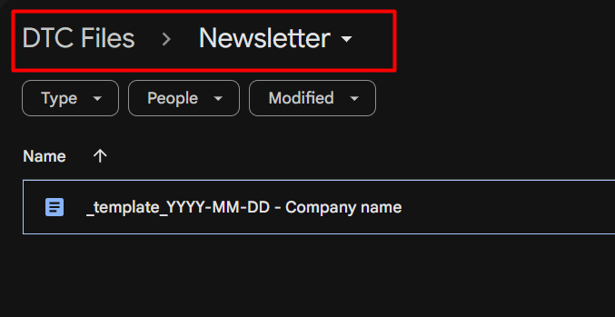
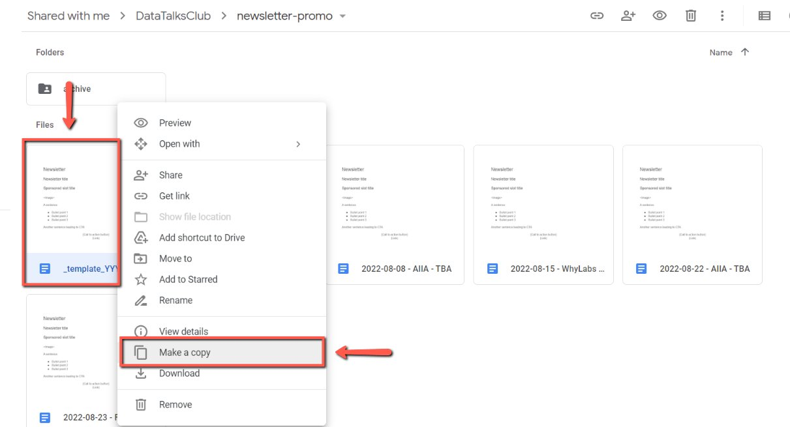
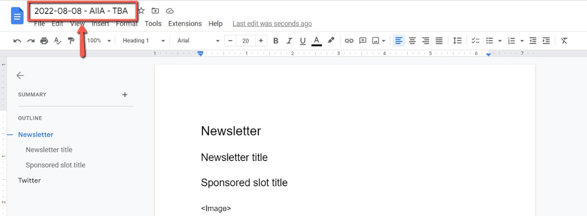
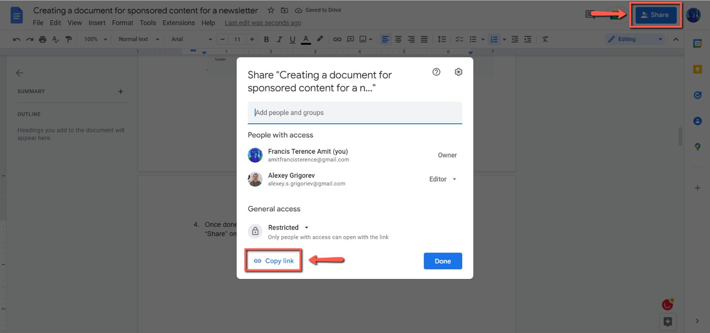
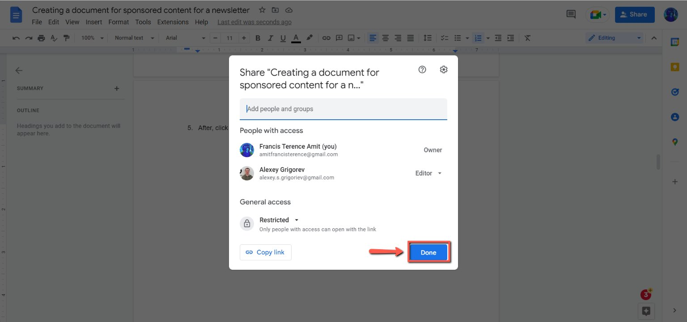
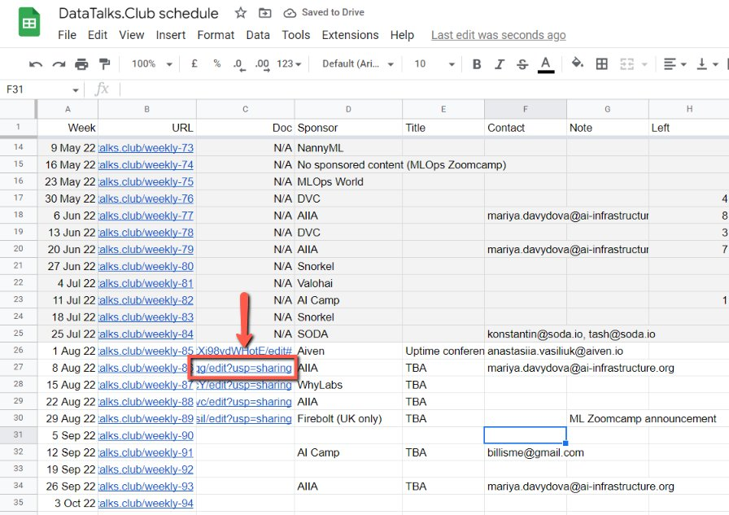

# Creating a document for sponsored content for a newsletter

<!-- sop-section-start: summary -->
## Summary

- Purpose:
- Outcome:
- Trigger:
- Frequency:
<!-- sop-section-end -->

<!-- sop-section-start: prerequisites -->
## Prerequisites

- Access:
- Tools:
- Inputs:

This procedure will show you the steps on how to create a document for sponsored content for a newsletter.
<!-- sop-section-end -->

<!-- sop-section-start: procedure -->
## Procedure

<!-- sop-group-start: "Creating a template" -->
### Creating a template

<!-- sop-step-start id=1 -->
1.  The first thing you need to do is open the [Newsletter](https://drive.google.com/drive/folders/1QmU2KvUOHWwJ6njLJpag94STRstrlUdu) folder on google drive.

    <!-- sop-screenshot-start -->
    
    <!-- sop-caption-start -->
    This screenshot anchors the step to open the Newsletter folder on google drive so you can match the documented UI before acting. Look for the folder or Drive location shown there, then use it to confirm you are in the correct place before continuing.
    <!-- sop-caption-end -->
    <!-- sop-screenshot-end -->
<!-- sop-step-end -->

<!-- sop-step-start id=2 -->
2.  After, right-click on the email template document and click “Make a copy”

    <!-- sop-screenshot-start -->
    
    <!-- sop-caption-start -->
    This screenshot anchors the step about right-click on the email template document and click “Make a copy” so you can match the documented UI before acting. Look for “Make a copy”, then use that cue to complete or verify the step before continuing.
    <!-- sop-caption-end -->
    <!-- sop-screenshot-end -->
<!-- sop-step-end -->

<!-- sop-step-start id=3 -->
3.  Then, rename the title of the newsletter.
    It should follow this format: “YYYY-MM-DD - Company name” (No need to to add “TBA”)

    We have 3 different types of Newsletter:
<!-- sop-step-end -->

<!-- sop-step-start id=4 -->
4.  Main Slot - YYYY-MM-DD - Company name
<!-- sop-step-end -->

<!-- sop-step-start id=5 -->
5.  Secondary Slot - YYYY-MM-DD - Company name (Secondary Slot)
<!-- sop-step-end -->

<!-- sop-step-start id=6 -->
6.  Stand-alone Newsletter - YYYY-MM-DD - Company name (Stand-alone newsletter)

    <!-- sop-screenshot-start -->
    
    <!-- sop-caption-start -->
    This screenshot anchors the step about stand-alone Newsletter - YYYY-MM-DD - Company name (Stand-alone newsletter) so you can match the documented UI before acting. Look for the relevant screen area shown there, then use it to confirm you are in the correct place before continuing.
    <!-- sop-caption-end -->
    <!-- sop-screenshot-end -->
<!-- sop-step-end -->

<!-- sop-group-end -->

<!-- sop-group-start: "Putting it to the Schedule spreadsheet" -->
### Putting it to the Schedule spreadsheet

<!-- sop-step-start id=7 -->
7.  Once done, let’s add the link of the document to the [DataTalks.Club schedule](https://docs.google.com/spreadsheets/d/1-T8qkmShlFUrT2NmkI8Pi1NgUS9IunP6wO5-L79xe2s/edit?gid=1710801712#gid=1710801712), “newsletter” sheet. To do that, click “Share” on the upper right of your screen and click “Copy link”

    <!-- sop-screenshot-start -->
    
    <!-- sop-caption-start -->
    This screenshot anchors the step about let’s add the link of the document to the DataTalks.Club schedule, “newsletter” sheet. To do that, click “Share” on the up... so you can match the documented UI before acting. Look for “newsletter” and “Share”, then use those cues to complete or verify the step before continuing.
    <!-- sop-caption-end -->
    <!-- sop-screenshot-end -->
<!-- sop-step-end -->

<!-- sop-step-start id=8 -->
8.  After, click “Done”

    <!-- sop-screenshot-start -->
    
    <!-- sop-caption-start -->
    This screenshot anchors the step to click “Done” so you can match the documented UI before acting. Look for “Done”, then use that cue to complete or verify the step before continuing.
    <!-- sop-caption-end -->
    <!-- sop-screenshot-end -->
<!-- sop-step-end -->

<!-- sop-step-start id=9 -->
9.  Then, open the [newsletter spreadsheet](https://docs.google.com/spreadsheets/d/1-T8qkmShlFUrT2NmkI8Pi1NgUS9IunP6wO5-L79xe2s/edit?usp=sharing), and paste the copied link under column C, right beside the name of the sponsor.

    <!-- sop-screenshot-start -->
    
    <!-- sop-caption-start -->
    This screenshot anchors the step to open the newsletter spreadsheet, and paste the copied link under column C, right beside the name of the sponsor so you can match the documented UI before acting. Look for the link, copy, or paste target shown there, then use it to confirm you are in the correct place before continuing.
    <!-- sop-caption-end -->
    <!-- sop-screenshot-end -->

    ##
<!-- sop-step-end -->

<!-- sop-group-end -->
<!-- sop-section-end -->

<!-- sop-section-start: validation -->
## Validation

-
<!-- sop-section-end -->

<!-- sop-section-start: troubleshooting -->
## Troubleshooting

-
<!-- sop-section-end -->

<!-- sop-section-start: references -->
## References

-
<!-- sop-section-end -->
