# Fill in the sponsored block in the newsletter

<!-- sop-section-start: summary -->
## Summary

- Purpose: Copy the sponsor copy, visual, and CTA link into the newsletter sponsored block.
- Outcome: The sponsored block has the sponsor image, CTA link, title, and text in Mailchimp.
- Trigger: The sponsor content is ready and approved by Valeria or Alexey.
- Frequency: For each sponsored newsletter placement.
<!-- sop-section-end -->

<!-- sop-section-start: prerequisites -->
## Prerequisites

- Access: Mailchimp newsletter draft and the sponsorship document.
- Tools: Mailchimp campaign editor, sponsor document, image download tool.
- Inputs: Sponsor visual, CTA link, title, and body text.

What: copying the copy, the visual and the CTA (call-to-action) link from the sponsorship document to the sponsored section of the newsletter

Why: the sponsors share their content with us via the sponsorship document and we need to transfer it to mailchimp’s campaign editor

When: the sponsor is ready with their content and our content team (Valeria or Alexey) checked it and said it’s okay
<!-- sop-section-end -->

<!-- sop-section-start: procedure -->
## Procedure

<!-- sop-group-start: "Preparation" -->
### Preparation

<!-- sop-step-start id=1 -->
1.  Open the newsletter draft.
<!-- sop-step-end -->
<!-- sop-group-end -->

<!-- sop-group-start: "Updating the visual for the sponsored slot" -->
### Updating the visual for the sponsored slot

<!-- sop-step-start id=2 -->
2.  Download the visual (the image) that the sponsor sent us.

    If they included the image in the document, click the picture and select “View more actions” and click “Save to Keep”
    <!-- sop-screenshot-start -->
    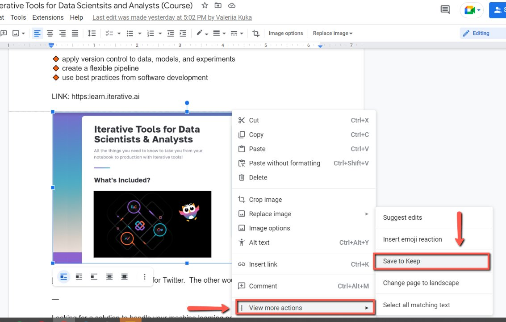
    <!-- sop-caption-start -->
    This screenshot anchors the step about if they included the image in the document, click the picture and select “View more actions” and click “Save to Keep” so you can match the documented UI before acting. Look for “View more actions” and “Save to Keep”, then use those cues to complete or verify the step before continuing.
    <!-- sop-caption-end -->
    <!-- sop-screenshot-end -->

    Then, find the image on the Keep Menu and click it then save the image.
    <!-- sop-screenshot-start -->
    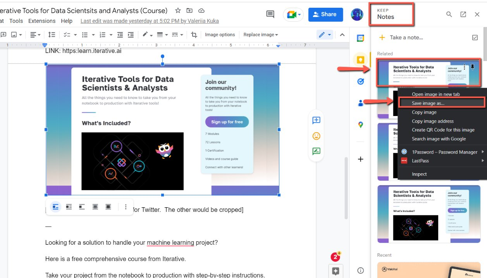
    <!-- sop-caption-start -->
    This screenshot anchors the step to find the image on the Keep Menu and click it then save the image so you can match the documented UI before acting. Look for the reporting value or action control shown there, then use it to confirm you are in the correct place before continuing.
    <!-- sop-caption-end -->
    <!-- sop-screenshot-end -->
<!-- sop-step-end -->

<!-- sop-step-start id=3 -->
3.  In Mailchimp, scroll down to the sponsored block section.

    <!-- sop-screenshot-start -->
    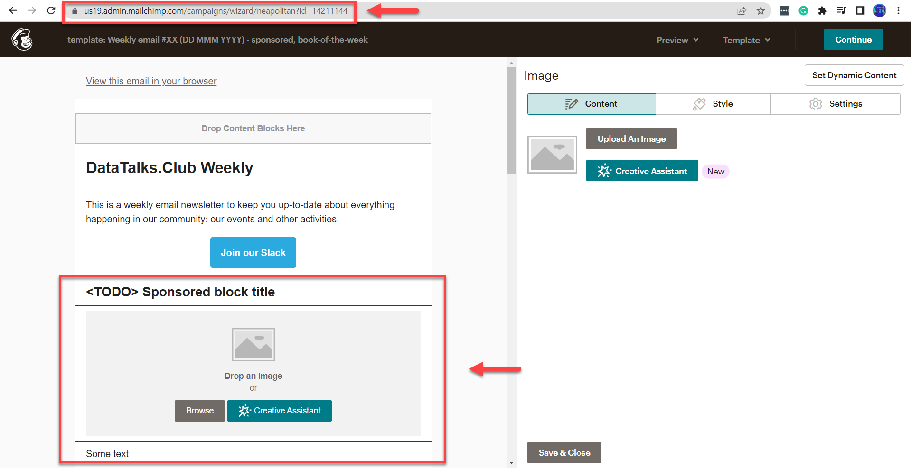
    <!-- sop-caption-start -->
    This screenshot anchors the step about in Mailchimp, scroll down to the sponsored block section so you can match the documented UI before acting. Look for the relevant screen area shown there, then use it to confirm you are in the correct place before continuing.
    <!-- sop-caption-end -->
    <!-- sop-screenshot-end -->
<!-- sop-step-end -->

<!-- sop-step-start id=4 -->
4.  Then click on the sponsored block title and select “Upload Image”

    <!-- sop-screenshot-start -->
    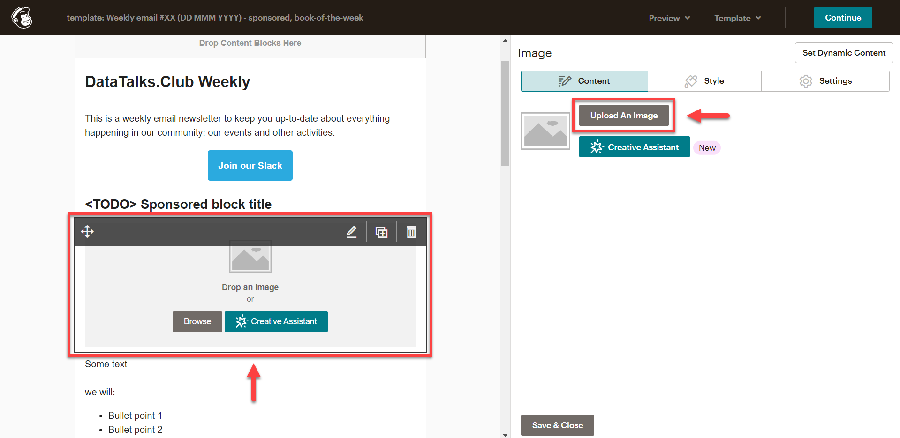
    <!-- sop-caption-start -->
    This screenshot anchors the step to click on the sponsored block title and select “Upload Image” so you can match the documented UI before acting. Look for “Upload Image”, then use that cue to complete or verify the step before continuing.
    <!-- sop-caption-end -->
    <!-- sop-screenshot-end -->
<!-- sop-step-end -->

<!-- sop-step-start id=5 -->
5.  After, click “Upload”

    <!-- sop-screenshot-start -->
    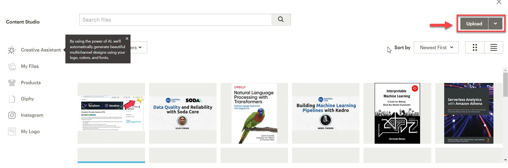
    <!-- sop-caption-start -->
    This screenshot anchors the step to click “Upload” so you can match the documented UI before acting. Look for “Upload”, then use that cue to complete or verify the step before continuing.
    <!-- sop-caption-end -->
    <!-- sop-screenshot-end -->
<!-- sop-step-end -->

<!-- sop-step-start id=6 -->
6.  Then select the picture you want to upload.

    <!-- sop-screenshot-start -->
    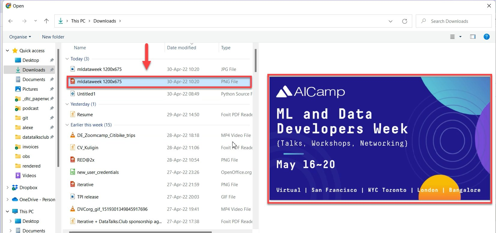
    <!-- sop-caption-start -->
    This screenshot anchors the step to select the picture you want to upload so you can match the documented UI before acting. Look for the file transfer or file picker state shown there, then use it to confirm you are in the correct place before continuing.
    <!-- sop-caption-end -->
    <!-- sop-screenshot-end -->
<!-- sop-step-end -->

<!-- sop-group-end -->

<!-- sop-group-start: "Adding the CTA link" -->
### Adding the CTA link

The CTA link is the main link for the campaign. We put it in two places: the visual and the CTA button.

<!-- sop-step-start id=7 -->
7.  Once the event banner is added, proceed to copy the link of the sponsor from the sponsorship document.

    <!-- sop-screenshot-start -->
    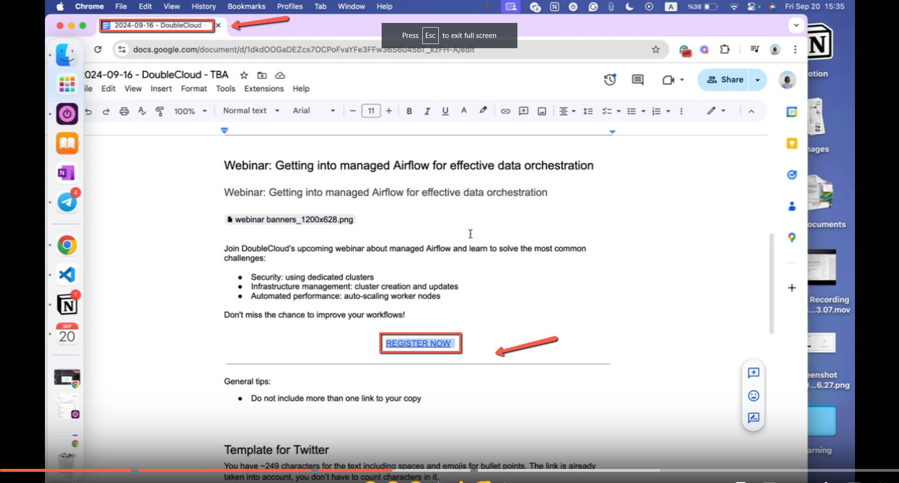
    <!-- sop-caption-start -->
    This screenshot anchors the step about once the event banner is added, proceed to copy the link of the sponsor from the sponsorship document so you can match the documented UI before acting. Look for the link, copy, or paste target shown there, then use it to confirm you are in the correct place before continuing.
    <!-- sop-caption-end -->
    <!-- sop-screenshot-end -->
<!-- sop-step-end -->

<!-- sop-step-start id=8 -->
8.  Then go back to Luma, click “Link” on the image.

    <!-- sop-screenshot-start -->
    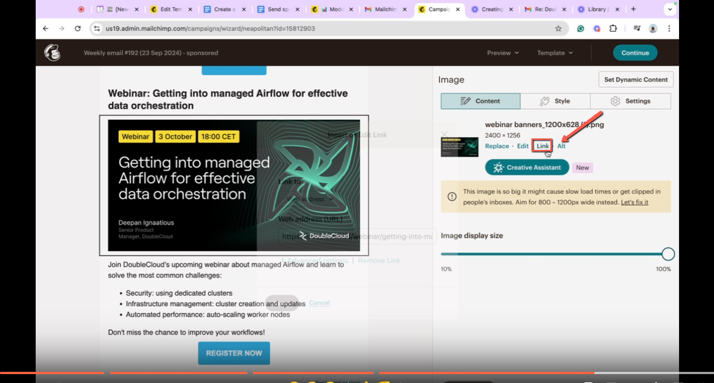
    <!-- sop-caption-start -->
    This screenshot anchors the step to go back to Luma, click “Link” on the image so you can match the documented UI before acting. Look for “Link”, then use that cue to complete or verify the step before continuing.
    <!-- sop-caption-end -->
    <!-- sop-screenshot-end -->
<!-- sop-step-end -->

<!-- sop-step-start id=9 -->
9.  Paste the copied link of the sponsor in the space provided and click “Insert”

    <!-- sop-screenshot-start -->
    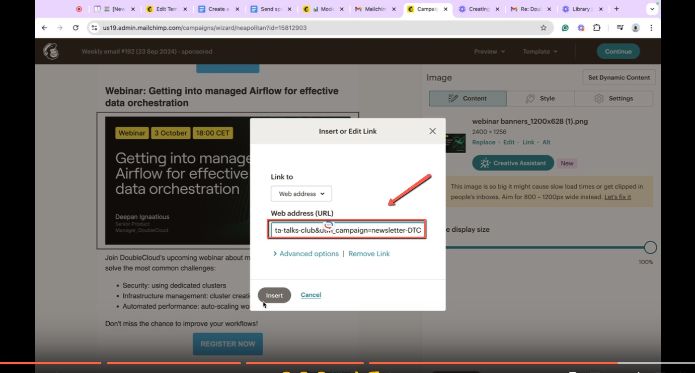
    <!-- sop-caption-start -->
    This screenshot anchors the step to paste the copied link of the sponsor in the space provided and click “Insert” so you can match the documented UI before acting. Look for “Insert”, then use that cue to complete or verify the step before continuing.
    <!-- sop-caption-end -->
    <!-- sop-screenshot-end -->
<!-- sop-step-end -->

<!-- sop-step-start id=10 -->
10. Don’t also forget to add the change the title and the link for the CTA button:

    <!-- sop-screenshot-start -->
    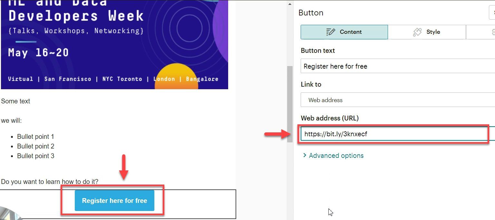
    <!-- sop-caption-start -->
    This screenshot anchors the step about don’t also forget to add the change the title and the link for the CTA button: so you can match the documented UI before acting. Look for the link, copy, or paste target shown there, then use it to confirm you are in the correct place before continuing.
    <!-- sop-caption-end -->
    <!-- sop-screenshot-end -->
<!-- sop-step-end -->

<!-- sop-group-end -->

<!-- sop-group-start: "Adding the title" -->
### Adding the title

<!-- sop-step-start id=11 -->
11. For the title, copy the title on the sponsorship document.

    <!-- sop-screenshot-start -->
    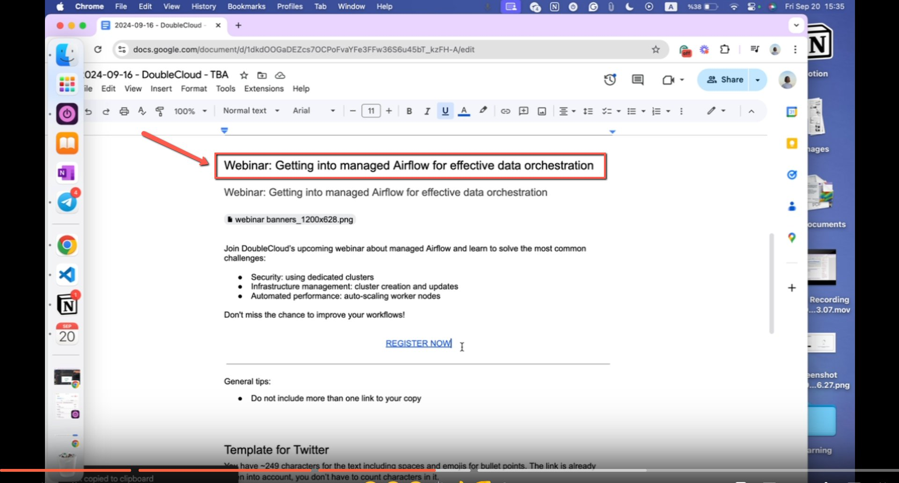
    <!-- sop-caption-start -->
    This screenshot anchors the step about for the title, copy the title on the sponsorship document so you can match the documented UI before acting. Look for the link, copy, or paste target shown there, then use it to confirm you are in the correct place before continuing.
    <!-- sop-caption-end -->
    <!-- sop-screenshot-end -->
<!-- sop-step-end -->

<!-- sop-step-start id=12 -->
12. And then, click on “\<TODO\> Sponsored Block title” and paste the title.

    <!-- sop-screenshot-start -->
    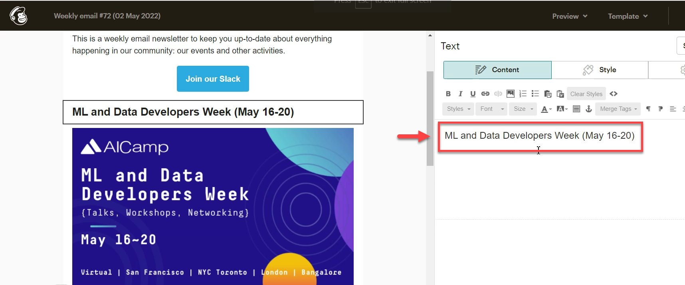
    <!-- sop-caption-start -->
    This screenshot anchors the step to click on “TODO Sponsored Block title” and paste the title so you can match the documented UI before acting. Look for “\<TODO\> Sponsored Block title”, then use that cue to complete or verify the step before continuing.
    <!-- sop-caption-end -->
    <!-- sop-screenshot-end -->
<!-- sop-step-end -->

<!-- sop-group-end -->

<!-- sop-group-start: "Adding the copy" -->
### Adding the copy

<!-- sop-step-start id=13 -->
13. To proceed, copy the description sent by the sponsors.

    <!-- sop-screenshot-start -->
    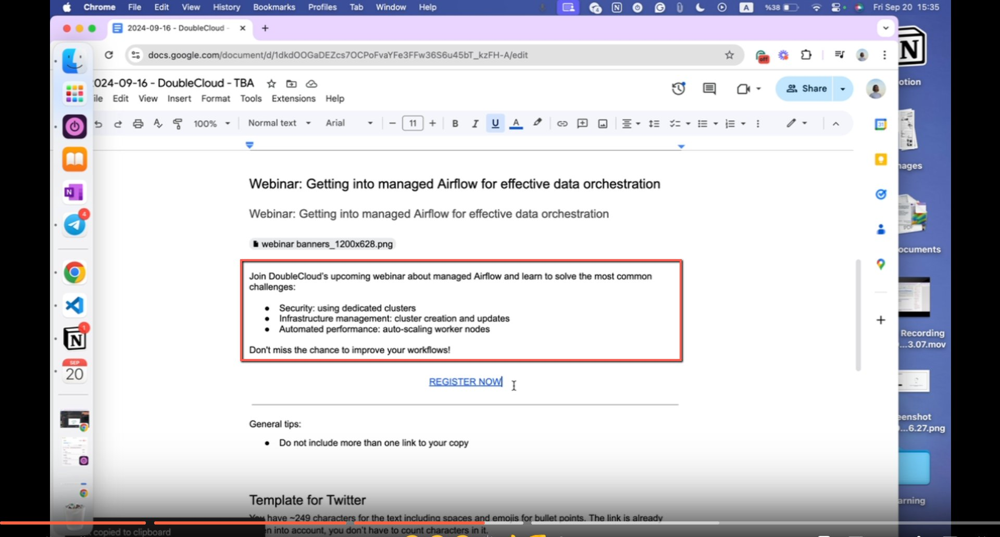
    <!-- sop-caption-start -->
    This screenshot anchors the step to copy the description sent by the sponsors so you can match the documented UI before acting. Look for the link, copy, or paste target shown there, then use it to confirm you are in the correct place before continuing.
    <!-- sop-caption-end -->
    <!-- sop-screenshot-end -->
<!-- sop-step-end -->

<!-- sop-step-start id=14 -->
14. After, paste the description

    Note: In case you don’t know the title or the description, just leave the block empty and ping Alexey about it.

    <!-- sop-screenshot-start -->
    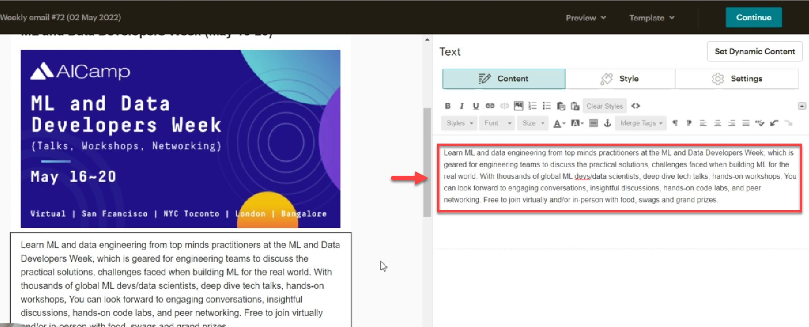
    <!-- sop-caption-start -->
    This screenshot anchors the step to paste the description so you can match the documented UI before acting. Look for the link, copy, or paste target shown there, then use it to confirm you are in the correct place before continuing.
    <!-- sop-caption-end -->
    <!-- sop-screenshot-end -->

    Loom links:
<!-- sop-step-end -->

<!-- sop-group-end -->
<!-- sop-section-end -->

<!-- sop-section-start: validation -->
## Validation

-
<!-- sop-section-end -->

<!-- sop-section-start: troubleshooting -->
## Troubleshooting

-
<!-- sop-section-end -->

<!-- sop-section-start: references -->
## References

-
<!-- sop-section-end -->
