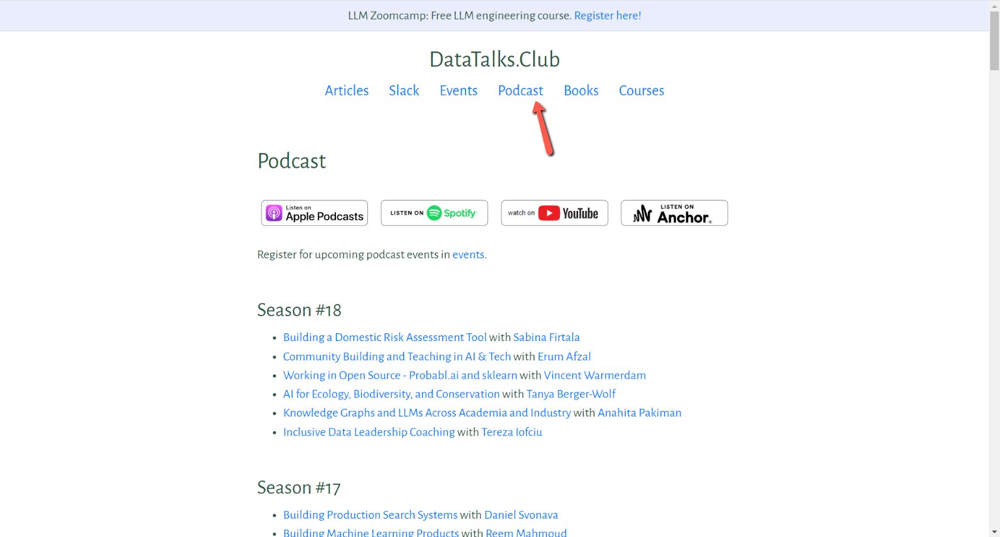
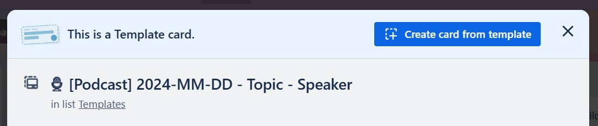
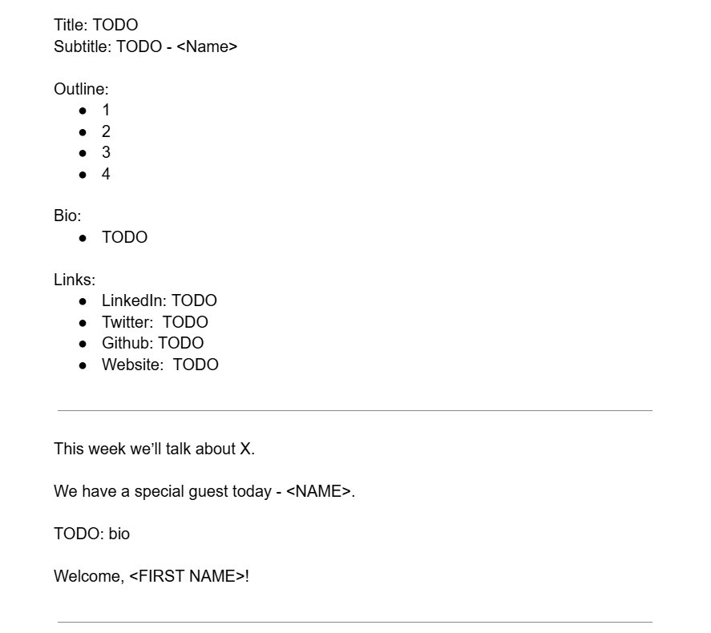
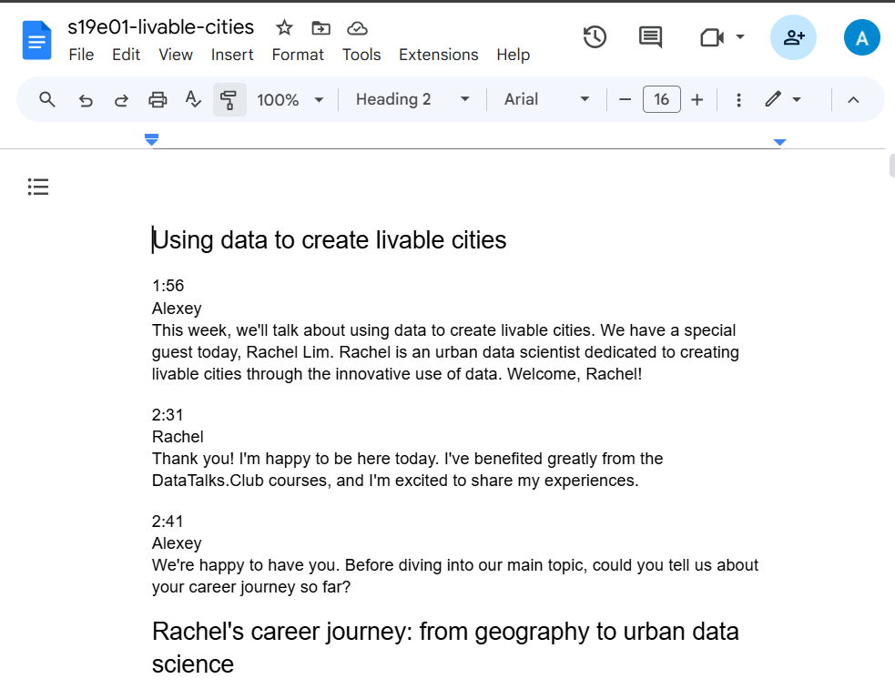
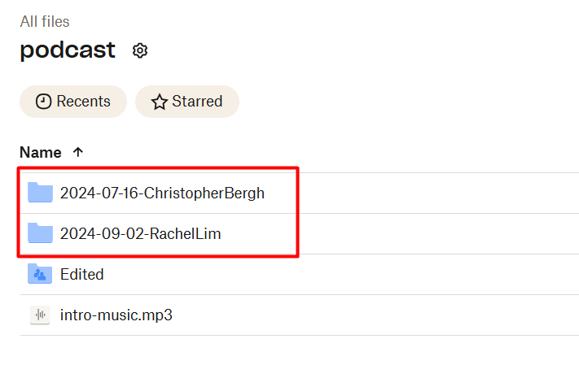
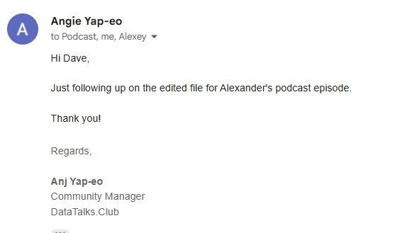
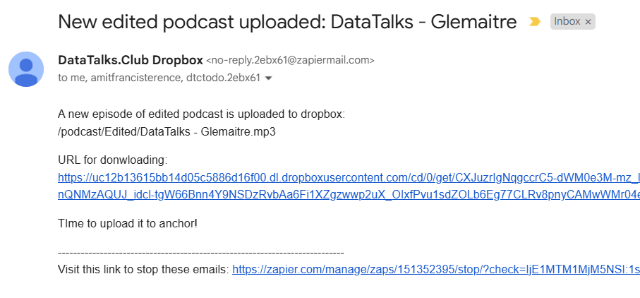
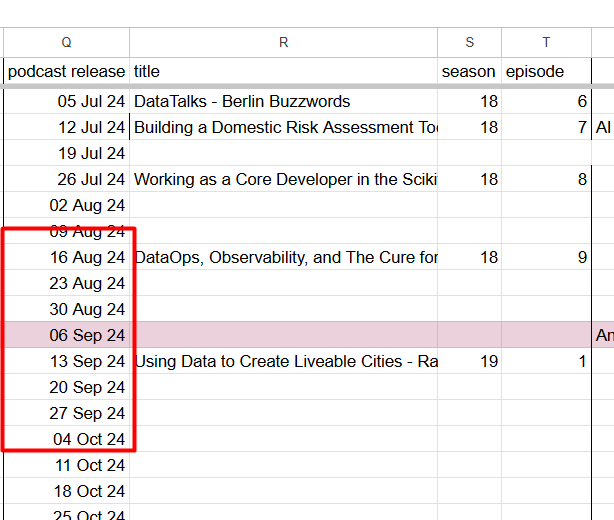
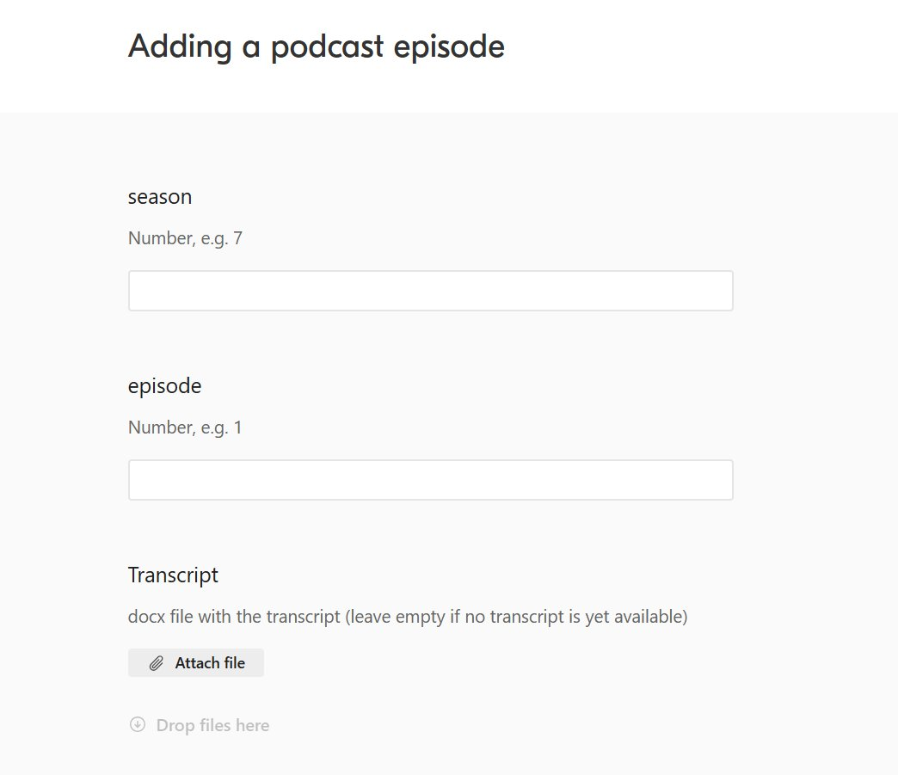
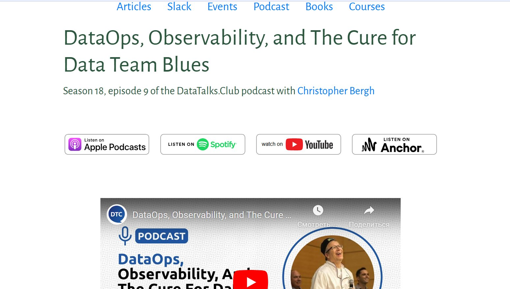

# Events (live) - Podcast

## Summary

## Content

### Podcast

Podcast is a live event – we invite guests to learn from them. There are no slides, just talking heads.

The podcast interviews are recorded live.

Usually we do them at 12:30 Berlin time on Mondays, but we can also do them at 12:30 on any other day. If the guests are from the US, we can do them in the evening (17:00).

After the live session, we share the audio recordings with our editors, and eventually publish an audio-only version on platforms like Apple Podcasts and Spotify. We also publish them on our website and include a transcript.

We publish them in a separate section – “Podcast”: [https://datatalks.club/podcast.html](https://datatalks.club/podcast.html)

Image note: This screenshot shows the Podcast section on the DataTalks.Club website and the platform links for published episodes. Use it to confirm where finished podcast pages appear and which external links need to be checked after publication.

You can click on the links like Apple podcasts, Spotify, YouTube to see/hear the podcasts.

| Note: there’s a task that needs to happen between Friday evening and Monday morning. It takes roughly 5-10 minutes. Our podcast is scheduled to go live every Friday, and when it is published, we need to create a page on our website. |
|----------------------------------------------------------------------------------------------------------------------------------------------------------------------------------------------------------------------------------------------|

In this document we give the outline of the process. For details, refer to Trello template and cards.

### Trello

Image note: This screenshot shows the Trello podcast template card and the button for creating a card from the template. Use that template as the operational checklist for a new podcast instead of creating a blank Trello card.

On our Trello board, we have a template for podcasts: [https://trello.com/c/4tWN4V6x](https://trello.com/c/4tWN4V6x/1-%F0%9F%8E%99%EF%B8%8F-podcast-2024-mm-dd-topic-speaker).

By the time we create the card, the first few checkboxes are already done, so resolve them.

As we go through the process, we need to fill in some TODOs in the cards:

Podcast document: TODO

Luma link: TODO

Meetup link: TODO

Youtube link: TODO

Transcription: TODO

Spotify for podcasters link: TODO

Spotify podcast link: TODO

Apple podcasts link: TODO

DTC webpage podcast link: TODO

Here we will talk about them

### Podcast document

This is the document that describes the podcast event: title, subtitle, outline, speaker’s bio – and, most importantly, the questions.

You fill find them in the [Podcast](https://drive.google.com/drive/folders/1NEm9zmr8W2zks5WIn0SOQMr6tWgZvy8D) folder of our shared drive with documents:

Image note: This screenshot shows the podcast document template fields for title, subtitle, outline, bio, and links. Use it to identify the fields that must be completed before announcing the episode and linking the document from Trello.

When you create a podcast document from this template, put the link instead of the TODO in the card’s description. We will need it throughout the entire process.

You can already fill in some things there, like \<NAME\>. Of course, there’s a process document for that – you will find the link in the Trello card.

For announcement, we need to fill:

- Title

- Subtitle

- Outline

- Bio

If it’s ready, the event is ready for the announcement.

We have a podcast producer (Johanna Bayer) who usually helps us with questions. She usually takes care of most of the things in this document.

### Transcript

After the live event, we create a transcript of the podcast. We put them in the [transcripts](https://drive.google.com/drive/folders/1khibztKmYTdyMBRjaQeiaNHXuE0A2HUw) folder of the “Files” drive.

Image note: This screenshot shows a transcript document with speaker turns and timestamps in Google Docs. Use it to confirm the transcript has been created before uploading it to `transcript-utils` for website-ready timecodes.

After that, we upload the file to the [transcript-utils](https://github.com/alexeygrigorev/transcript-utils) GitHub repository to create timecodes and a machine-readable version for our website.

### Audio recording and editing

During the live interview, we stream the conversation to YouTube and also record the audio-only version.

The audio is later uploaded by Alexey to drop box, “podcast” folder:

Image note: This screenshot shows the Dropbox `podcast` folder with date-name subfolders for raw audio. Use the folder naming pattern to find the correct recording before sending the audio link to the editor.

The pattern is “date-name”, e.g. “2024-07-16-Christopher”.

We have a freelancer (Dave, [dave@podcastengineers.com](mailto:dave@podcastengineers.com)) who takes care of editing the podcast. We send them the link and ask them to edit the episode.

Once the podcast is edited, it’s uploaded by Dave to the “Edited” folder. We receive an email notification when it’s ready:

Note: When we have a podcast pending publication on Spotify, check with Dave if the podcast will be on time for publishing the following week.

If there is a TODO task labeled "Check with Dave that the next podcast episode is on time" and you can't find it in Dropbox, send an email to confirm the status of the upcoming podcast.

Image note: This screenshot shows the email notification from the editor that an edited podcast file is ready. Use the message as the trigger to fetch the edited file and continue with the Spotify upload workflow.

Image note: This screenshot shows the automated task notification created when the edited podcast is uploaded. Use the linked Dropbox file in the task to verify the edited audio is available before scheduling publication.

And it’s also automatically added to the TODO list.

### Uploading to Spotify for Podcasters

When the podcast is edited, we need to publish it

- Upload the edited version to Spotify for Podcasters

- Schedule it for publication

When you do it, move the file to the “uploaded” folder.

We typically schedule the podcast episodes on Fridays at 19:00 Berlin time.

You can see the date for publishing in our [DataTalks.Club schedule](https://docs.google.com/spreadsheets/u/1/d/1-T8qkmShlFUrT2NmkI8Pi1NgUS9IunP6wO5-L79xe2s/edit), “Timetable” sheet:

Image note: This screenshot shows the podcast publishing columns in the schedule sheet, including release date, title, season, and episode. Use this row to set the Spotify publication date and to copy the correct season and episode numbers.

When the episode goes live, update the links in the Trello card.

### Publishing the episode on DataTalks.Club website

The final transcript and episode details are uploaded to our website. We use [a special form for that](https://airtable.com/app7NCWvFj6Wz0ASm/shriRxLKwB1CyxhEy):

Image note: This screenshot shows the Airtable form for adding a podcast episode to the website. Use it to enter the season, episode, transcript, and related episode data after the audio is published.

And finally, the podcast episode is published on our website:

Image note: This screenshot shows the final published podcast page with the title, platform buttons, and embedded YouTube player. Use it as the validation target after submitting the Airtable form and updating the Trello links.

### Newsletter

The last step is adding the podcast page to the newsletter – and the process is over.

## References

-
