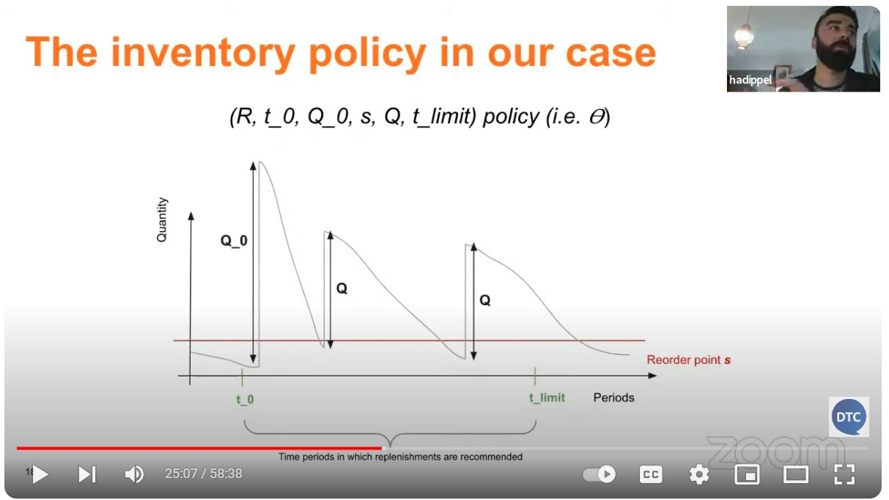

# Events (live) - Webinar

## Summary

## Content

### Webinars

Live sessions where the purpose is to teach something. They are not hands-on, usually there’s one or two presenters going over slides.

Image note: This screenshot shows a webinar recording where the main content is a slide presentation with the speaker visible. Use it as the visual cue for classifying the event as a webinar and following the simpler webinar process.

Webinars are simpler than [Events (live) - Podcast](events-live-podcast.md) but follow a similar structure and timeframe.

They differ from podcasts in that the speaker prepares their own slides, and the event concludes with a Q&A session. We don’t prepare questions in advance. There are no transcripts for webinars, and the post-event process is simpler, with fewer tasks to manage.

We typically have them on Tuesdays, at 12:30 Berlin time, unless otherwise agreed with the speakers.

We create a Trello card from the webinar template and follow the same steps as podcasts in terms of scheduling and document creation.

The template for webinars: [https://trello.com/c/OScNM9Ai](https://trello.com/c/OScNM9Ai).

Youtube playlist with webinars: [https://www.youtube.com/playlist?list=PL3MmuxUbc_hKPx7yVcu-9aAJxkCe8y_Ld](https://www.youtube.com/playlist?list=PL3MmuxUbc_hKPx7yVcu-9aAJxkCe8y_Ld)

## References

-
