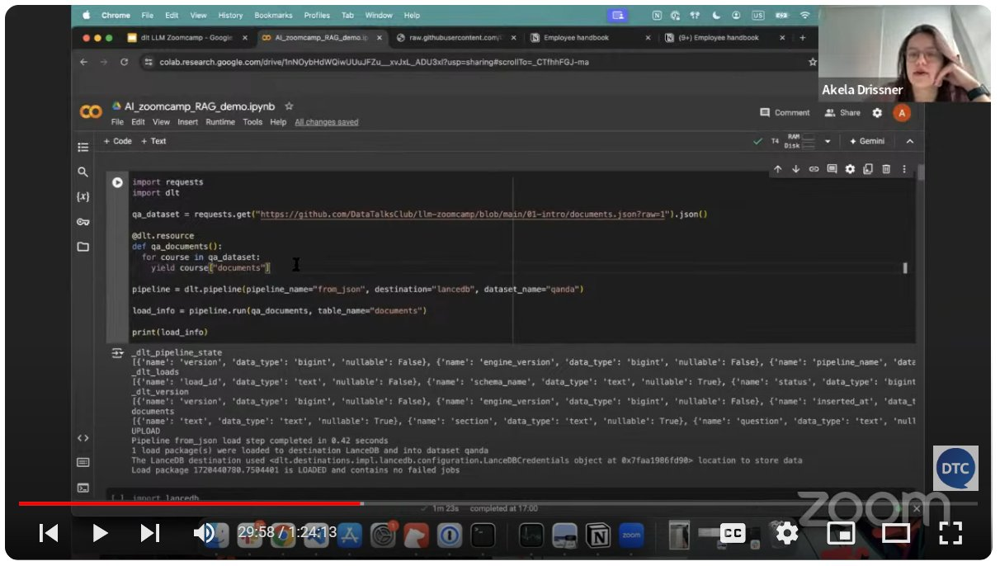

# Events (live) - Workshop

## Summary

## Content

Workshops are similar to webinars but involve hands-on demonstrations. The speaker typically shares their screen to code or show how to do something. The process is almost identical to webinars in terms of setup, scheduling, and tracking.

They are often sponsored.

Image note: This screenshot shows a typical workshop recording with the speaker sharing code in a live demo. Use it to distinguish workshops from slide-based webinars and confirm that the event setup supports hands-on screen sharing.

Playlist: [https://www.youtube.com/playlist?list=PL3MmuxUbc_hKXoe5VllAqUa0nTp0k9Mbl](https://www.youtube.com/playlist?list=PL3MmuxUbc_hKXoe5VllAqUa0nTp0k9Mbl)

## References

-
