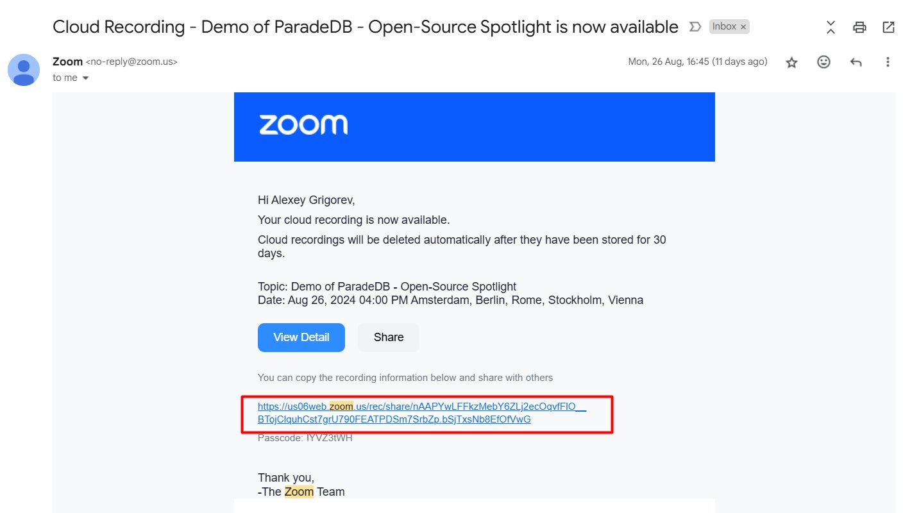
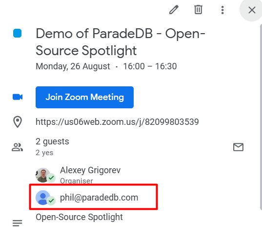
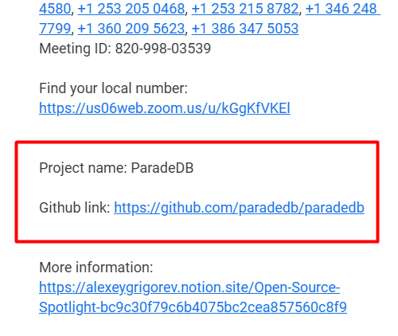

# Events (pre-recorded) - Open-Source Spotlight

## Summary

## Content

### Open-Source Spotlight

Open Source Spotlight is a pre-recorded event focused on showcasing interesting open-source projects. Unlike other events such as podcasts or webinars, it is not streamed live.

### Initiating the process

The event can be initiated in multiple ways:

- Alexey discovers a project and sends a link. We don’t know anyone from the project, so we need to find contact details and reach out to them. We use GitHub and LinkedIn for that.

- Sometimes we already have the contact information of the author/maintainer (e.g. it could be recommended by someone else) . Then Alexey just sends email details and you directly reach out to them.

- Sometimes you already receive a recording, so you just follow the rest of the process (i.e. no need to reach out to them)

When we reach out, we send them this document: [https://alexeygrigorev.notion.site/Open-Source-Spotlight-bc9c30f79c6b4075bc2cea857560c8f9](https://alexeygrigorev.notion.site/Open-Source-Spotlight-bc9c30f79c6b4075bc2cea857560c8f9)

It describes the event and tells the authors what we expect from them. If we agree, we schedule time.

### Scheduling

We use calendly for scheduling. We share the calendly link and ask them to pick up a suitable slot: [https://calendly.com/dtc-alexey/oss](https://calendly.com/dtc-alexey/oss).

If they are US-based (especially PT), they won’t find a suitable slot in calendly, so we manually arrange a time.

Typically, we do it on Mondays at 17:00, 17:30 or 18:00 Berlin time (which is 8:00, 8:30, 9:00 PT). In such cases, we ask the guest to book a random slot in Calendly, after which we manually adjust the appointment to the agreed time.

### Recording

The event is recorded with Zoom and at the end Alexey receives a link to the video

Image note: This screenshot shows the Zoom cloud recording email that starts the post-recording workflow. Look for the recording link in the email body, then use it to download the video and chat files before continuing.

Then you get forwarded this email and need to take care of the rest of the process.

### Downloading and uploading

You get a link to Zoom, you download the video and the chat. You will need both.

- You upload the video to YouTube (unlisted, you don’t add it to any of the channels)

- You use the txt file for edits

### Editing

During the recording, Alexey uses the Zoom chat to mark points where edits need to be made.

- The speaker may need to resize their screen or increase the font size during a demo.

- If the speaker makes a mistake, we can mark a section to be redone.

- Technical issues or errors might occur, which can be flagged for editing.

If the chat simply says "edit," you’ll need to listen to the section and identify what needs to be adjusted based on the context.

If it says “edit”, and then some time later “continue” or “continue from here”, we need to cut the entire section between “edit” and “continue” – usually it happens if there was an error or the speaker needed to redo a part of their demo.

Usually the chat starts with “start” – to see where the start of the video was. Then you use the [Open-Source Spotlight Offset Calculation](https://docs.google.com/spreadsheets/d/1MDJUjRur6wPYkPP6N7JzQw3kuUIaA82_gIBwbGi1t04/edit) spreadsheet to calculate the actual timestamps in the video (relative to the “start” message)

The timestamps will not be exact, so you need to use your best judgment to see what to cut and how much.

You can use YouTube for editing, or a local tool. Using YouTube is simpler, because if we need to re-edit it, the YouTube ID stays the same – we don’t need to re-upload the video.

### Project and contact information

We ask the authors to put the relevant information about their projects into the calendly form. You can access this information from my calendar. You need to find the event for recording and get it from there.

Image note: This calendar view is where the Calendly submission details are stored for the Open-Source Spotlight recording. Check the guest email and event details here so you can contact the speaker and collect project information for publishing.

If you scroll down, you’ll see other things, like project repository (you will need it for the video description)

Image note: This screenshot highlights the project name and GitHub link in the calendar event details. Copy these fields into the video description and use them to verify you are publishing the correct project.

### Post-recording

Once the video is edited, you send it to the speaker for their review. They check the video and tell us if we need to make any further edits.

We also ask the speaker to provide timecodes. Once they provide that, we schedule it for publishing.

### Publishing the video

Initially the video is unlisted. When we schedule it for publishing, it becomes private, so we can add it to the Open-Source Spotlight playlist.

We usually release OSS videos on Wednesdays at 17:00.

## References

-
