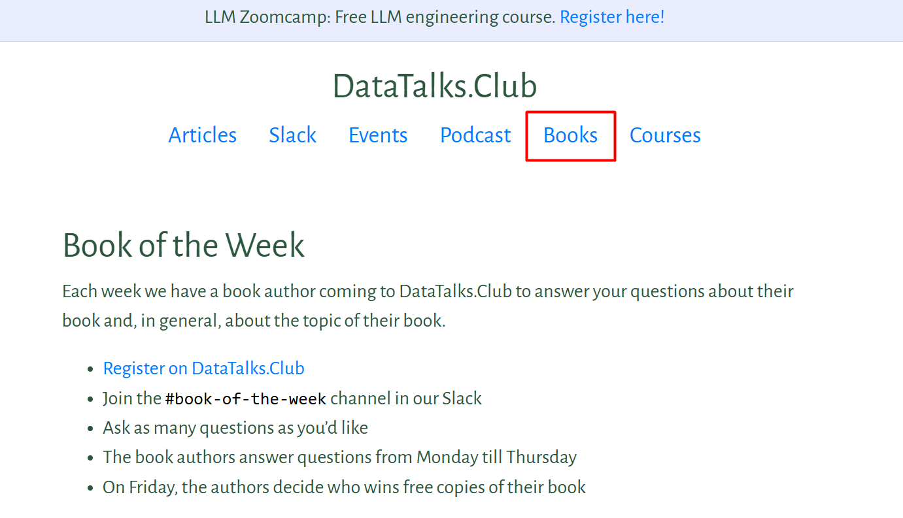
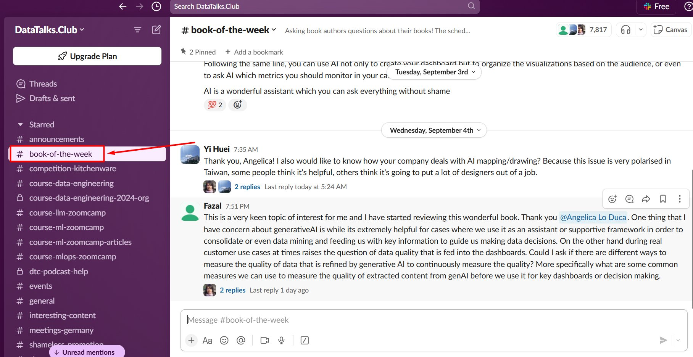

# Events (slack) - Book of the Week

## Summary

## Content

### Book of the Week

This is a Slack-based event where we invite authors to answer questions from the community over the course of a week (Monday to Thursday).

Image note: This screenshot shows the Books section on the DataTalks.Club site where Book of the Week events are surfaced. Use it to confirm that this process is tied to the Books area, not the live Events or Podcast sections.

It happens in [\#book-of-the-week](https://app.slack.com/client/T01ATQK62F8/C01H403LKG8) channel

Image note: This screenshot shows the Slack `#book-of-the-week` channel with an active author Q&A thread. Use the highlighted channel name to verify you are in the right Slack space before posting announcements or reviewing questions.

The author answers community questions in Slack. At the end of the week, they either select the winners or we do it randomly.

### Free books

When authors agree to take part, we arrange five copies of their book to be given away to participants.

We have contacts with O’Reilly, Manning, and Packt Publishing to get these book copies.

If the author is from another publisher, we ask them to provide the books directly.

## References

-
