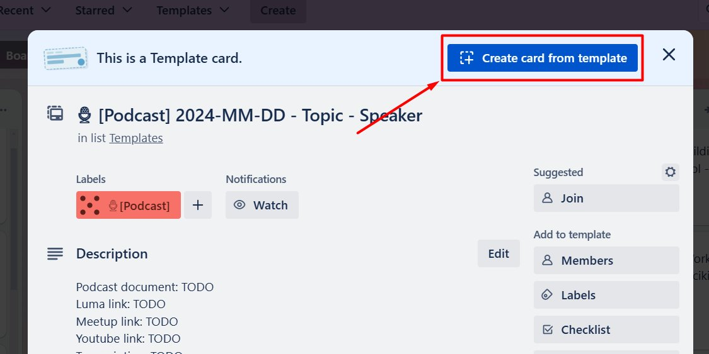
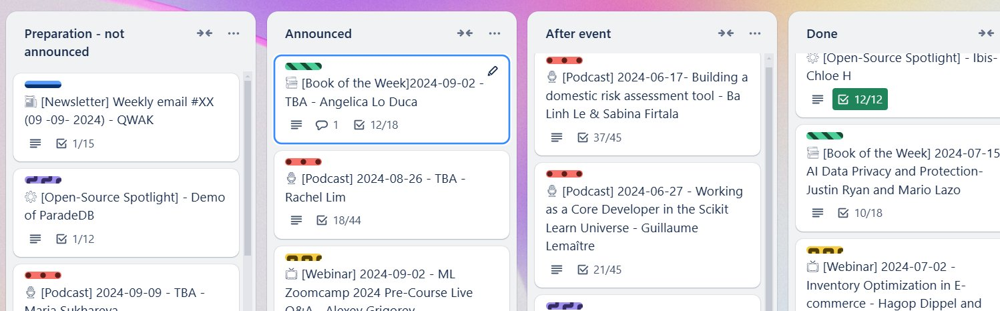
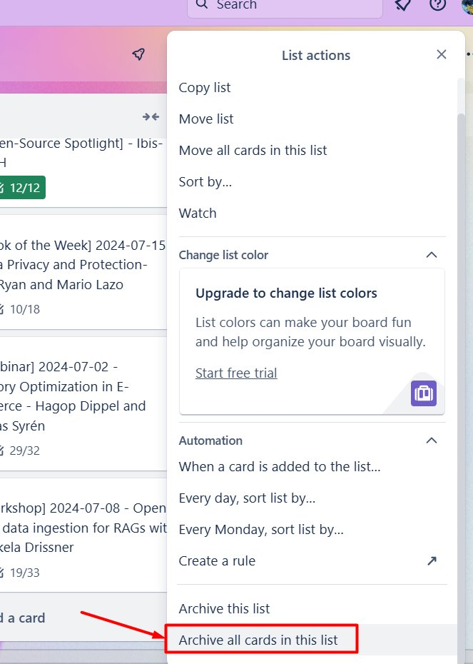
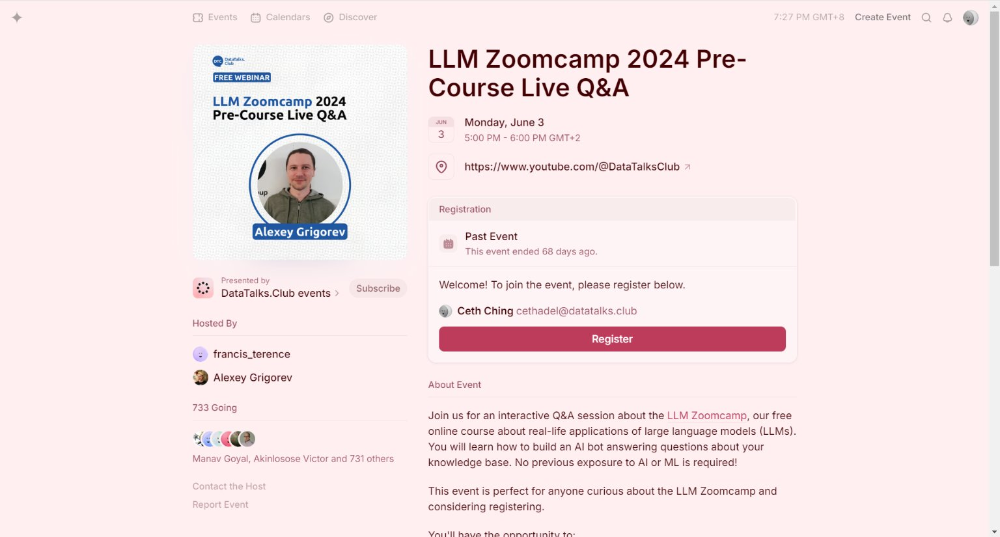

# Events

## Summary

## Content

### Events

In this document, we will describe the common ties between all our events. After checking this document you should go to the individual documents to learn about specifics for each.

We have many events:

- [Events (live) - Podcast](events-live-podcast.md)

- [Events (live) - Webinar](events-live-webinar.md)

- [Events (live) - Workshop](events-live-workshop.md)

- [Events (pre-recorded) - Open-Source Spotlight](events-pre-recorded-open-source-spotlight.md)

- [Events (slack) - Book of the Week](events-slack-book-of-the-week.md)

- [Events (slack) - Project of the Week](events-slack-project-of-the-week.md)

There are 3 ways they happen:

- Live – we stream the event to [our YouTube channel](https://www.youtube.com/c/datatalksclub)

- Pre-recorded – we record it, edit, and then publish

- Slack – the interaction happens in slack, there’s no video

### Finding speakers

First, we need to find speakers for our events.

Guest outreach can happen in multiple ways:

- Alexey comes across someone interesting at a conference, on LinkedIn, or on Twitter, and then sends their name or LinkedIn profile.

- Somebody sends a connection request on LinkedIn and their profile is interesting, so we want to speak with them.

- Someone else recommends the guest – typically someone who already spoke at our event.

- The guest reaches out to Alexey or you directly.

Our main goal at the initial stage is to ask if they are interested in speaking at our event, and if yes, get their email address.

The process usually looks like this:

- If we only have their name, we need to find them on LinkedIn.

- If we have their LinkedIn, but don’t have their email

  - Send them a connection request.

  - Ask if they want to take part in our events (podcast, webinar, or we can offer both – or it could be something else)

  - If they agree, ask for their email address.

  - Once we have the email address, propose a date for the event

- Process for Slack, Twitter and other platforms is similar to LinkedIn

- If we already have their email address

  - Send an email asking if they want to take part in our event

  - If yes, propose a date

- Sometimes Alexey already agrees with them on event type and he just gives you their email address to start the process

  - You propose a date in the first email

- If they reach out to us

  - We discuss internally if we want to host them

  - If yes, agree on the date

- When we agree on the date, we can create a Trello card using a template (see next) and follow the rest of the process for this particular event

Relevant process documents:

- [Reaching out to people using Alexey's LinkedIn Account](https://docs.google.com/document/d/19xReu85OzsoOC4GoVP8Yq8dCa6GQ5cwyIRqOI_bo6Cg/edit?usp=sharing)

- [Connection Request on LinkedIn - Reaching out](https://docs.google.com/document/d/11uf5DRZ9YjqN8mQVCibl3qN8DGCLiUf_3hOzUqMoyKA/edit?usp=sharing)

- [First Time reaching out to a speaker - Podcast&Webinar](https://docs.google.com/document/d/1LTWIrQT2jfLQotOU9PxPLWurfslNyplbqk_3AFPjN6o/edit?usp=sharing)

- [OSS - Reaching out to author/s about their tool](https://docs.google.com/document/d/1FSJQoMOAZOpiA7EGR2t-xYcu_nEEd2hQSZCC3t5vdq8/edit?usp=sharing)

- [Book of the week - reaching out to authors](https://docs.google.com/document/d/1QXNfawI_EzctNrh4w9qg8kzZAzAgiJDpJJrzoxMwAsQ/edit?usp=sharing)

- [Reaching out through Slack](https://docs.google.com/document/d/13QaJz72PaTrHMSojEdboOV7wvqU9ExtjPffmhErB_N0/edit?usp=sharing)

- [Reaching out on Twitter](https://docs.google.com/document/d/1eDlegf-9kJstGsNEiVdK1KD1ghAby_EWuVXZ6ybTlc0/edit?usp=sharing)

Usually, the subject of the email is “\<Name\> at DataTalks.Club – \<Event Type\>”, e.g. “Elena at DataTalks.Club – webinar”

For proposing the date, we use our schedule.

We can propose 2 dates for sponsored events and if we reach out to guests it’s just one.

### Schedule

The Schedule spreadsheet is where we keep track of all the dates. You can see it here [DataTalks.Club schedule](https://docs.google.com/spreadsheets/d/1-T8qkmShlFUrT2NmkI8Pi1NgUS9IunP6wO5-L79xe2s/edit#gid=0) and read more in [Schedule](schedule.md)

Image note: This screenshot shows the shared schedule spreadsheet with the event-type columns highlighted. Use it before proposing dates so the event goes into the correct column group and does not conflict with existing bookings.

When agreeing on a date, check Alexey’s calendar if he’s available on that day and time. See [Alexey's Calendar](../../internal-admin/reference/alexey-s-calendar.md) for more information.

### Communications

In general, emails can be sent out any time of the day. We have no scheduling for emails.

### Trello

Once we agree on the day and time with the speaker, we can create a Trello card [on our board](https://trello.com/b/qVB6fAUG/datatalksclub).

Open the relevant template and click “Create card from template”

Image note: This screenshot shows a Trello template card and the `Create card from template` button. Use this button after the speaker and date are agreed, then fill in the placeholders instead of manually recreating the checklist.

Next, fill in the placeholders:

- YYYY-MM-DD for date of the event

- Topic – “TBA” if not agreed yet

- Speaker – the full name of the guest

And then put the card to the “Preparation - not announced” line:

Image note: This screenshot shows the Trello workflow lists from preparation through done, with the announcement stage highlighted. Move cards through these lists to reflect the event state and keep downstream work visible.

We have 4 categories:

- Preparation – not announced yet. The event is not announced on Luma and other platforms yet

- Announced – the details are confirmed, the event is already announced but hasn’t happened yet

- After event – the event already happened, but there are things we still need to finish, like editing, publishing the audio-only version for the podcast, etc.

- Done – everything is Done

When the “Done” line is full, we can archive all the cards by clicking on “...” in the top right corner and then selecting “archive all cards in this list”:

Image note: This screenshot shows the list menu option for archiving all cards in the Done list. Use it only when the Done column is full and the completed cards no longer need to stay visible on the board.

### Luma

We use lu.ma for scheduling live events and projects of the week too.

Here’s an example of an event on Lu.ma:

Image note: This screenshot shows an example Lu.ma event page with the title, date, and registration panel. Use it as the published-event check: confirm the public page has the correct event details before sharing it.

### Editing

When a live event happens, it's streamed to our YouTube channel. After the stream, you'll need to edit it: add a cover and cut the beginning.

You will find the videos on our YouTube channel

### Managing the Backlog

When we run low on potential guests, you can refer to the “guest leads” spreadsheet, which includes potential speakers. It’s a CRM-like table but for managing potential guests.

The list contains their LinkedIn profiles and any other relevant details. If you find someone interesting, you’ll reach out to them to gauge their interest.

See the “Guest leads” sheet in our [DataTalks.Club schedule](https://docs.google.com/spreadsheets/d/1-T8qkmShlFUrT2NmkI8Pi1NgUS9IunP6wO5-L79xe2s/edit?gid=891575055#gid=891575055) spreadsheet.

Columns:

- Name – the name of the person

- LinkedIn – their LinkedIn profile

- Event type – workshop, webinar, podcast, OSS (open-source spotlight), etc

- Lead comment / Link (event, etc) – comment Alexey left when adding the lead or the link where we found them

- Source – who referred them, or the conference where we found them, or another source

- Email – when they share their email, we put it there

- Status

  - backlog – only added to the list, but didn’t attempt to contact

  - to be review – recommended by someone, but didn’t check if they are interesting

  - pending request – sent a connection request but no answer

  - proposed – connected successfully and asked if they are interested in speaking

  - closed – got their email and they agreed to speak

  - declined – they declined

- Date of last contact attempt – when we attempted to contact them last ime

- Date follow up – when we should contact them again

- Comment – anything we want to add

- Account used (LinkedIn) – your name or Alexey’s account

### Next

Now go [to the top of this document](#events) to check the docs for each of the individual events.

Sources:

## References

-
