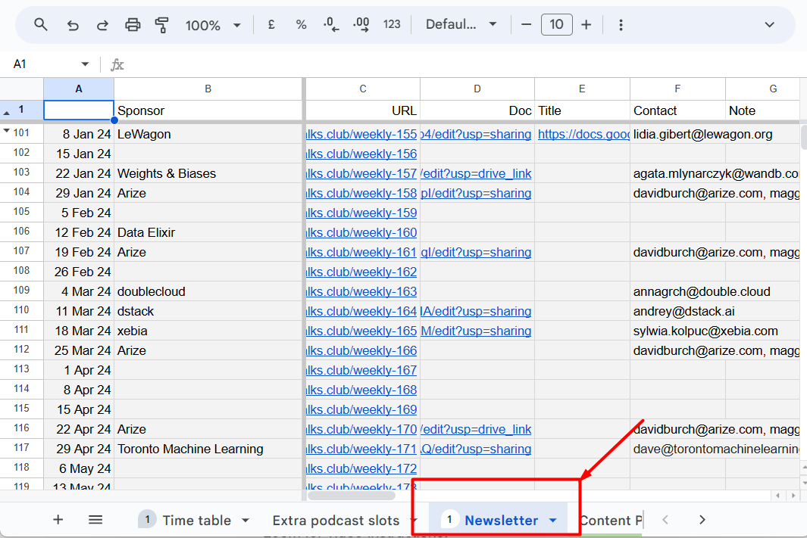
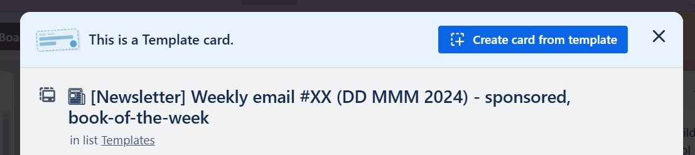

# Newsletter

## Summary

## Content

### Newsletter

We have a newsletter with 100k+ subscribers, which we manage through MailChimp. The newsletter goes out every Monday at around 10:00 Berlin time.

Our clients pay us to be included in the newsletter – there’s a sponsored section in each of them.

You can see the newsletter schedule in [DataTalks.Club schedule](https://docs.google.com/spreadsheets/d/1-T8qkmShlFUrT2NmkI8Pi1NgUS9IunP6wO5-L79xe2s/edit?gid=1710801712#gid=1710801712)- the “Newsletter” tab

Image note: This screenshot shows the Newsletter tab in the schedule spreadsheet with sponsor, URL, contact, and note columns. Use it to check whether a newsletter issue has a sponsor and where the sponsor document link should be tracked.

Each newsletter can have only one sponsored slot, and we use this document for assigning a sponsor to a slot.

Preparing the newsletter involves multiple steps, from drafting the content to coordinating with sponsors, and requires starting in advance to ensure everything is ready on time.

The newsletter may contain event announcements, relevant news, and sponsored content.

### Trello

There’s also a Trello template for it: [https://trello.com/c/TuIVBFfr](https://trello.com/c/TuIVBFfr)

Image note: This screenshot shows the Trello newsletter template card title pattern. Use the issue number from the URL to replace `#XX`, and keep or remove the sponsored/book-of-the-week labels based on the schedule.

Each newsletter has a unique number – you can see it in the URL (weekly-171, 172, etc), so you use it to replace \#XX.

If it’s sponsored, we leave “sponsored”. If there’s a book of the week happening, we also leave it in the title, and otherwise remove it.

### Draft

The drafting process begins ~10 days before the newsletter’s scheduled send-out date. You receive a reminder notification in Telegram, prompting you to start preparing the draft.

For that, you create a copy of the newsletter template – this is the base for each newsletter and includes placeholders for all the usual content sections, such as upcoming events, announcements, and links to resources.

If we don’t have a trello card for the newsletter, this is when we also should create it.

There are always two newsletter drafts in progress: one for the upcoming Monday and one for the week after. This ensures that the newsletter pipeline is always ahead, allowing for a smooth process even if unexpected delays occur. You alternate between updating these two drafts as necessary.

Note: Always create a new email thread for every newsletter
Subject email: (Company) + Datatalks.club Newsletter - MM DD, YYY

### Filling in the content

As you go through the week, you gradually fill in the relevant details:

- Event announcements (e.g., podcasts, webinars, workshops)

- Any updates from the community or blog posts

- Additional information such as resources or updates from DataTalks.Club

Initially, you will be able to fill in only basic information, but you will update it as the week progresses and new content becomes available.

You will work closely with Valeria – our content manager. You will handle most of the structured content (based on templates), Valeria will add, edit, or adjust specific content. She focuses on writing or tweaking sections, while you manage the overall structure and input based on the templates.

### Sponsored content

Often the newsletter includes sponsored content – a promotion from one of our sponsors, such as a mention of their product, event, or resource.

You can see in column B if any particular newsletter issue has a sponsored section.

In case we have a sponsor, you create a newsletter document and share it with the sponsor. This document outlines what will be included in the newsletter and allows the sponsor to review or provide feedback.

Send this document well in advance (10 days before the newsletter is sent out), giving both the sponsor and us enough time to make any adjustments.

For deadlines of receiving the document from the sponsor, the ideal time frame is to receive it 10 days before the required date. However, if there's limited time, the minimum deadline should be by Wednesday of the week prior to the Monday when the newsletter is scheduled, to allow Valeria enough time to review.

We have templates for communicating with the sponsor. You will send them an email in advance asking to fill it in. Later Valeria and Alexey work with this content and take care of the sponsored section.

If the sponsor hasn’t provided their content as the week progresses, you’ll need to send reminders.

### Newsletter send-out

Once the draft is finalized and reviewed, the newsletter is scheduled to be sent on Monday. Usually you don’t do it, Valeria or Alexey take care of that.

## References

-
