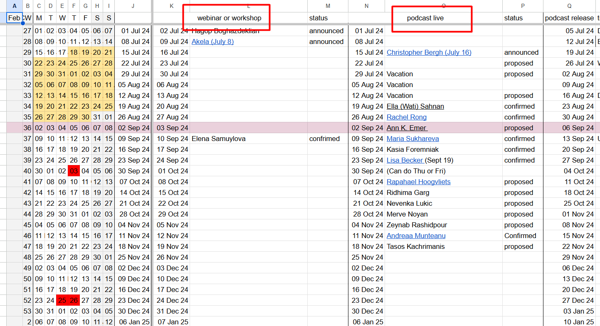
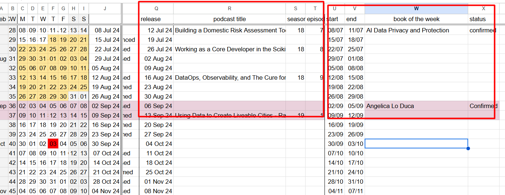
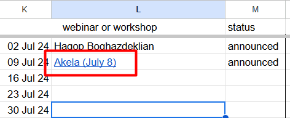
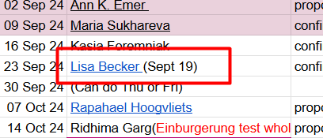
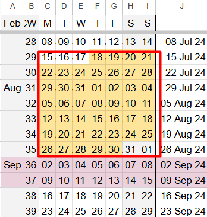
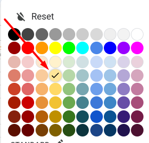
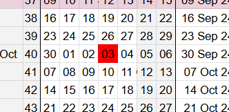
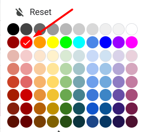

# Schedule

## Summary

## Content

This document describes the [DataTalks.Club schedule](https://docs.google.com/spreadsheets/u/1/d/1-T8qkmShlFUrT2NmkI8Pi1NgUS9IunP6wO5-L79xe2s/edit) spreadsheet

It helps to keep track of all the dates

Image note: This screenshot gives the full schedule layout so you can orient yourself before editing dates. Look for the webinar/workshop and podcast-live column groups, then use the sheet as the source of truth for available event slots.

Image note: This screenshot zooms in on the event scheduling columns and the Book of the Week area. Use the highlighted column groups to place each event type in the correct section instead of mixing live events, podcast publishing, and Slack events.

There are multiple columns:

- Webinars or workshops (K-M) – [Events (live) - Webinar](events-live-webinar.md) or [Events (live) - Workshop](events-live-workshop.md)

- Podcast live (N-P) – [Events (live) - Podcast](events-live-podcast.md)

- Podcast publishing (Q-T) – [Events (live) - Podcast](events-live-podcast.md) (see Uploading to Spotify for Podcasters)

- Book of the week (U-X) – [Events (slack) - Book of the Week](events-slack-book-of-the-week.md)

### Webinars and workshop (live)

Webinar or workshops – dates for webinars / workshops

Usually Tuesdays, but we can propose a non-Tuesday date. Then for this week we put the date in parentheses

For workshops, turn the text in the cell (L column) into a link to the workshop document

Example:

Image note: This example shows a workshop cell linked to its document, with the event name and date highlighted. Use it as the model for workshop entries: put the title in the webinar/workshop area and link the cell to the workshop document.

Different day (non-Tuesday) and link to the workshop document

### Podcast (live)

Podcast – dates for podcast interviews. Usually Mondays, but we can also propose a non-Monday date. In this case we put the date in ().

Example:

Image note: This example shows a podcast interview scheduled on a non-Monday date using the date in parentheses. When a guest cannot use the usual Monday slot, record the alternate date in the same way so the exception is visible in the schedule.

Podcast interview with Lisa is not on Monday, but on a different day.

### Alexey’s Calendar

So, when agreeing on a date, check the schedule document and see if a date is available. Also check Alexey’s calendar if he’s available on that day and time.
See [Alexey's Calendar](../../internal-admin/reference/alexey-s-calendar.md) for more information.

When Alexey is not available on Monday/Tuesday, you may see a note in the spreadsheet in the respective cell saying that you need to use a different day. This usually means that the week is available, just the day isn’t

Sometimes the cells would say “Vacation - entire week” (or just “vacation”) – then we don’t have anything for that week. BUT can schedule something for another week. This is especially useful for podcasts, because we want to keep weekly cadence for recorded/edited releases.

### Status

If we find a available date when Alexey is also free, propose the date and time to the guest:

- Put their name in the cell

- Put the status “proposed”
Once the guest confirms the date, change the status to “confirmed”
For podcasts and workshops, we also link the cells to the relevant documents (workshop document or podcast document). For webinars, we don’t have any documents, so don’t link anything.

### Podcast publishing

After the podcast is recorded live, we publish the edited audio-only version to all major podcast platforms. We keep track of the date, and also season and episode in the Podcast publishing columns (Q-T)

Image note: This repeated schedule screenshot points to the podcast publishing columns after the live recording columns. Use it to enter the publication season and episode details separately from the live interview date.

Usually there’s 2-3 weeks delay between the live event and the publication on Spotify.

For more information see [Events (live) - Podcast](events-live-podcast.md)

### Book of the week

Columns U-X help us schedule “Book of the week” events.

### Color coding

School holidays – check with Alexey on which dates he’s available or not available (light yellow 2)

Image note: This screenshot shows school-holiday dates highlighted in light yellow on the calendar portion of the sheet. Treat these dates as requiring an availability check with Alexey before proposing an event.

Image note: This screenshot shows the color picker with the light-yellow holiday color selected. Use this color when marking school holidays so future scheduling checks can identify them consistently.

Public holidays in Berlin – can’t schedule anything on these days (red)

Image note: This screenshot shows a public holiday date marked in red in the schedule. Do not propose or confirm events on dates marked with this red holiday signal.

Image note: This screenshot shows the color picker with the red public-holiday color selected. Use this red marking for Berlin public holidays so they are clearly blocked from scheduling.

## References

-
