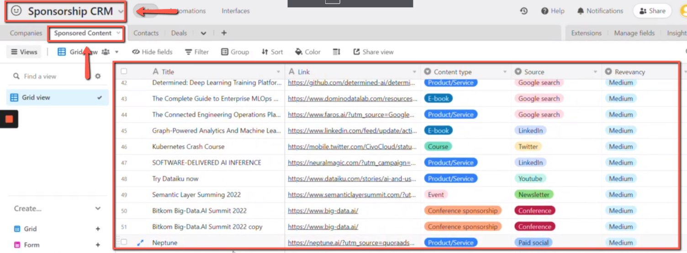
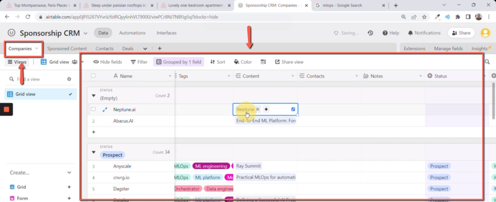
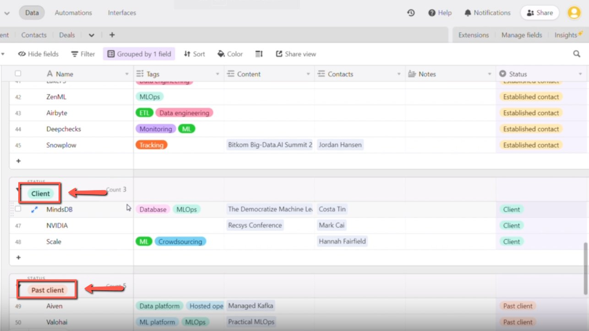
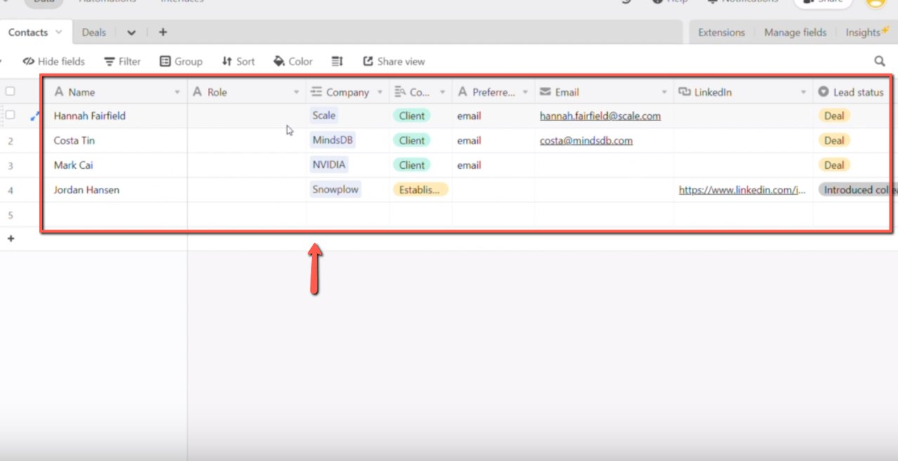
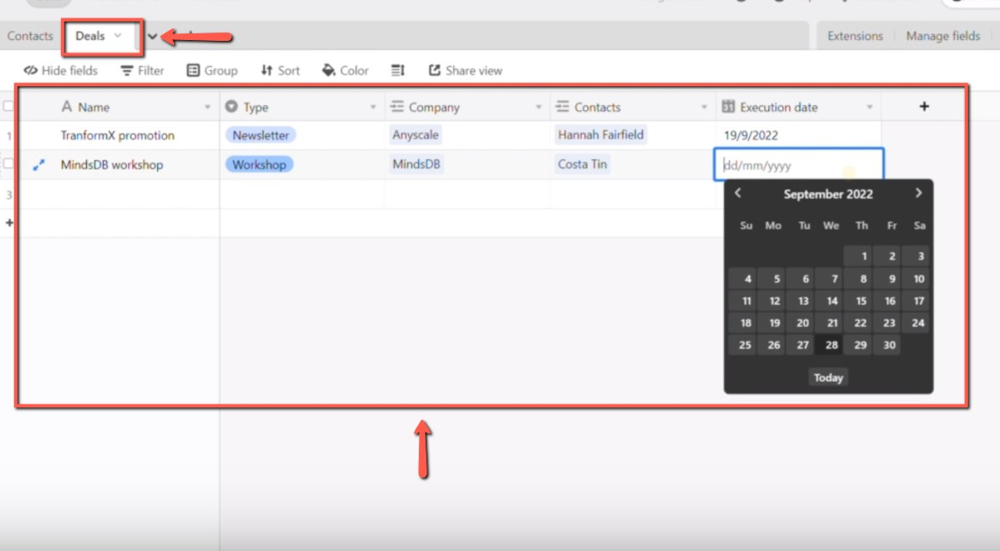

# Overview Document- Airtable Sponsorship CRM database

## Summary

## Content

Overview Document- Airtable Sponsorship CRM database
All Sponsored content and leads are captured in the “Sponsored Content” table in [Airtable.](https://airtable.com/app0jPi5287VYvrii?)

Image note: This screenshot anchors the CRM update in Airtable CRM. Look for the red callout around "Sponsored Content", then update the record so the CRM data stays consistent.

The list companies who produced the sponsored content can be located on the “Companies” table. Information of the companies includes the name, link of the sponsored content, source and and revevacny can be found in the table.

Image note: This screenshot anchors the CRM update in Airtable CRM. Look for the red callout around "Companies", then update the record so the CRM data stays consistent.

Each company has a status:

- Prospect - companies that we haven’t reach out yet

- Contacted - companies that we reached out but we didn’t get any response back.

- Established contact - companies that replied something back and we started communicating with them

- Client - companeis that decided to partner and collaborate (sponsorship, newsletter promotion, workshops) with us

- Past Client - companies who were our clients before

- Lost/Declined - companies who declined to the request or didn’t answer anything

Image note: This screenshot anchors the CRM update in Airtable CRM. Look for the red callout around the highlighted table, record, field, status, or linked value, then update the record so the CRM data stays consistent.

In the “Contacts” table, it contains the contact information of the companies. This includes the name of the contact person, name of the company, email, social media accounts.

Image note: This screenshot anchors the CRM update in Airtable CRM. Look for the red callout around "Contacts", then update the record so the CRM data stays consistent.

Finally, in the “Deals” table, it contains the companies who agreed to have a close deal with us. Information includes the name of the company, type (workshop, newsletter promotion, sponsorship), contact person, and the executed date.

Image note: This screenshot anchors the CRM update in Airtable CRM. Look for the red callout around "Deals", then update the record so the CRM data stays consistent.

## References

-
