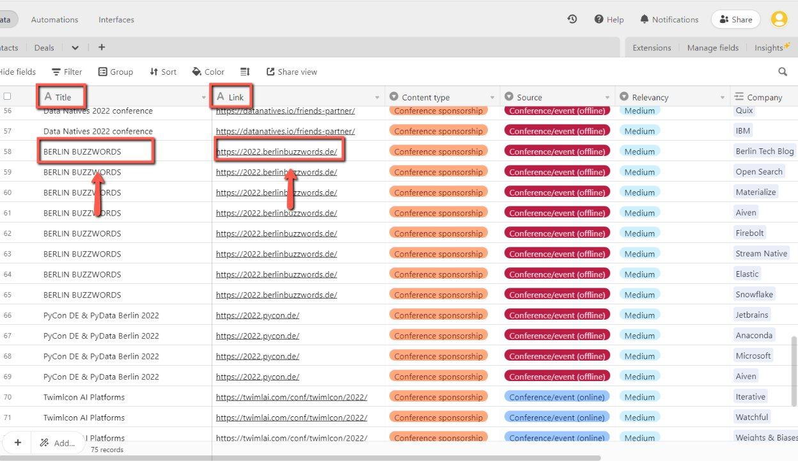
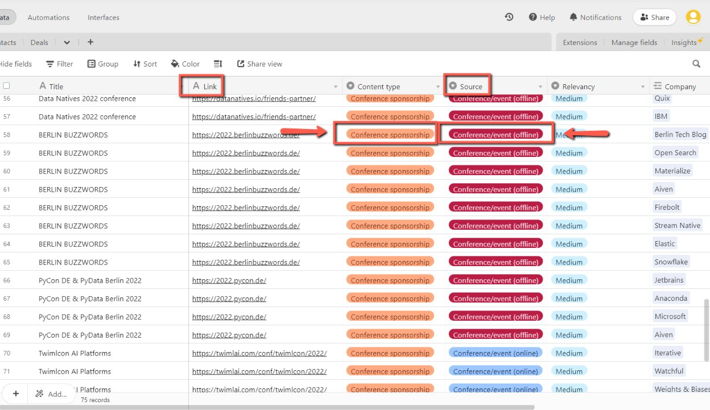
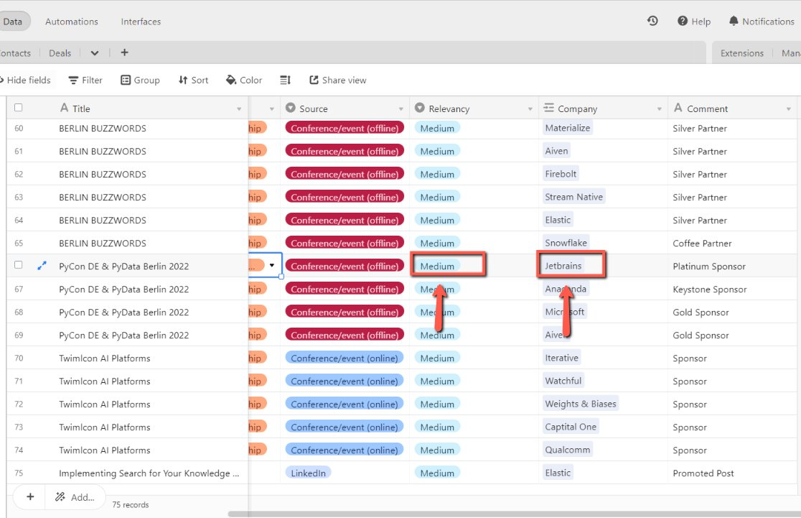
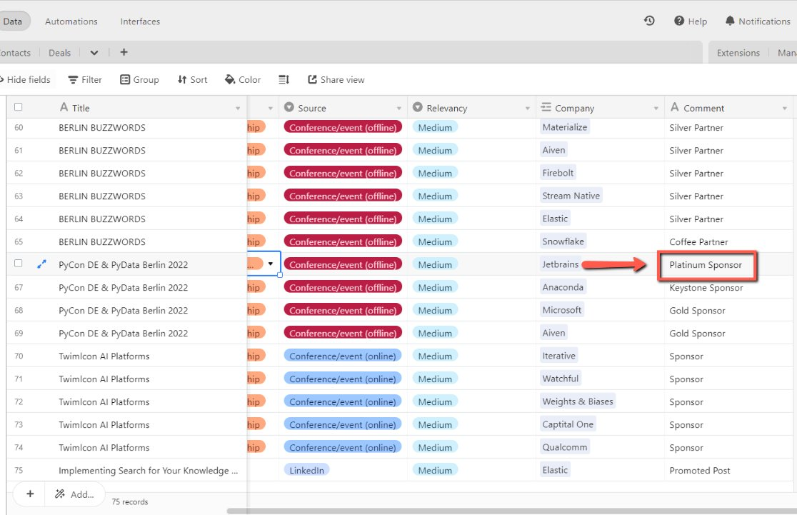

# Adding Conference Sponsors to Sponsorship CRM

<!-- sop-section-start: summary -->
## Summary

- Purpose: Add conference sponsorship opportunities to the sponsorship CRM.
- Outcome: The conference sponsor record is created with source and link details.
- Trigger: A conference sponsorship lead needs to be tracked.
- Frequency: As needed
<!-- sop-section-end -->

<!-- sop-section-start: prerequisites -->
## Prerequisites

- Access: Sponsorship CRM.
- Tools: Airtable.
- Inputs: Conference name, conference link, source, and sponsorship details.
<!-- sop-section-end -->

<!-- sop-section-start: procedure -->
## Procedure

<!-- sop-prose-start -->
How to Add Conference Sponsors to Sponsorship CRM
This procedure will show you the steps on how to Add Conference Sponsors to Sponsorship CRM

Step-by-step Instructions
<!-- sop-prose-end -->

<!-- sop-step-start id=1 -->
1.  The first thing you need to do is add the name and link of the conference under the “Name” column and “Link”.

    <!-- sop-screenshot-start -->
    
    <!-- sop-caption-start -->
    This screenshot anchors the CRM update in Airtable CRM. Look for the red callout around "Link", then update the record so the CRM data stays consistent.
    <!-- sop-caption-end -->
    <!-- sop-screenshot-end -->
<!-- sop-step-end -->

<!-- sop-step-start id=2 -->
2.  Next, choose the Content type and Source of the Conference.

    Note: In here, the conference is a conference sponsorship and the source is Conference/event (offline)

    <!-- sop-screenshot-start -->
    
    <!-- sop-caption-start -->
    This screenshot anchors the CRM update in Airtable CRM. Look for the red callout around the highlighted table, record, field, status, or linked value, then update the record so the CRM data stays consistent.
    <!-- sop-caption-end -->
    <!-- sop-screenshot-end -->
<!-- sop-step-end -->

<!-- sop-step-start id=3 -->
3.  Next, add the relevancy and the company who sponsored the conference.

    <!-- sop-screenshot-start -->
    
    <!-- sop-caption-start -->
    This screenshot anchors the CRM update in Airtable CRM. Look for the red callout around the highlighted table, record, field, status, or linked value, then update the record so the CRM data stays consistent.
    <!-- sop-caption-end -->
    <!-- sop-screenshot-end -->
<!-- sop-step-end -->

<!-- sop-step-start id=4 -->
4.  Lastly, incidate in the “Comment” column the type of sponsor the company is.

    <!-- sop-screenshot-start -->
    
    <!-- sop-caption-start -->
    This screenshot anchors the CRM update in Airtable CRM. Look for the red callout around "Comment", then update the record so the CRM data stays consistent.
    <!-- sop-caption-end -->
    <!-- sop-screenshot-end -->
<!-- sop-step-end -->
<!-- sop-section-end -->

<!-- sop-section-start: validation -->
## Validation

-
<!-- sop-section-end -->

<!-- sop-section-start: troubleshooting -->
## Troubleshooting

-
<!-- sop-section-end -->

<!-- sop-section-start: references -->
## References

-
<!-- sop-section-end -->
