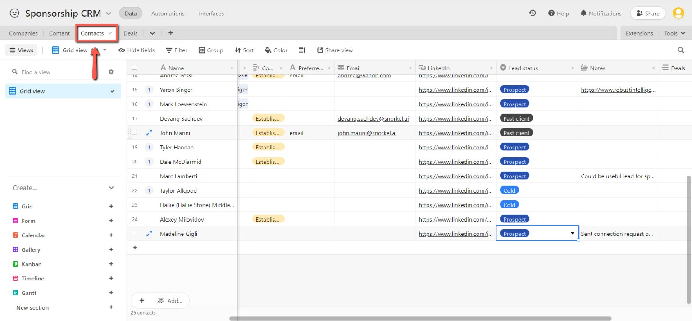
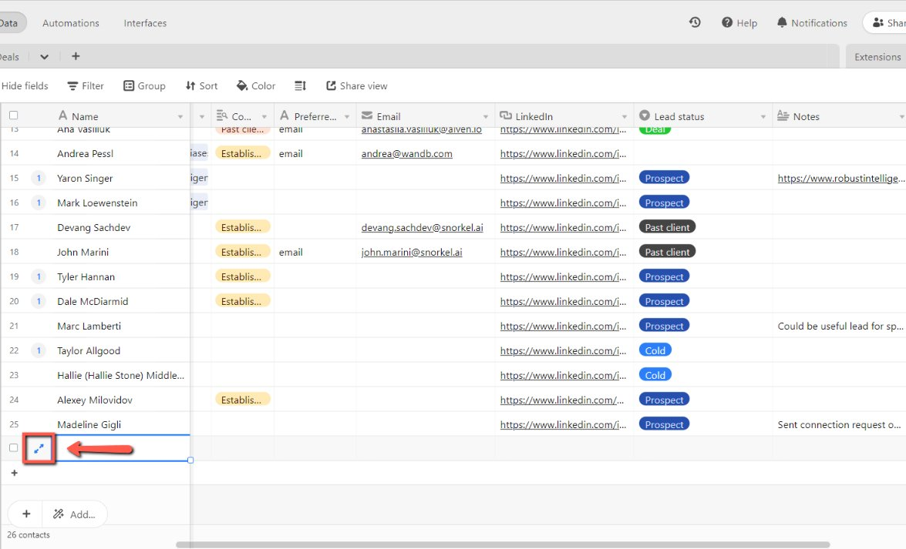
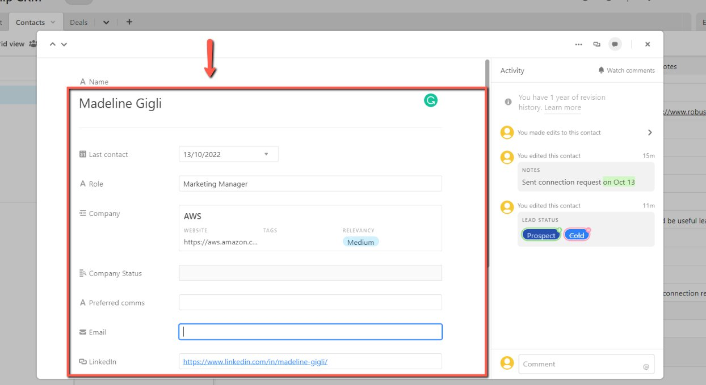
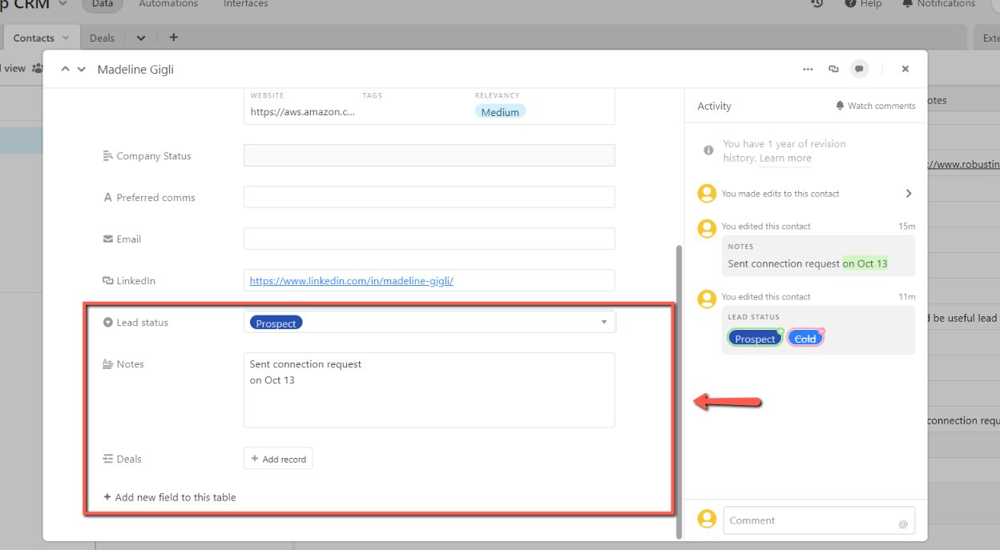

# Adding Contacts on the CRM Table

<!-- sop-section-start: summary -->
## Summary

- Purpose: Add sponsor contacts to the CRM contacts table.
- Outcome: The contact record is created with relevant company and lead status details.
- Trigger: A new sponsor contact needs to be tracked.
- Frequency: As needed
<!-- sop-section-end -->

<!-- sop-section-start: prerequisites -->
## Prerequisites

- Access: Airtable CRM and contact source information.
- Tools: Airtable, LinkedIn.
- Inputs: Contact name, company, role, LinkedIn profile, email if available, and lead status.
<!-- sop-section-end -->

<!-- sop-section-start: procedure -->
## Procedure

<!-- sop-prose-start -->
How to Add Contacts on the CRM Table
This procedure will show you the steps on how to Add Contacts on the CRM Table.

Step-by-step Instructions
<!-- sop-prose-end -->

<!-- sop-step-start id=1 -->
1.  The first thing you need to do is click “Contacts” on Airtable.

    <!-- sop-screenshot-start -->
    
    <!-- sop-caption-start -->
    This screenshot anchors the CRM update in Airtable CRM. Look for the red callout around "Contacts", then update the record so the CRM data stays consistent.
    <!-- sop-caption-end -->
    <!-- sop-screenshot-end -->
<!-- sop-step-end -->

<!-- sop-step-start id=2 -->
2.  And then, click the expand icon to add contact and information.

    Note: You can also add the contact and information by typing on the empty space.

    <!-- sop-screenshot-start -->
    
    <!-- sop-caption-start -->
    This screenshot anchors the CRM update in Airtable CRM. Look for the red callout around the highlighted table, record, field, status, or linked value, then update the record so the CRM data stays consistent.
    <!-- sop-caption-end -->
    <!-- sop-screenshot-end -->
<!-- sop-step-end -->

<!-- sop-step-start id=3 -->
3.  Now, enter the name of the person; his/her role in the company; date of the last contact company name; email (if given); LinkedIn account; the lead status; and some notes or comment you want to add

    Note: Here are meaning of the lead statuses:

    Prospect - sent connection request on LinkedIn

    Cold - contacted them, it was a cold outreach, nobody introduced us to them

    Hot - Somebody introduce as to them or Alexey have met somebody and contact was established

    Proposed - When we talked to them and had a conversation or discussion and sent them an offer

    Deal - Clients that agreed to the proposal

    Introduced collegue - We reached not to the right people (e.g. Account Executive). People who don't own the budget of the marketing or partnerships but he/she can introduce us to his/her colleague who are in marketing or partnerships.

    <!-- sop-screenshot-start -->
    
    <!-- sop-caption-start -->
    This screenshot anchors the CRM update in Airtable CRM. Look for the red callout around the highlighted table, record, field, status, or linked value, then update the record so the CRM data stays consistent.
    <!-- sop-caption-end -->
    <!-- sop-screenshot-end -->

    <!-- sop-screenshot-start -->
    
    <!-- sop-caption-start -->
    This screenshot anchors the CRM update in Airtable CRM. Look for the red callout around the highlighted table, record, field, status, or linked value, then update the record so the CRM data stays consistent.
    <!-- sop-caption-end -->
    <!-- sop-screenshot-end -->
<!-- sop-step-end -->
<!-- sop-section-end -->

<!-- sop-section-start: validation -->
## Validation

-
<!-- sop-section-end -->

<!-- sop-section-start: troubleshooting -->
## Troubleshooting

-
<!-- sop-section-end -->

<!-- sop-section-start: references -->
## References

-
<!-- sop-section-end -->
