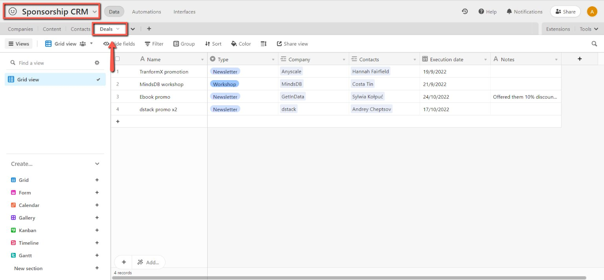
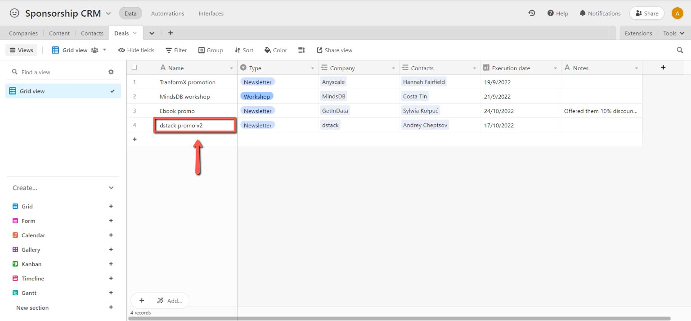
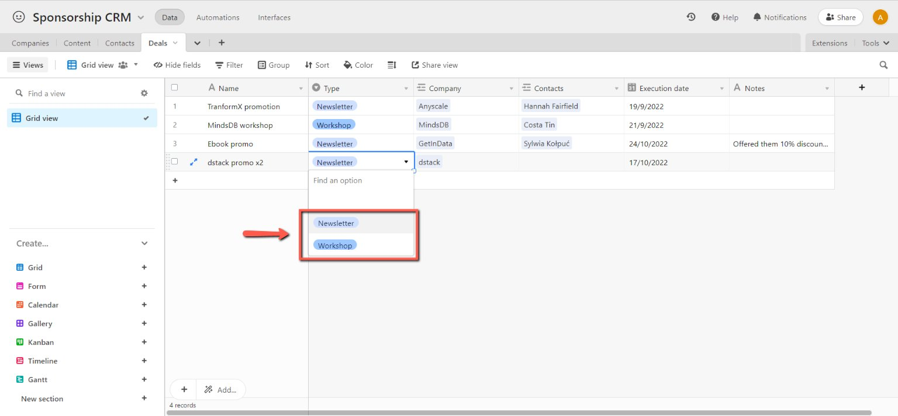
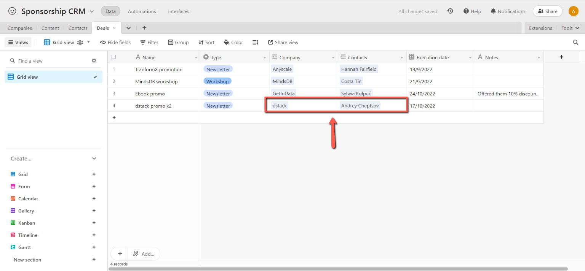
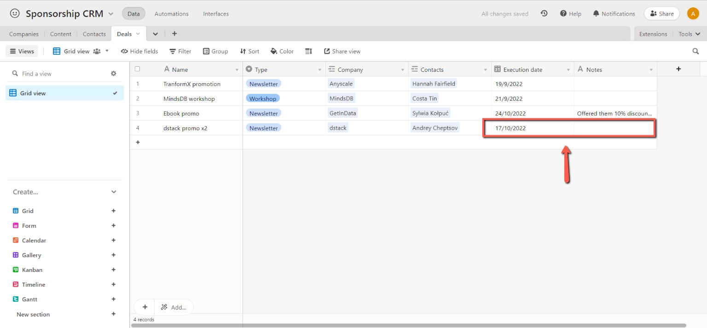

# Adding Deals in CRM Table

<!-- sop-section-start: summary -->
## Summary

- Purpose: Add sponsorship or promotion deals to the CRM deals table.
- Outcome: The deal record is created with type, company, date, and promotion details.
- Trigger: A new sponsorship, workshop, or newsletter promotion deal needs tracking.
- Frequency: As needed
<!-- sop-section-end -->

<!-- sop-section-start: prerequisites -->
## Prerequisites

- Access: Airtable CRM deals table.
- Tools: Airtable.
- Inputs: Company, deal type, promotion date, deal amount if known, and related content.
<!-- sop-section-end -->

<!-- sop-section-start: procedure -->
## Procedure

<!-- sop-prose-start -->
How to Add Deals in the CRM Table
This procedure will show you the steps on how to Add Deals in the CRM Table.

Step-by-step Instructions
<!-- sop-prose-end -->

<!-- sop-step-start id=1 -->
1.  The first thing you need to do is open the [“Deals” table](https://airtable.com/app0jPi5287VYvrii/tblUULkMSNoCcaefx/viwWf4ma0iv1yG785?blocks=hide) on CRM.

    <!-- sop-screenshot-start -->
    
    <!-- sop-caption-start -->
    This screenshot anchors the CRM update in Airtable CRM. Look for the red callout around "Deals", then update the record so the CRM data stays consistent.
    <!-- sop-caption-end -->
    <!-- sop-screenshot-end -->
<!-- sop-step-end -->

<!-- sop-step-start id=2 -->
2.  After, add the name/description of the deal.

    Note: Deals can be a newsletter promotion, workshop, and sponsorship. In this example, the deal is a newsletter promotion

    <!-- sop-screenshot-start -->
    
    <!-- sop-caption-start -->
    This screenshot anchors the CRM update in Airtable CRM. Look for the red callout around the highlighted table, record, field, status, or linked value, then update the record so the CRM data stays consistent.
    <!-- sop-caption-end -->
    <!-- sop-screenshot-end -->
<!-- sop-step-end -->

<!-- sop-step-start id=3 -->
3.  Then, add the type of the deal by clicking the drag down button.

    Note: Since it’s a newsletter promotion, click “Newsletter”
    <!-- sop-screenshot-start -->
    
    <!-- sop-caption-start -->
    This screenshot anchors the CRM update in Airtable CRM. Look for the red callout around "Newsletter", then update the record so the CRM data stays consistent.
    <!-- sop-caption-end -->
    <!-- sop-screenshot-end -->
<!-- sop-step-end -->

<!-- sop-step-start id=4 -->
4.  Next, add the company and the contact person of the company.

    <!-- sop-screenshot-start -->
    
    <!-- sop-caption-start -->
    This screenshot anchors the CRM update in Airtable CRM. Look for the red callout around the highlighted table, record, field, status, or linked value, then update the record so the CRM data stays consistent.
    <!-- sop-caption-end -->
    <!-- sop-screenshot-end -->
<!-- sop-step-end -->

<!-- sop-step-start id=5 -->
5.  Lastly, enter the execution date or when will the newsletter or workshop will happen. You can also add comments on the “Notes” column.

    Note: In this example, the promotion happened last Oct 17.
    <!-- sop-screenshot-start -->
    
    <!-- sop-caption-start -->
    This screenshot anchors the CRM update in Airtable CRM. Look for the red callout around "Notes", then update the record so the CRM data stays consistent.
    <!-- sop-caption-end -->
    <!-- sop-screenshot-end -->
<!-- sop-step-end -->
<!-- sop-section-end -->

<!-- sop-section-start: validation -->
## Validation

-
<!-- sop-section-end -->

<!-- sop-section-start: troubleshooting -->
## Troubleshooting

-
<!-- sop-section-end -->

<!-- sop-section-start: references -->
## References

-
<!-- sop-section-end -->
