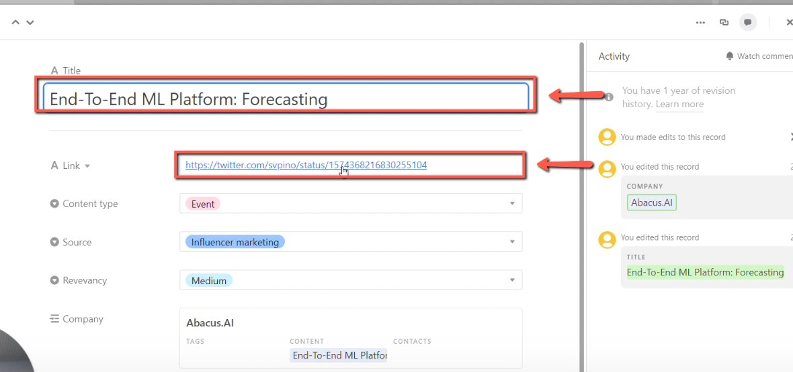
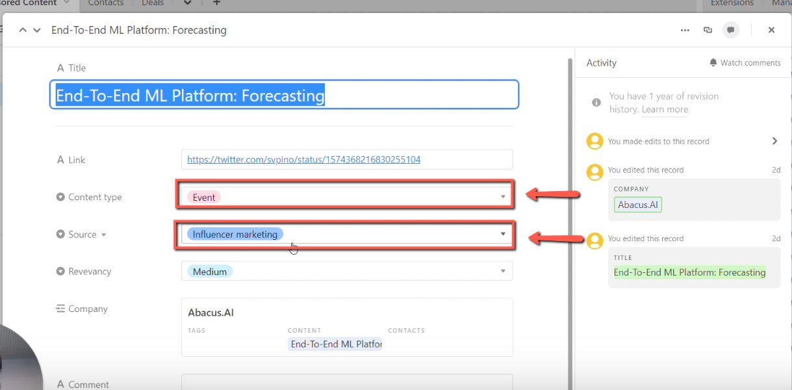
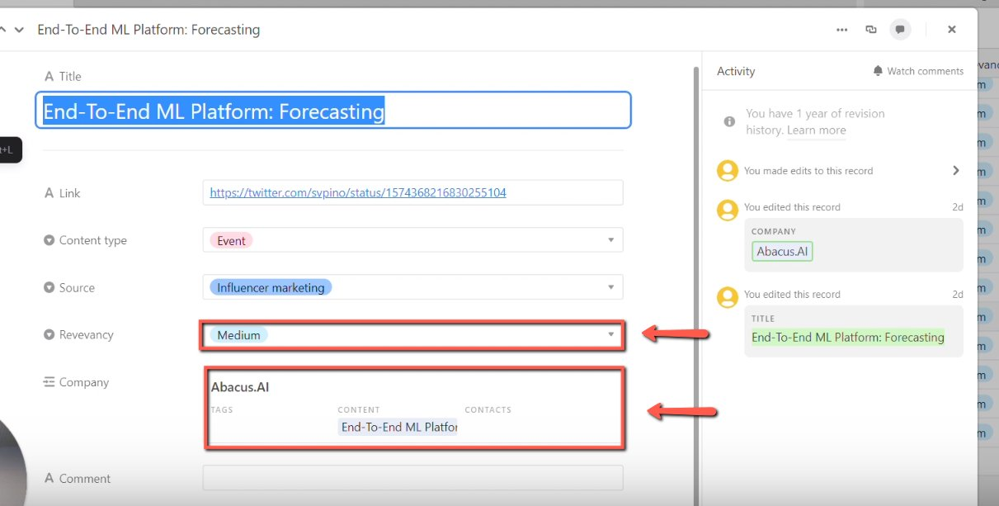

# Adding influencer marketing content to the CRM

<!-- sop-section-start: summary -->
## Summary

- Purpose: Add influencer marketing content to the CRM.
- Outcome: The sponsored content record is created with influencer marketing as the source.
- Trigger: A sponsor pays for influencer marketing content.
- Frequency: As needed
<!-- sop-section-end -->

<!-- sop-section-start: prerequisites -->
## Prerequisites

- Access: Sponsorship CRM.
- Tools: Airtable.
- Inputs: Sponsored content name, link, sponsor, source, and content type.
<!-- sop-section-end -->

<!-- sop-section-start: procedure -->
## Procedure

<!-- sop-prose-start -->
How to Add Influencer Marketing Content to the CRM
This procedure will show you the steps on how to Add Influencer Marketing Content to the CRM. Marketing Inluencer are being paid by the sponsor to the the Marketing Content for their brand or product.

Step-by-step Instructions
<!-- sop-prose-end -->

<!-- sop-step-start id=1 -->
1.  The first thing you need to do is add the name and link of the sponsored content under the “Name” and “Link” column.

    <!-- sop-screenshot-start -->
    
    <!-- sop-caption-start -->
    This screenshot anchors the CRM update in Airtable CRM. Look for the red callout around "Link", then update the record so the CRM data stays consistent.
    <!-- sop-caption-end -->
    <!-- sop-screenshot-end -->
<!-- sop-step-end -->

<!-- sop-step-start id=2 -->
2.  After, add the content type and the source of the content.

    Note: Since it is an influencer who promoted the content, the source is “Influencer Marketing”
    <!-- sop-screenshot-start -->
    
    <!-- sop-caption-start -->
    This screenshot anchors the CRM update in Airtable CRM. Look for the red callout around "Influencer Marketing", then update the record so the CRM data stays consistent.
    <!-- sop-caption-end -->
    <!-- sop-screenshot-end -->
<!-- sop-step-end -->

<!-- sop-step-start id=3 -->
3.  Lastly, add the Relevancy and the company who sponsored the content.

    <!-- sop-screenshot-start -->
    
    <!-- sop-caption-start -->
    This screenshot anchors the CRM update in Airtable CRM. Look for the red callout around the highlighted table, record, field, status, or linked value, then update the record so the CRM data stays consistent.
    <!-- sop-caption-end -->
    <!-- sop-screenshot-end -->
<!-- sop-step-end -->
<!-- sop-section-end -->

<!-- sop-section-start: validation -->
## Validation

-
<!-- sop-section-end -->

<!-- sop-section-start: troubleshooting -->
## Troubleshooting

-
<!-- sop-section-end -->

<!-- sop-section-start: references -->
## References

-
<!-- sop-section-end -->
