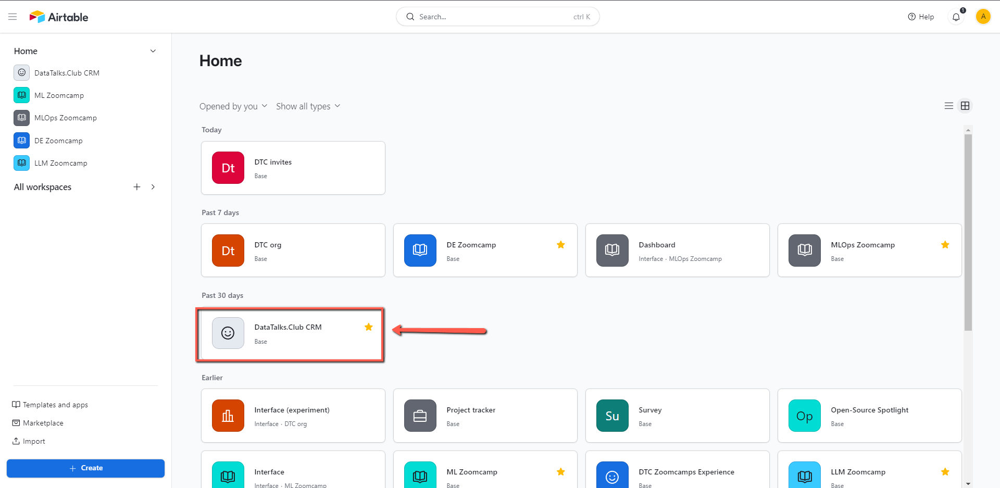
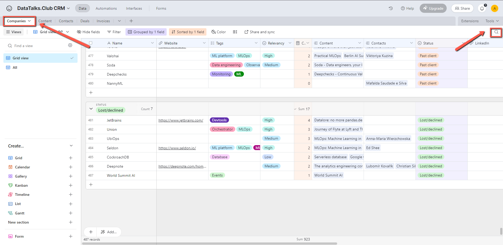
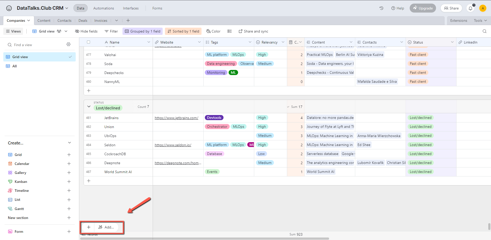
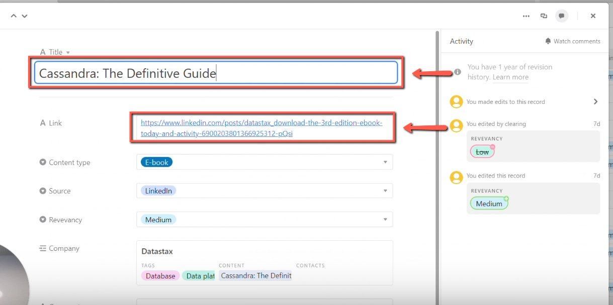
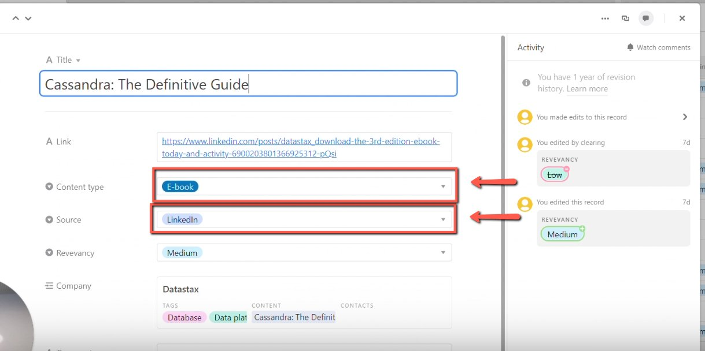
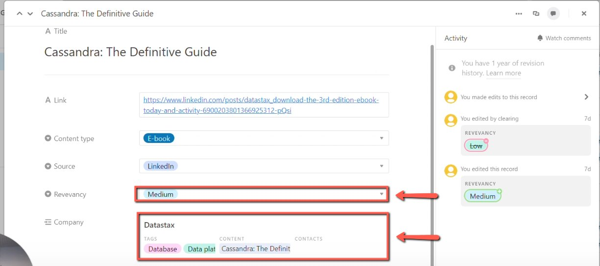
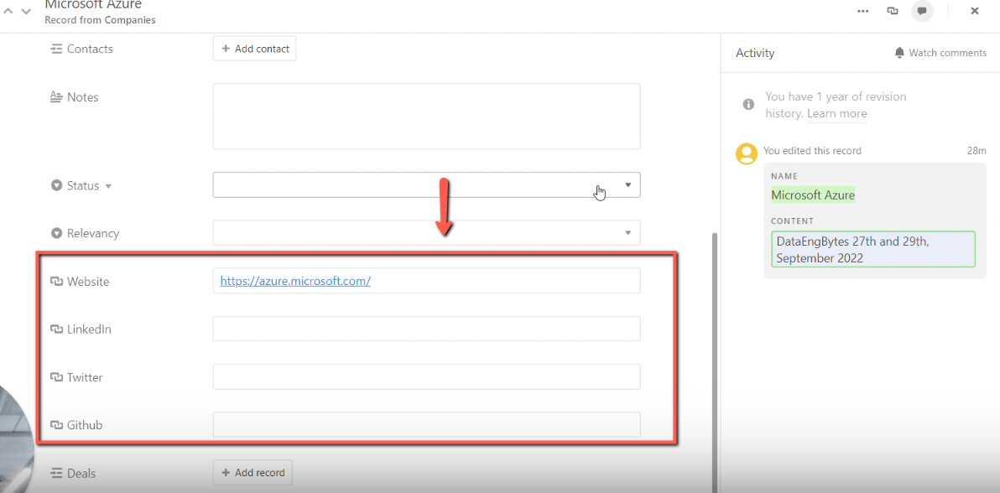
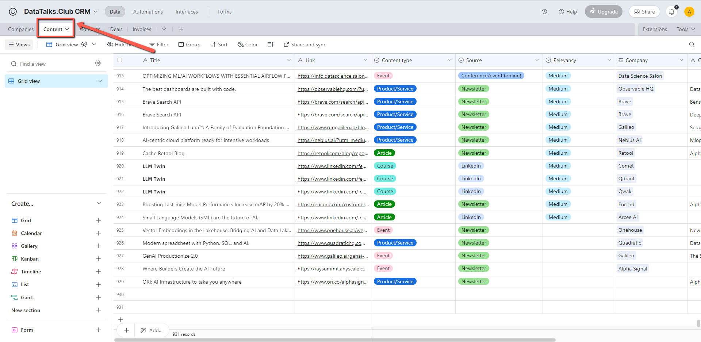
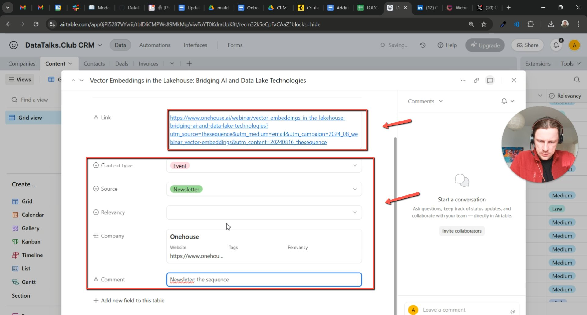
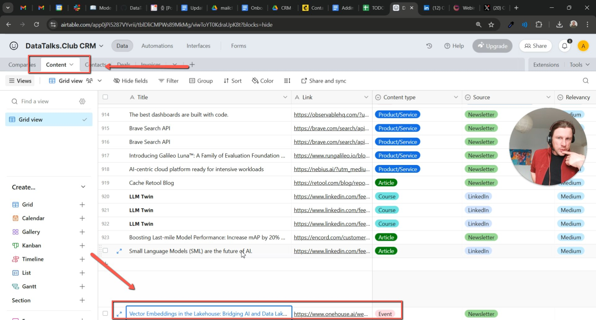

# Adding promoted content to the sponsorship CRM

<!-- sop-section-start: summary -->
## Summary

- Purpose: Adding sponsored content to our CRM
- Outcome: We want to keep track of what companies promote so we can sell them sponsorship
- Trigger: When you get a TODO about some promoted content from a newsletter, social media, etc
- Frequency: As needed
<!-- sop-section-end -->

<!-- sop-section-start: prerequisites -->
## Prerequisites

- Access: Airtable sponsorship CRM and source content.
- Tools: Airtable, LinkedIn or source platform.
- Inputs: Content link, sponsor/company name, content type, source, and company details.
<!-- sop-section-end -->

<!-- sop-section-start: procedure -->
## Procedure

<!-- sop-group-start: "Create a New Company Record" -->
### Create a New Company Record

<!-- sop-step-start id=1 -->
1.  Open the CRM database in Airtable [https://airtable.com/](https://airtable.com/)

    <!-- sop-screenshot-start -->
    
    <!-- sop-caption-start -->
    This screenshot anchors the CRM update in Airtable CRM. Look for the red callout around the highlighted table, record, field, status, or linked value, then update the record so the CRM data stays consistent.
    <!-- sop-caption-end -->
    <!-- sop-screenshot-end -->
<!-- sop-step-end -->

<!-- sop-step-start id=2 -->
2.  Select the “Companies” section and search if there is already an existing record of the company.

    Note: If there is no existing record proceed to the next step

    <!-- sop-screenshot-start -->
    
    <!-- sop-caption-start -->
    This screenshot anchors the CRM update in Airtable CRM. Look for the red callout around "Companies", then update the record so the CRM data stays consistent.
    <!-- sop-caption-end -->
    <!-- sop-screenshot-end -->
<!-- sop-step-end -->

<!-- sop-step-start id=3 -->
3.  Look for the “Add” button on the lower left side of the screen and click to add.

    <!-- sop-screenshot-start -->
    
    <!-- sop-caption-start -->
    This screenshot anchors the CRM update in Airtable CRM. Look for the red callout around "Add", then update the record so the CRM data stays consistent.
    <!-- sop-caption-end -->
    <!-- sop-screenshot-end -->
<!-- sop-step-end -->

<!-- sop-step-start id=4 -->
4.  A new record would be created and select the “Expand” button on the side. A tab would appear where you are tasked to provide information, add the name and the link of the sponsored content on the corresponding lines.

    <!-- sop-screenshot-start -->
    
    <!-- sop-caption-start -->
    This screenshot anchors the CRM update in Airtable CRM. Look for the red callout around "Expand", then update the record so the CRM data stays consistent.
    <!-- sop-caption-end -->
    <!-- sop-screenshot-end -->
<!-- sop-step-end -->

<!-- sop-step-start id=5 -->
5.  After, add the content type and the source of the sponsored content

    Note: SInce this is an ebook, the content type is ebook and the source on where you can view it, is on LinkedIn. For Organic contents, these are content that they are promoting through newsletter, LinkedIn post, and other social media platforms.

    <!-- sop-screenshot-start -->
    
    <!-- sop-caption-start -->
    This screenshot anchors the CRM update in Airtable CRM. Look for the red callout around the highlighted table, record, field, status, or linked value, then update the record so the CRM data stays consistent.
    <!-- sop-caption-end -->
    <!-- sop-screenshot-end -->
<!-- sop-step-end -->

<!-- sop-step-start id=6 -->
6.  Then, add the Relevancy and the company who sponsored the content on LinkedIn.

    Note: Don’t forget to add the sponsor’s website and other information

    <!-- sop-screenshot-start -->
    
    <!-- sop-caption-start -->
    This screenshot anchors the CRM update in Airtable CRM. Look for the red callout around the highlighted table, record, field, status, or linked value, then update the record so the CRM data stays consistent.
    <!-- sop-caption-end -->
    <!-- sop-screenshot-end -->

    <!-- sop-screenshot-start -->
    
    <!-- sop-caption-start -->
    This screenshot anchors the CRM update in Airtable CRM. Look for the red callout around the highlighted table, record, field, status, or linked value, then update the record so the CRM data stays consistent.
    <!-- sop-caption-end -->
    <!-- sop-screenshot-end -->
<!-- sop-step-end -->

<!-- sop-group-end -->

<!-- sop-group-start: "Add Content for the Company" -->
### Add Content for the Company

<!-- sop-step-start id=7 -->
7.  After saving the company, navigate back to home and click the “Content” section in the CRM.

    <!-- sop-screenshot-start -->
    
    <!-- sop-caption-start -->
    This screenshot anchors the CRM update in Airtable CRM. Look for the red callout around "Content", then update the record so the CRM data stays consistent.
    <!-- sop-caption-end -->
    <!-- sop-screenshot-end -->
<!-- sop-step-end -->

<!-- sop-step-start id=8 -->
8.  Click on “Add Record” on the bottom of the screen and expand to create a new content record.

    <!-- sop-screenshot-start -->
    
    <!-- sop-caption-start -->
    This screenshot anchors the CRM update in Airtable CRM. Look for the red callout around "Add Record", then update the record so the CRM data stays consistent.
    <!-- sop-caption-end -->
    <!-- sop-screenshot-end -->
<!-- sop-step-end -->

<!-- sop-step-start id=9 -->
9.  Expand the record fields and input the following information. Add the direct link to the content, add the Content Type, choose the relevant type. For a webinar, select “Event.” Select the content source. For example, “Newsletter” if it was shared via a newsletter.For “Comment”, enter a brief description, such as the name of the newsletter source.

    <!-- sop-screenshot-start -->
    
    <!-- sop-caption-start -->
    This screenshot anchors the CRM update in Airtable CRM. Look for the red callout around "Comment", then update the record so the CRM data stays consistent.
    <!-- sop-caption-end -->
    <!-- sop-screenshot-end -->
<!-- sop-step-end -->

<!-- sop-step-start id=10 -->
10.  Click “Save” and verify that the content record is added under the company.

     <!-- sop-screenshot-start -->
     
     <!-- sop-caption-start -->
     This screenshot anchors the CRM update in Airtable CRM. Look for the red callout around "Save", then update the record so the CRM data stays consistent.
     <!-- sop-caption-end -->
     <!-- sop-screenshot-end -->

     Loom links:
<!-- sop-step-end -->

<!-- sop-group-end -->
<!-- sop-section-end -->

<!-- sop-section-start: validation -->
## Validation

-
<!-- sop-section-end -->

<!-- sop-section-start: troubleshooting -->
## Troubleshooting

-
<!-- sop-section-end -->

<!-- sop-section-start: references -->
## References

-
<!-- sop-section-end -->
