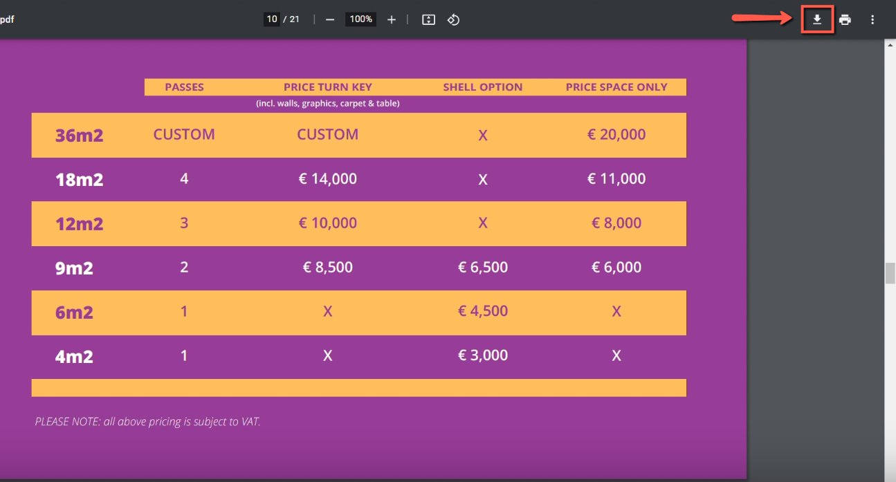
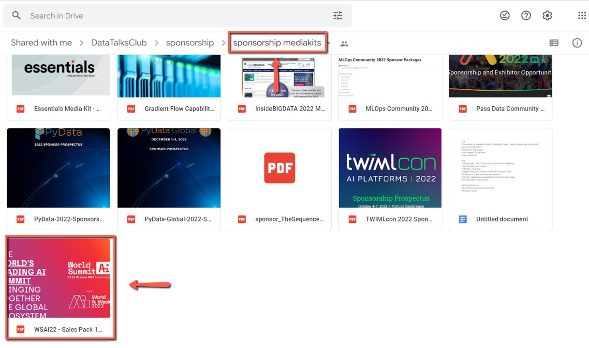

# Downloading the Mediakits from Sponsors

<!-- sop-section-start: summary -->
## Summary

- Purpose: Download sponsor media kits from the CRM or sponsor record.
- Outcome: The sponsor media kit file is downloaded for review or use.
- Trigger: A sponsor media kit is needed.
- Frequency: As needed
<!-- sop-section-end -->

<!-- sop-section-start: prerequisites -->
## Prerequisites

- Access: Sponsor record or media kit source.
- Tools: Browser.
- Inputs: Sponsor record and media kit download link.
<!-- sop-section-end -->

<!-- sop-section-start: procedure -->
## Procedure

<!-- sop-prose-start -->
How to Download the Mediakits from Sponsors
This procedure will show you the steps on how to Download the Mediakits from Sponsors

Step-by-step Instructions
<!-- sop-prose-end -->

<!-- sop-step-start id=1 -->
1.  The first thing you need to do is click the downlaod icon of the mediakit at the upper-right of your screen.

    <!-- sop-screenshot-start -->
    
    <!-- sop-caption-start -->
    This screenshot anchors the CRM update in Airtable CRM. Look for the red callout around the highlighted table, record, field, status, or linked value, then update the record so the CRM data stays consistent.
    <!-- sop-caption-end -->
    <!-- sop-screenshot-end -->
<!-- sop-step-end -->

<!-- sop-step-start id=2 -->
2.  Once done, open the [mediakit folder](https://drive.google.com/drive/folders/1y9nNwajgMgvv-ZYpaI_hdXnbMu07I_fQ?usp=sharing) in google drive and upload the mediakit downloaded.

    <!-- sop-screenshot-start -->
    
    <!-- sop-caption-start -->
    This screenshot anchors the CRM update in Airtable CRM. Look for the red callout around the highlighted table, record, field, status, or linked value, then update the record so the CRM data stays consistent.
    <!-- sop-caption-end -->
    <!-- sop-screenshot-end -->
<!-- sop-step-end -->
<!-- sop-section-end -->

<!-- sop-section-start: validation -->
## Validation

-
<!-- sop-section-end -->

<!-- sop-section-start: troubleshooting -->
## Troubleshooting

-
<!-- sop-section-end -->

<!-- sop-section-start: references -->
## References

-
<!-- sop-section-end -->
