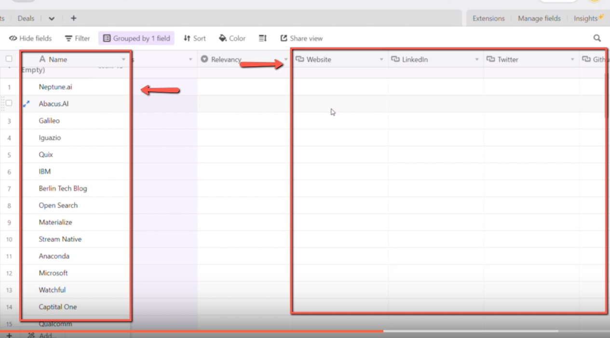
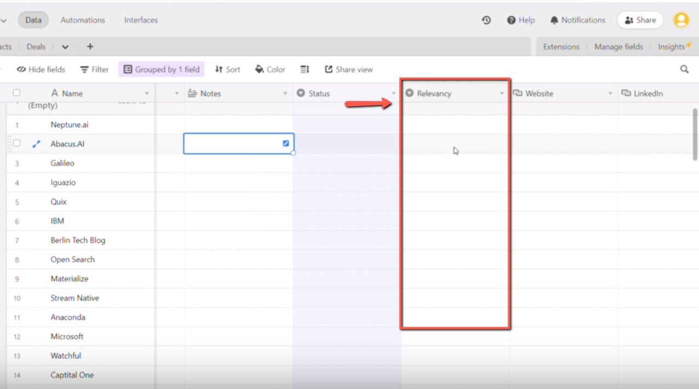

# Filling in the missing fields in the Companies table on CRM

<!-- sop-section-start: summary -->
## Summary

- Purpose: Complete missing company fields in the CRM companies table.
- Outcome: Company records include available website, social, and profile details.
- Trigger: A company record is missing required CRM fields.
- Frequency: As needed
<!-- sop-section-end -->

<!-- sop-section-start: prerequisites -->
## Prerequisites

- Access: CRM companies table and public company profiles.
- Tools: Airtable, LinkedIn, GitHub, Twitter, company website.
- Inputs: Company name and available public profile links.
<!-- sop-section-end -->

<!-- sop-section-start: procedure -->
## Procedure

<!-- sop-prose-start -->
How to Fill in the missing fields in the "Companies" table on CRM
This procedure will show you the steps on How to Fill in the missing fields in the "Companies" table on CRM

Step-by-step Instructions
<!-- sop-prose-end -->

<!-- sop-step-start id=1 -->
1.  The first thing you need to do is enter the name of the company under “Name” column on “Companies” table and then add necessary information of the company (LinkedIn, Website, Twitter, Github, etc.)

    <!-- sop-screenshot-start -->
    
    <!-- sop-caption-start -->
    This screenshot anchors the CRM update in Airtable CRM. Look for the red callout around "Companies", then update the record so the CRM data stays consistent.
    <!-- sop-caption-end -->
    <!-- sop-screenshot-end -->
<!-- sop-step-end -->

<!-- sop-step-start id=2 -->
2.  After, add the relevancy of the company.

    <!-- sop-screenshot-start -->
    
    <!-- sop-caption-start -->
    This screenshot anchors the CRM update in Airtable CRM. Look for the red callout around the highlighted table, record, field, status, or linked value, then update the record so the CRM data stays consistent.
    <!-- sop-caption-end -->
    <!-- sop-screenshot-end -->
<!-- sop-step-end -->
<!-- sop-section-end -->

<!-- sop-section-start: validation -->
## Validation

-
<!-- sop-section-end -->

<!-- sop-section-start: troubleshooting -->
## Troubleshooting

-
<!-- sop-section-end -->

<!-- sop-section-start: references -->
## References

-
<!-- sop-section-end -->
