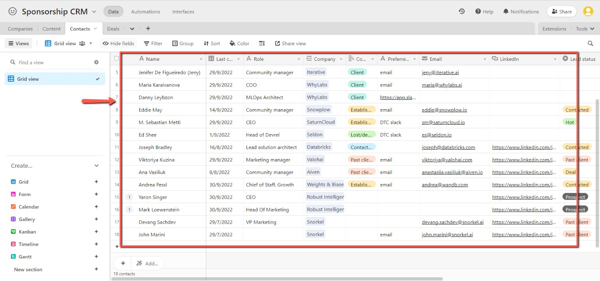
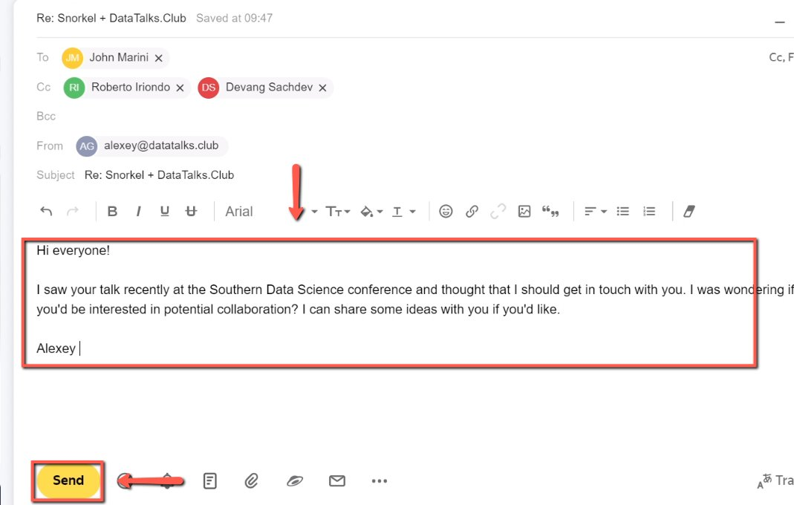

# Getting in touch with past clients

<!-- sop-section-start: summary -->
## Summary

- Purpose: Contact past clients about future sponsorship opportunities.
- Outcome: Past clients are identified and contacted from the CRM.
- Trigger: Past clients should be re-engaged for sales outreach.
- Frequency: As needed
<!-- sop-section-end -->

<!-- sop-section-start: prerequisites -->
## Prerequisites

- Access: CRM Airtable and outreach channel.
- Tools: Airtable, email or LinkedIn.
- Inputs: Past client records, contact details, and outreach message.
<!-- sop-section-end -->

<!-- sop-section-start: procedure -->
## Procedure

<!-- sop-prose-start -->
How to Get in touch with past clients
This procedure will show you the steps on how to Get in touch with past clients

Step-by-step Instructions
<!-- sop-prose-end -->

<!-- sop-step-start id=1 -->
1.  The first thing you need to do is open the [CRM Airtable](https://airtable.com/app0jPi5287VYvrii/tblzNU6MCDMbvgDX4/viwRM0tpfR7YTCczb?blocks=hide) to view our past clients.

    <!-- sop-screenshot-start -->
    
    <!-- sop-caption-start -->
    This screenshot anchors the CRM update in LinkedIn. Look for the red callout around the highlighted table, record, field, status, or linked value, then update the record so the CRM data stays consistent.
    <!-- sop-caption-end -->
    <!-- sop-screenshot-end -->
<!-- sop-step-end -->

<!-- sop-step-start id=2 -->
2.  Once you select the client, reach out to them via email. You can copy the [template](https://docs.google.com/document/d/1WE6CPH90wqvwFStj_xQa_ebSKItpOVAzPjzK370yTQY/edit?usp=sharing). After, click “Send”

    <!-- sop-screenshot-start -->
    
    <!-- sop-caption-start -->
    This screenshot supports the outreach step in LinkedIn. Look for the red callout around "Send", then confirm the recipient and message before sending.
    <!-- sop-caption-end -->
    <!-- sop-screenshot-end -->
<!-- sop-step-end -->
<!-- sop-section-end -->

<!-- sop-section-start: validation -->
## Validation

-
<!-- sop-section-end -->

<!-- sop-section-start: troubleshooting -->
## Troubleshooting

-
<!-- sop-section-end -->

<!-- sop-section-start: references -->
## References

-
<!-- sop-section-end -->
