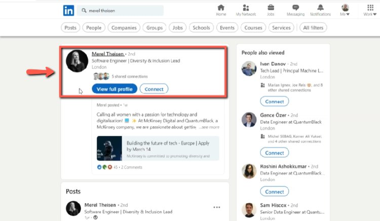
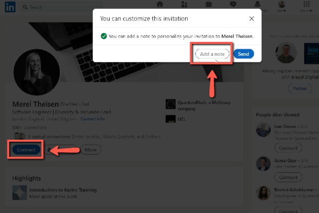
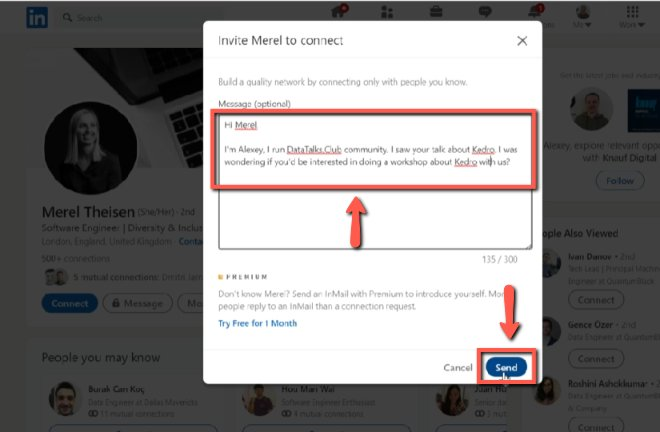

# Reach out to speakers that Alexey finds in other events

<!-- sop-section-start: summary -->
## Summary

- Purpose:
- Outcome:
- Trigger:
- Frequency:
<!-- sop-section-end -->

<!-- sop-section-start: prerequisites -->
## Prerequisites

- Access:
- Tools:
- Inputs:
<!-- sop-section-end -->

<!-- sop-section-start: procedure -->
## Procedure

<!-- sop-prose-start -->
How to reach out to speakers that Alexey find in other events
This procedure will show you the steps on how to reach out to speakers that Alexey find in other events.

Step-by-step Instructions
<!-- sop-prose-end -->

<!-- sop-step-start id=1 -->
1.  The first thing you need to do is find the LinkedIn account of the potential guest.

    <!-- sop-screenshot-start -->
    
    <!-- sop-caption-start -->
    This screenshot supports the outreach step in LinkedIn. Look for the red callout around the highlighted profile, connection button, message field, or send control, then confirm the recipient and message before sending.
    <!-- sop-caption-end -->
    <!-- sop-screenshot-end -->
<!-- sop-step-end -->

<!-- sop-step-start id=2 -->
2.  Once you are in his/her LinkedIn profile, click "Connect" and select "Add a note"

    <!-- sop-screenshot-start -->
    
    <!-- sop-caption-start -->
    This screenshot supports the outreach step in LinkedIn. Look for the red callout around "Add a note", then confirm the recipient and message before sending.
    <!-- sop-caption-end -->
    <!-- sop-screenshot-end -->
<!-- sop-step-end -->

<!-- sop-step-start id=3 -->
3.  And now, add a note/message for the person and then click "Send”

    <!-- sop-screenshot-start -->
    
    <!-- sop-caption-start -->
    This screenshot supports the outreach step in LinkedIn. Look for the red callout around "Send", then confirm the recipient and message before sending.
    <!-- sop-caption-end -->
    <!-- sop-screenshot-end -->
<!-- sop-step-end -->
<!-- sop-section-end -->

<!-- sop-section-start: validation -->
## Validation

-
<!-- sop-section-end -->

<!-- sop-section-start: troubleshooting -->
## Troubleshooting

-
<!-- sop-section-end -->

<!-- sop-section-start: references -->
## References

-
<!-- sop-section-end -->
