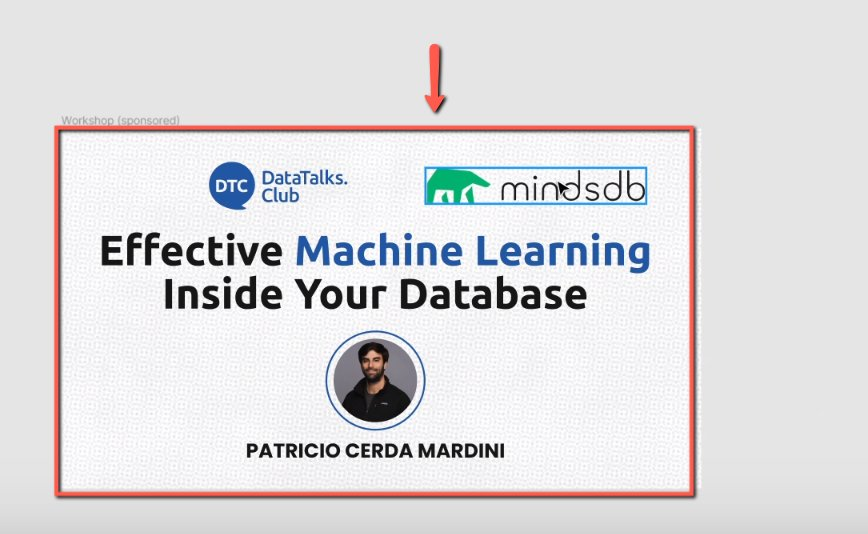
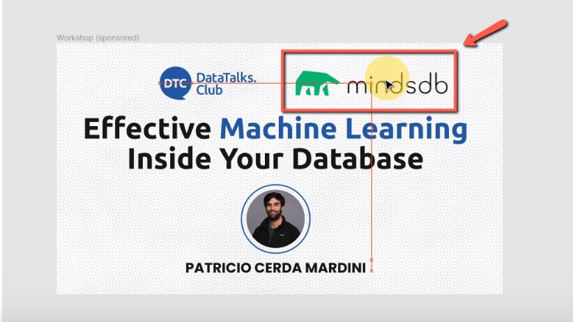

# Aligning the logos for the sponsored events banners

<!-- sop-section-start: summary -->
## Summary

- Purpose: Align sponsor and DataTalks.Club logos on sponsored event banners.
- Outcome: The logos are centered and visually aligned in the banner.
- Trigger: A sponsored event banner needs logo alignment.
- Frequency: Whenever sponsored event banners are prepared or adjusted.
<!-- sop-section-end -->

<!-- sop-section-start: prerequisites -->
## Prerequisites

- Access: Figma event banner file.
- Tools: Figma.
- Inputs: Sponsored event banner and logos to align.
<!-- sop-section-end -->

<!-- sop-section-start: procedure -->
## Procedure

<!-- sop-prose-start -->
How to Align the logos for the sponsored event banners
This procedure will show you the steps on how to Align the logos for the sponsored event banners.

Step-by-step Instructions
<!-- sop-prose-end -->

<!-- sop-step-start id=1 -->
1.  The first thing you need to do is open, Figma and then, select an image.

    <!-- sop-screenshot-start -->
    
    <!-- sop-caption-start -->
    This screenshot anchors step 1 of the Aligning the logos for the sponsored events banners process by showing the screen for open, Figma and then, select an image. Look for the red box or arrow around Open, then use that highlighted area as the target for the action before continuing.
    <!-- sop-caption-end -->
    <!-- sop-screenshot-end -->
<!-- sop-step-end -->

<!-- sop-step-start id=2 -->
2.  On the image, click the logo or icon you want to move and then drag the logo in the center, aligned with the DataTalks.Club’s logo.

    <!-- sop-screenshot-start -->
    
    <!-- sop-caption-start -->
    This screenshot anchors step 2 of the Aligning the logos for the sponsored events banners process by showing the screen for on the image, click the logo or icon you want to move and then drag the logo in the center, aligned with the. Look for the red box, arrow, selected row, or highlighted screen area, then use that highlighted area as the target for the action before continuing.
    <!-- sop-caption-end -->
    <!-- sop-screenshot-end -->
<!-- sop-step-end -->

<!-- sop-step-start id=3 -->
3.  Lastly, adjust the logos in the center.

    <!-- sop-screenshot-start -->
    
    <!-- sop-caption-start -->
    This screenshot anchors step 3 of the Aligning the logos for the sponsored events banners process by showing the screen for adjust the logos in the center. Look for the red box, arrow, selected row, or highlighted screen area, then use that highlighted area as the target for the action before continuing.
    <!-- sop-caption-end -->
    <!-- sop-screenshot-end -->
<!-- sop-step-end -->
<!-- sop-section-end -->

<!-- sop-section-start: validation -->
## Validation

-
<!-- sop-section-end -->

<!-- sop-section-start: troubleshooting -->
## Troubleshooting

-
<!-- sop-section-end -->

<!-- sop-section-start: references -->
## References

-
<!-- sop-section-end -->
