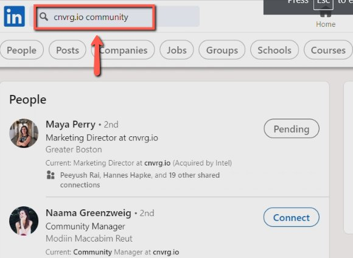
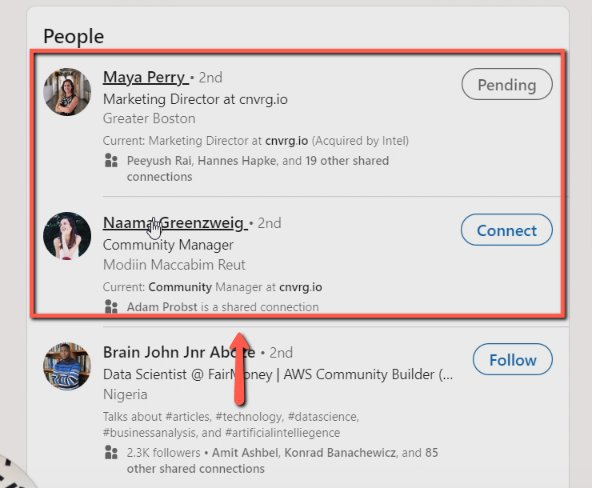
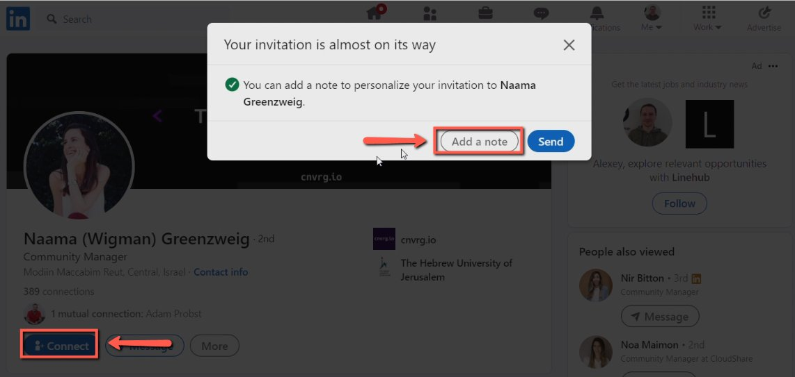
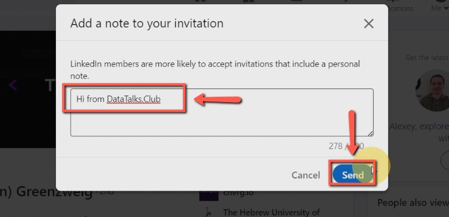
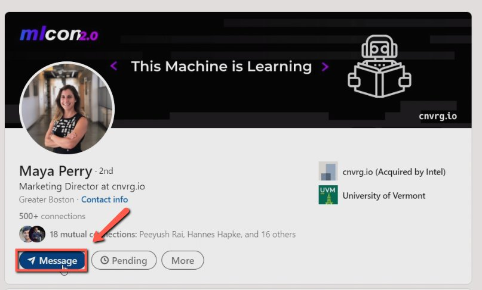
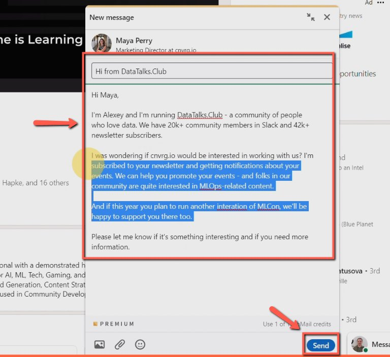

# Cold outreach via LinkedIn inmails to prospective clients sponsors

<!-- sop-section-start: summary -->
## Summary

- Purpose: Reach out to prospective sponsors through LinkedIn InMail.
- Outcome: Relevant sponsor contacts receive a connection note or message.
- Trigger: A new prospective sponsor lead is identified.
- Frequency: As needed
<!-- sop-section-end -->

<!-- sop-section-start: prerequisites -->
## Prerequisites

- Access: LinkedIn and the outreach message template.
- Tools: LinkedIn.
- Inputs: Company name, target contact, lead source, and outreach template.
<!-- sop-section-end -->

<!-- sop-section-start: procedure -->
## Procedure

<!-- sop-prose-start -->
How to Cold outreach via LinkedIn in mails to prospective clients/sponsors
This procedure will show you the steps on how to Cold outreach via LinkedIn inmails to prospective clients/sponsors

Step-by-step Instructions
<!-- sop-prose-end -->

<!-- sop-step-start id=1 -->
1.  The first thing you need to do is copy the name of the the company

    Note: We usually get our leads from a subscribed newsletter

    <!-- sop-screenshot-start -->
    
    <!-- sop-caption-start -->
    This screenshot anchors the CRM update in LinkedIn. Look for the red callout around the highlighted table, record, field, status, or linked value, then update the record so the CRM data stays consistent.
    <!-- sop-caption-end -->
    <!-- sop-screenshot-end -->
<!-- sop-step-end -->

<!-- sop-step-start id=2 -->
2.  And then, paste the name of the company on LinkedIn and add the word “community” on the search box.

    <!-- sop-screenshot-start -->
    
    <!-- sop-caption-start -->
    This screenshot anchors the CRM update in LinkedIn. Look for the red callout around "community", then update the record so the CRM data stays consistent.
    <!-- sop-caption-end -->
    <!-- sop-screenshot-end -->
<!-- sop-step-end -->

<!-- sop-step-start id=3 -->
3.  Once done, click on the names of the person to reach out.

    Note: Persons that are community managers or Marketing Directors of the community
    <!-- sop-screenshot-start -->
    
    <!-- sop-caption-start -->
    This screenshot anchors the CRM update in LinkedIn. Look for the red callout around the highlighted table, record, field, status, or linked value, then update the record so the CRM data stays consistent.
    <!-- sop-caption-end -->
    <!-- sop-screenshot-end -->
<!-- sop-step-end -->

<!-- sop-step-start id=4 -->
4.  Next, click “Connect” on their profile and select “Add note”

    <!-- sop-screenshot-start -->
    
    <!-- sop-caption-start -->
    This screenshot anchors the CRM update in LinkedIn. Look for the red callout around "Add note", then update the record so the CRM data stays consistent.
    <!-- sop-caption-end -->
    <!-- sop-screenshot-end -->
<!-- sop-step-end -->

<!-- sop-step-start id=5 -->
5.  Then, enter the description and click “Send”

    Note: Description would be: “Hi from DataTalks.Club”
    <!-- sop-screenshot-start -->
    
    <!-- sop-caption-start -->
    This screenshot anchors the CRM update in LinkedIn. Look for the red callout around "Hi from DataTalks.Club", then update the record so the CRM data stays consistent.
    <!-- sop-caption-end -->
    <!-- sop-screenshot-end -->
<!-- sop-step-end -->

<!-- sop-step-start id=6 -->
6.  To write an email to lead, click “Message”

    <!-- sop-screenshot-start -->
    
    <!-- sop-caption-start -->
    This screenshot anchors the CRM update in LinkedIn. Look for the red callout around "Message", then update the record so the CRM data stays consistent.
    <!-- sop-caption-end -->
    <!-- sop-screenshot-end -->
<!-- sop-step-end -->

<!-- sop-step-start id=7 -->
7.  Enter the subject and the message and click “Send”

    Note: Follow this [template](https://docs.google.com/document/d/1Is4I4tku6_4fPmWjTx8HIzRKmiWPbV23RiOD079INIM/edit?tab=t.0).

    <!-- sop-screenshot-start -->
    
    <!-- sop-caption-start -->
    This screenshot anchors the CRM update in LinkedIn. Look for the red callout around "Send", then update the record so the CRM data stays consistent.
    <!-- sop-caption-end -->
    <!-- sop-screenshot-end -->
<!-- sop-step-end -->
<!-- sop-section-end -->

<!-- sop-section-start: validation -->
## Validation

-
<!-- sop-section-end -->

<!-- sop-section-start: troubleshooting -->
## Troubleshooting

-
<!-- sop-section-end -->

<!-- sop-section-start: references -->
## References

-
<!-- sop-section-end -->
