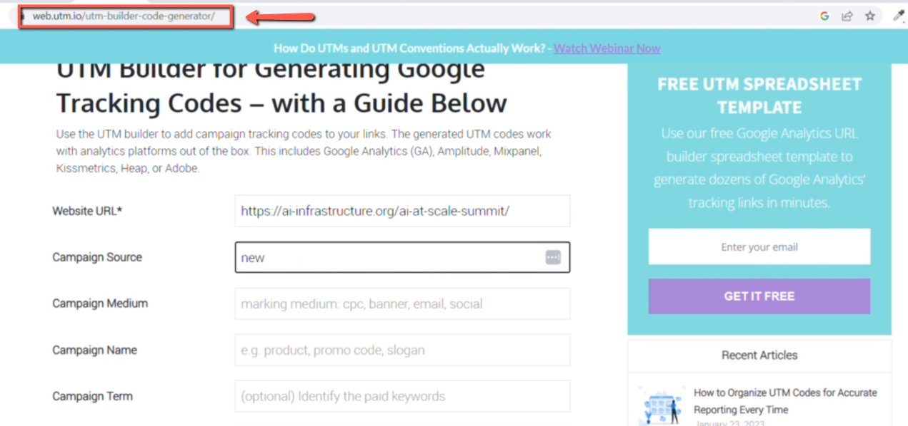
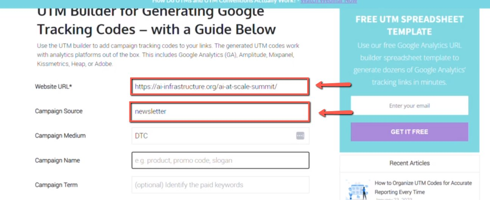
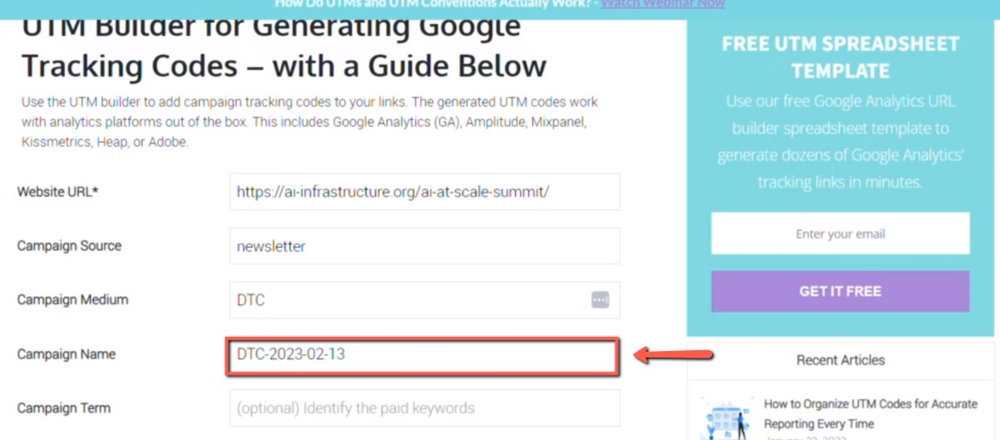
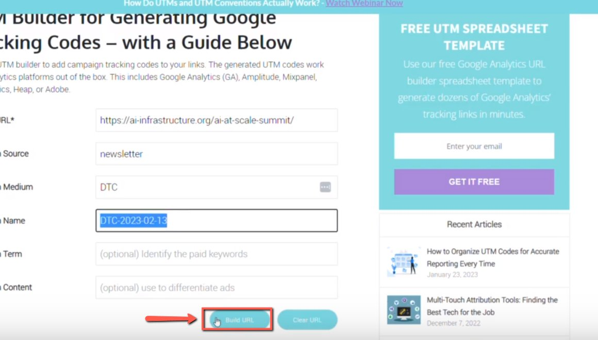
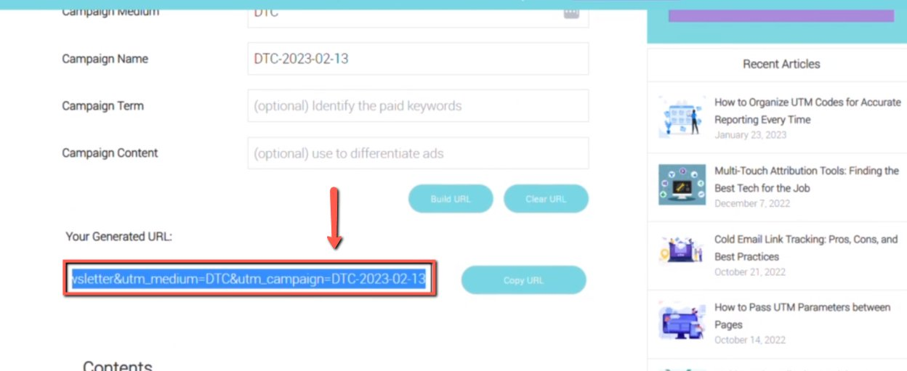

# Creating UTM Tags for Email Campaigns

<!-- sop-section-start: summary -->
## Summary

- Purpose: Create tracked URLs for sponsored email and social campaigns.
- Outcome: A UTM-tagged sponsor URL is generated and added to the sponsored document.
- Trigger: A sponsor link needs tracking for a campaign.
- Frequency: For each sponsored campaign link that needs UTM tracking.
<!-- sop-section-end -->

<!-- sop-section-start: prerequisites -->
## Prerequisites

- Access: Sponsor document and URL builder.
- Tools: UTM builder and sponsor document.
- Inputs: Sponsor URL, campaign source, medium, and campaign name.
<!-- sop-section-end -->

<!-- sop-section-start: procedure -->
## Procedure

<!-- sop-prose-start -->
How to Create UTM tags for Email Campaigns
This procedure will show you the steps on How to Create UTM Tags for Email Campaigns.

Step-by-step Instructions
<!-- sop-prose-end -->

<!-- sop-step-start id=1 -->
1.  The first thing you need to do is visit, [https://web.utm.io/utm-builder-code-generator/](https://web.utm.io/utm-builder-code-generator/)

    <!-- sop-screenshot-start -->
    
    <!-- sop-caption-start -->
    This screenshot anchors step 1 of the Creating UTM Tags for Email Campaigns process by showing the screen for visit, https://web.utm.io/utm builder code generator/. Look for the red box, arrow, selected row, or highlighted screen area, then use that highlighted area as the target for the action before continuing.
    <!-- sop-caption-end -->
    <!-- sop-screenshot-end -->
<!-- sop-step-end -->

<!-- sop-step-start id=2 -->
2.  And then, add the website URL given by the sponsor and the campaign source.

    Note: In here, since the source is newsletter campaign, add “newsletter” as the campaign source. If it’s LinkedIn or Twitter, it’s “Social”
    <!-- sop-screenshot-start -->
    
    <!-- sop-caption-start -->
    This screenshot anchors step 2 of the Creating UTM Tags for Email Campaigns process by showing the screen for , add the website URL given by the sponsor and the campaign source. Look for the red box or arrow around Add, then use that highlighted area as the target for the action before continuing.
    <!-- sop-caption-end -->
    <!-- sop-screenshot-end -->
<!-- sop-step-end -->

<!-- sop-step-start id=3 -->
3.  Then, add the campaign medium which is “DTC” and the campaign name as “DTC-\<YYYY\>-\<MM\>-\<DD\>

    Note: If the campaign is through Social Media, follow this format: “DTC-\<Name of Social Media”\> e.g. DTC-twitter

    <!-- sop-screenshot-start -->
    
    <!-- sop-caption-start -->
    This screenshot anchors step 3 of the Creating UTM Tags for Email Campaigns process by showing the screen for add the campaign medium which is "DTC" and the campaign name as "DTC \<YYYY\ \<MM\ \<DD\. Look for the red box or arrow around Add, then use that highlighted area as the target for the action before continuing.
    <!-- sop-caption-end -->
    <!-- sop-screenshot-end -->
<!-- sop-step-end -->

<!-- sop-step-start id=4 -->
4.  To generate the UTW, click “Build URL”

    <!-- sop-screenshot-start -->
    
    <!-- sop-caption-start -->
    This screenshot anchors step 4 of the Creating UTM Tags for Email Campaigns process by showing the screen for to generate the UTW, click "Build URL". Look for the red box or arrow around "Build URL", then use that highlighted area as the target for the action before continuing.
    <!-- sop-caption-end -->
    <!-- sop-screenshot-end -->
<!-- sop-step-end -->

<!-- sop-step-start id=5 -->
5.  Lastly, copy the URL and paste it on the sponsored document.

    <!-- sop-screenshot-start -->
    
    <!-- sop-caption-start -->
    This screenshot anchors step 5 of the Creating UTM Tags for Email Campaigns process by showing the screen for copy the URL and paste it on the sponsored document. Look for the red box, arrow, selected row, or highlighted screen area, then use that highlighted area as the target for the action before continuing.
    <!-- sop-caption-end -->
    <!-- sop-screenshot-end -->
<!-- sop-step-end -->
<!-- sop-section-end -->

<!-- sop-section-start: validation -->
## Validation

-
<!-- sop-section-end -->

<!-- sop-section-start: troubleshooting -->
## Troubleshooting

-
<!-- sop-section-end -->

<!-- sop-section-start: references -->
## References

-
<!-- sop-section-end -->
