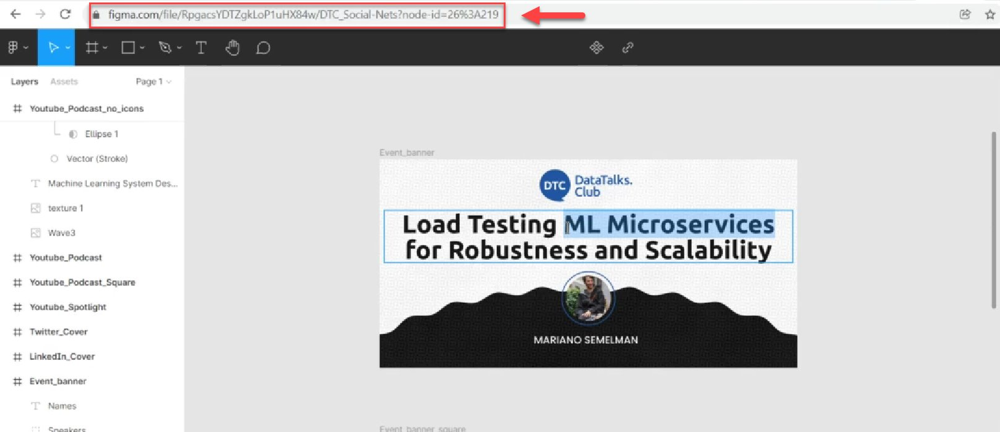
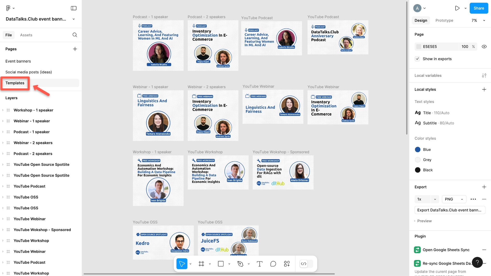
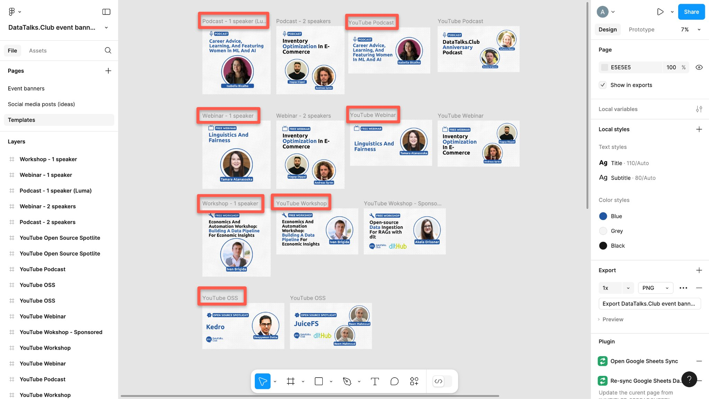
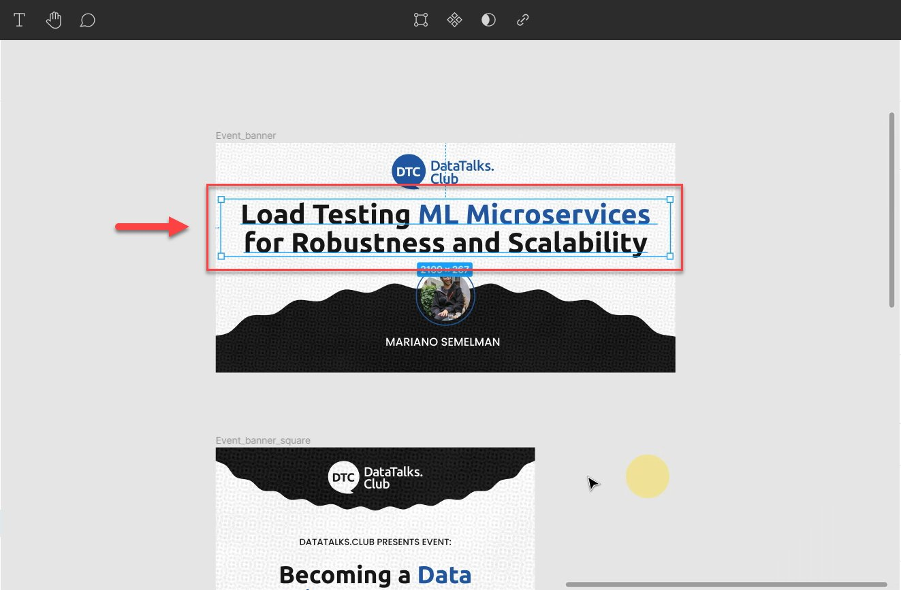
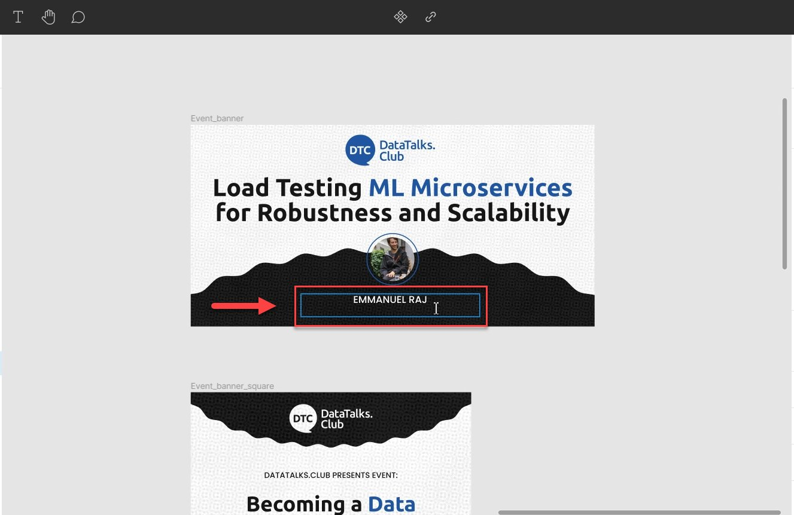
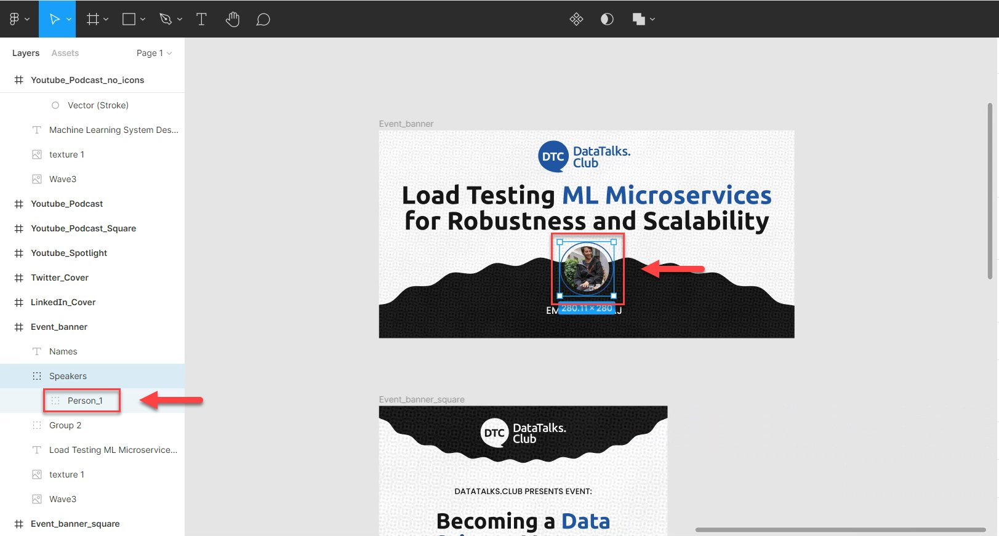
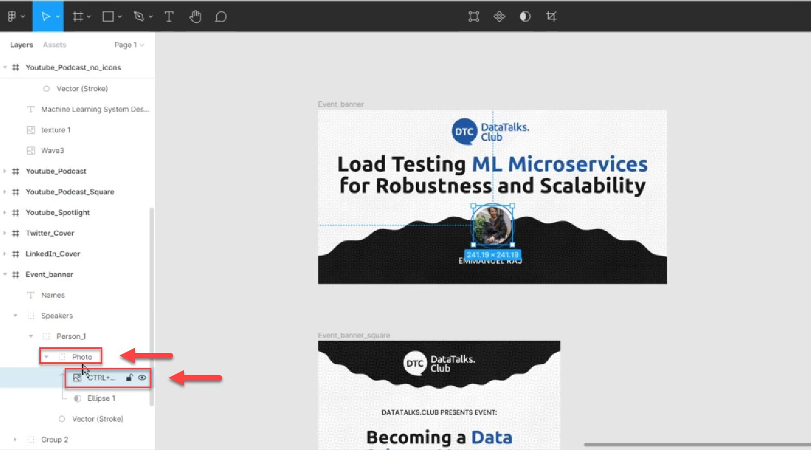
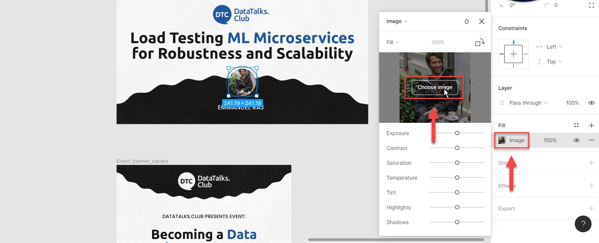
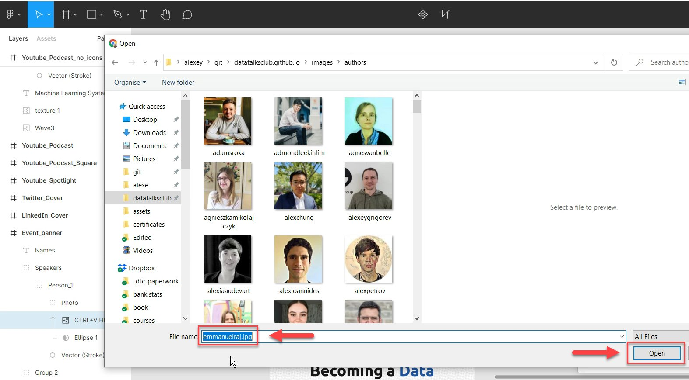
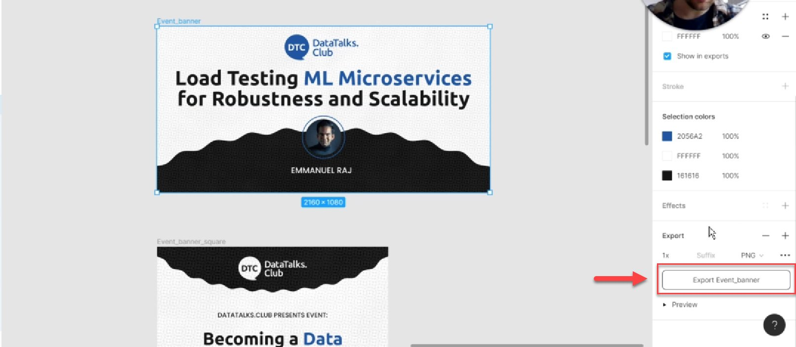

# How to use Figma for creating event banners

<!-- sop-section-start: summary -->
## Summary

- Purpose: Create event banners from DataTalks.Club Figma templates.
- Outcome: Event banner assets are updated with the event title, guest, image, and logos.
- Trigger: A new event needs banner images.
- Frequency: For each event that needs promotional banners.
<!-- sop-section-end -->

<!-- sop-section-start: prerequisites -->
## Prerequisites

- Access: DataTalks.Club event banners file in Figma.
- Tools: Figma and browser-based image sources.
- Inputs: Event title, event type, speaker name, speaker image, and sponsor logos when applicable.
<!-- sop-section-end -->

<!-- sop-section-start: procedure -->
## Procedure

<!-- sop-prose-start -->
How to use Figma for creating event banners
This procedure will show you the steps on how to use Figma for creating event banners.

Link: [https://www.figma.com/design/Q0752C6PS1AbIdY4bmRAFA/DataTalks.Club-event-banners?node-id=1237-227&node-type=canvas](https://www.figma.com/design/Q0752C6PS1AbIdY4bmRAFA/DataTalks.Club-event-banners?node-id=1237-227&node-type=canvas)

Step-by-step Instructions
<!-- sop-prose-end -->

<!-- sop-step-start id=1 -->
1.  The first thing you need to do is open "[figma.com](http://figma.com)"

    Note: Event banners are ready to be used. You only need to edit the name of the event, picture, and name of the guest; and other necessary edits (e.g. color of the text, size, etc...)

    <!-- sop-screenshot-start -->
    
    <!-- sop-caption-start -->
    This screenshot anchors step 1 of the How to use Figma for creating event banners process by showing the screen for open "figma.com". Look for the red box or arrow around "figma.com", then use that highlighted area as the target for the action before continuing.
    <!-- sop-caption-end -->
    <!-- sop-screenshot-end -->
<!-- sop-step-end -->

<!-- sop-step-start id=2 -->
2.  On the left side, select “Templates.”

    <!-- sop-screenshot-start -->
    
    <!-- sop-caption-start -->
    This screenshot anchors step 2 of the How to use Figma for creating event banners process by showing the screen for on the left side, select "Templates.". Look for the red box or arrow around "Templates", then use that highlighted area as the target for the action before continuing.
    <!-- sop-caption-end -->
    <!-- sop-screenshot-end -->
<!-- sop-step-end -->

<!-- sop-step-start id=3 -->
3.  Choose the specific template in accordance to the speaker’s event type.

    Note: Each template is captioned with the type of event, for how many speakers, and for sponsored events. Ex: Podcast-1 speaker. The banner used for Luma is the square shaped template and the banner used for Youtube is the rectangular shaped template.
    <!-- sop-screenshot-start -->
    
    <!-- sop-caption-start -->
    This screenshot anchors step 3 of the How to use Figma for creating event banners process by showing the screen for choose the specific template in accordance to the speaker's event type. Look for the red box, arrow, selected row, or highlighted screen area, then use that highlighted area as the target for the action before continuing.
    <!-- sop-caption-end -->
    <!-- sop-screenshot-end -->
<!-- sop-step-end -->

<!-- sop-step-start id=4 -->
4.  Next, zoom in to the specific template and start to edit the title of the event.

    Note: In this example, the title of the event is: "Load Testing ML Microservices for robustness and scalability". In addition, make sure to align the logos in the center, especially for sponsored event banners.

    <!-- sop-screenshot-start -->
    
    <!-- sop-caption-start -->
    This screenshot anchors step 4 of the How to use Figma for creating event banners process by showing the screen for zoom in to the specific template and start to edit the title of the event. Look for the red box or arrow around Next, Edit, then use that highlighted area as the target for the action before continuing.
    <!-- sop-caption-end -->
    <!-- sop-screenshot-end -->
<!-- sop-step-end -->

<!-- sop-step-start id=5 -->
5.  After, add the name of the guest.

    <!-- sop-screenshot-start -->
    
    <!-- sop-caption-start -->
    This screenshot anchors step 5 of the How to use Figma for creating event banners process by showing the screen for add the name of the guest. Look for the red box or arrow around Add, then use that highlighted area as the target for the action before continuing.
    <!-- sop-caption-end -->
    <!-- sop-screenshot-end -->
<!-- sop-step-end -->

<!-- sop-step-start id=6 -->
6.  To change the picture of the guest, click on the photo, and on the left side of your screen, click on "Person_1"

    <!-- sop-screenshot-start -->
    
    <!-- sop-caption-start -->
    This screenshot anchors step 6 of the How to use Figma for creating event banners process by showing the screen for to change the picture of the guest, click on the photo, and on the left side of your screen, click on "Person 1". Look for the red box or arrow around "Person 1", then use that highlighted area as the target for the action before continuing.
    <!-- sop-caption-end -->
    <!-- sop-screenshot-end -->
<!-- sop-step-end -->

<!-- sop-step-start id=7 -->
7.  After clicking, select "Photo" and click "CTRL + V HERE"

    <!-- sop-screenshot-start -->
    
    <!-- sop-caption-start -->
    This screenshot anchors step 7 of the How to use Figma for creating event banners process by showing the screen for after clicking, select "Photo" and click "CTRL + V HERE". Look for the red boxes or arrows around "Photo", "CTRL + V HERE", then use that highlighted area as the target for the action before continuing.
    <!-- sop-caption-end -->
    <!-- sop-screenshot-end -->
<!-- sop-step-end -->

<!-- sop-step-start id=8 -->
8.  On the right side of your screen, you can see a small image. Click on that small image icon and select "Choose Image"

    <!-- sop-screenshot-start -->
    
    <!-- sop-caption-start -->
    This screenshot anchors step 8 of the How to use Figma for creating event banners process by showing the screen for on the right side of your screen, you can see a small image. Click on that small image icon and select "Choose. Look for the red box or arrow around "Choose Image", then use that highlighted area as the target for the action before continuing.
    <!-- sop-caption-end -->
    <!-- sop-screenshot-end -->
<!-- sop-step-end -->

<!-- sop-step-start id=9 -->
9.  From here, choose the image from your computer and select "Open"

    <!-- sop-screenshot-start -->
    
    <!-- sop-caption-start -->
    This screenshot anchors step 9 of the How to use Figma for creating event banners process by showing the screen for from here, choose the image from your computer and select "Open". Look for the red box or arrow around "Open", then use that highlighted area as the target for the action before continuing.
    <!-- sop-caption-end -->
    <!-- sop-screenshot-end -->
<!-- sop-step-end -->

<!-- sop-step-start id=10 -->
10. After uploading the picture, click "Export Event_banner" on the left side of your screen.

    Note: Make sure to double-check the grammar of the cover using Grammarly.com
    <!-- sop-screenshot-start -->
    
    <!-- sop-caption-start -->
    This screenshot anchors step 10 of the How to use Figma for creating event banners process by showing the screen for after uploading the picture, click "Export Event banner" on the left side of your screen. Look for the red box or arrow around "Export Event banner", then use that highlighted area as the target for the action before continuing.
    <!-- sop-caption-end -->
    <!-- sop-screenshot-end -->
<!-- sop-step-end -->
<!-- sop-section-end -->

<!-- sop-section-start: validation -->
## Validation

-
<!-- sop-section-end -->

<!-- sop-section-start: troubleshooting -->
## Troubleshooting

-
<!-- sop-section-end -->

<!-- sop-section-start: references -->
## References

-
<!-- sop-section-end -->
