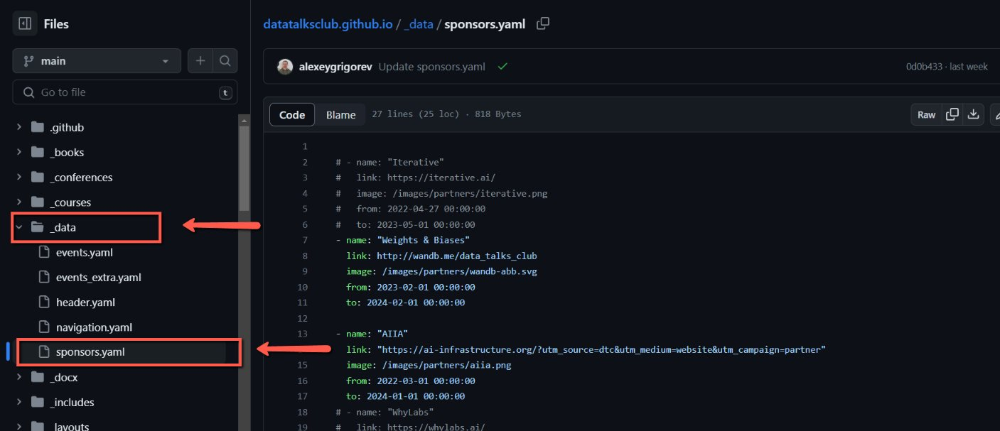
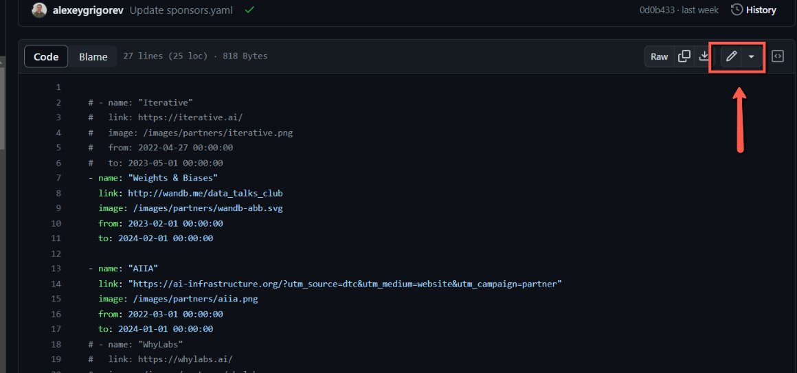
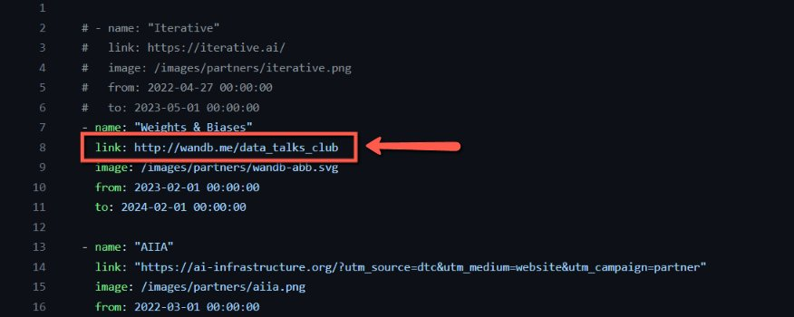

# Updating the Sponsor's URL in Github

<!-- sop-section-start: summary -->
## Summary

- Purpose:
- Outcome:
- Trigger:
- Frequency:
<!-- sop-section-end -->

<!-- sop-section-start: prerequisites -->
## Prerequisites

- Access:
- Tools:
- Inputs:
<!-- sop-section-end -->

<!-- sop-section-start: procedure -->
## Procedure

<!-- sop-prose-start -->
How to Update the Sponsor’s URL in Github
This procedure will show you the steps on how to Update the Sponsor’s URL in Github

Step-by-step Instructions
<!-- sop-prose-end -->

<!-- sop-step-start id=1 -->
1.  Go to DataTalksClub’s github repo and select “\_data” and “[sponsors.yaml](https://github.com/DataTalksClub/datatalksclub.github.io/blob/main/_data/sponsors.yaml)”

    <!-- sop-screenshot-start -->
    
    <!-- sop-caption-start -->
    This screenshot anchors step 1 of the Updating the Sponsor's URL in Github process by showing the screen for go to DataTalksClub's github repo and select "\ data" and "sponsors.yaml". Look for the red boxes or arrows around "\ data", "sponsors.yaml", then use that highlighted area as the target for the action before continuing.
    <!-- sop-caption-end -->
    <!-- sop-screenshot-end -->
<!-- sop-step-end -->

<!-- sop-step-start id=2 -->
2.  On the top right side of the page, click the pen icon.

    <!-- sop-screenshot-start -->
    
    <!-- sop-caption-start -->
    This screenshot anchors step 2 of the Updating the Sponsor's URL in Github process by showing the screen for on the top right side of the page, click the pen icon. Look for the red box, arrow, selected row, or highlighted screen area, then use that highlighted area as the target for the action before continuing.
    <!-- sop-caption-end -->
    <!-- sop-screenshot-end -->
<!-- sop-step-end -->

<!-- sop-step-start id=3 -->
3.  Lastly, copy the new URL and paste it on the “link” section

    <!-- sop-screenshot-start -->
    
    <!-- sop-caption-start -->
    This screenshot anchors step 3 of the Updating the Sponsor's URL in Github process by showing the screen for copy the new URL and paste it on the "link" section. Look for the red box or arrow around "link", then use that highlighted area as the target for the action before continuing.
    <!-- sop-caption-end -->
    <!-- sop-screenshot-end -->
<!-- sop-step-end -->
<!-- sop-section-end -->

<!-- sop-section-start: validation -->
## Validation

-
<!-- sop-section-end -->

<!-- sop-section-start: troubleshooting -->
## Troubleshooting

-
<!-- sop-section-end -->

<!-- sop-section-start: references -->
## References

-
<!-- sop-section-end -->
