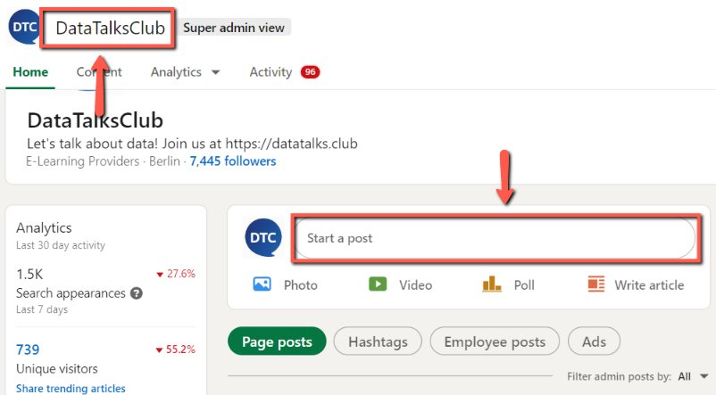
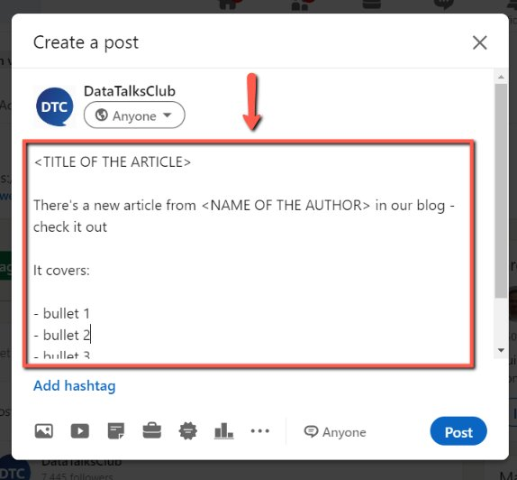
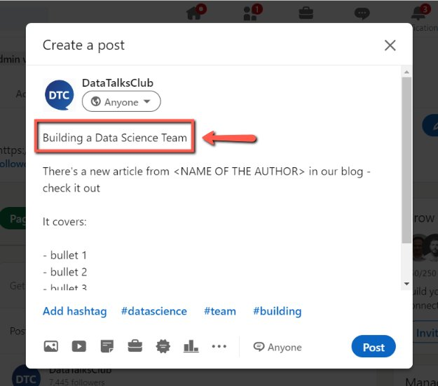
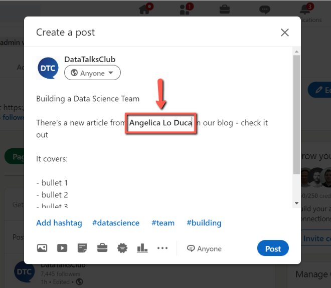
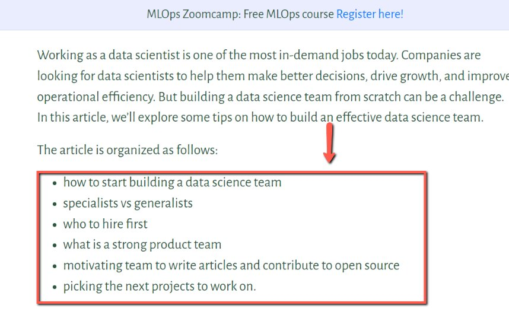
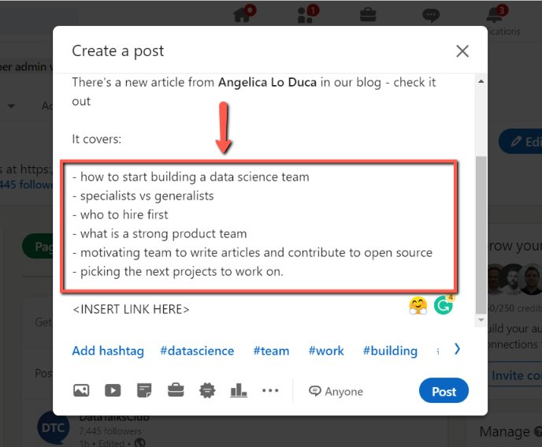
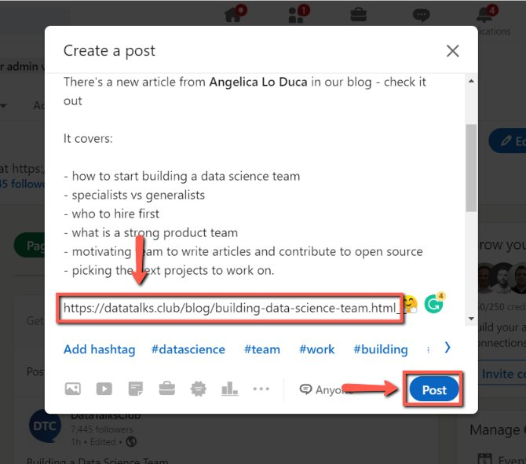

# Sharing Articles on LinkedIn

<!-- sop-section-start: summary -->
## Summary

- Purpose:
- Outcome:
- Trigger:
- Frequency:
<!-- sop-section-end -->

<!-- sop-section-start: prerequisites -->
## Prerequisites

- Access:
- Tools:
- Inputs:
<!-- sop-section-end -->

<!-- sop-section-start: procedure -->
## Procedure

<!-- sop-prose-start -->
How to Share Articles on LinkedIn
This procedure will show you the steps on how to Share Articles on LinkedIn. For the schedule of sharing the article, refer [here](https://docs.google.com/document/d/1YQa7Rorrw9VrOV1IwUi164XBfxljfCXkgKzdilQsi18/edit?usp=sharing)

Step-by-step Instructions
<!-- sop-prose-end -->

<!-- sop-step-start id=1 -->
1.  The first thing you need to do is open, [DataTalks.Club’s LinkedIn account](https://www.linkedin.com/company/71802369/admin/) and click “Start a post”

    <!-- sop-screenshot-start -->
    
    <!-- sop-caption-start -->
    This screenshot anchors the step about open, DataTalks.Club’s LinkedIn account and click “Start a post” so you can match the documented UI before acting. Look for “Start a post”, then use that cue to complete or verify the step before continuing.
    <!-- sop-caption-end -->
    <!-- sop-screenshot-end -->
<!-- sop-step-end -->

<!-- sop-step-start id=2 -->
2.  Then, paste the [template](https://docs.google.com/document/d/10nRQ9KHly9vQ6NkKMW83s24UUnsxjwsYr_qUeyiNjV0/edit?usp=sharing) in announcing the article.

    <!-- sop-screenshot-start -->
    
    <!-- sop-caption-start -->
    This screenshot anchors the step to paste the template in announcing the article so you can match the documented UI before acting. Look for the link, copy, or paste target shown there, then use it to confirm you are in the correct place before continuing.
    <!-- sop-caption-end -->
    <!-- sop-screenshot-end -->
<!-- sop-step-end -->

<!-- sop-step-start id=3 -->
3.  Next, edit the template. Enter the Title of the article.

    <!-- sop-screenshot-start -->
    
    <!-- sop-caption-start -->
    This screenshot anchors the step to edit the template. Enter the Title of the article so you can match the documented UI before acting. Look for the relevant screen area shown there, then use it to confirm you are in the correct place before continuing.
    <!-- sop-caption-end -->
    <!-- sop-screenshot-end -->
<!-- sop-step-end -->

<!-- sop-step-start id=4 -->
4.  Then, add the name of the author of the article

    Note: Make sure to tag the author. In this example, we tagged “@Angelica Lo Duca”

    <!-- sop-screenshot-start -->
    
    <!-- sop-caption-start -->
    This screenshot anchors the step about make sure to tag the author. In this example, we tagged “@Angelica Lo Duca” so you can match the documented UI before acting. Look for the relevant screen area shown there, then use it to confirm you are in the correct place before continuing.
    <!-- sop-caption-end -->
    <!-- sop-screenshot-end -->
<!-- sop-step-end -->

<!-- sop-step-start id=5 -->
5.  Once done, copy the bullet points from the article.

    <!-- sop-screenshot-start -->
    
    <!-- sop-caption-start -->
    This screenshot anchors the step to copy the bullet points from the article so you can match the documented UI before acting. Look for the link, copy, or paste target shown there, then use it to confirm you are in the correct place before continuing.
    <!-- sop-caption-end -->
    <!-- sop-screenshot-end -->
<!-- sop-step-end -->

<!-- sop-step-start id=6 -->
6.  And paste it into the description.

    Note: Don’t forget to follow the [proper punctuation marks and format](https://docs.google.com/document/d/192lEpUc6WemtooqcqNiHub-7OTTJAHe2k-mJg-bUWYI/edit?usp=sharing)
    <!-- sop-screenshot-start -->
    
    <!-- sop-caption-start -->
    This screenshot anchors the step about don’t forget to follow the proper punctuation marks and format so you can match the documented UI before acting. Look for the relevant screen area shown there, then use it to confirm you are in the correct place before continuing.
    <!-- sop-caption-end -->
    <!-- sop-screenshot-end -->
<!-- sop-step-end -->

<!-- sop-step-start id=7 -->
7.  Lastly, paste the link to the article and click “Post”

    <!-- sop-screenshot-start -->
    
    <!-- sop-caption-start -->
    This screenshot anchors the step to paste the link to the article and click “Post” so you can match the documented UI before acting. Look for “Post”, then use that cue to complete or verify the step before continuing.
    <!-- sop-caption-end -->
    <!-- sop-screenshot-end -->
<!-- sop-step-end -->
<!-- sop-section-end -->

<!-- sop-section-start: validation -->
## Validation

-
<!-- sop-section-end -->

<!-- sop-section-start: troubleshooting -->
## Troubleshooting

-
<!-- sop-section-end -->

<!-- sop-section-start: references -->
## References

-
<!-- sop-section-end -->
