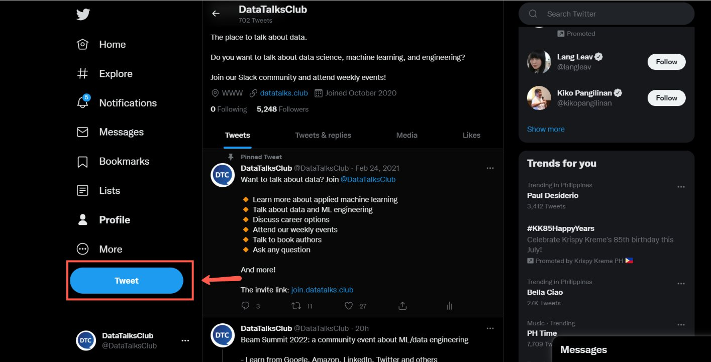
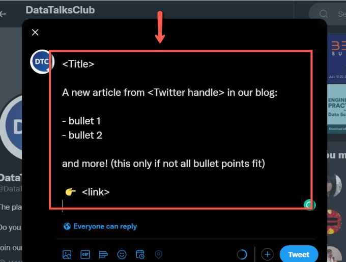
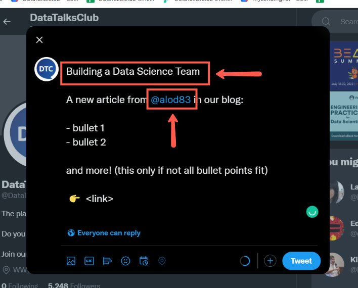
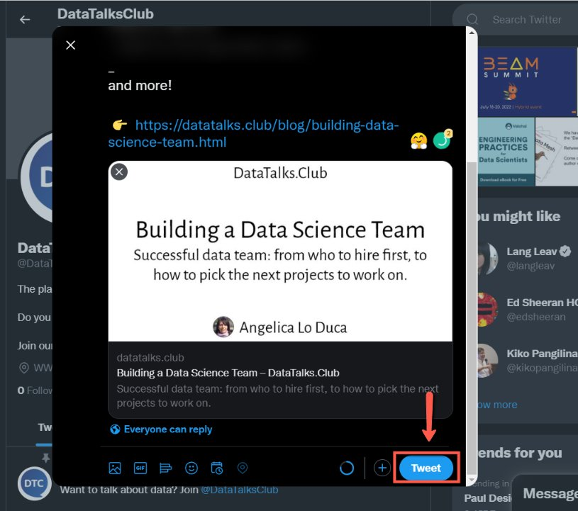

# Sharing Articles on Twitter

<!-- sop-section-start: summary -->
## Summary

- Purpose:
- Outcome:
- Trigger:
- Frequency:
<!-- sop-section-end -->

<!-- sop-section-start: prerequisites -->
## Prerequisites

- Access:
- Tools:
- Inputs:
<!-- sop-section-end -->

<!-- sop-section-start: procedure -->
## Procedure

<!-- sop-prose-start -->
How to Share Articles on Twitter.
This procedure will show you the steps on how to Share Articles on Twitter. For the schedule of sharing the article, refer [here](https://docs.google.com/document/d/1YQa7Rorrw9VrOV1IwUi164XBfxljfCXkgKzdilQsi18/edit?usp=sharing)

Step-by-step Instructions
<!-- sop-prose-end -->

<!-- sop-step-start id=1 -->
1.  On [DataTalks.Club’s Twitter](https://twitter.com/DataTalksClub) account, click “Tweet”

    <!-- sop-screenshot-start -->
    
    <!-- sop-caption-start -->
    This screenshot anchors the step about on DataTalks.Club’s Twitter account, click “Tweet” so you can match the documented UI before acting. Look for “Tweet”, then use that cue to complete or verify the step before continuing.
    <!-- sop-caption-end -->
    <!-- sop-screenshot-end -->
<!-- sop-step-end -->

<!-- sop-step-start id=2 -->
2.  Then, paste the [template](https://docs.google.com/document/d/10nRQ9KHly9vQ6NkKMW83s24UUnsxjwsYr_qUeyiNjV0/edit?usp=sharing) for announcing articles on Twitter.

    <!-- sop-screenshot-start -->
    
    <!-- sop-caption-start -->
    This screenshot anchors the step to paste the template for announcing articles on Twitter so you can match the documented UI before acting. Look for the link, copy, or paste target shown there, then use it to confirm you are in the correct place before continuing.
    <!-- sop-caption-end -->
    <!-- sop-screenshot-end -->
<!-- sop-step-end -->

<!-- sop-step-start id=3 -->
3.  Next, enter the title of the article and add the Twitter Handle of the author

    <!-- sop-screenshot-start -->
    
    <!-- sop-caption-start -->
    This screenshot anchors the step to enter the title of the article and add the Twitter Handle of the author so you can match the documented UI before acting. Look for the post composer or published post shown there, then use it to confirm you are in the correct place before continuing.
    <!-- sop-caption-end -->
    <!-- sop-screenshot-end -->
<!-- sop-step-end -->

<!-- sop-step-start id=4 -->
4.  Then enter the information and link to the article.

    Note: This colon is optional - so in case it doesn't fit the limit, it could be removed
    <!-- sop-screenshot-start -->
    
    <!-- sop-caption-start -->
    This screenshot anchors the step to enter the information and link to the article so you can match the documented UI before acting. Look for the link, copy, or paste target shown there, then use it to confirm you are in the correct place before continuing.
    <!-- sop-caption-end -->
    <!-- sop-screenshot-end -->
<!-- sop-step-end -->

<!-- sop-step-start id=5 -->
5.  Lastly, click “Tweet”

    <!-- sop-screenshot-start -->
    
    <!-- sop-caption-start -->
    This screenshot anchors the step to click “Tweet” so you can match the documented UI before acting. Look for “Tweet”, then use that cue to complete or verify the step before continuing.
    <!-- sop-caption-end -->
    <!-- sop-screenshot-end -->
<!-- sop-step-end -->
<!-- sop-section-end -->

<!-- sop-section-start: validation -->
## Validation

-
<!-- sop-section-end -->

<!-- sop-section-start: troubleshooting -->
## Troubleshooting

-
<!-- sop-section-end -->

<!-- sop-section-start: references -->
## References

-
<!-- sop-section-end -->
