# Creating Sponsored Content for LinkedIn Post

<!-- sop-section-start: summary -->
## Summary

- Purpose: Create a sponsored LinkedIn post from newsletter sponsor materials.
- Outcome: A LinkedIn sponsored post is drafted or scheduled with text, link, and image.
- Trigger: Sponsored newsletter promotional content needs a LinkedIn post.
- Frequency: For each sponsored LinkedIn promotion.
<!-- sop-section-end -->

<!-- sop-section-start: prerequisites -->
## Prerequisites

- Access: DataTalks.Club LinkedIn page and Trello sponsorship card.
- Tools: LinkedIn and Trello.
- Inputs: Sponsorship document, LinkedIn post template, registration link, and banner image.
<!-- sop-section-end -->

<!-- sop-section-start: procedure -->
## Procedure

<!-- sop-prose-start -->
Creating Sponsored Content for LinkedIn Post
This procedure will show you the steps on how to schedule posts with LinkedIn and post about newsletter promotional content.

Step-by-step instructions
<!-- sop-prose-end -->

<!-- sop-step-start id=1 -->
1.  The first thing you need to do is open [https://www.linkedin.com/company/datatalks-club/](https://www.linkedin.com/company/datatalks-club/) and click the “Create” button.

    <!-- sop-screenshot-start -->
    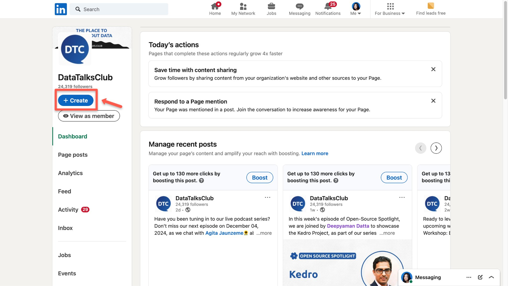
    <!-- sop-caption-start -->
    This screenshot anchors the step to open https://www.linkedin.com/company/datatalks-club/ and click the “Create” button so you can match the documented UI before acting. Look for “Create”, then use that cue to complete or verify the step before continuing.
    <!-- sop-caption-end -->
    <!-- sop-screenshot-end -->
<!-- sop-step-end -->

<!-- sop-step-start id=2 -->
2.  And then, click “Start a post”

    <!-- sop-screenshot-start -->
    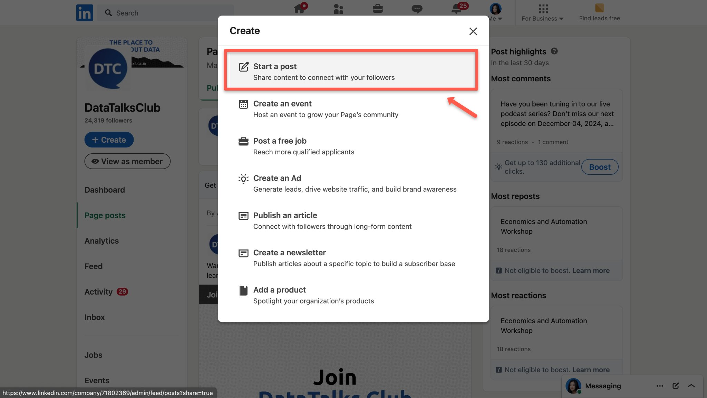
    <!-- sop-caption-start -->
    This screenshot anchors the step to click “Start a post” so you can match the documented UI before acting. Look for “Start a post”, then use that cue to complete or verify the step before continuing.
    <!-- sop-caption-end -->
    <!-- sop-screenshot-end -->
<!-- sop-step-end -->

<!-- sop-step-start id=3 -->
3.  In another tab, go to Trello and select the card that contains the sponsored newsletter. Open the sponsorship document to look for templates.

    Note: For this example, the sponsor is DoubleCloud and we will follow the template on the corresponding sponsorship document provided.

    <!-- sop-screenshot-start -->
    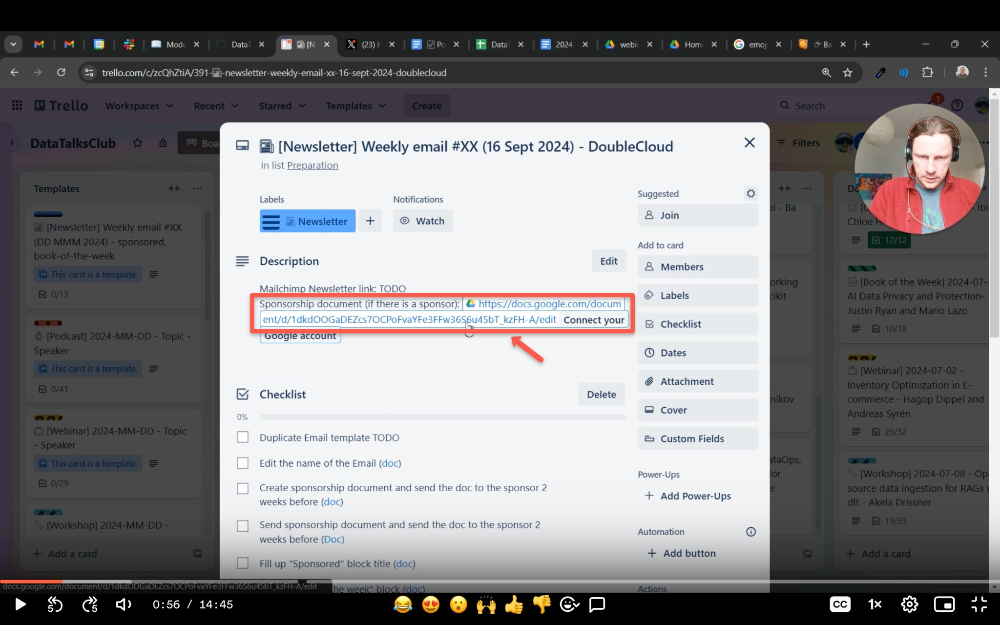
    <!-- sop-caption-start -->
    This screenshot anchors the example shown in the procedure so you can match the documented UI before acting. Look for the relevant screen area shown there, then use it to confirm you are in the correct place before continuing.
    <!-- sop-caption-end -->
    <!-- sop-screenshot-end -->
<!-- sop-step-end -->

<!-- sop-step-start id=4 -->
4.  Copy the template under “Webinar” for LinkedIn posts.

    Note: Only copy the text. Do not copy embedded files like “webinar banners_1200x628.png”

    <!-- sop-screenshot-start -->
    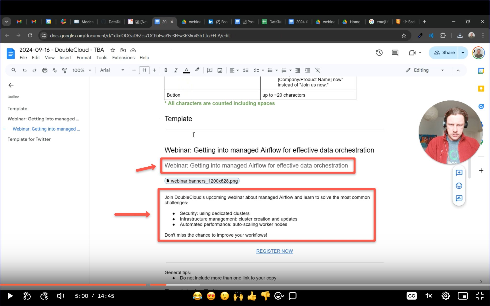
    <!-- sop-caption-start -->
    This screenshot anchors the step about only copy the text. Do not copy embedded files like “webinar banners_1200x628.png” so you can match the documented UI before acting. Look for “webinar banners_1200x628.png”, then use that cue to complete or verify the step before continuing.
    <!-- sop-caption-end -->
    <!-- sop-screenshot-end -->
<!-- sop-step-end -->

<!-- sop-step-start id=5 -->
5.  Paste the text on the draft post you started on LinkedIn. Make sure to mention the sponsor’s account in the post.

    Note: You can mention accounts by putting “@” before the name. Different accounts might appear, so make sure to click the correct one.

    <!-- sop-screenshot-start -->
    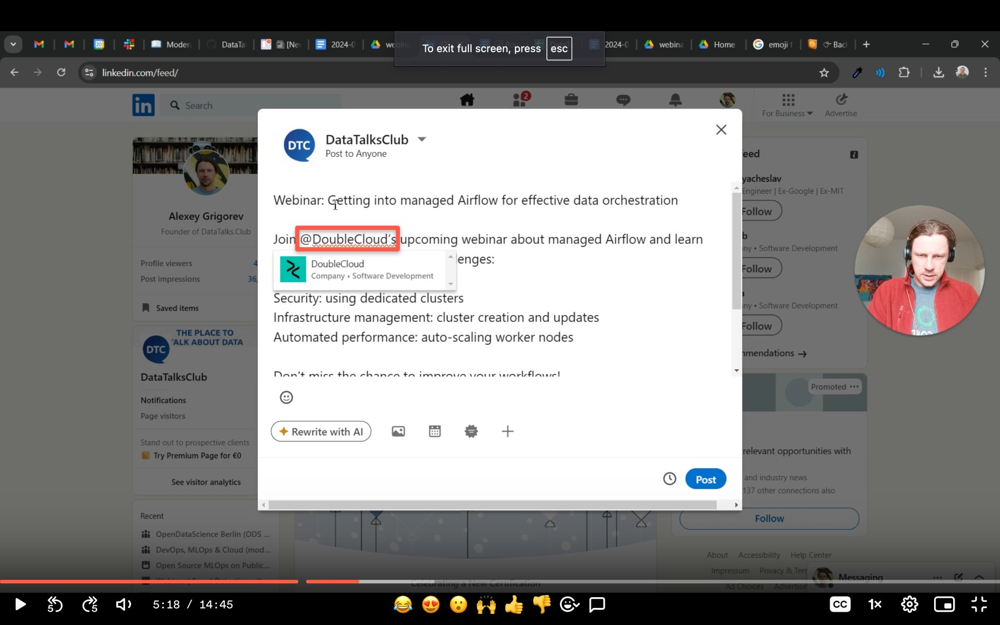
    <!-- sop-caption-start -->
    This screenshot anchors the step about you can mention accounts by putting “@” before the name. Different accounts might appear, so make sure to click the correc... so you can match the documented UI before acting. Look for the reporting value or action control shown there, then use it to confirm you are in the correct place before continuing.
    <!-- sop-caption-end -->
    <!-- sop-screenshot-end -->
<!-- sop-step-end -->

<!-- sop-step-start id=6 -->
6.  In some cases, you might need to edit the texts. Make sure to add bullet points for the outline. Preferably, a diamond bullet.

    <!-- sop-screenshot-start -->
    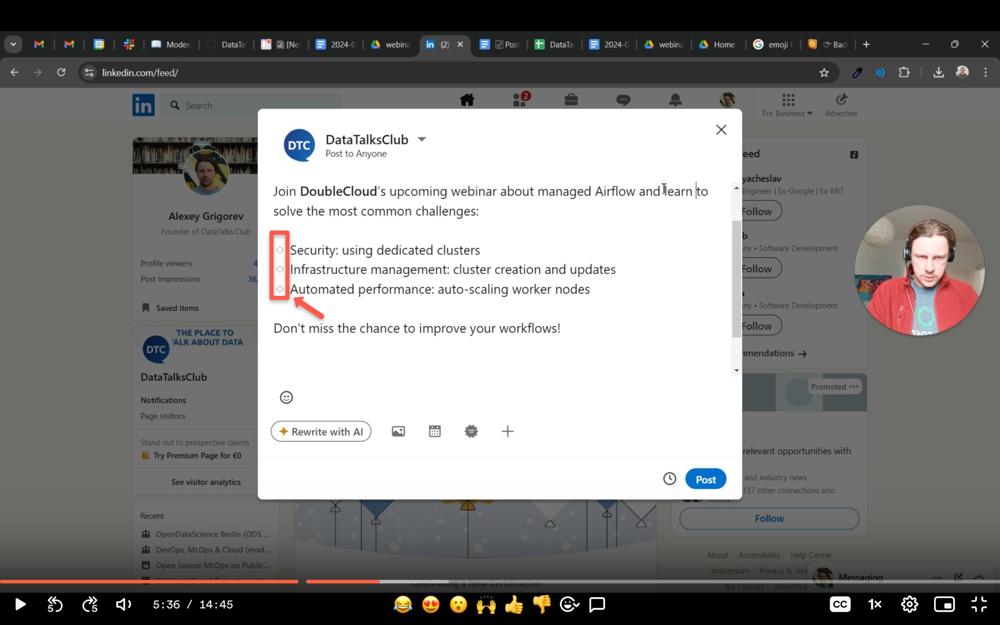
    <!-- sop-caption-start -->
    This screenshot anchors the step about in some cases, you might need to edit the texts. Make sure to add bullet points for the outline. Preferably, a diamond bullet so you can match the documented UI before acting. Look for the relevant screen area shown there, then use it to confirm you are in the correct place before continuing.
    <!-- sop-caption-end -->
    <!-- sop-screenshot-end -->
<!-- sop-step-end -->

<!-- sop-step-start id=7 -->
7.  Go back to the sponsorship document and copy the registration link.

    <!-- sop-screenshot-start -->
    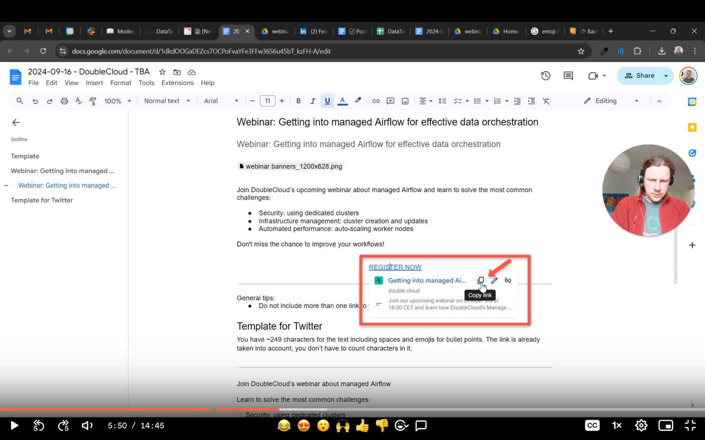
    <!-- sop-caption-start -->
    This screenshot anchors the step to go back to the sponsorship document and copy the registration link so you can match the documented UI before acting. Look for the link, copy, or paste target shown there, then use it to confirm you are in the correct place before continuing.
    <!-- sop-caption-end -->
    <!-- sop-screenshot-end -->
<!-- sop-step-end -->

<!-- sop-step-start id=8 -->
8.  Put “Register now:” at the end of the post and paste the link after the colon.

    <!-- sop-screenshot-start -->
    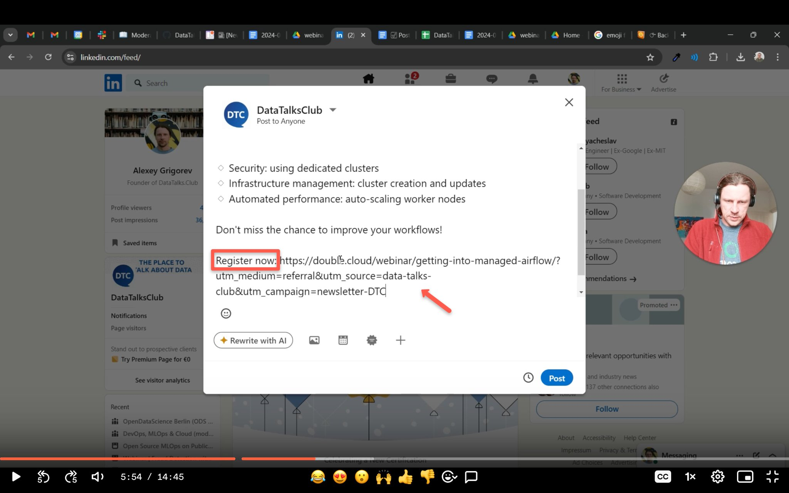
    <!-- sop-caption-start -->
    This screenshot anchors the step about put “Register now:” at the end of the post and paste the link after the colon so you can match the documented UI before acting. Look for “Register now:”, then use that cue to complete or verify the step before continuing.
    <!-- sop-caption-end -->
    <!-- sop-screenshot-end -->
<!-- sop-step-end -->

<!-- sop-step-start id=9 -->
9.  Remove the preview that will appear after the link by clicking the “x” button.

    <!-- sop-screenshot-start -->
    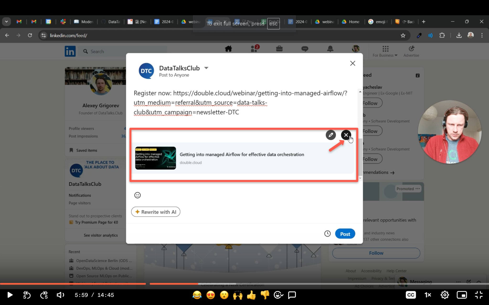
    <!-- sop-caption-start -->
    This screenshot anchors the step to remove the preview that will appear after the link by clicking the “x” button so you can match the documented UI before acting. Look for “x”, then use that cue to complete or verify the step before continuing.
    <!-- sop-caption-end -->
    <!-- sop-screenshot-end -->
<!-- sop-step-end -->

<!-- sop-step-start id=10 -->
10. Go back to the sponsorship document. Click the edited webinar banner file and download it.

    <!-- sop-screenshot-start -->
    
    <!-- sop-caption-start -->
    This screenshot anchors the step to go back to the sponsorship document. Click the edited webinar banner file and download it so you can match the documented UI before acting. Look for the file transfer or file picker state shown there, then use it to confirm you are in the correct place before continuing.
    <!-- sop-caption-end -->
    <!-- sop-screenshot-end -->
<!-- sop-step-end -->

<!-- sop-step-start id=11 -->
11. Click the “*add media*” button and upload the edited webinar banner from your files.

    <!-- sop-screenshot-start -->
    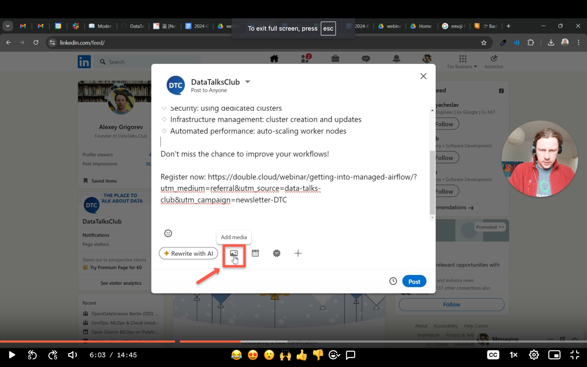
    <!-- sop-caption-start -->
    This screenshot anchors the step to click the “*add media*” button and upload the edited webinar banner from your files so you can match the documented UI before acting. Look for “*add media*”, then use that cue to complete or verify the step before continuing.
    <!-- sop-caption-end -->
    <!-- sop-screenshot-end -->
<!-- sop-step-end -->

<!-- sop-step-start id=12 -->
12. After the “Register now: \[LINK\]” text, *leave* three (3) spaces or breaks and indicate that the LinkedIn post is sponsored through this format:

    “This post is sponsored by \[SPONSOR\]. Thank you for supporting our community!”

    Note: The sponsor’s account should also be mentioned.

    <!-- sop-screenshot-start -->
    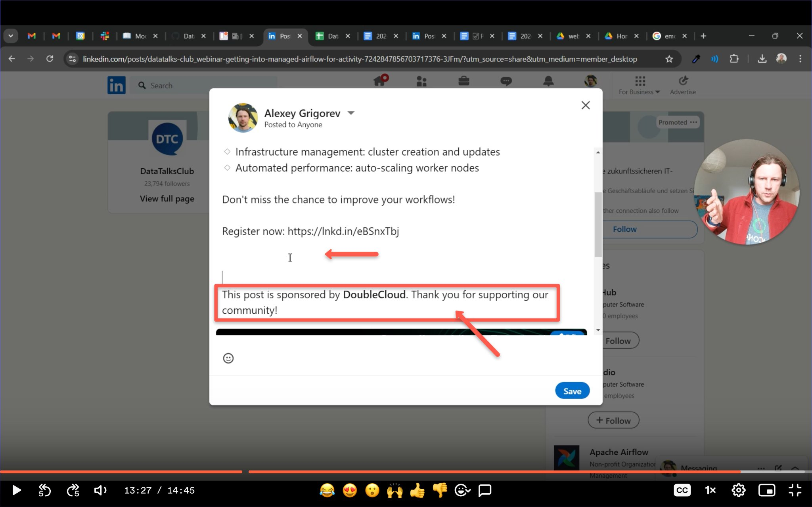
    <!-- sop-caption-start -->
    This screenshot anchors the step about “This post is sponsored by [SPONSOR]. Thank you for supporting our community!” so you can match the documented UI before acting. Look for the post composer or published post shown there, then use it to confirm you are in the correct place before continuing.
    <!-- sop-caption-end -->
    <!-- sop-screenshot-end -->
<!-- sop-step-end -->

<!-- sop-step-start id=13 -->
13. Now that the edited banner has been placed, click the “*schedule for later”* button to schedule the post.

    <!-- sop-screenshot-start -->
    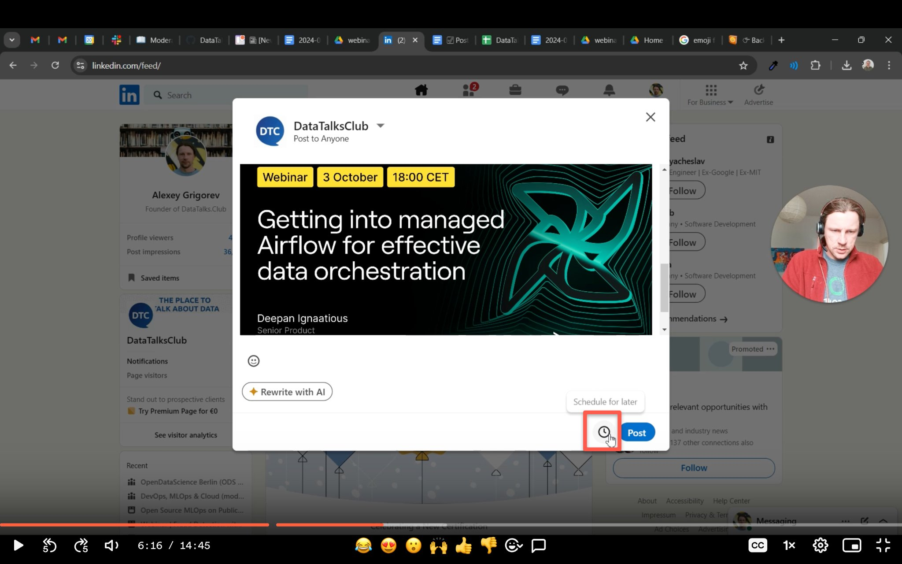
    <!-- sop-caption-start -->
    This screenshot anchors the step about that the edited banner has been placed, click the “*schedule for later”* button to schedule the post so you can match the documented UI before acting. Look for “*schedule for later”, then use that cue to complete or verify the step before continuing.
    <!-- sop-caption-end -->
    <!-- sop-screenshot-end -->
<!-- sop-step-end -->

<!-- sop-step-start id=14 -->
14. Edit the date and time according to the corresponding content plan. Typically, the scheduled post for sponsored content is on a *Wednesday*.

    Note: LinkedIn does not let you define the timezone. So, make sure that the time is aligned to the Central European Time (CET).
    <!-- sop-screenshot-start -->
    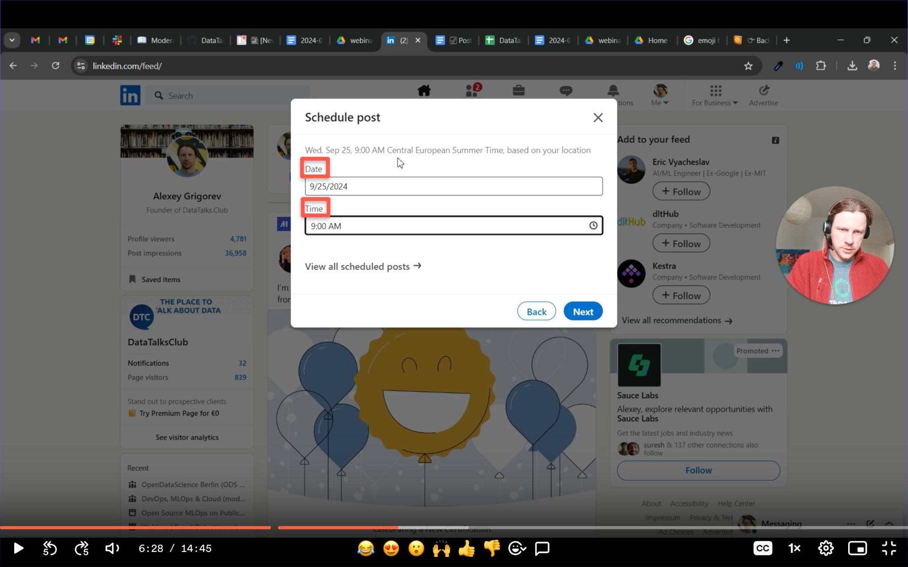
    <!-- sop-caption-start -->
    This screenshot anchors the step about linkedIn does not let you define the timezone. So, make sure that the time is aligned to the Central European Time (CET) so you can match the documented UI before acting. Look for the schedule or date control shown there, then use it to confirm you are in the correct place before continuing.
    <!-- sop-caption-end -->
    <!-- sop-screenshot-end -->
<!-- sop-step-end -->

<!-- sop-step-start id=15 -->
15. To help you with the timezone, you can search for conversion from your timezone to CET or Berlin timezone on google.

    Note: In this example, we are converting 9:00 AM Berlin Time to Manila Time. It is shown that 9:00 AM in Berlin is 4:00 PM in Manila. So, if you are trying to schedule a 9:00 AM CET time (but you are in a Manila Timezone) , schedule it at 4:00 PM.

    <!-- sop-screenshot-start -->
    
    <!-- sop-caption-start -->
    This screenshot anchors the example shown in the procedure so you can match the documented UI before acting. Look for the schedule or date control shown there, then use it to confirm you are in the correct place before continuing.
    <!-- sop-caption-end -->
    <!-- sop-screenshot-end -->
<!-- sop-step-end -->

<!-- sop-step-start id=16 -->
16. After that, click the “*schedule*” button to schedule the post.

    <!-- sop-screenshot-start -->
    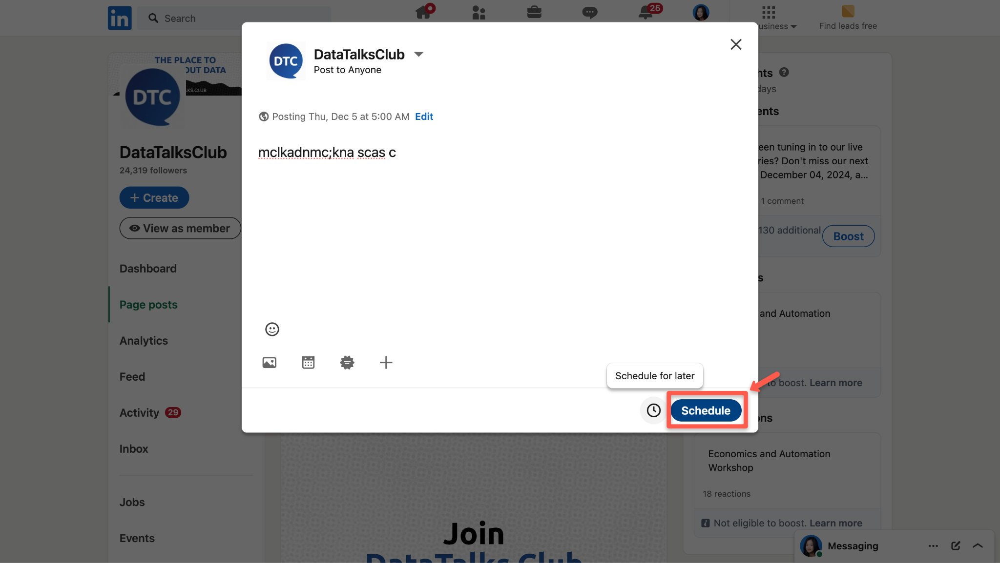
    <!-- sop-caption-start -->
    This screenshot anchors the step to click the “*schedule*” button to schedule the post so you can match the documented UI before acting. Look for “*schedule*”, then use that cue to complete or verify the step before continuing.
    <!-- sop-caption-end -->
    <!-- sop-screenshot-end -->

    After the post has been posted.
<!-- sop-step-end -->

<!-- sop-step-start id=17 -->
17. Copy the link to the sponsored LinkedIn post.

    <!-- sop-screenshot-start -->
    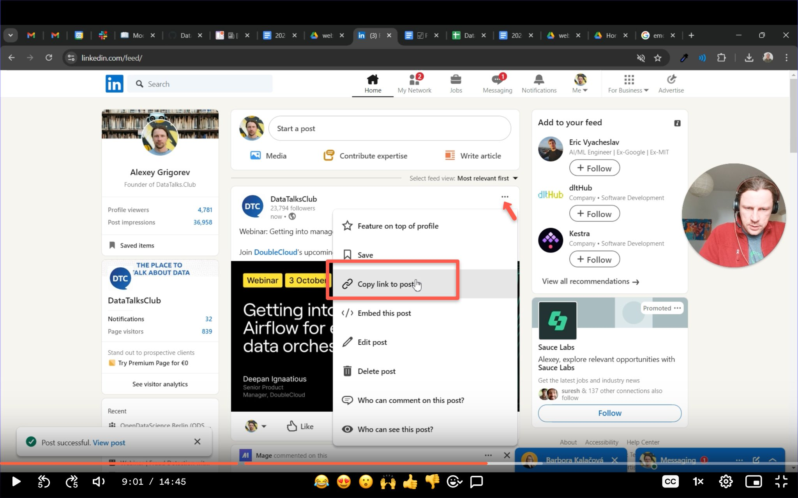
    <!-- sop-caption-start -->
    This screenshot anchors the step to copy the link to the sponsored LinkedIn post so you can match the documented UI before acting. Look for the link, copy, or paste target shown there, then use it to confirm you are in the correct place before continuing.
    <!-- sop-caption-end -->
    <!-- sop-screenshot-end -->
<!-- sop-step-end -->

<!-- sop-step-start id=18 -->
18. Open Trello and paste the link of the LinkedIn post on the corresponding sponsored newsletter card.

    <!-- sop-screenshot-start -->
    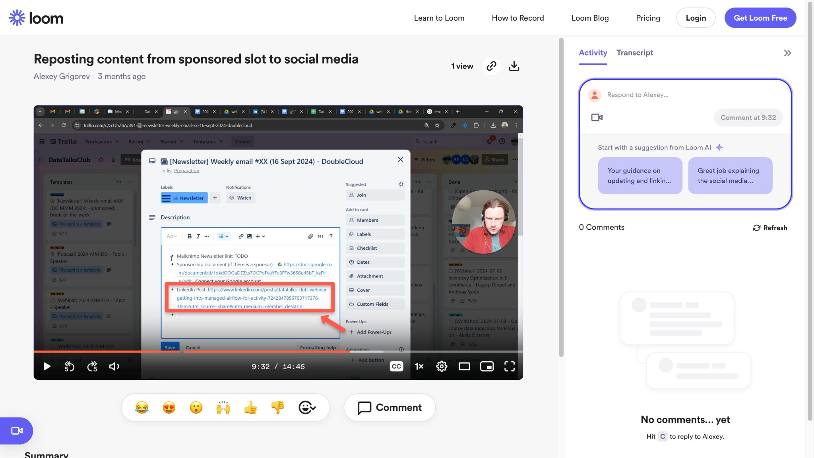
    <!-- sop-caption-start -->
    This screenshot anchors the step to open Trello and paste the link of the LinkedIn post on the corresponding sponsored newsletter card so you can match the documented UI before acting. Look for the link, copy, or paste target shown there, then use it to confirm you are in the correct place before continuing.
    <!-- sop-caption-end -->
    <!-- sop-screenshot-end -->
<!-- sop-step-end -->

<!-- sop-step-start id=19 -->
19. Open the DataTalks.Club schedule sheets [https://docs.google.com/spreadsheets/d/1-T8qkmShlFUrT2NmkI8Pi1NgUS9IunP6wO5-L79xe2s/edit?gid=1710801712#gid=1710801712](https://docs.google.com/spreadsheets/d/1-T8qkmShlFUrT2NmkI8Pi1NgUS9IunP6wO5-L79xe2s/edit?gid=1710801712#gid=1710801712) and paste the link of the LinkedIn post under the “*LinkedIn post”* column of the corresponding sponsor.

    <!-- sop-screenshot-start -->
    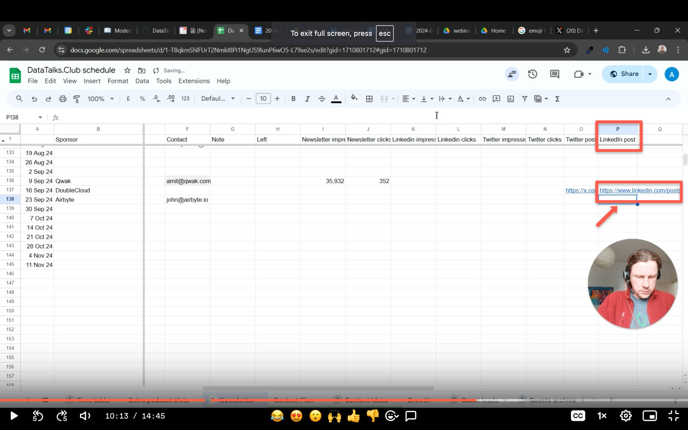
    <!-- sop-caption-start -->
    This screenshot anchors the step to open the DataTalks.Club schedule sheets https://docs.google.com/spreadsheets/d/1-T8qkmShlFUrT2NmkI8Pi1NgUS9IunP6wO5-L79xe2... so you can match the documented UI before acting. Look for “*LinkedIn post”, then use that cue to complete or verify the step before continuing.
    <!-- sop-caption-end -->
    <!-- sop-screenshot-end -->
<!-- sop-step-end -->

<!-- sop-step-start id=20 -->
20. Log-in to LinkedIn using Alexey’s account. Click the "Like" button of the sponsored post and comment depending on the content. This is to amplify the post, so that many people would see it.

    Note: In this example, the comment is “Looking forward to it!”
    <!-- sop-screenshot-start -->
    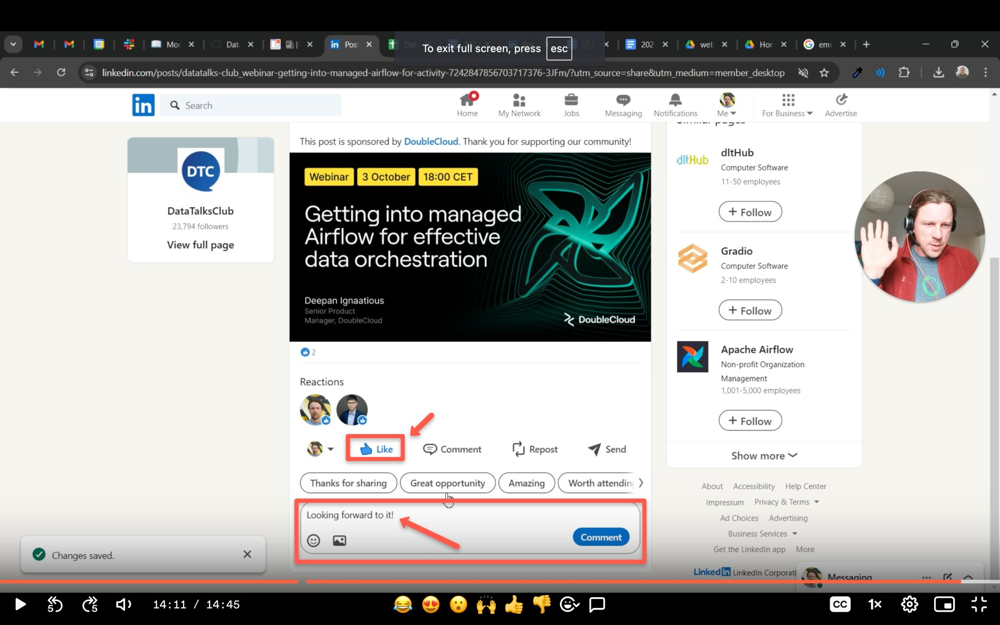
    <!-- sop-caption-start -->
    This screenshot anchors the example shown in the procedure so you can match the documented UI before acting. Look for “Looking forward to it!”, then use that cue to complete or verify the step before continuing.
    <!-- sop-caption-end -->
    <!-- sop-screenshot-end -->
<!-- sop-step-end -->
<!-- sop-section-end -->

<!-- sop-section-start: validation -->
## Validation

-
<!-- sop-section-end -->

<!-- sop-section-start: troubleshooting -->
## Troubleshooting

-
<!-- sop-section-end -->

<!-- sop-section-start: references -->
## References

-
<!-- sop-section-end -->
