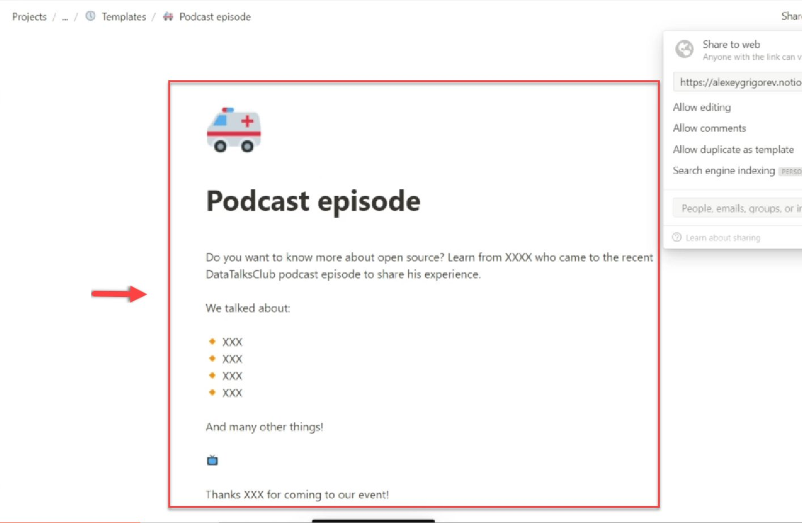
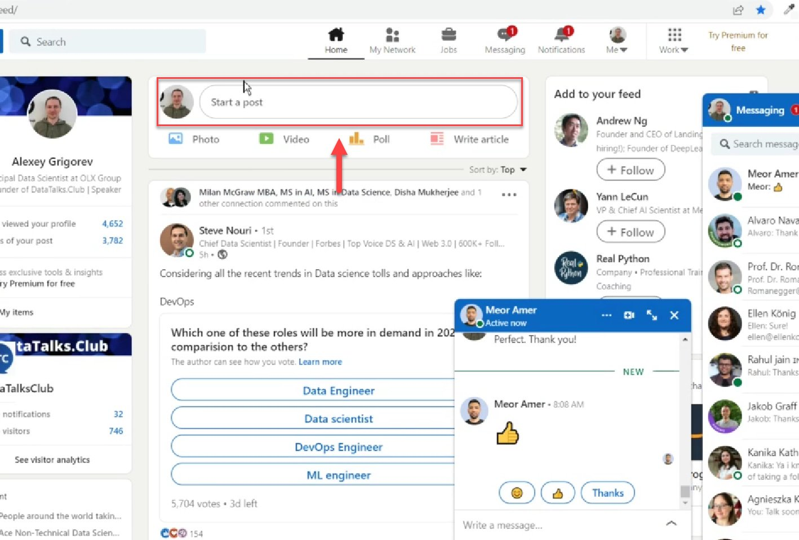
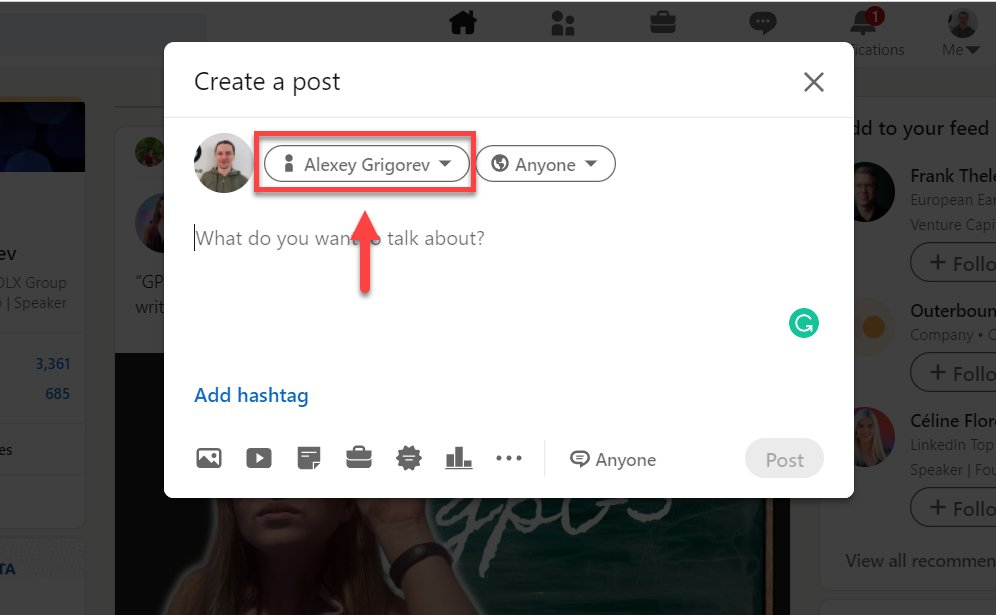
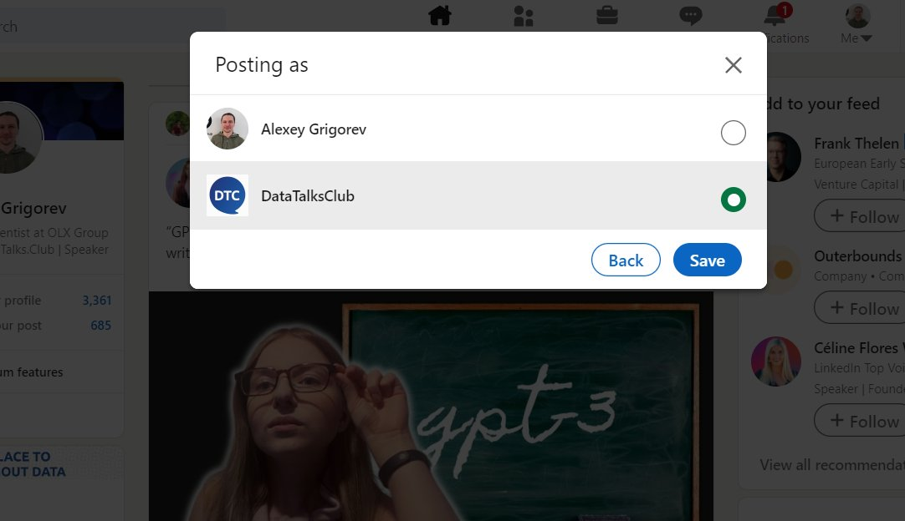
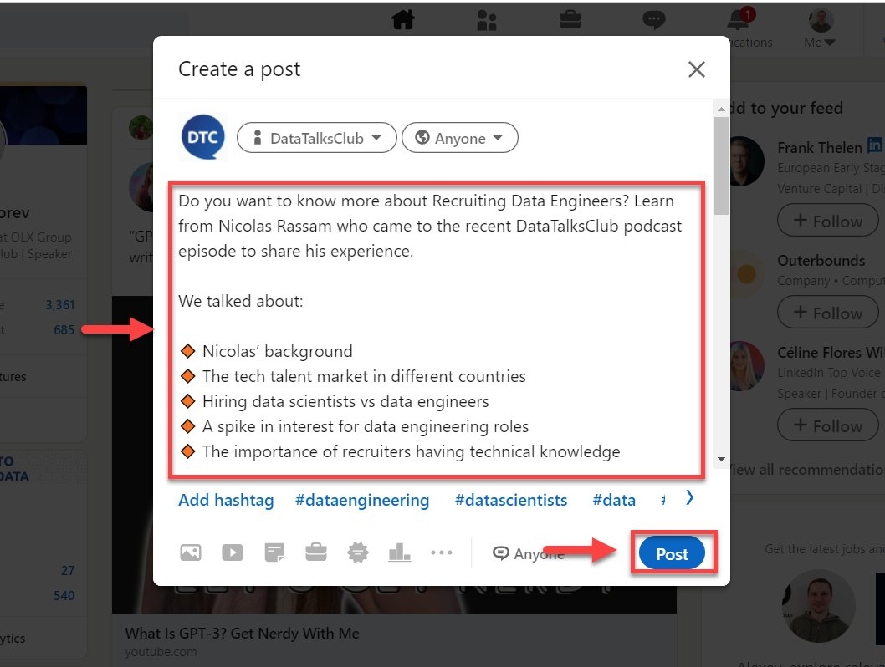
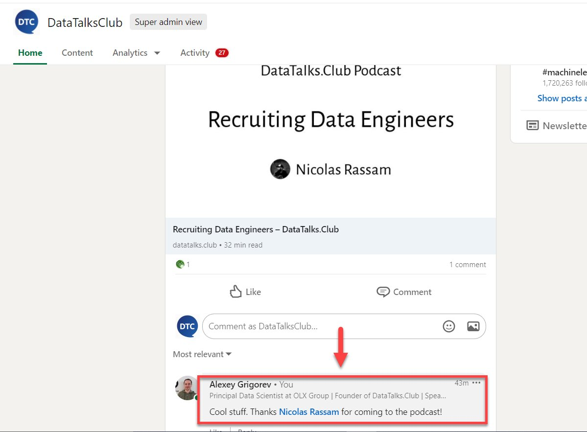

# Make an announcement on LinkedIn

<!-- sop-section-start: summary -->
## Summary

- Purpose: Publish a DataTalks.Club announcement on LinkedIn.
- Outcome: The announcement is posted from the DataTalks.Club LinkedIn page with a follow-up comment.
- Trigger: A podcast or event announcement is ready to publish.
- Frequency: As needed for announcements.
<!-- sop-section-end -->

<!-- sop-section-start: prerequisites -->
## Prerequisites

- Access: DataTalks.Club LinkedIn page and announcement template.
- Tools: LinkedIn and Notion template.
- Inputs: Announcement text and speaker or podcast details.
<!-- sop-section-end -->

<!-- sop-section-start: procedure -->
## Procedure

<!-- sop-prose-start -->
How to make an announcement on LinkedIn
This procedure will show you the steps on how to make an announcement on LinkedIn.

Step-by-step Instructions
<!-- sop-prose-end -->

<!-- sop-step-start id=1 -->
1.  The first thing you need to do is open the podcast announcement template on Notion.

    <!-- sop-screenshot-start -->
    
    <!-- sop-caption-start -->
    This screenshot anchors the step to open the podcast announcement template on Notion so you can match the documented UI before acting. Look for the relevant screen area shown there, then use it to confirm you are in the correct place before continuing.
    <!-- sop-caption-end -->
    <!-- sop-screenshot-end -->
<!-- sop-step-end -->

<!-- sop-step-start id=2 -->
2.  After, visit LinkedIn and select "Start a post”

    <!-- sop-screenshot-start -->
    
    <!-- sop-caption-start -->
    This screenshot anchors the step about visit LinkedIn and select "Start a post” so you can match the documented UI before acting. Look for “Start a post”, then use that cue to complete or verify the step before continuing.
    <!-- sop-caption-end -->
    <!-- sop-screenshot-end -->
<!-- sop-step-end -->

<!-- sop-step-start id=3 -->
3.  And then, select the button- right beside the profile picture

    <!-- sop-screenshot-start -->
    
    <!-- sop-caption-start -->
    This screenshot anchors the step to select the button- right beside the profile picture so you can match the documented UI before acting. Look for the file transfer or file picker state shown there, then use it to confirm you are in the correct place before continuing.
    <!-- sop-caption-end -->
    <!-- sop-screenshot-end -->
<!-- sop-step-end -->

<!-- sop-step-start id=4 -->
4.  And select “DataTalks.Club”

    <!-- sop-screenshot-start -->
    
    <!-- sop-caption-start -->
    This screenshot anchors the step about and select “DataTalks.Club” so you can match the documented UI before acting. Look for “DataTalks.Club”, then use that cue to complete or verify the step before continuing.
    <!-- sop-caption-end -->
    <!-- sop-screenshot-end -->
<!-- sop-step-end -->

<!-- sop-step-start id=5 -->
5.  After, paste the podcast announcement on the space provided and click “Post”

    Note: Don’t include dots in LinkedIn announcement

    Wrong: “..DataTalks.Club”

    Correct:”...DataTalksClub”

    <!-- sop-screenshot-start -->
    
    <!-- sop-caption-start -->
    This screenshot anchors the step about correct:”...DataTalksClub” so you can match the documented UI before acting. Look for the relevant screen area shown there, then use it to confirm you are in the correct place before continuing.
    <!-- sop-caption-end -->
    <!-- sop-screenshot-end -->
<!-- sop-step-end -->

<!-- sop-step-start id=6 -->
6.  After posting, open the message as Alexey’s account and write in the comments: “Cool stuff. Thanks \<name\> for coming to the podcast!”

    Possible comments:

    - “Cool stuff”
    - “Looking forward to the talk \<NAME OF THE SPEAKER\>”
    - ‘Looking forward to it!’
    - “Looking forward to the chat \<NAME OF THE SPEAKER\>”
    - “See you next week, \<NAME OF THE SPEAKER\>”

    <!-- sop-screenshot-start -->
    
    <!-- sop-caption-start -->
    This screenshot anchors the step about “See you next week, NAME OF THE SPEAKER” so you can match the documented UI before acting. Look for “See you next week, \<NAME OF THE SPEAKER\>”, then use that cue to complete or verify the step before continuing.
    <!-- sop-caption-end -->
    <!-- sop-screenshot-end -->
<!-- sop-step-end -->
<!-- sop-section-end -->

<!-- sop-section-start: validation -->
## Validation

-
<!-- sop-section-end -->

<!-- sop-section-start: troubleshooting -->
## Troubleshooting

-
<!-- sop-section-end -->

<!-- sop-section-start: references -->
## References

-
<!-- sop-section-end -->
