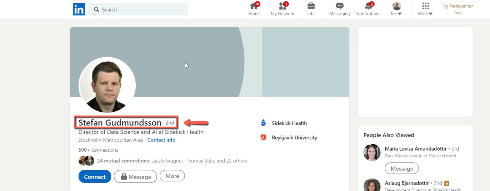
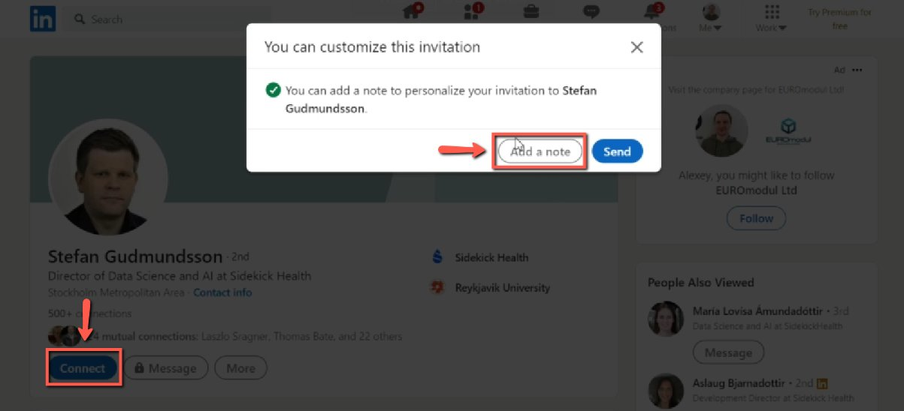
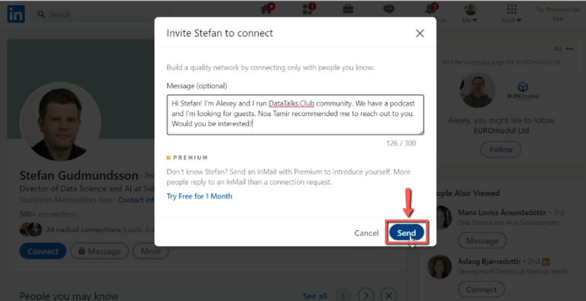

# Reach out to people on LinkedIn + following a recommendation

<!-- sop-section-start: summary -->
## Summary

- Purpose: Contact recommended prospective guests on LinkedIn.
- Outcome: A connection request with a short invitation note is sent.
- Trigger: Someone recommends a potential podcast or event guest.
- Frequency: As needed during guest outreach.
<!-- sop-section-end -->

<!-- sop-section-start: prerequisites -->
## Prerequisites

- Access: LinkedIn account used for outreach.
- Tools: LinkedIn.
- Inputs: Recommended person, recommender name when available, and outreach note.
<!-- sop-section-end -->

<!-- sop-section-start: procedure -->
## Procedure

<!-- sop-prose-start -->
How to reach out to people on LinkedIn + following a recommendation

This procedure will show you the steps on how to reach out to people on LinkedIn + following a recommendation

Step-by-step Instructions
<!-- sop-prose-end -->

<!-- sop-step-start id=1 -->
1.  The first thing you need to do is to reach out to the person recommended, through LinkedIn.

    <!-- sop-screenshot-start -->
    
    <!-- sop-caption-start -->
    This screenshot anchors the step about to reach out to the person recommended, through LinkedIn so you can match the documented UI before acting. Look for the link, copy, or paste target shown there, then use it to confirm you are in the correct place before continuing.
    <!-- sop-caption-end -->
    <!-- sop-screenshot-end -->
<!-- sop-step-end -->

<!-- sop-step-start id=2 -->
2.  Once you are in their LinkedIn profile, click "Connect" and select "Add a note"

    <!-- sop-screenshot-start -->
    
    <!-- sop-caption-start -->
    This screenshot anchors the step about once you are in their LinkedIn profile, click "Connect" and select "Add a note" so you can match the documented UI before acting. Look for “Connect” and “Add a note”, then use those cues to complete or verify the step before continuing.
    <!-- sop-caption-end -->
    <!-- sop-screenshot-end -->
<!-- sop-step-end -->

<!-- sop-step-start id=3 -->
3.  And now, you can enter a note or message for the person and click "Send".
    Example note:

    “Hi Remi! I'm \>NAME\<, Community Manager at DataTalks.Club. We organize live podcasts that feature guests from the data field. Would you be interested in being a guest?”

    Note: Don't forget to include the name of the person who recommended them, if any. In this example, it was Noa Tamir who recommended Stefan.

    <!-- sop-screenshot-start -->
    
    <!-- sop-caption-start -->
    This screenshot anchors the step about don't forget to include the name of the person who recommended them, if any. In this example, it was Noa Tamir who recomme... so you can match the documented UI before acting. Look for the relevant screen area shown there, then use it to confirm you are in the correct place before continuing.
    <!-- sop-caption-end -->
    <!-- sop-screenshot-end -->
<!-- sop-step-end -->
<!-- sop-section-end -->

<!-- sop-section-start: validation -->
## Validation

-
<!-- sop-section-end -->

<!-- sop-section-start: troubleshooting -->
## Troubleshooting

-
<!-- sop-section-end -->

<!-- sop-section-start: references -->
## References

-
<!-- sop-section-end -->
