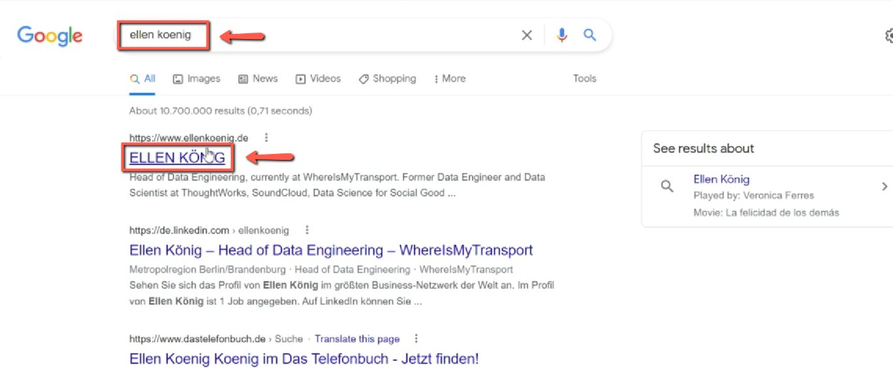
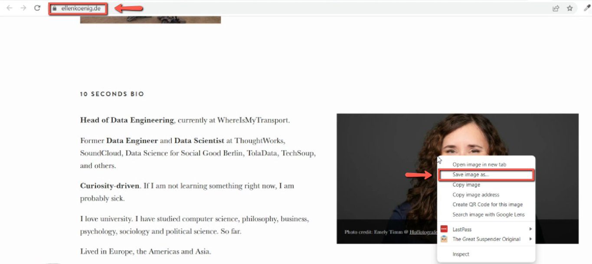
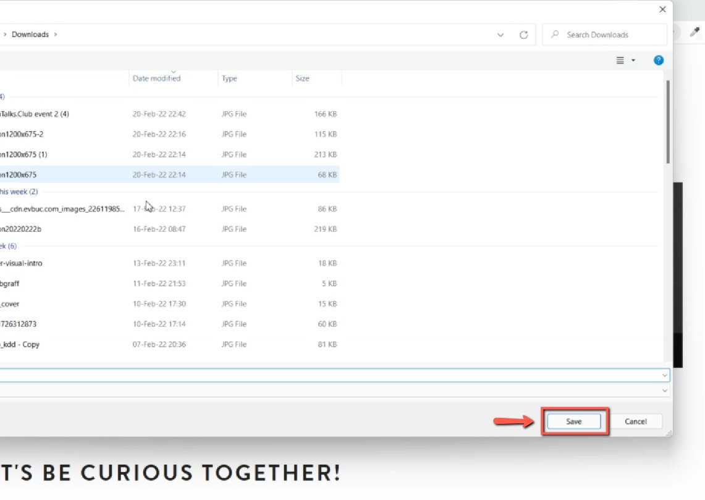
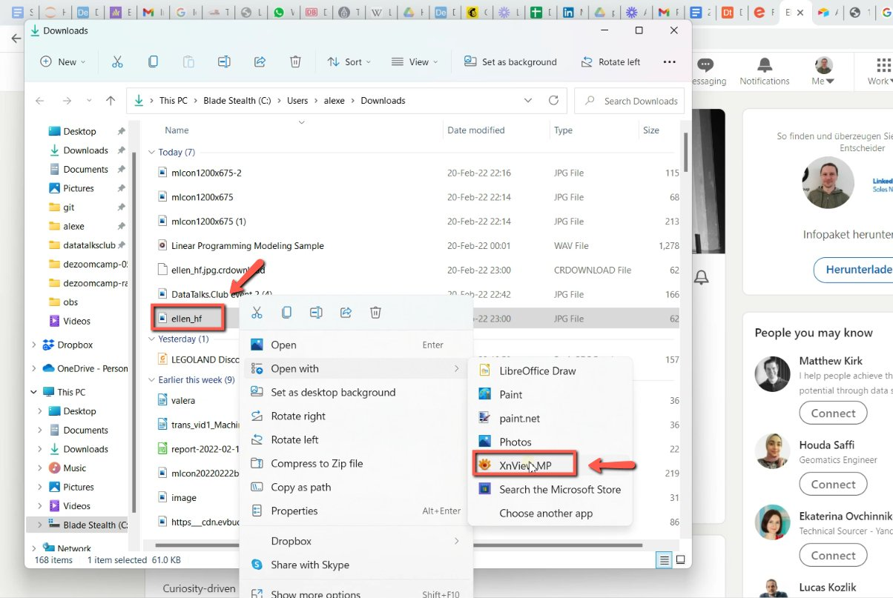
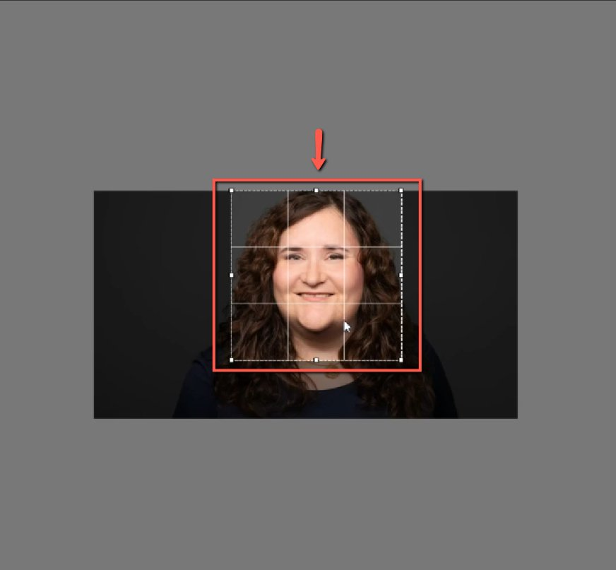

# Remove hiring in the speaker's LinkedIn picture

<!-- sop-section-start: summary -->
## Summary

- Purpose: Prepare a speaker headshot without a LinkedIn hiring overlay.
- Outcome: A clean resized speaker picture is ready for the speaker profile form.
- Trigger: The available LinkedIn picture has a hiring overlay or unsuitable filter.
- Frequency: As needed when preparing speaker profiles.
<!-- sop-section-end -->

<!-- sop-section-start: prerequisites -->
## Prerequisites

- Access: Speaker public image sources and speaker profile form.
- Tools: Browser and XnViewMP or another image editor.
- Inputs: Speaker name and clean source image.
<!-- sop-section-end -->

<!-- sop-section-start: procedure -->
## Procedure

<!-- sop-prose-start -->
How to remove “hiring” in the speaker’s LinkedIn picture

This procedure will show you the steps on how to remove “hiring” in the speaker’s LinkedIn picture.

Step-by-step Instructions
<!-- sop-prose-end -->

<!-- sop-step-start id=1 -->
1.  The first thing you need to do is search the name and find a picture of the guest on Google.

    Note: Usually, their pictures can be found on their personal website or other social media

    platforms. Make sure that there are no filters on the picture.

    <!-- sop-screenshot-start -->
    
    <!-- sop-caption-start -->
    This screenshot anchors the step about platforms. Make sure that there are no filters on the picture so you can match the documented UI before acting. Look for the relevant screen area shown there, then use it to confirm you are in the correct place before continuing.
    <!-- sop-caption-end -->
    <!-- sop-screenshot-end -->
<!-- sop-step-end -->

<!-- sop-step-start id=2 -->
2.  If you find their personal website, open it and then click their picture and select “Save image as”

    <!-- sop-screenshot-start -->
    
    <!-- sop-caption-start -->
    This screenshot anchors the step about if you find their personal website, open it and then click their picture and select “Save image as” so you can match the documented UI before acting. Look for “Save image as”, then use that cue to complete or verify the step before continuing.
    <!-- sop-caption-end -->
    <!-- sop-screenshot-end -->
<!-- sop-step-end -->

<!-- sop-step-start id=3 -->
3.  After, save it on your computer then click "Save"

    <!-- sop-screenshot-start -->
    
    <!-- sop-caption-start -->
    This screenshot anchors the step to save it on your computer then click "Save" so you can match the documented UI before acting. Look for “Save”, then use that cue to complete or verify the step before continuing.
    <!-- sop-caption-end -->
    <!-- sop-screenshot-end -->
<!-- sop-step-end -->

<!-- sop-step-start id=4 -->
4.  In order to make the picture into a headshot size, select the picture and open it with "XnViewMP"

    Note: You may also use other third-party software to edit the size of the picture.

    <!-- sop-screenshot-start -->
    
    <!-- sop-caption-start -->
    This screenshot anchors the step about in order to make the picture into a headshot size, select the picture and open it with "XnViewMP" so you can match the documented UI before acting. Look for “XnViewMP”, then use that cue to complete or verify the step before continuing.
    <!-- sop-caption-end -->
    <!-- sop-screenshot-end -->
<!-- sop-step-end -->

<!-- sop-step-start id=5 -->
5.  After resizing the picture, you can now add it to the speaker profile form.

    <!-- sop-screenshot-start -->
    
    <!-- sop-caption-start -->
    This screenshot anchors the step about resizing the picture, you can now add it to the speaker profile form so you can match the documented UI before acting. Look for the file transfer or file picker state shown there, then use it to confirm you are in the correct place before continuing.
    <!-- sop-caption-end -->
    <!-- sop-screenshot-end -->
<!-- sop-step-end -->
<!-- sop-section-end -->

<!-- sop-section-start: validation -->
## Validation

-
<!-- sop-section-end -->

<!-- sop-section-start: troubleshooting -->
## Troubleshooting

-
<!-- sop-section-end -->

<!-- sop-section-start: references -->
## References

-
<!-- sop-section-end -->
