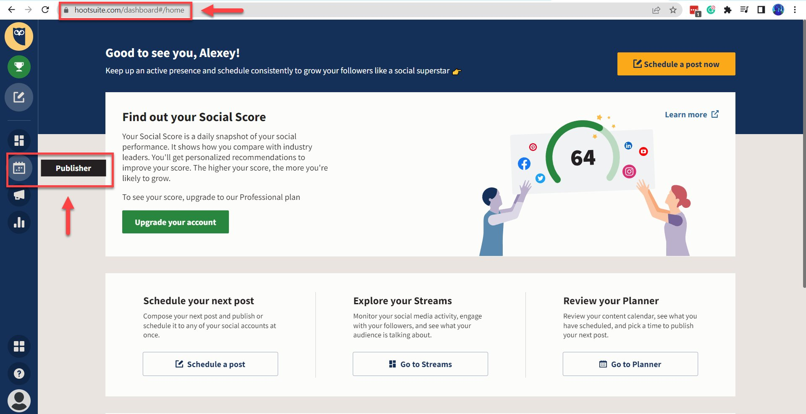
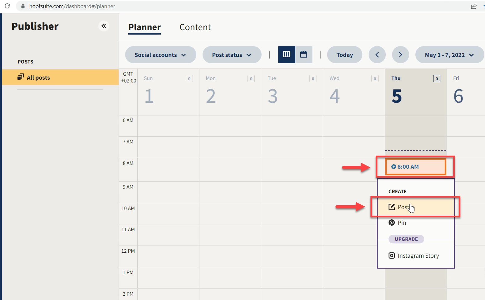
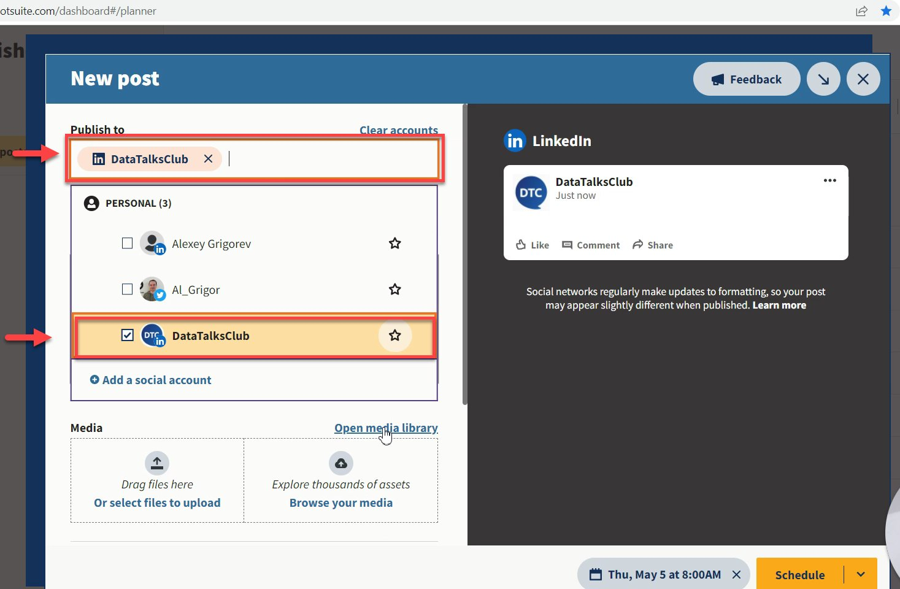
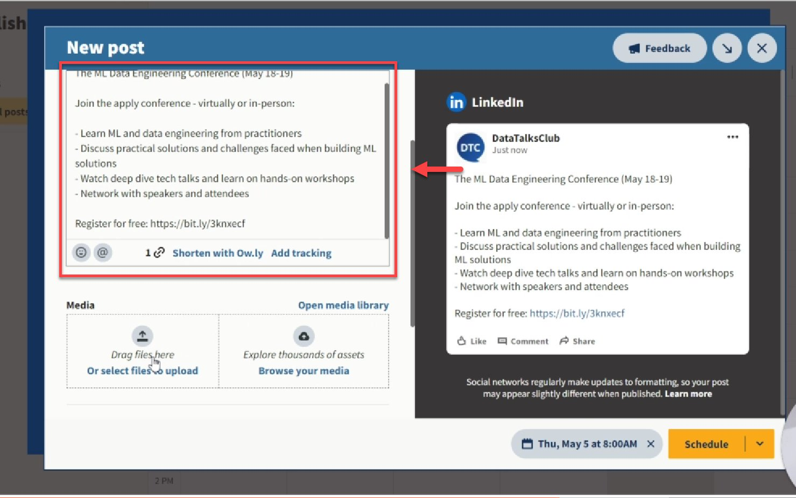
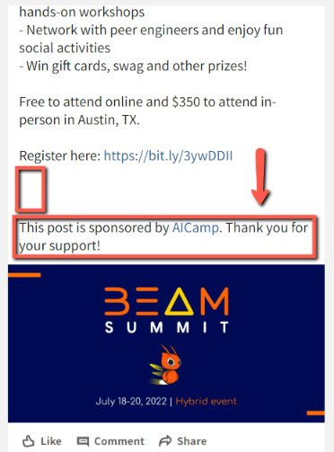
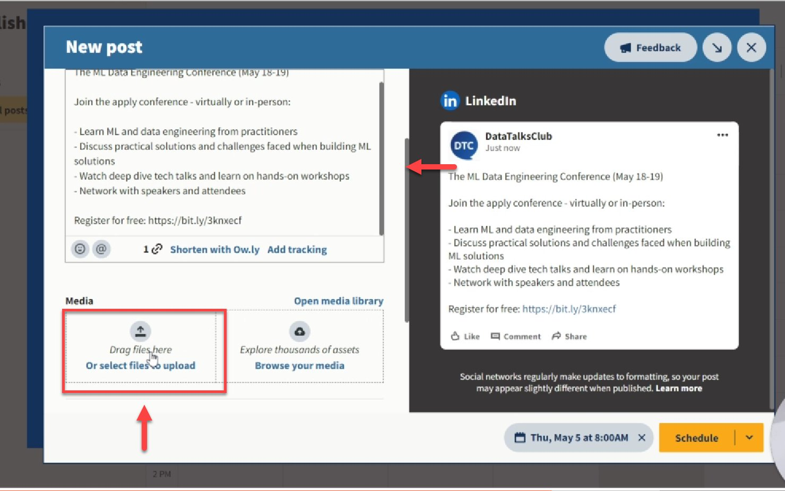
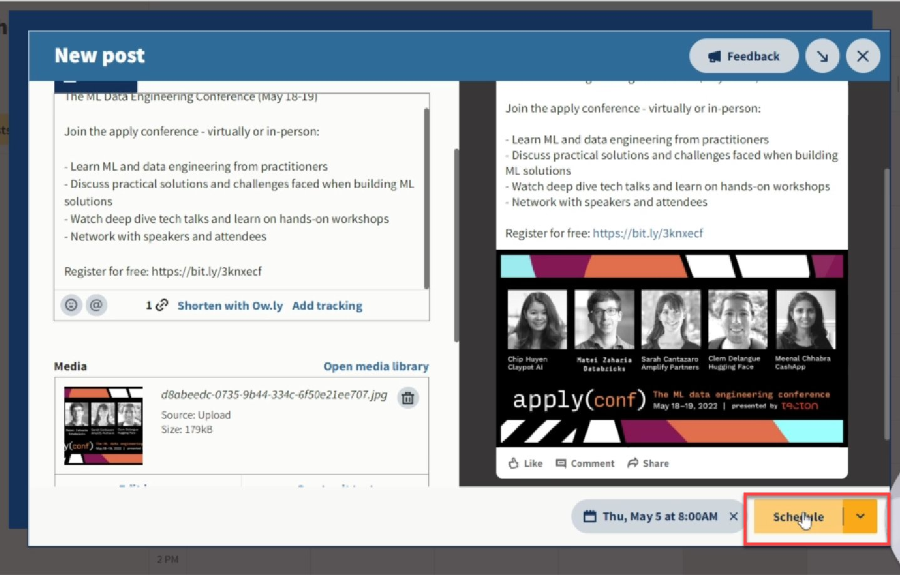

# Schedule social media posts with Hootsuite and post about newsletter promotional content

<!-- sop-section-start: summary -->
## Summary

- Purpose: Schedule sponsored newsletter promotional posts for LinkedIn in Hootsuite.
- Outcome: The LinkedIn post is scheduled with copy, media, and sponsor disclosure.
- Trigger: Newsletter promotional content needs to be scheduled on LinkedIn.
- Frequency: As needed for sponsored newsletter promotions.
<!-- sop-section-end -->

<!-- sop-section-start: prerequisites -->
## Prerequisites

- Access: Hootsuite and the DataTalks.Club LinkedIn account.
- Tools: Hootsuite Publisher.
- Inputs: Post copy, schedule date/time, media file, and sponsor disclosure.
<!-- sop-section-end -->

<!-- sop-section-start: procedure -->
## Procedure

<!-- sop-prose-start -->
How to schedule social media posts with Hootsuite and posting about newsletter promotional content
This procedure will show you the steps on how to schedule social media posts with Hootsuite and post about newsletter promotional content.

Step-by-step Instructions
<!-- sop-prose-end -->

<!-- sop-step-start id=1 -->
1.  The first thing you need to do is open [Hootsuite](https://hootsuite.com/dashboard#/home) and on the right side of your screen, click the calendar icon, “Publisher”

    <!-- sop-screenshot-start -->
    
    <!-- sop-caption-start -->
    This screenshot anchors the step to open Hootsuite and on the right side of your screen, click the calendar icon, “Publisher” so you can match the documented UI before acting. Look for “Publisher”, then use that cue to complete or verify the step before continuing.
    <!-- sop-caption-end -->
    <!-- sop-screenshot-end -->
<!-- sop-step-end -->

<!-- sop-step-start id=2 -->
2.  In the calendar, select the time and date you wish to schedule your post and select “Post”

    Note: For LinkedIn posts, it is usually scheduled every 8 AM CET.
    <!-- sop-screenshot-start -->
    
    <!-- sop-caption-start -->
    This screenshot anchors the step about for LinkedIn posts, it is usually scheduled every 8 AM CET so you can match the documented UI before acting. Look for the schedule or date control shown there, then use it to confirm you are in the correct place before continuing.
    <!-- sop-caption-end -->
    <!-- sop-screenshot-end -->
<!-- sop-step-end -->

<!-- sop-step-start id=3 -->
3.  And then, select what social account you will be using.

    Note: In this example, we will be posting through our LinkedIn account.

    <!-- sop-screenshot-start -->
    
    <!-- sop-caption-start -->
    This screenshot anchors the example shown in the procedure so you can match the documented UI before acting. Look for the link, copy, or paste target shown there, then use it to confirm you are in the correct place before continuing.
    <!-- sop-caption-end -->
    <!-- sop-screenshot-end -->
<!-- sop-step-end -->

<!-- sop-step-start id=4 -->
4.  And now, enter the description of the newsletter promotional content under “Content”

    <!-- sop-screenshot-start -->
    
    <!-- sop-caption-start -->
    This screenshot anchors the step about and now, enter the description of the newsletter promotional content under “Content” so you can match the documented UI before acting. Look for “Content”, then use that cue to complete or verify the step before continuing.
    <!-- sop-caption-end -->
    <!-- sop-screenshot-end -->
<!-- sop-step-end -->

<!-- sop-step-start id=5 -->
5.  Don’t forget to add: “This post is sponsored by \<Company\>. Thank you for your support!”

    Note: Separate it with three line breaks at least from the last sentence or phrase e.g “Register here: xxx”

    <!-- sop-screenshot-start -->
    
    <!-- sop-caption-start -->
    This screenshot anchors the step about separate it with three line breaks at least from the last sentence or phrase e.g “Register here: xxx” so you can match the documented UI before acting. Look for “Register here: xxx”, then use that cue to complete or verify the step before continuing.
    <!-- sop-caption-end -->
    <!-- sop-screenshot-end -->
<!-- sop-step-end -->

<!-- sop-step-start id=6 -->
6.  To upload a picture, click “Drag files here or select files to upload” under “Media”

    <!-- sop-screenshot-start -->
    
    <!-- sop-caption-start -->
    This screenshot anchors the step about to upload a picture, click “Drag files here or select files to upload” under “Media” so you can match the documented UI before acting. Look for “Drag files here or select files to upload” and “Media”, then use those cues to complete or verify the step before continuing.
    <!-- sop-caption-end -->
    <!-- sop-screenshot-end -->
<!-- sop-step-end -->

<!-- sop-step-start id=7 -->
7.  Lastly, select “Schedule”

    <!-- sop-screenshot-start -->
    
    <!-- sop-caption-start -->
    This screenshot anchors the step to select “Schedule” so you can match the documented UI before acting. Look for “Schedule”, then use that cue to complete or verify the step before continuing.
    <!-- sop-caption-end -->
    <!-- sop-screenshot-end -->
<!-- sop-step-end -->
<!-- sop-section-end -->

<!-- sop-section-start: validation -->
## Validation

-
<!-- sop-section-end -->

<!-- sop-section-start: troubleshooting -->
## Troubleshooting

-
<!-- sop-section-end -->

<!-- sop-section-start: references -->
## References

-
<!-- sop-section-end -->
