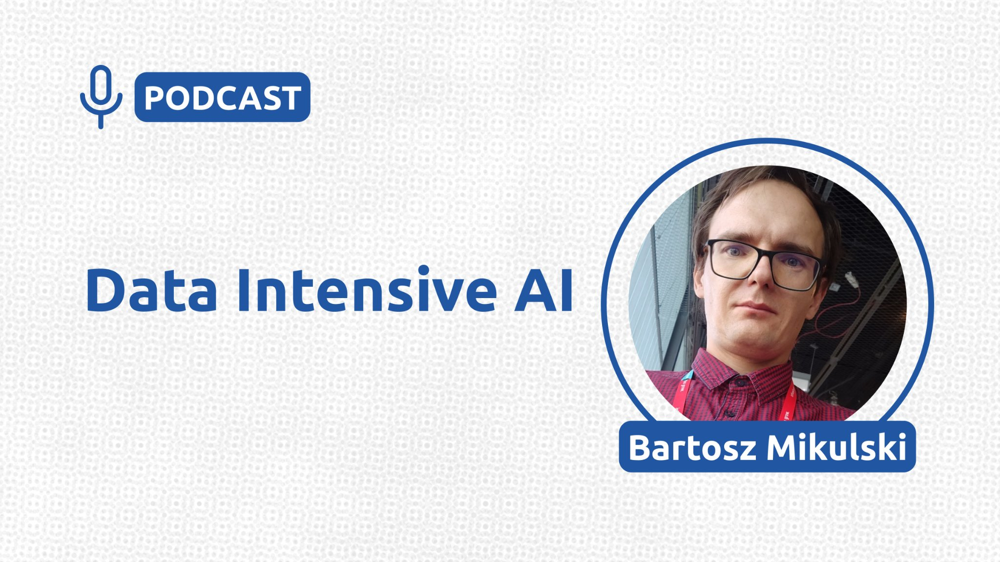
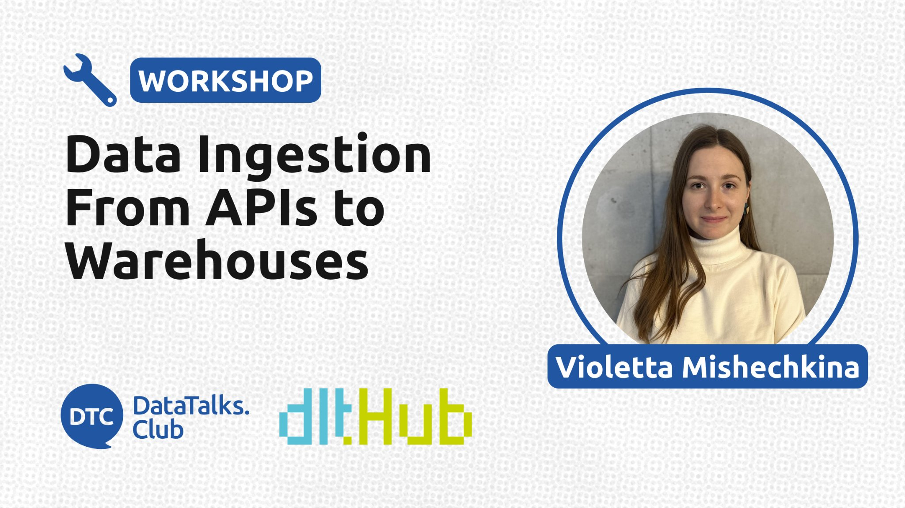
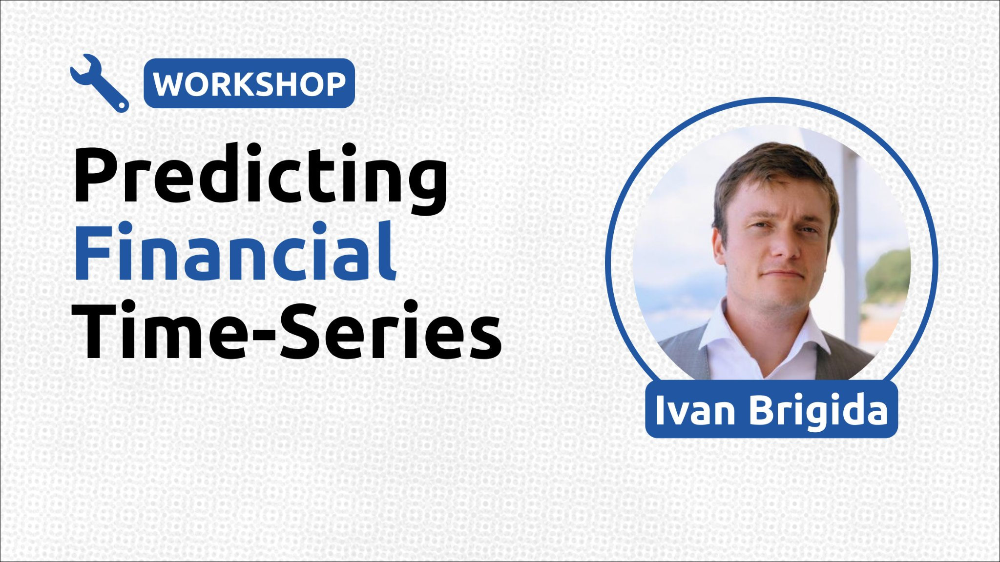
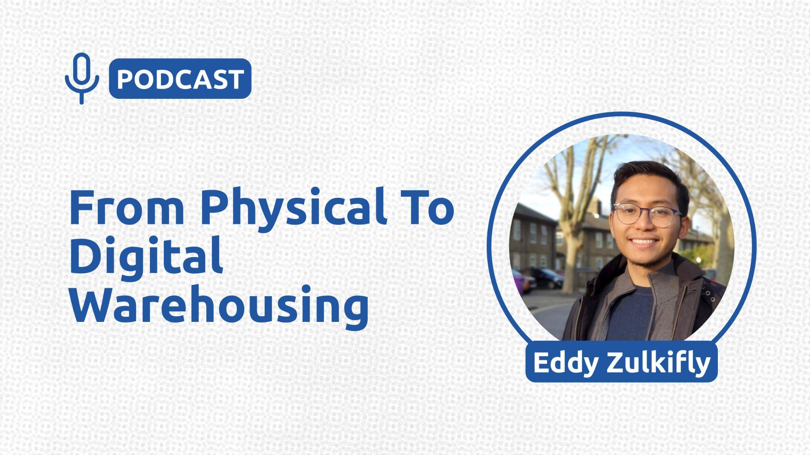
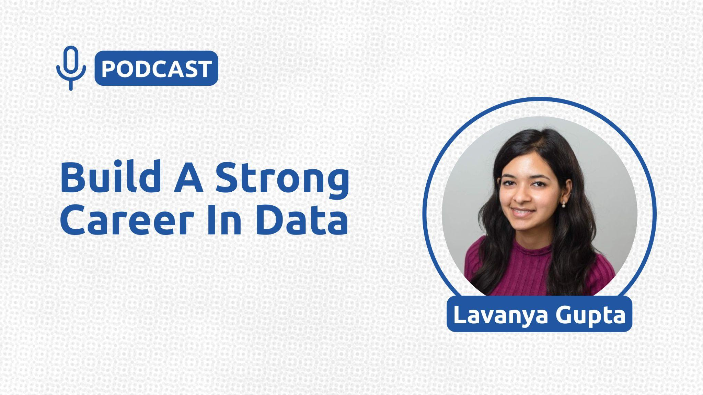

# ✅ Post. New event announcements (podcasts, webinars, workshops)

## Summary
- Purpose: Announce new podcasts, webinars, and workshops on social media.
- Outcome: Event announcement copy and banner are ready for LinkedIn and other channels.
- Trigger: A new event is ready to promote.
- Frequency: For each new podcast, webinar, or workshop announcement.
## Prerequisites

- Access: Event details, Luma event page, banner assets, and social media accounts.
- Tools: Announcement template, Figma or banner source, LinkedIn, and YouTube/Luma links.
- Inputs: Event outline, speaker name, registration link, and event banner.

## Content

### Post. New event announcements (podcasts, webinars, workshops)

POST FORMAT
\(1\) For the post, use any template from this document to begin the post and use the examples below as reference for how to complete the post.
[Template. New event announcements (podcasts, webinars, workshops)](../templates/template-new-event-announcements-podcasts-webinars-workshops.md)

Add the outline (2), link to Luma (3), and the banner of the event in rectangular format (4). Remember to use the diamonds as bullet points for the outline.

EXAMPLE
Join our future workshop on Effective Domain-Driven Design for Machine Learning Products with [Dr. Larysa Visengeriyeva](https://www.linkedin.com/in/ACoAAACCgH8Baq0I-k4s1JdhjioanaxJ5HqalnM)

In this workshop, we’ll cover the following:

🔸 Find out which problems and use cases are suitable for ML

🔸 Define and prioritize problems and opportunities for ML in business areas and projects

🔸 Learn how to use the Data Landscape Canvas

🔸 Learn the knowledge crunching method of event storming used in DDD in a case study and apply it yourself

🔸 Learn how to use the Machine Learning Canvas to structure ML projects

Register Here: \[LINK to Luma\]

Attached the banner of the event in rectangular format

EXAMPLE 2
Mark your calendars! Our next live podcast episode is happening on February 10, 2025. We'll be joined by @Bartosz Miskulski \Tagged*\*, who will share their insights on Data Intensive AI. Join us for an informative and engaging conversation!

In this workshop, we’ll cover the following:

🔸​Prompt engineering

🔸​Use of AI in companies

🔸​AI applications and use cases

🔸​RAGs (tuning, improvement, hallucinations)

Attached link: https://lu.ma/sb9hv6bp

Image note: This screenshot anchors the step about attached link: https://lu.ma/sb9hv6bp so you can match the documented UI before acting. Look for the link, copy, or paste target shown there, then use it to confirm you are in the correct place before continuing.

Example 3:
Looking for a way to advance your career in data? Join our live workshop on Data Ingestion From APIs to Warehouses and Data Lakes with @Violetta Mishechkina and gain valuable skills you can use right away.

In this hands-on workshop, we’ll dive into building data ingestion pipelines and data lakes using dlt (data load tool).

We’ll cover the following steps:

🔸Extracting data from APIs, files, and databases.

🔸Normalizing and loading data.

🔸Incremental loading.

🔸Using a filesystem destination for your data lake.

Attached link: https://lu.ma/quyfn4q8

Image note: This screenshot anchors the step about attached link: https://lu.ma/quyfn4q8 so you can match the documented UI before acting. Look for the link, copy, or paste target shown there, then use it to confirm you are in the correct place before continuing.

Example 4:
Ready to level up your data skills? Sign up for our upcoming workshop on Predicting Financial Time-Series with [@Ivan Brigida](https://www.linkedin.com/in/ivan-brigida-0b961319/) and learn by doing.

This is the second workshop in our series on financial data automation and analysis. In the first session, "[Economics and Automation Workshop: Building a Data Pipeline for Economic Insights](https://www.youtube.com/watch?v=MeDUe75WQaQ&list=PLSWnIAnueyu8KBcwhE48ASp20nZMg2qtt)" participants built an automated data pipeline to retrieve and analyze macroeconomic indicators.

In this workshop, he’ll cover the following:

🔸Introduction & Overview (Recap of the previous workshop, objectives, and agenda)

🔸​Data Acquisition & Preprocessing (Yahoo Finance API, SQLite storage, generating additional variables)

🔸​Exploratory Analysis & Time-Series Features

🔸​Forecasting Techniques (Prophet, ARIMA, Deep Learning)

🔸​Visualization & Deployment (Plotly, Streamlit Cloud, GitHub Actions)

Register here: [https://lu.ma/9qrelkgg](https://lu.ma/9qrelkgg)

Image note: This screenshot anchors the step about register here: https://lu.ma/9qrelkgg so you can match the documented UI before acting. Look for the relevant screen area shown there, then use it to confirm you are in the correct place before continuing.

Example 5:
It's almost time for our next podcast episode, and we can't wait to share it with you! Our guest is @Eddy Zulkifly, and he 'll be sharing some valuable insights and tips on From Supply Chain Management to Digital Warehousing and FinOps. Be sure to tune in!

In this podcast he will cover the following:

🔸From Supply Chain Management to Digital warehousing

🔸Digital Warehousing

🔸FinOps and Process Optimization

Register here: [https://lu.ma/gm2g0jj1](https://lu.ma/gm2g0jj1)

Image note: This screenshot anchors the step about register here: https://lu.ma/gm2g0jj1 so you can match the documented UI before acting. Look for the relevant screen area shown there, then use it to confirm you are in the correct place before continuing.

Example 6:

Have you been tuning in to our live podcast series? Don't miss our next episode on February 25 as we chat with @Lavanya Gupta about Build a Strong Career in Data. We can't wait to hear their insights!

In this podcast he will cover the following:

🔸Career Journey: From Interest to Impact

🔸Deep Dive: Research & Long-Context LLMs

🔸AI/ML Content Creation & Public Speaking

Register here: https://lu.ma/ofsco36y

Image note: This screenshot anchors the step about register here: https://lu.ma/ofsco36y so you can match the documented UI before acting. Look for the relevant screen area shown there, then use it to confirm you are in the correct place before continuing.

## References

-
