# Creating a Visual for a Book Giveaway Campaign on Twitter

<!-- sop-section-start: summary -->
## Summary

- Purpose: Create Twitter/X visuals for a book giveaway campaign.
- Outcome: Book giveaway images are updated and ready to post.
- Trigger: A book giveaway campaign needs promotional visuals.
- Frequency: For each book giveaway campaign.
<!-- sop-section-end -->

<!-- sop-section-start: prerequisites -->
## Prerequisites

- Access: Previous giveaway slide/template and book cover source.
- Tools: Google Slides or equivalent screenshot tool.
- Inputs: Book title, book cover image URL, giveaway details, and previous visual template.
<!-- sop-section-end -->

<!-- sop-section-start: procedure -->
## Procedure

<!-- sop-prose-start -->
How to Create a Visual for a Book Giveaway Campaign on Twitter.
This procedure will show you the steps on how to Create a Visual for a Book Giveaway Campaign on Twitter.

Step-by-step Instructions
<!-- sop-prose-end -->

<!-- sop-step-start id=1 -->
1.  The first thing you need to do is duplicate the slide from the previous book giveaway campaign.

    <!-- sop-screenshot-start -->
    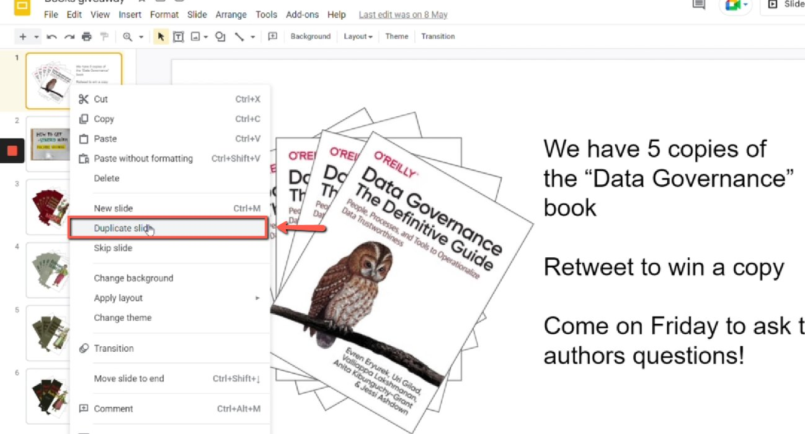
    <!-- sop-caption-start -->
    This screenshot anchors the step about duplicate the slide from the previous book giveaway campaign so you can match the documented UI before acting. Look for the relevant screen area shown there, then use it to confirm you are in the correct place before continuing.
    <!-- sop-caption-end -->
    <!-- sop-screenshot-end -->
<!-- sop-step-end -->

<!-- sop-step-start id=2 -->
2.  After duplicating, edit the information/text in the slide.

    <!-- sop-screenshot-start -->
    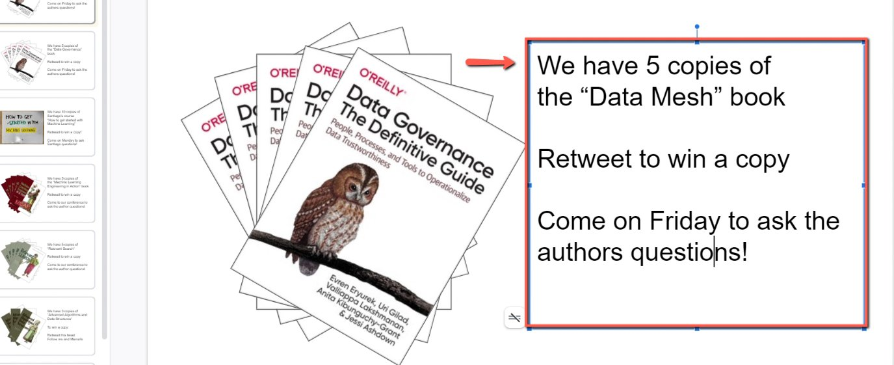
    <!-- sop-caption-start -->
    This screenshot anchors the step about duplicating, edit the information/text in the slide so you can match the documented UI before acting. Look for the relevant screen area shown there, then use it to confirm you are in the correct place before continuing.
    <!-- sop-caption-end -->
    <!-- sop-screenshot-end -->
<!-- sop-step-end -->

<!-- sop-step-start id=3 -->
3.  Next, copy the image address of the book. Right-click and select “Copy Image Address”

    Note: You can visit the publisher’s page to view the book cover.

    <!-- sop-screenshot-start -->
    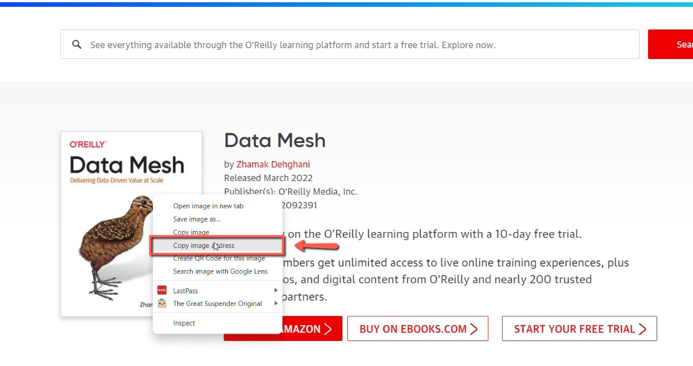
    <!-- sop-caption-start -->
    This screenshot anchors the step to copy the image address of the book. Right-click and select “Copy Image Address” so you can match the documented UI before acting. Look for “Copy Image Address”, then use that cue to complete or verify the step before continuing.
    <!-- sop-caption-end -->
    <!-- sop-screenshot-end -->
<!-- sop-step-end -->

<!-- sop-step-start id=4 -->
4.  Go back to the Google slide, right-click the picture and point your mouse to “Replace Image” and select “By URL”

    <!-- sop-screenshot-start -->
    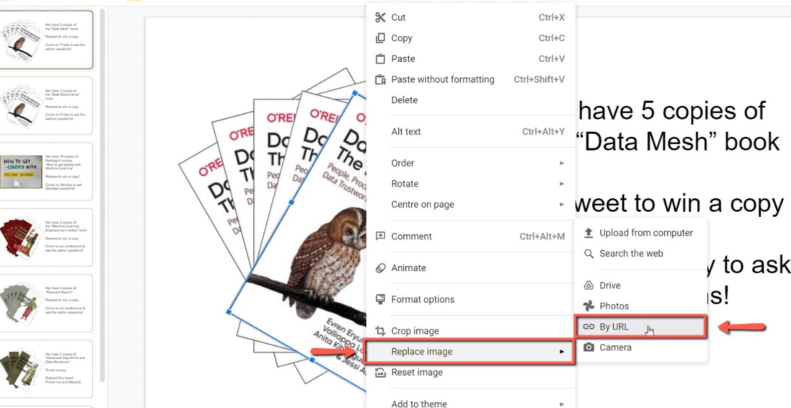
    <!-- sop-caption-start -->
    This screenshot anchors the step to go back to the Google slide, right-click the picture and point your mouse to “Replace Image” and select “By URL” so you can match the documented UI before acting. Look for “Replace Image” and “By URL”, then use those cues to complete or verify the step before continuing.
    <!-- sop-caption-end -->
    <!-- sop-screenshot-end -->
<!-- sop-step-end -->

<!-- sop-step-start id=5 -->
5.  And then, paste the image address under the “Replace Image” field.

    <!-- sop-screenshot-start -->
    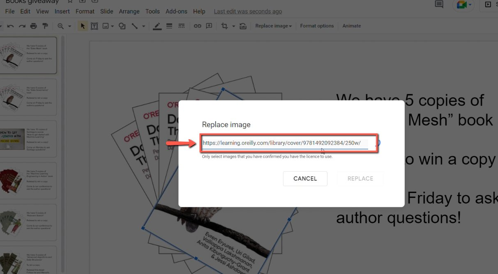
    <!-- sop-caption-start -->
    This screenshot anchors the step to paste the image address under the “Replace Image” field so you can match the documented UI before acting. Look for “Replace Image”, then use that cue to complete or verify the step before continuing.
    <!-- sop-caption-end -->
    <!-- sop-screenshot-end -->
<!-- sop-step-end -->

<!-- sop-step-start id=6 -->
6.  Then, click “Replace”

    <!-- sop-screenshot-start -->
    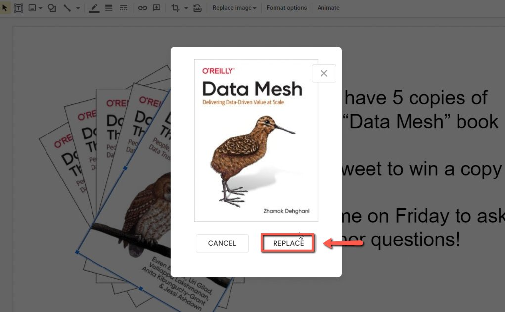
    <!-- sop-caption-start -->
    This screenshot anchors the step to click “Replace” so you can match the documented UI before acting. Look for “Replace”, then use that cue to complete or verify the step before continuing.
    <!-- sop-caption-end -->
    <!-- sop-screenshot-end -->
<!-- sop-step-end -->

<!-- sop-step-start id=7 -->
7.  Once done, repeat the process to the other images.

    Note: In this example, we repeated the process 5 times since there are 5 images.

    <!-- sop-screenshot-start -->
    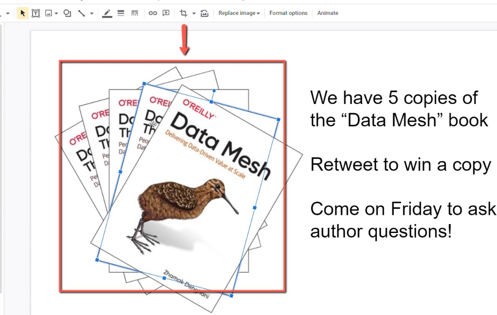
    <!-- sop-caption-start -->
    This screenshot anchors the example shown in the procedure so you can match the documented UI before acting. Look for the schedule or date control shown there, then use it to confirm you are in the correct place before continuing.
    <!-- sop-caption-end -->
    <!-- sop-screenshot-end -->
<!-- sop-step-end -->

<!-- sop-step-start id=8 -->
8.  To proceed, take a screenshot of the Visual.

    Note: You can use any software to take screenshots or use “Window + Shift +S”

    <!-- sop-screenshot-start -->
    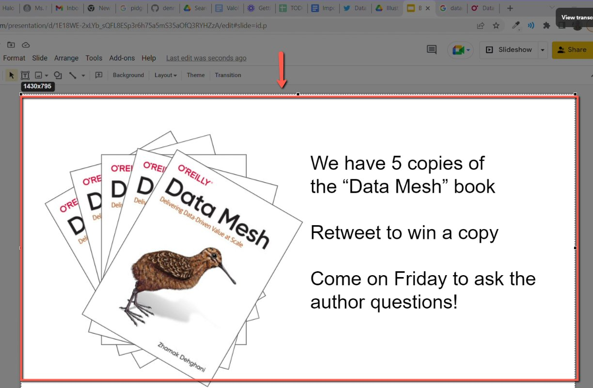
    <!-- sop-caption-start -->
    This screenshot anchors the step about you can use any software to take screenshots or use “Window + Shift +S” so you can match the documented UI before acting. Look for “Window + Shift +S”, then use that cue to complete or verify the step before continuing.
    <!-- sop-caption-end -->
    <!-- sop-screenshot-end -->
<!-- sop-step-end -->

<!-- sop-step-start id=9 -->
9.  In announcing the giveaway, open DataTalks.Club’s Twitter account and select “Tweet”

    <!-- sop-screenshot-start -->
    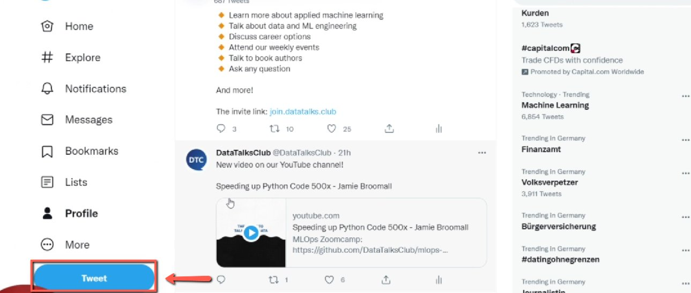
    <!-- sop-caption-start -->
    This screenshot anchors the step about in announcing the giveaway, open DataTalks.Club’s Twitter account and select “Tweet” so you can match the documented UI before acting. Look for “Tweet”, then use that cue to complete or verify the step before continuing.
    <!-- sop-caption-end -->
    <!-- sop-screenshot-end -->
<!-- sop-step-end -->

<!-- sop-step-start id=10 -->
10. Then, paste the copied image on the clipboard, and press “Ctrl + V”

    <!-- sop-screenshot-start -->
    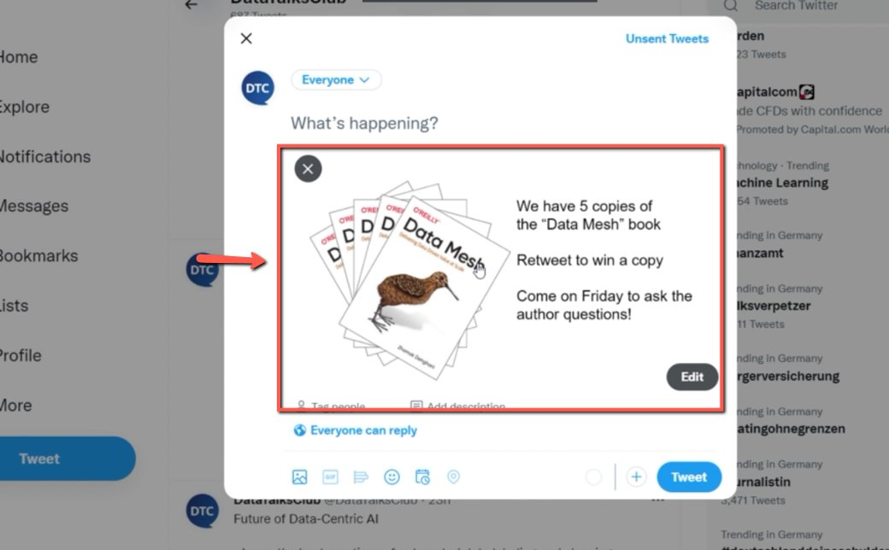
    <!-- sop-caption-start -->
    This screenshot anchors the step to paste the copied image on the clipboard, and press “Ctrl + V” so you can match the documented UI before acting. Look for “Ctrl + V”, then use that cue to complete or verify the step before continuing.
    <!-- sop-caption-end -->
    <!-- sop-screenshot-end -->
<!-- sop-step-end -->

<!-- sop-step-start id=11 -->
11. And enter the caption of the book giveaway.

    Note: Tag the author’s Twitter account and include the event page link in the caption.

    <!-- sop-screenshot-start -->
    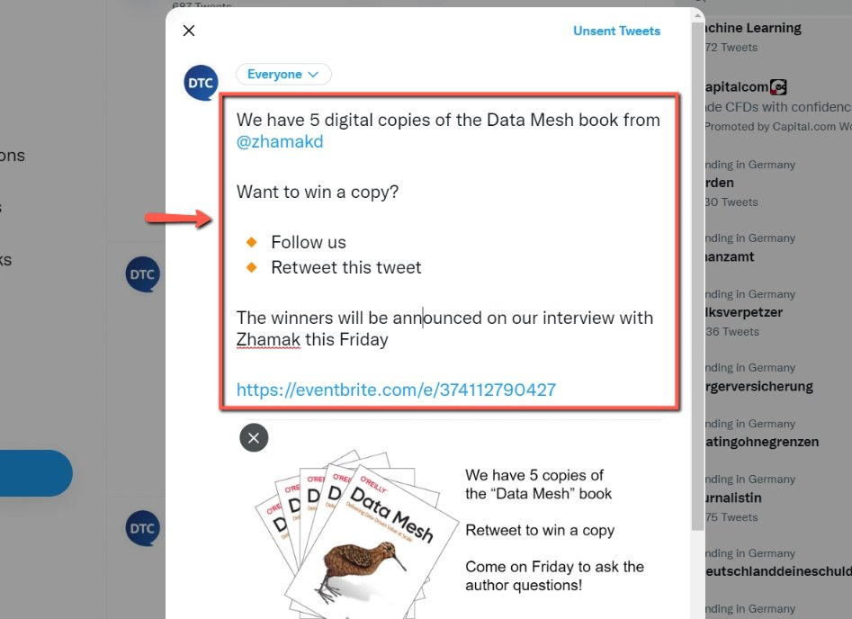
    <!-- sop-caption-start -->
    This screenshot anchors the step about tagging the author’s Twitter account and including the event page link in the caption so you can match the documented UI before acting. Look for the link, copy, or paste target shown there, then use it to confirm you are in the correct place before continuing.
    <!-- sop-caption-end -->
    <!-- sop-screenshot-end -->
<!-- sop-step-end -->

<!-- sop-step-start id=12 -->
12. After reviewing the caption, click “Tweet”

    <!-- sop-screenshot-start -->
    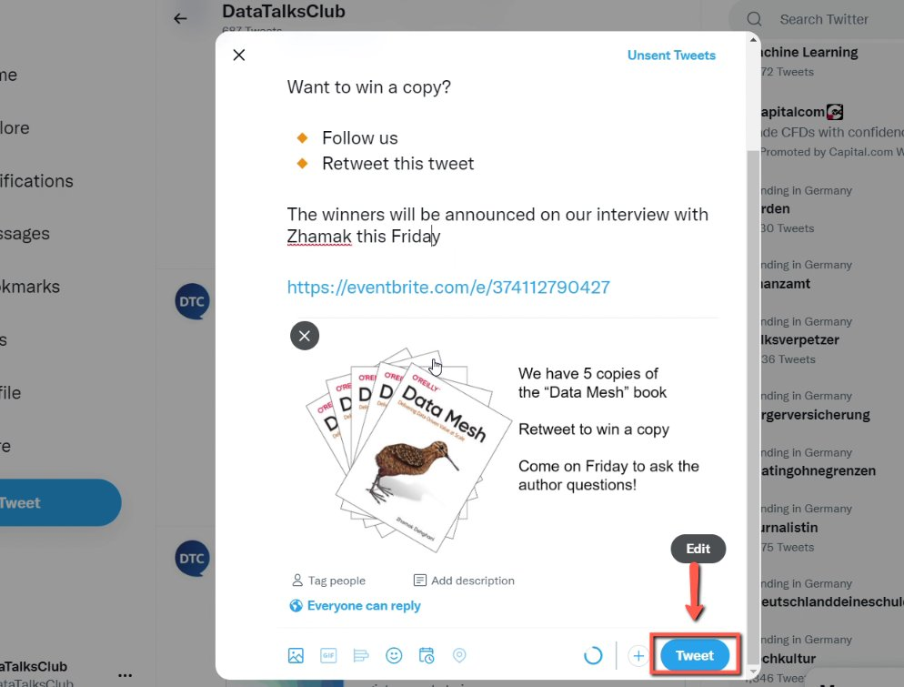
    <!-- sop-caption-start -->
    This screenshot anchors the step about reviewing the caption, click “Tweet” so you can match the documented UI before acting. Look for “Tweet”, then use that cue to complete or verify the step before continuing.
    <!-- sop-caption-end -->
    <!-- sop-screenshot-end -->
<!-- sop-step-end -->
<!-- sop-section-end -->

<!-- sop-section-start: validation -->
## Validation

-
<!-- sop-section-end -->

<!-- sop-section-start: troubleshooting -->
## Troubleshooting

-
<!-- sop-section-end -->

<!-- sop-section-start: references -->
## References

-
<!-- sop-section-end -->
