# Creating post for sponsored content on X

<!-- sop-section-start: summary -->
## Summary

- Purpose: Create and schedule a sponsored content post on X.
- Outcome: The sponsored X post is scheduled with copy, link, banner, and timing.
- Trigger: Sponsored newsletter content needs an X promotion.
- Frequency: For each sponsored X promotion.
<!-- sop-section-end -->

<!-- sop-section-start: prerequisites -->
## Prerequisites

- Access: DataTalks.Club X account and Trello sponsorship card.
- Tools: X and Trello.
- Inputs: Sponsorship document, Twitter/X template, registration link, banner image, and schedule time.
<!-- sop-section-end -->

<!-- sop-section-start: procedure -->
## Procedure

<!-- sop-prose-start -->
This procedure will show you the steps on how to schedule posts with Twitter and post about newsletter promotional content
<!-- sop-prose-end -->

<!-- sop-group-start: "Step-by-step instructions" -->
### Step-by-step instructions

<!-- sop-step-start id=1 -->
1.  The first thing you need to do is open [https://x.com/DataTalksClub](https://x.com/DataTalksClub) and click the “Post” button.

    <!-- sop-screenshot-start -->
    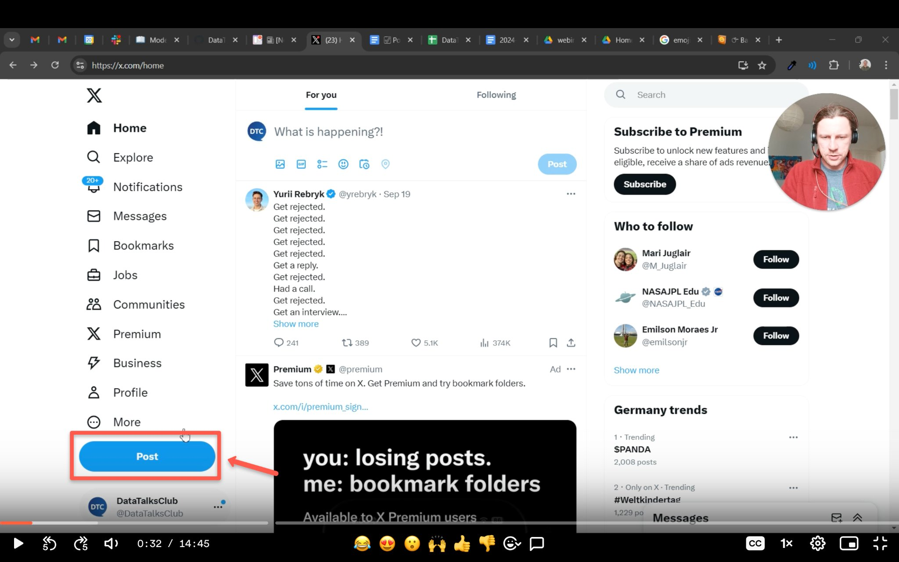
    <!-- sop-caption-start -->
    This screenshot anchors the step to open https://x.com/DataTalksClub and click the “Post” button so you can match the documented UI before acting. Look for “Post”, then use that cue to complete or verify the step before continuing.
    <!-- sop-caption-end -->
    <!-- sop-screenshot-end -->
<!-- sop-step-end -->

<!-- sop-step-start id=2 -->
2.  On another tab, open Trello and click the sponsorship document found in the corresponding sponsored newsletter card to find templates.

    <!-- sop-screenshot-start -->
    
    <!-- sop-caption-start -->
    This screenshot anchors the step about on another tab, open Trello and click the sponsorship document found in the corresponding sponsored newsletter card to fin... so you can match the documented UI before acting. Look for the reporting value or action control shown there, then use it to confirm you are in the correct place before continuing.
    <!-- sop-caption-end -->
    <!-- sop-screenshot-end -->
<!-- sop-step-end -->

<!-- sop-step-start id=3 -->
3.  In the sponsorship document, copy the text under the “Template for Twitter.”

    <!-- sop-screenshot-start -->
    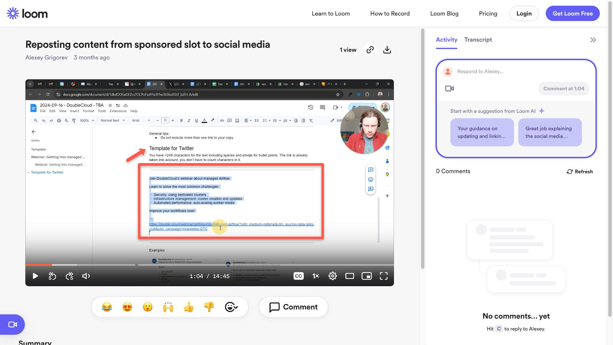
    <!-- sop-caption-start -->
    This screenshot anchors the step about in the sponsorship document, copy the text under the “Template for Twitter.” so you can match the documented UI before acting. Look for “Template for Twitter.”, then use that cue to complete or verify the step before continuing.
    <!-- sop-caption-end -->
    <!-- sop-screenshot-end -->
<!-- sop-step-end -->

<!-- sop-step-start id=4 -->
4.  Paste it on the draft post on X.

    Note: X has a text limit. With this, we need to erase some descriptions and make the text shorter so that it will not exceed the limit. Don’t forget to follow [proper punctuation](https://docs.google.com/document/d/192lEpUc6WemtooqcqNiHub-7OTTJAHe2k-mJg-bUWYI/edit?usp=sharing) and spacing.

    <!-- sop-screenshot-start -->
    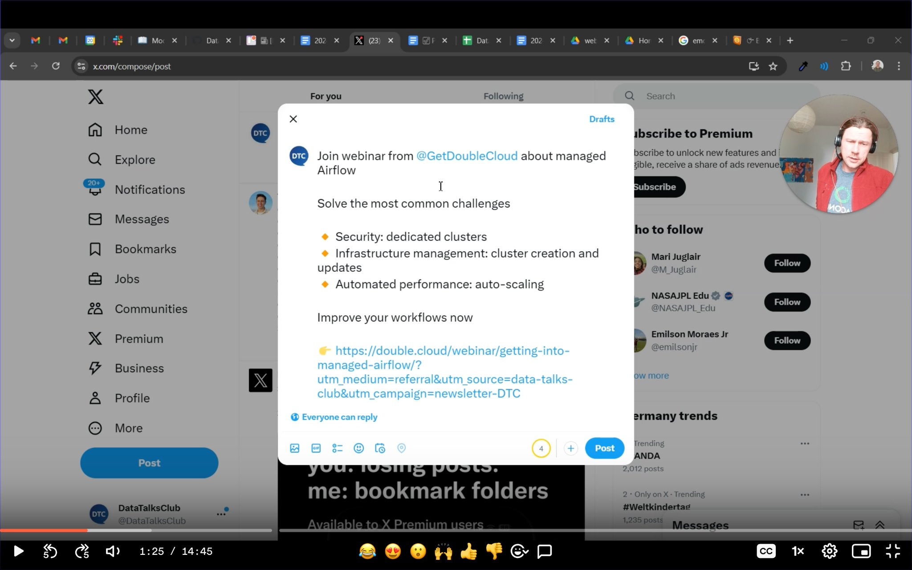
    <!-- sop-caption-start -->
    This screenshot anchors the step to paste it on the draft post on X so you can match the documented UI before acting. Look for the link, copy, or paste target shown there, then use it to confirm you are in the correct place before continuing.
    <!-- sop-caption-end -->
    <!-- sop-screenshot-end -->
<!-- sop-step-end -->

<!-- sop-step-start id=5 -->
5.  Remove the preview that will appear after the link.

    <!-- sop-screenshot-start -->
    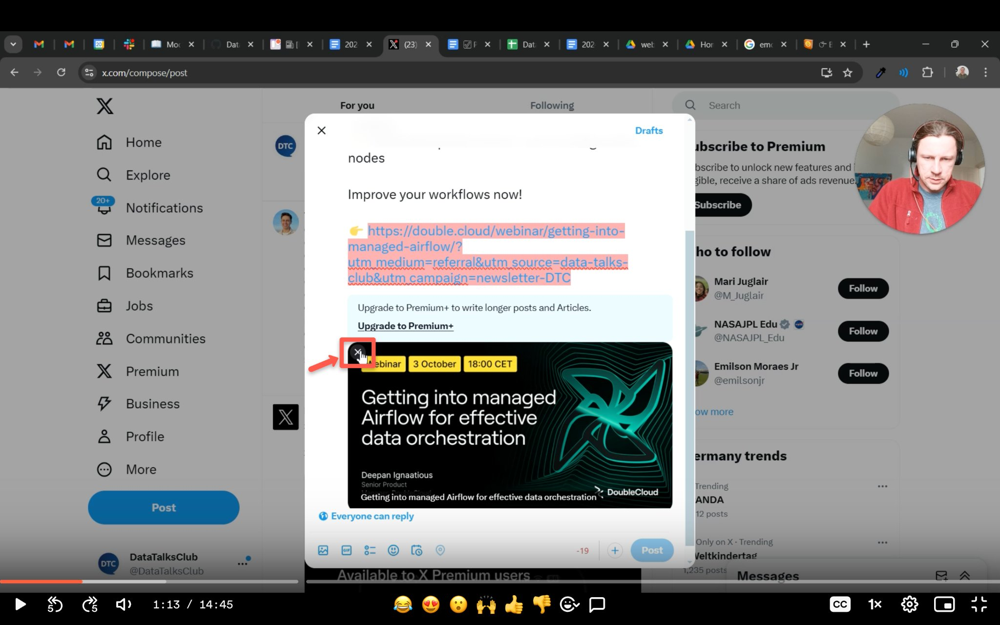
    <!-- sop-caption-start -->
    This screenshot anchors the step to remove the preview that will appear after the link so you can match the documented UI before acting. Look for the link, copy, or paste target shown there, then use it to confirm you are in the correct place before continuing.
    <!-- sop-caption-end -->
    <!-- sop-screenshot-end -->
<!-- sop-step-end -->

<!-- sop-step-start id=6 -->
6.  Go back to the sponsorship document. Find the edited webinar banner file and download it.

    <!-- sop-screenshot-start -->
    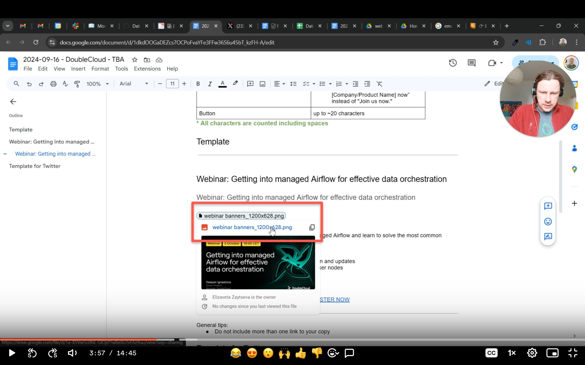
    <!-- sop-caption-start -->
    This screenshot anchors the step to go back to the sponsorship document. Find the edited webinar banner file and download it so you can match the documented UI before acting. Look for the file transfer or file picker state shown there, then use it to confirm you are in the correct place before continuing.
    <!-- sop-caption-end -->
    <!-- sop-screenshot-end -->
<!-- sop-step-end -->

<!-- sop-step-start id=7 -->
7.  Click the “media” button and upload the edited webinar banner from your files.

    <!-- sop-screenshot-start -->
    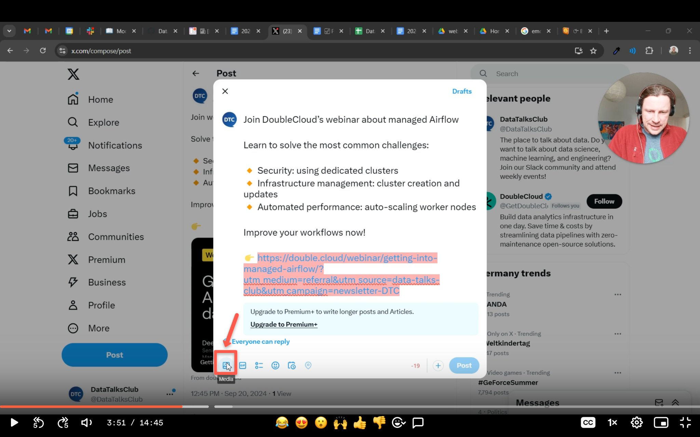
    <!-- sop-caption-start -->
    This screenshot anchors the step to click the “media” button and upload the edited webinar banner from your files so you can match the documented UI before acting. Look for “media”, then use that cue to complete or verify the step before continuing.
    <!-- sop-caption-end -->
    <!-- sop-screenshot-end -->
<!-- sop-step-end -->

<!-- sop-step-start id=8 -->
8.  After the edited webinar banner has been added, click the “schedule” button to schedule the post.

    <!-- sop-screenshot-start -->
    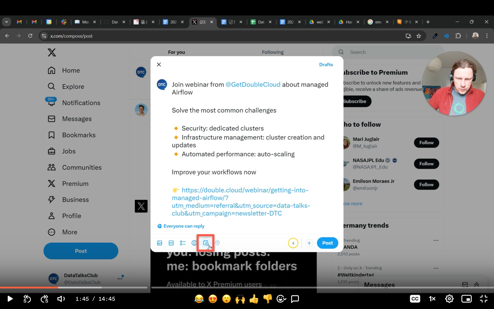
    <!-- sop-caption-start -->
    This screenshot anchors the step about the edited webinar banner has been added, click the “schedule” button to schedule the post so you can match the documented UI before acting. Look for “schedule”, then use that cue to complete or verify the step before continuing.
    <!-- sop-caption-end -->
    <!-- sop-screenshot-end -->
<!-- sop-step-end -->

<!-- sop-step-start id=9 -->
9.  Edit the date and time according to the corresponding content plan. Typically, the scheduled post for sponsored content is on a *Wednesday*.

    Note: X does not let you select a timezone. So, make sure that the time is aligned to Central European Timezone (CET) or Berlin Time.

    <!-- sop-screenshot-start -->
    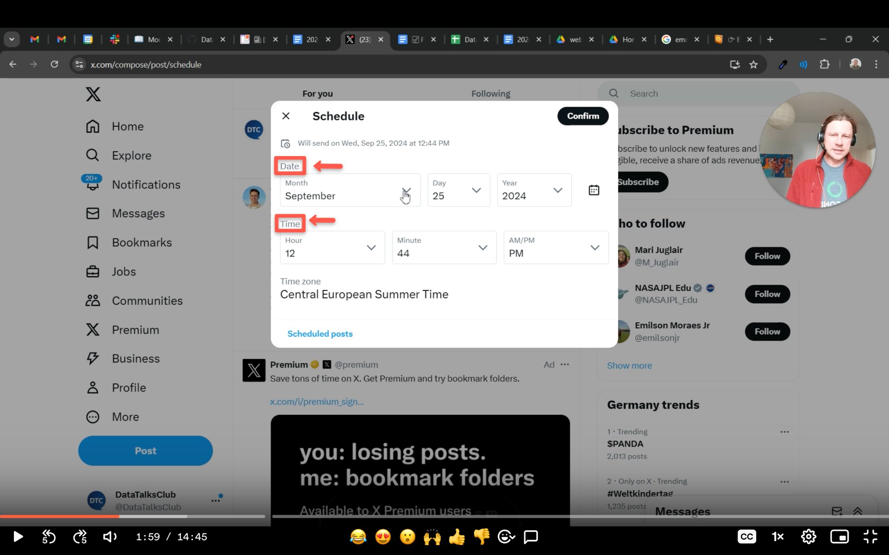
    <!-- sop-caption-start -->
    This screenshot anchors the step to edit the date and time according to the corresponding content plan. Typically, the scheduled post for sponsored content is... so you can match the documented UI before acting. Look for the schedule or date control shown there, then use it to confirm you are in the correct place before continuing.
    <!-- sop-caption-end -->
    <!-- sop-screenshot-end -->
<!-- sop-step-end -->

<!-- sop-step-start id=10 -->
10. To help you with the timezone, you can search for conversion from your timezone to CET or Berlin timezone on google.

    Note: In this example, we are converting 9:00 AM Berlin Time to Manila Time. It is shown that 9:00 AM in Berlin is 4:00 PM in Manila. So, if you are trying to schedule a 9:00 AM CET time (but you are in a Manila Timezone) , schedule it at 4:00 PM.

    <!-- sop-screenshot-start -->
    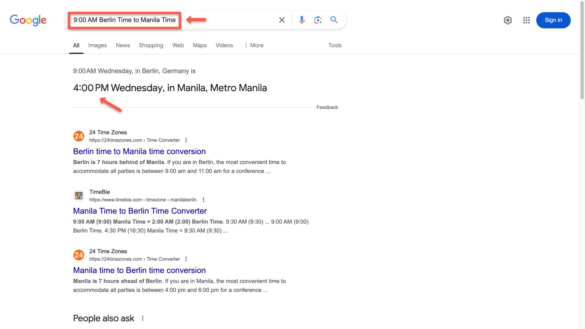
    <!-- sop-caption-start -->
    This screenshot anchors the example shown in the procedure so you can match the documented UI before acting. Look for the schedule or date control shown there, then use it to confirm you are in the correct place before continuing.
    <!-- sop-caption-end -->
    <!-- sop-screenshot-end -->
<!-- sop-step-end -->

<!-- sop-step-start id=11 -->
11. After that, click the “schedule” button to schedule the post.

    <!-- sop-screenshot-start -->
    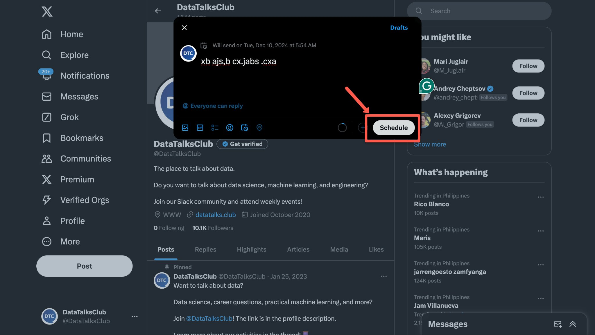
    <!-- sop-caption-start -->
    This screenshot anchors the step to click the “schedule” button to schedule the post so you can match the documented UI before acting. Look for “schedule”, then use that cue to complete or verify the step before continuing.
    <!-- sop-caption-end -->
    <!-- sop-screenshot-end -->
<!-- sop-step-end -->

<!-- sop-group-end -->

<!-- sop-group-start: "After the post has been posted." -->
### After the post has been posted.

<!-- sop-step-start id=12 -->
12. Comment on the post and indicate that it is sponsored through this format:

    “This post is sponsored by \[SPONSOR\]. Thank you for supporting our community!”

    Note: The account of the sponsor should be mentioned.

    <!-- sop-screenshot-start -->
    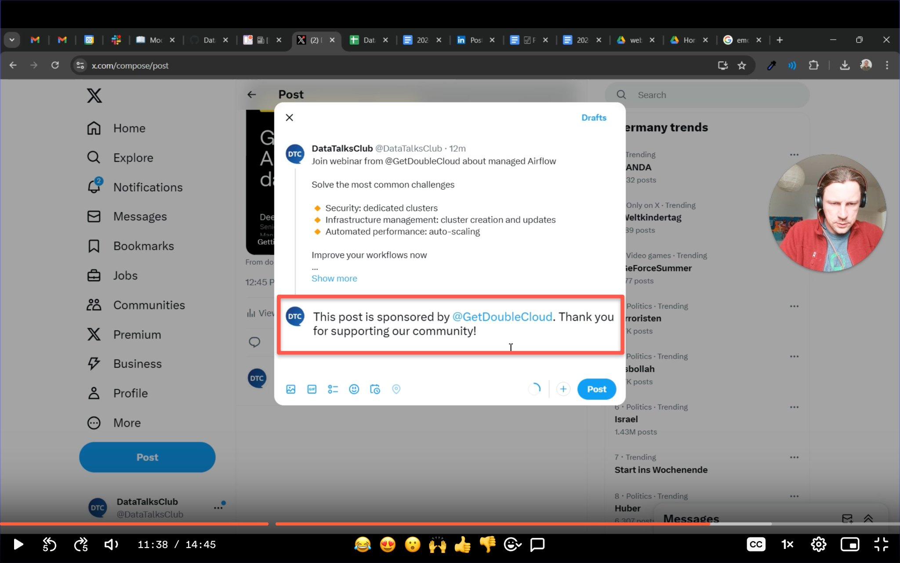
    <!-- sop-caption-start -->
    This screenshot anchors the step about “This post is sponsored by [SPONSOR]. Thank you for supporting our community!” so you can match the documented UI before acting. Look for the post composer or published post shown there, then use it to confirm you are in the correct place before continuing.
    <!-- sop-caption-end -->
    <!-- sop-screenshot-end -->
<!-- sop-step-end -->

<!-- sop-step-start id=13 -->
13. Copy the link to the sponsored X post.

    <!-- sop-screenshot-start -->
    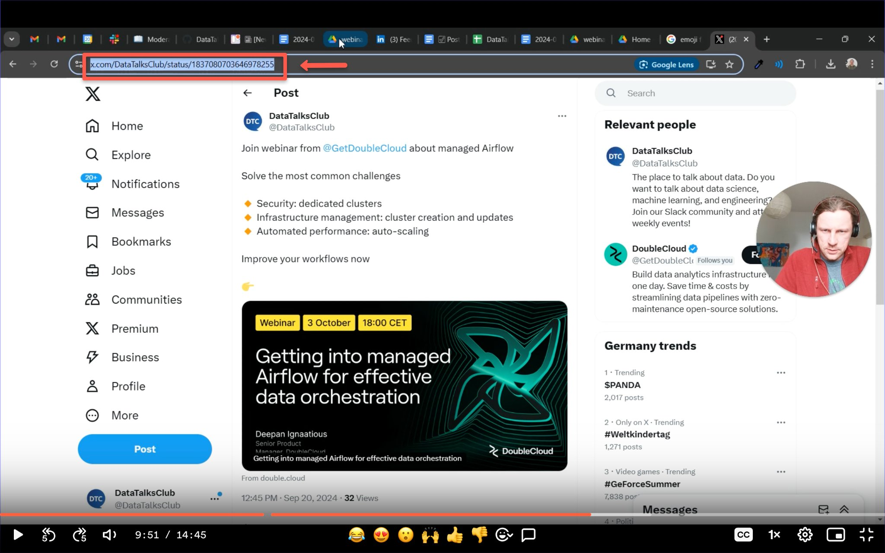
    <!-- sop-caption-start -->
    This screenshot anchors the step to copy the link to the sponsored X post so you can match the documented UI before acting. Look for the link, copy, or paste target shown there, then use it to confirm you are in the correct place before continuing.
    <!-- sop-caption-end -->
    <!-- sop-screenshot-end -->
<!-- sop-step-end -->

<!-- sop-step-start id=14 -->
14. Open Trello and paste the link of the X post on the corresponding sponsored newsletter card. Save the changes.

    <!-- sop-screenshot-start -->
    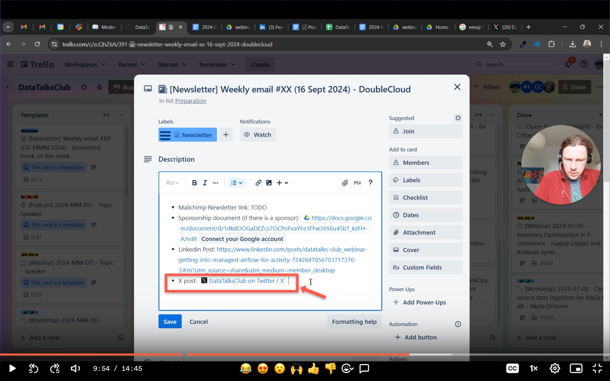
    <!-- sop-caption-start -->
    This screenshot anchors the step to open Trello and paste the link of the X post on the corresponding sponsored newsletter card. Save the changes so you can match the documented UI before acting. Look for the link, copy, or paste target shown there, then use it to confirm you are in the correct place before continuing.
    <!-- sop-caption-end -->
    <!-- sop-screenshot-end -->
<!-- sop-step-end -->

<!-- sop-step-start id=15 -->
15. Open the DataTalks.Club schedule sheets [https://docs.google.com/spreadsheets/d/1-T8qkmShlFUrT2NmkI8Pi1NgUS9IunP6wO5-L79xe2s/edit?gid=1710801712#gid=1710801712](https://docs.google.com/spreadsheets/d/1-T8qkmShlFUrT2NmkI8Pi1NgUS9IunP6wO5-L79xe2s/edit?gid=1710801712#gid=1710801712) and paste the link of the X post under the “*Twitter post”* column of the corresponding sponsor.

    <!-- sop-screenshot-start -->
    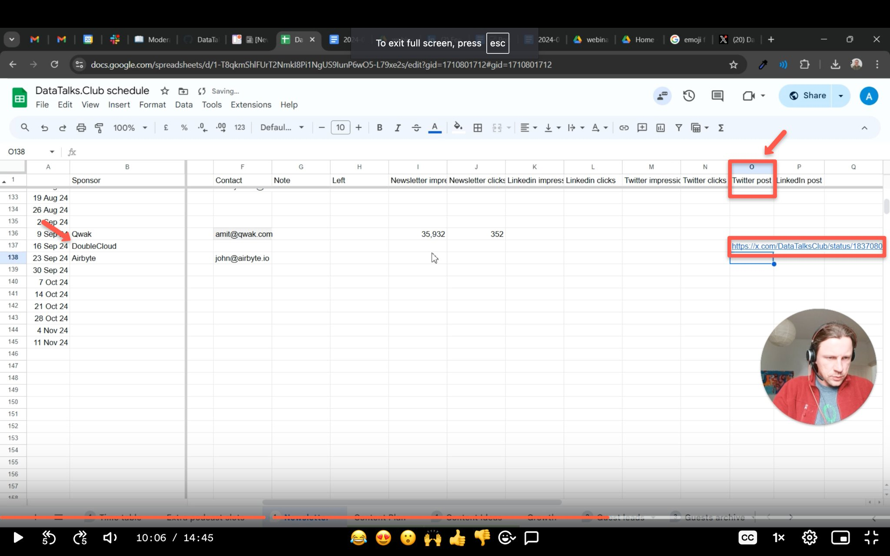
    <!-- sop-caption-start -->
    This screenshot anchors the step to open the DataTalks.Club schedule sheets https://docs.google.com/spreadsheets/d/1-T8qkmShlFUrT2NmkI8Pi1NgUS9IunP6wO5-L79xe2... so you can match the documented UI before acting. Look for “*Twitter post”, then use that cue to complete or verify the step before continuing.
    <!-- sop-caption-end -->
    <!-- sop-screenshot-end -->
<!-- sop-step-end -->

<!-- sop-step-start id=16 -->
16. Log-in on X using Alexey’s account. Click the "Like" and “Repost” button of the sponsored post. This is to amplify the post, so that many people would see it.

    <!-- sop-screenshot-start -->
    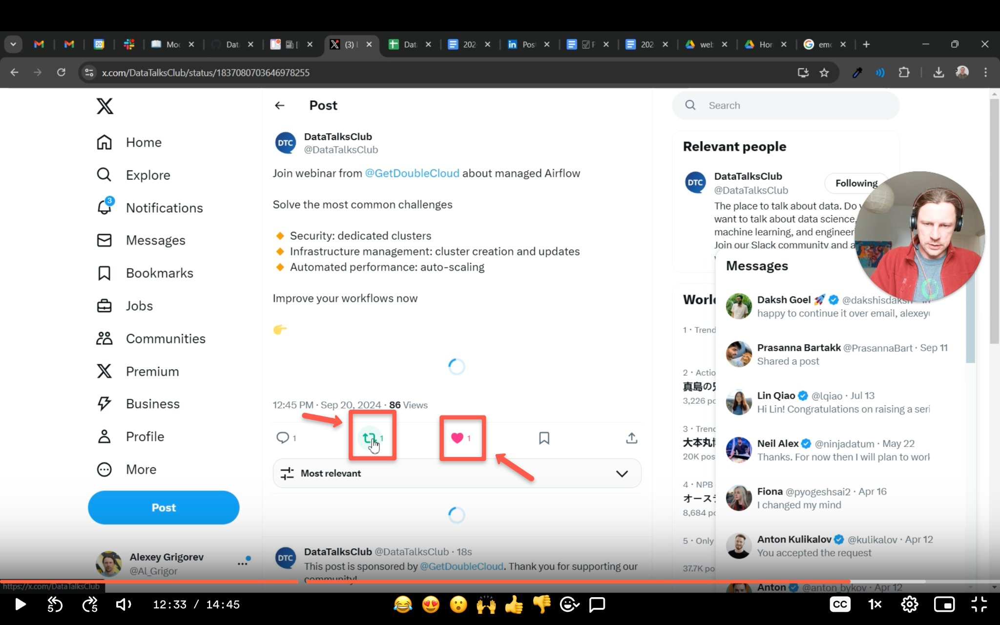
    <!-- sop-caption-start -->
    This screenshot anchors the step about log-in on X using Alexey’s account. Click the "Like" and “Repost” button of the sponsored post. This is to amplify the pos... so you can match the documented UI before acting. Look for “Like” and “Repost”, then use those cues to complete or verify the step before continuing.
    <!-- sop-caption-end -->
    <!-- sop-screenshot-end -->
<!-- sop-step-end -->

<!-- sop-group-end -->
<!-- sop-section-end -->

<!-- sop-section-start: validation -->
## Validation

-
<!-- sop-section-end -->

<!-- sop-section-start: troubleshooting -->
## Troubleshooting

-
<!-- sop-section-end -->

<!-- sop-section-start: references -->
## References

-
<!-- sop-section-end -->
