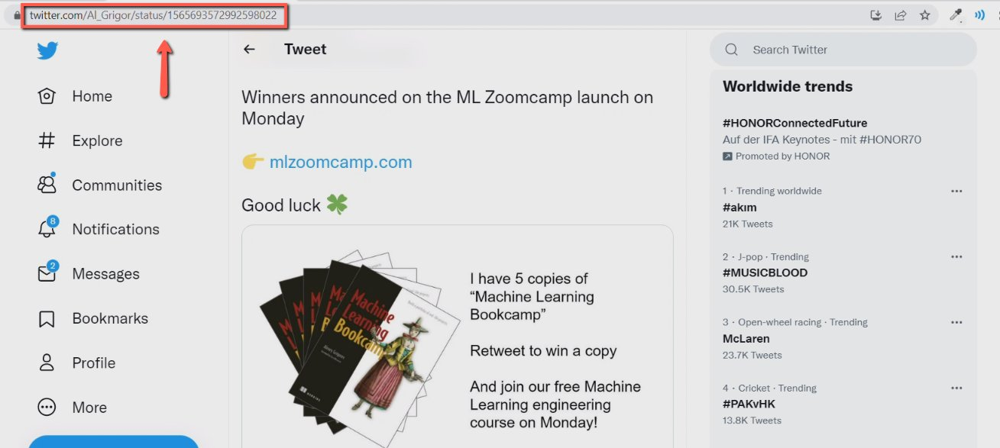
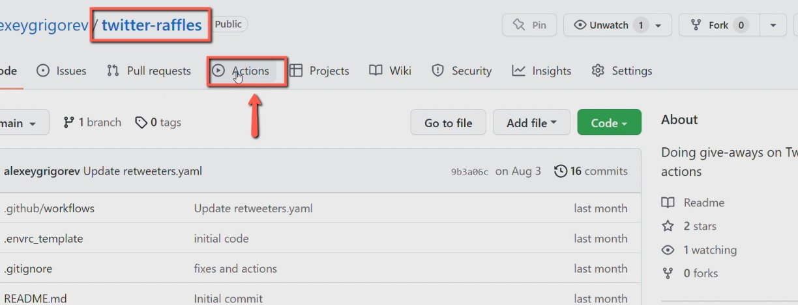
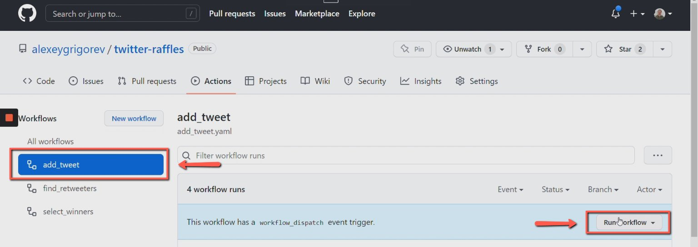
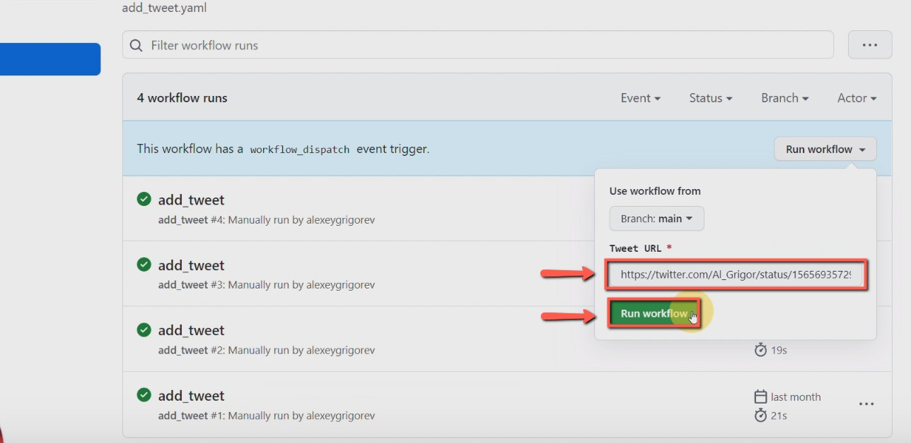

# Record people who retweeted the giveaway using the Github repo

<!-- sop-section-start: summary -->
## Summary

- Purpose: Record giveaway retweeters using the twitter-raffles GitHub workflow.
- Outcome: The giveaway tweet URL is submitted to the repository workflow for tracking.
- Trigger: A giveaway tweet needs retweeter tracking.
- Frequency: For each Twitter/X giveaway campaign.
<!-- sop-section-end -->

<!-- sop-section-start: prerequisites -->
## Prerequisites

- Access: GitHub access to the twitter-raffles repository.
- Tools: GitHub Actions.
- Inputs: Giveaway tweet URL.
<!-- sop-section-end -->

<!-- sop-section-start: procedure -->
## Procedure

<!-- sop-prose-start -->
How to Record People who Retweeted the Giveaway using the Github repo
This procedure will show you the steps on how to Record People who Retweeted the Giveaway using the Github repo

Step-by-step Instructions
<!-- sop-prose-end -->

<!-- sop-step-start id=1 -->
1.  The first thing you need to do is copy the URL link of the Tweet.

    <!-- sop-screenshot-start -->
    
    <!-- sop-caption-start -->
    This screenshot anchors the step to copy the URL link of the Tweet so you can match the documented UI before acting. Look for the link, copy, or paste target shown there, then use it to confirm you are in the correct place before continuing.
    <!-- sop-caption-end -->
    <!-- sop-screenshot-end -->
<!-- sop-step-end -->

<!-- sop-step-start id=2 -->
2.  After, open the [Github repo](https://github.com/alexeygrigorev/twitter-raffles) and click “Actions”

    <!-- sop-screenshot-start -->
    
    <!-- sop-caption-start -->
    This screenshot anchors the step to open the Github repo and click “Actions” so you can match the documented UI before acting. Look for “Actions”, then use that cue to complete or verify the step before continuing.
    <!-- sop-caption-end -->
    <!-- sop-screenshot-end -->
<!-- sop-step-end -->

<!-- sop-step-start id=3 -->
3.  Then click “add_tweet” and select “Run Workflow”

    <!-- sop-screenshot-start -->
    
    <!-- sop-caption-start -->
    This screenshot anchors the step to click “add_tweet” and select “Run Workflow” so you can match the documented UI before acting. Look for “add_tweet” and “Run Workflow”, then use those cues to complete or verify the step before continuing.
    <!-- sop-caption-end -->
    <!-- sop-screenshot-end -->
<!-- sop-step-end -->

<!-- sop-step-start id=4 -->
4.  Next, paste the copied URL Tweet on the field and select “Run workflow”

    Note: For the URL, it should not start with “mobile”

    <!-- sop-screenshot-start -->
    
    <!-- sop-caption-start -->
    This screenshot anchors the step about for the URL, it should not start with “mobile” so you can match the documented UI before acting. Look for “mobile”, then use that cue to complete or verify the step before continuing.
    <!-- sop-caption-end -->
    <!-- sop-screenshot-end -->
<!-- sop-step-end -->
<!-- sop-section-end -->

<!-- sop-section-start: validation -->
## Validation

-
<!-- sop-section-end -->

<!-- sop-section-start: troubleshooting -->
## Troubleshooting

-
<!-- sop-section-end -->

<!-- sop-section-start: references -->
## References

-
<!-- sop-section-end -->
