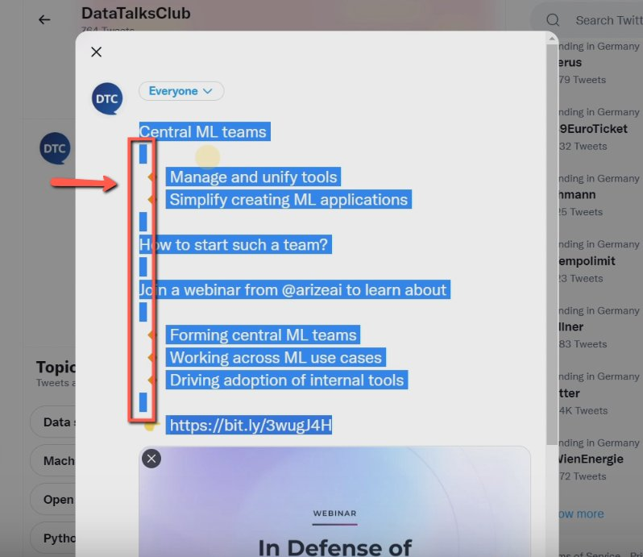

# Removing extra characters in Twitter added by Google docs

<!-- sop-section-start: summary -->
## Summary

- Purpose: Clean extra spacing added when copying Google Docs text into Twitter/X.
- Outcome: The tweet text has correct spacing before posting.
- Trigger: Copied Google Docs text includes extra spaces in Twitter/X.
- Frequency: As needed when drafting tweets from Google Docs.
<!-- sop-section-end -->

<!-- sop-section-start: prerequisites -->
## Prerequisites

- Access: Twitter/X draft and source Google Doc.
- Tools: Google Docs and Twitter/X.
- Inputs: Copied tweet text.
<!-- sop-section-end -->

<!-- sop-section-start: procedure -->
## Procedure

<!-- sop-prose-start -->
How to Remove extra characters in Twitter added by Google docs
This procedure will show you the steps on how to Remove extra characters in Twitter added by Google docs

Step-by-step Instructions
<!-- sop-prose-end -->

<!-- sop-step-start id=1 -->
1.  The first thing you need to do is copy the text from Google docs.

    <!-- sop-screenshot-start -->
    
    <!-- sop-caption-start -->
    This screenshot anchors the step to copy the text from Google docs so you can match the documented UI before acting. Look for the link, copy, or paste target shown there, then use it to confirm you are in the correct place before continuing.
    <!-- sop-caption-end -->
    <!-- sop-screenshot-end -->
<!-- sop-step-end -->

<!-- sop-step-start id=2 -->
2.  And then, open Twitter and click “Tweet” then paste the copied text.

    <!-- sop-screenshot-start -->
    
    <!-- sop-caption-start -->
    This screenshot anchors the step to open Twitter and click “Tweet” then paste the copied text so you can match the documented UI before acting. Look for “Tweet”, then use that cue to complete or verify the step before continuing.
    <!-- sop-caption-end -->
    <!-- sop-screenshot-end -->
<!-- sop-step-end -->

<!-- sop-step-start id=3 -->
3.  After, highlight the whole text.

    Note: As you can see, there are double spaces in between the text. Make sure to remove one space.

    <!-- sop-screenshot-start -->
    
    <!-- sop-caption-start -->
    This screenshot anchors the visual check described in the note so you can match the documented UI before acting. Look for the relevant screen area shown there, then use it to confirm you are in the correct place before continuing.
    <!-- sop-caption-end -->
    <!-- sop-screenshot-end -->
<!-- sop-step-end -->
<!-- sop-section-end -->

<!-- sop-section-start: validation -->
## Validation

-
<!-- sop-section-end -->

<!-- sop-section-start: troubleshooting -->
## Troubleshooting

-
<!-- sop-section-end -->

<!-- sop-section-start: references -->
## References

-
<!-- sop-section-end -->
